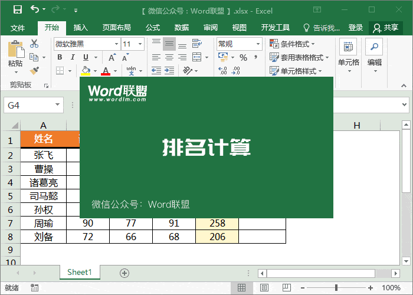
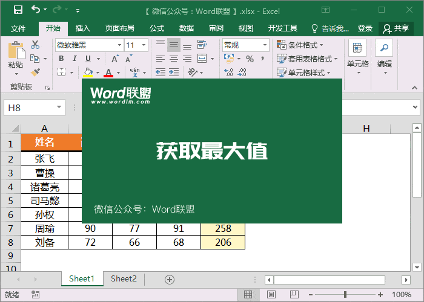
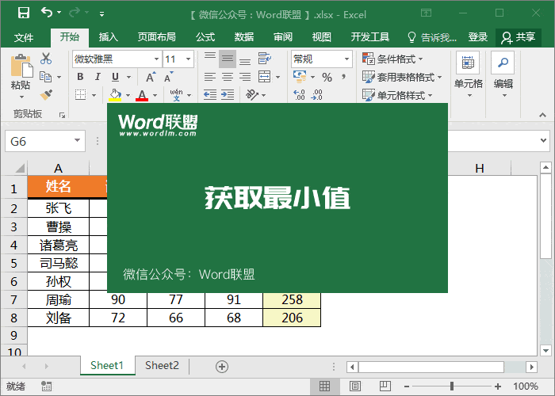
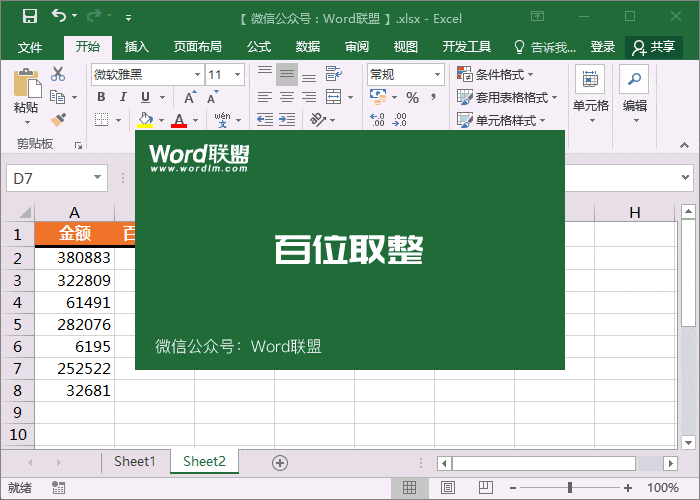
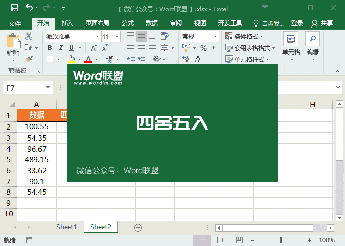
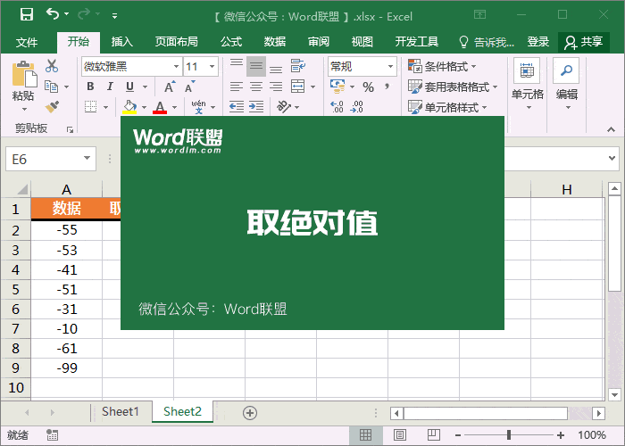
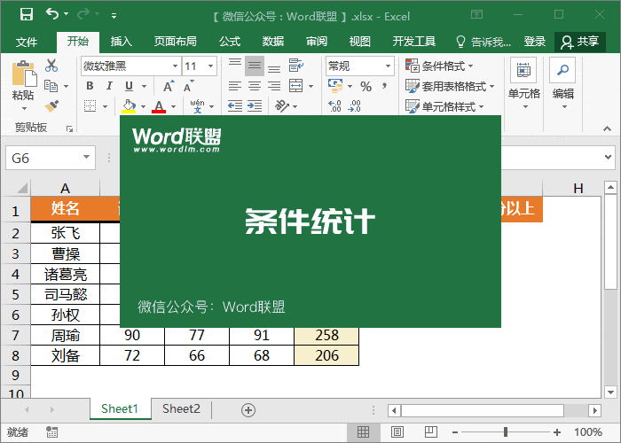
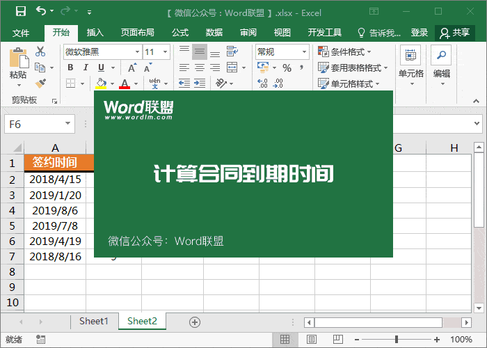
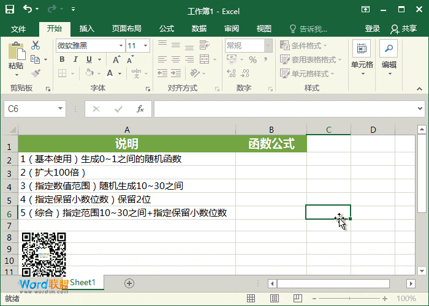
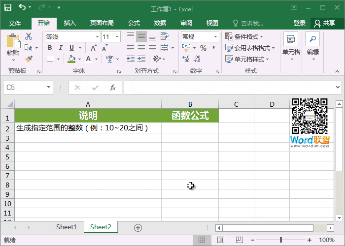

## Excel排名计算

=RANK(E2,E:E)

能够快速的帮助你计算出该区域中排名顺序。

 

## 获取最大值

=MAX(E2:E8)

获取该区域中最大的一个值。

 

## 获取最小值

=MIN(E2:E8)

获取该区域中最小的一个值。

 

## 百位取整

=ROUND(A2,-2)

有时候数值过大，我们希望将数据简化，取整到百位。后面的“-2”是取整两位，大家可以自行更改。

 

## 四舍五入

=ROUND(A2,0)

=ROUND(数值或数值单元格，要保留的位数)。这里指的是四舍五入不保留小数。

 

## 取绝对值

=ABS(A2)

取绝对值，将负数变成正数。

 

## 条件统计

=COUNTIF(E2:E8,">250")

统计区域中，总分250分以上成绩一共几个。

 

## 计算合同到期时间

=EDATE(A2,B2)

使用公式填充后，我们再将数字格式设为“日期”，就能得到到期时间。EDATE函数可以计算与发行日处于一月中同一天的到期日的日期。

 

## 随机数

### RAND函数

说明：RAND函数可以生成0~1之间的随机函数（包含小数位数）。

**使用方法：**

（**方法一、基本使用**）在单元格内输入【=RAND()】即可生成随机数。按F9可以刷新。

（**方法二、扩大100倍**）如果觉得0~1之间这个数值小了，我们也让他放大使用公式【=RAND()*100】，加上*100也就扩大100倍。

（**方法三、指定数值范围**）如果要给这个随机函数指定一个范围，那我们应该使用【=RAND()*(B-A)+A】。比如：我现在指定范围是随机生成10~30之间的数值，那么应该输入【=RAND()*(30-10)+10】。

（**方法四、指定保留小数位数**）如果觉得小数位数太多，我们也可以进行指定的。比如：我只希望随机数保留一位小数位数【=ROUND(RAND(),1)】，保留两位那就是【=ROUND(RAND(),2)】，可以根据需要自行修改。（提示：我们也可以直接使用“设置单元格格式”中的“数值”来定义小数位数）

（**方法五、综合使用，指定生成范围+指定保留小数位数**）比如：我希望生成数值在10~30之间，且整数不带小数位数。我们可以使用公式【=RAND()*(30-10)+10】，然后鼠标右键-设置单元格格式-数值-小数位数设为“0”即可。

**操作演示：**

 

### RANDBETWEEN函数

说明：RANDBETWEEN函数可以随机生成指定范围的随机整数。

使用方法：比如：我需要随机生成10~20之间的随机数，可以使用函数公式【=RANDBETWEEN(10,20)】，按F9可以随机刷新变化。

**操作演示：**

相比之下RANDBETWEEN函数操作更为简单，在平常办公中也是使用比较多的！