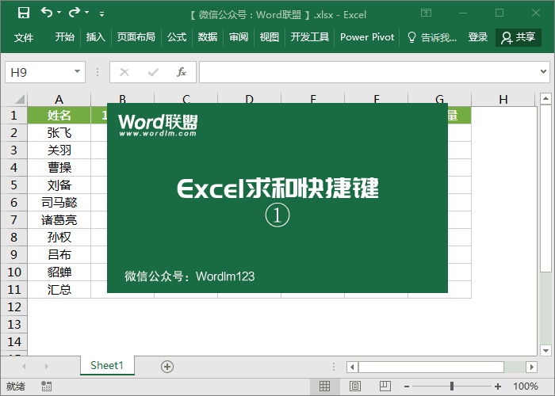
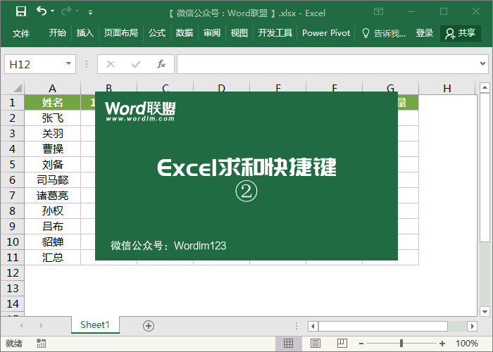

# Excel常用快捷键

## Excel求和快捷键

1、如下图所示，例如：我们需要求出某行或某列的和，只需选中该行或该列所有数据的单元格，然后使用快捷键「ALT + =」，此时，求和结果就能出现在旁边的空白单元格中。

 

2、不仅如此，我们使用Excel求和快捷键「ALT + =」还能够用最快的速度，一次得到所有数据的和，是不是非常的快速呢！

 

# Excel快捷键大全

| ==Excel常用快捷键==                                          |                                                             |
| :----------------------------------------------------------- | ----------------------------------------------------------- |
| 关闭工作簿                                                   | Ctrl+W                                                      |
| 打开工作簿                                                   | Ctrl+O                                                      |
| 转至“主页”选项卡                                             | Alt+H                                                       |
| 保存工作簿                                                   | Ctrl+S                                                      |
| 复制                                                         | Ctrl+C                                                      |
| 粘贴                                                         | Ctrl+V                                                      |
| 撤消                                                         | Ctrl+Z                                                      |
| 删除单元格内容                                               | Delete 键                                                   |
| 选择填充颜色                                                 | Alt+H, H                                                    |
| 剪切                                                         | Ctrl+X                                                      |
| 转至“插入”选项卡                                             | Alt+N                                                       |
| 加粗                                                         | Ctrl+B                                                      |
| 居中对齐单元格内容                                           | Alt + H、A、C                                               |
| 转至“页面布局 ”选项卡                                        | Alt+P                                                       |
| 转至“数据”选项卡                                             | Alt+A                                                       |
| 转至“视图”选项卡                                             | Alt+W                                                       |
| 打开上下文菜单                                               | Shift+F10 或 上下文键                                       |
| 添加边框                                                     | Alt+H, B                                                    |
| 删除列                                                       | Alt + H、D、C                                               |
| 转至“公式”选项卡                                             | Alt+M                                                       |
| 隐藏选定的行                                                 | Ctrl+9                                                      |
| 隐藏选定的列                                                 | Ctrl+0                                                      |
| ==**功能区选项卡的访问键**==                                 |                                                             |
| 操作说明搜索框                                               | Alt + Q                                                     |
| 开打“文件”页面                                               | Alt+F                                                       |
| 打开“主页”选项卡                                             | Alt+H                                                       |
| 打开“插入”选项卡                                             | Alt+N                                                       |
| 打开“页面布局”选项卡                                         | Alt+P                                                       |
| 打开“公式”选项卡                                             | Alt+M                                                       |
| 打开“数据”选项卡                                             | Alt+A                                                       |
| 打开“审阅”选项卡                                             | Alt+R                                                       |
| 打开“视图”选项卡                                             | Alt+W                                                       |
| ==**通过键盘使用功能区**==                                   |                                                             |
| 选择功能区的活动选项卡并激活访问键。                         | Alt 或 F10                                                  |
| 将焦点移到功能区上的命令。                                   | Tab 或 Shift+Tab                                            |
| 分别在功能区上的各项之间向下、向上、向左或向右移动。         | 向下、向上、向左或向右箭头键                                |
| 激活所选按钮。                                               | 空格键或 Enter                                              |
| 打开所选命令的列表。                                         | 向下键                                                      |
| 打开所选按钮的菜单。                                         | Alt+向下箭头键                                              |
| 当菜单或子菜单处于打开状态时，移到下一条命令。               | 向下键                                                      |
| 展开或折叠功能区。                                           | Ctrl+F1                                                     |
| 打开上下文菜单。                                             | Shift+F10                                                   |
| 当主菜单处于打开或选中状态时，移到子菜单。                   | 向左键                                                      |
| ==**用于单元格导航的键盘快捷键**==                           |                                                             |
| 移到工作表中的前一个单元格或对话框中的前一个选项             | Shift+Tab                                                   |
| 在工作表中向上移动一个单元格。                               | 向上键                                                      |
| 在工作表中向下移动一个单元格。                               | 向下键                                                      |
| 在工作表中向左移动一个单元格。                               | 向左键                                                      |
| 在工作表中向右移动一个单元格。                               | 向右键                                                      |
| 移到工作表中当前数据区域的边缘。                             | Ctrl + 箭头键                                               |
| 移到工作表上的最后一个单元格，即所使用的最右一列的最下面一行。 | Ctrl+End                                                    |
| 将单元格选定区域扩展至工作表上最后一个使用的单元格（右下角）。 | Ctrl+Shift+End                                              |
| 当 Scroll Lock 处于开启状态时，移到窗口左上角的单元格。      | Home+Scroll Lock                                            |
| 移到工作表的开头。                                           | Ctrl+Home                                                   |
| 在工作表中向下移动一屏。                                     | Page Down                                                   |
| 移到工作簿中的下一个工作表。                                 | Ctrl+Page Down                                              |
| 在工作表中向右移动一屏。                                     | Alt+Page Down                                               |
| 在工作表中向上移动一屏。                                     | Page Up                                                     |
| 在工作表中向左移动一屏。                                     | Alt+Page Up                                                 |
| 移到工作簿中的上一个工作表。                                 | Ctrl+Page Up                                                |
| 在工作表中向右移动一个单元格。或者，在受保护的工作表中，在未锁定的单元格之间移动。 | Tab                                                         |
| 在应用了数据验证选项的单元格上打开验证选项列表。             | Alt+向下箭头键                                              |
| 环绕文本框或图像等浮动形状。                                 | 按 Ctrl + Alt + 5, 然后重复按 Tab 键                        |
| 退出浮动形状导航并返回普通导航。                             | Esc                                                         |
| ==**用于单元格格式设置的键盘快捷键**==                       |                                                             |
| 打开“设置单元格格式”对话框。                                 | Ctrl+1                                                      |
| 在“设置单元格格式”对话框中设置字体格式。                     | Ctrl+Shift+F 或 Ctrl+Shift+P                                |
| 编辑活动单元格，并将插入点放在其内容的末尾。或者，如果单元格的编辑已关闭，则将插入点移到编辑栏中。如果编辑公式，请关闭或打开点模式，以便你可以使用箭头键创建引用。 | F2                                                          |
| 添加或编辑单元格批注。                                       | Shift+F2                                                    |
| 打开用于插入空白单元格的“插入”对话框。                       | Ctrl+Shift+加号 (+)                                         |
| 打开用于删除选定单元格的“删除”对话框。                       | Ctrl+减号 (-)                                               |
| 输入当前时间。                                               | Ctrl+Shift+冒号 (:)                                         |
| 输入当前日期。                                               | Ctrl+分号 (;)                                               |
| 在工作表中，在显示单元格值或公式之间切换。                   | Ctrl+重音符 (`)                                             |
| 将公式从活动单元格上方的单元格复制到单元格或编辑栏中。       | Ctrl+撇号 (')                                               |
| 移动选定的单元格。                                           | Ctrl+X                                                      |
| 复制选定的单元格。                                           | Ctrl+C                                                      |
| 在插入点粘贴内容，并替换任何所选内容。                       | Ctrl+V                                                      |
| 打开“选择性粘贴”对话框。                                     | Ctrl+Alt+V                                                  |
| 将文本设置为斜体或删除倾斜格式。                             | Ctrl+I 或 Ctrl+3                                            |
| 将文本设置为加粗或删除加粗格式。                             | Ctrl+B 或 Ctrl+2                                            |
| 为文字添加下划线或删除下划线。                               | Ctrl+U 或 Ctrl+4                                            |
| 应用或删除删除线格式。                                       | Ctrl+5                                                      |
| 在隐藏对象、显示对象和显示对象的占位符之间切换。             | Ctrl+6                                                      |
| 将轮廓边框应用于选定单元格。                                 | Ctrl+Shift+与号 (&)                                         |
| 从选定单元格中删除轮廓边框。                                 | Ctrl+Shift+下划线 (_)                                       |
| 显示或隐藏大纲符号。                                         | Ctrl+8                                                      |
| 使用“向下填充”命令将选定范围内最顶层单元格的内容和格式复制到下面的单元格中。 | Ctrl+D                                                      |
| 应用“常规”数字格式。                                         | Ctrl+Shift+波形符 (~)                                       |
| 应用带有两位小数的“货币”格式（负数放在括号中）。             | Ctrl+Shift+美元符号 ($)                                     |
| 应用不带小数位的“百分比”格式。                               | Ctrl+Shift+百分比 (%)                                       |
| 应用带有两位小数的科学计数格式。                             | Ctrl+Shift+脱字号 (^)                                       |
| 应用带有日、月和年的“日期”格式。                             | Ctrl+Shift+数字符号 (#)                                     |
| 应用带有小时和分钟以及 AM 或 PM 的“时间”格式。               | Ctrl+Shift+@ 符号 (@)                                       |
| 应用带有两位小数、千分位分隔符和减号 (-)（用于负值）的“数值”格式。 | Ctrl+Shift+感叹号 (!)                                       |
| 打开“插入超链接”对话框                                       | Ctrl+K                                                      |
| 检查活动工作表或选定范围中的拼写。                           | F7                                                          |
| 显示用于包含数据的选定单元格的“快速分析”选项。               | Ctrl+Q                                                      |
| 显示“创建表”对话框。                                         | Ctrl+L 或 Ctrl+T                                            |
| ==**进行选择并执行操作的键盘快捷键**==                       |                                                             |
| 选择整个工作表。                                             | Ctrl+A 或 Ctrl+Shift+空格键                                 |
| 选择工作簿中的当前和下一个工作表。                           | Ctrl+Shift+Page Down                                        |
| 选择工作簿中的当前和上一个工作表。                           | Ctrl+Shift+Page Up                                          |
| 将单元格的选定范围扩大一个单元格。                           | Shift+箭头键                                                |
| 将单元格的选定范围扩展到活动单元格所在列或行中的最后一个非空单元格，或者如果下一个单元格为空，则扩展到下一个非空单元格。 | Ctrl + Shift + 箭头键                                       |
| 打开扩展模式并使用箭头键扩展选定范围。再次按下以关闭。       | F8                                                          |
| 通过使用箭头键将非邻近单元格或区域添加到单元格的选定范围中。 | Shift+F8                                                    |
| 在同一单元格中另起一个新行。                                 | Alt+Enter                                                   |
| 使用当前输入填充选定的单元格区域。                           | Ctrl+Enter                                                  |
| 完成单元格输入并选择上面的单元格。                           | Shift+Enter                                                 |
| 选择工作表中的整列。                                         | Ctrl+空格键                                                 |
| 选择工作表中的整行。                                         | Shift+空格键                                                |
| 当某个对象处于选定状态时，选择工作表上的所有对象。           | Ctrl+Shift+空格键                                           |
| 将单元格的选定范围扩展到工作表的开头。                       | Ctrl+Shift+Home                                             |
| 如果工作表包含数据，则选择当前区域。再按一次将选择当前区域和其摘要行。按第三次将选择整个工作表。 | Ctrl+A 或 Ctrl+Shift+空格键                                 |
| 选择环绕活动单元格的当前区域或选择整个数据透视表。           | Ctrl+Shift+星号 (*)                                         |
| 当菜单或子菜单处于可见状态时，选择菜单上的第一个命令。       | Home                                                        |
| 重复上一个命令或操作（如有可能）。                           | Ctrl+Y                                                      |
| 撤消最后一个操作。                                           | Ctrl+Z                                                      |
| ==**用于处理数据、函数和编辑栏的键盘快捷键**==               |                                                             |
| 键入公式                                                     | =（等号）                                                   |
| 将公式作为数组公式输入                                       | Ctrl+Shift+Enter                                            |
| 用SUM函数插入“自动求和”公式                                  | [Alt+=](http://www.wordlm.com/Excel/jqdq/6763.html)（等号） |
| 选择整个数据透视表。                                         | Ctrl+Shift+星号 (*)                                         |
| 编辑活动单元格，并将插入点放在其内容的末尾。或者，如果单元格的编辑已关闭，则将插入点移到编辑栏中。如果编辑公式，请关闭或打开点模式，以便你可以使用箭头键创建引用。 | F2                                                          |
| 展开或折叠编辑栏。                                           | Ctrl+Shift+U                                                |
| 取消单元格或编辑栏中的输入。                                 | Esc                                                         |
| 完成编辑栏中的输入并选择下面的单元格。                       | Enter                                                       |
| 在编辑栏中时，将光标移到文本的末尾。                         | Ctrl+End                                                    |
| 选择编辑栏中从光标所在的位置到结尾的所有文本。               | Ctrl+Shift+End                                              |
| 计算所有打开的工作簿中的所有工作表。                         | F9                                                          |
| 计算活动工作表。                                             | Shift+F9                                                    |
| 计算所有打开的工作簿中的所有工作表，不管自上次计算以来它们是否已更改。 | Ctrl+Alt+F9                                                 |
| 检查从属的公式，然后计算所有打开的工作簿中的所有单元格，其中包括未标记为需要计算的单元格。 | Ctrl+Alt+Shift+F9                                           |
| 显示“错误检查”按钮的菜单或消息。                             | Alt+Shift+F10                                               |
| 当插入点位于公式中某个函数名称的右边时，会显示“函数参数”对话框。 | Ctrl+A                                                      |
| 当插入点位于公式中某个函数名称的右边时，会插入参数名称和括号。 | Ctrl+Shift+A                                                |
| 调用快速填充以自动识别相邻列中的模式并填充当前列             | [Ctrl+E](http://www.wordlm.com/Excel/jqdq/6564.html)        |
| 如果选定了单元格引用或范围，则会在公式中的绝对和相对引用的所有各种组合之间循环切换。 | F4                                                          |
| 插入函数。                                                   | Shift+F3                                                    |
| 将活动单元格上方的单元格的值复制到单元格或编辑栏中。         | Ctrl+Shift+直双引号 (")                                     |
| 在当前范围中创建数据的嵌入图表。                             | Alt+F1                                                      |
| 在单独的图表工作表中创建当前范围内数据的图表。               | F11                                                         |
| 定义名称以在引用中使用。                                     | Alt+M, M, D                                                 |
| 从“粘贴名称”对话框中粘贴名称（在工作簿中已定义名称的情况下） | F3                                                          |
| 移到数据表单下一条记录中的第一个字段。                       | Enter                                                       |
| 创建、运行、编辑或删除宏。                                   | Alt+F8                                                      |
| 打开 Microsoft Visual Basic For Applications Editor。        | Alt+F11                                                     |
| ==**功能键**==                                               |                                                             |
| 显示“Excel 帮助”任务窗格。                                   | F1                                                          |
| 显示或隐藏功能区。                                           | Ctrl+F1                                                     |
| 在当前区域中创建数据的嵌入图表。                             | Alt+F1                                                      |
| 插入新的工作表。                                             | Alt+Shift+F1                                                |
| 编辑活动单元格，并将插入点放在其内容的末尾。或者，如果单元格的编辑已关闭，则将插入点移到编辑栏中。如果编辑公式，请关闭或打开点模式，以便你可以使用箭头键创建引用。 | F2                                                          |
| 添加或编辑单元格批注。                                       | Shift+F2                                                    |
| 显示 Backstage 视图 中“打印”选项卡上的打印预览区域。         | Ctrl+F2                                                     |
| 显示“粘贴名称”对话框。仅适用于在工作簿中已定义名称的情况。   | F3                                                          |
| 显示“插入函数”对话框。                                       | Shift+F3                                                    |
| 重复上一个命令或操作（如有可能）。当公式中选定单元格引用或区域时，按 F4 可在绝对和相对引用的所有各种组合中循环切换。 | F4                                                          |
| 关闭选定的工作簿窗口。                                       | Ctrl+F4                                                     |
| 关闭 Excel。                                                 | Alt+F4                                                      |
| 显示“定位”对话框。                                           | F5                                                          |
| 恢复选定工作簿窗口的窗口大小。                               | Ctrl+F5                                                     |
| 在工作表、功能区、任务窗格和缩放控件之间切换。在已拆分的工作表中，在窗格和功能区区域之间切换时，按 F6 可包括已拆分的窗格。 | F6                                                          |
| 在工作表、缩放控件、任务窗格和功能区之间切换。               | Shift+F6                                                    |
| 如果打开了多个工作簿窗口，按 Ctrl+F6 可切换到下一个工作簿窗口。 | Ctrl+F6                                                     |
| 打开“拼写检查”对话框，用于检查活动工作表或选定范围中的拼写。 | F7                                                          |
| 如果工作簿窗口未最大化，则按 Ctrl+F7 可对该窗口执行“移动”命令。使用箭头键移动窗口，并在完成时按 Enter，或按 Esc 取消。 | Ctrl+F7                                                     |
| 打开或关闭扩展模式。在扩展模式中，“扩展选定”将出现在状态行中，并且按箭头键可扩展选定范围。 | F8                                                          |
| 允许您使用箭头键将非邻近单元格或区域添加到单元格的选定范围中。 | Shift + F8                                                  |
| 当工作簿未最大化时，执行“大小”命令。                         | Ctrl+F8                                                     |
| 显示“宏”对话框，用于创建、运行、编辑或删除宏。               | Alt+F8                                                      |
| 计算所有打开的工作簿中的所有工作表。                         | F9                                                          |
| 计算活动工作表。                                             | Shift+F9                                                    |
| 计算所有打开的工作簿中的所有工作表，不管它们自上次计算以来是否已更改。 | Ctrl+Alt+F9                                                 |
| 重新检查从属的公式，然后计算所有打开的工作簿中的所有单元格，其中包括未标记为需要计算的单元格。 | Ctrl+Alt+Shift+F9                                           |
| 将工作簿窗口最小化为图标。                                   | Ctrl+F9                                                     |
| 打开或关闭快捷键提示。（按 Alt 也能实现同样目的。）          | F10                                                         |
| 显示选定项目的快捷菜单。                                     | Shift+F10                                                   |
| 显示“错误检查”按钮的菜单或消息。                             | Alt+Shift+F10                                               |
| 最大化或还原选定的工作簿窗口。                               | Ctrl+F10                                                    |
| 在单独的图表工作表中创建当前范围内数据的图表。               | F11                                                         |
| 插入一个新工作表。                                           | Shift+F11                                                   |
| 打开 Microsoft Visual Basic For Applications 编辑器，你可以在该编辑器中通过使用 Visual Basic for Applications (VBA) 来创建宏。 | Alt+F11                                                     |
| 显示“另存为”对话框。                                         | F12                                                         |

