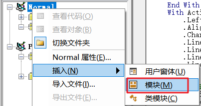
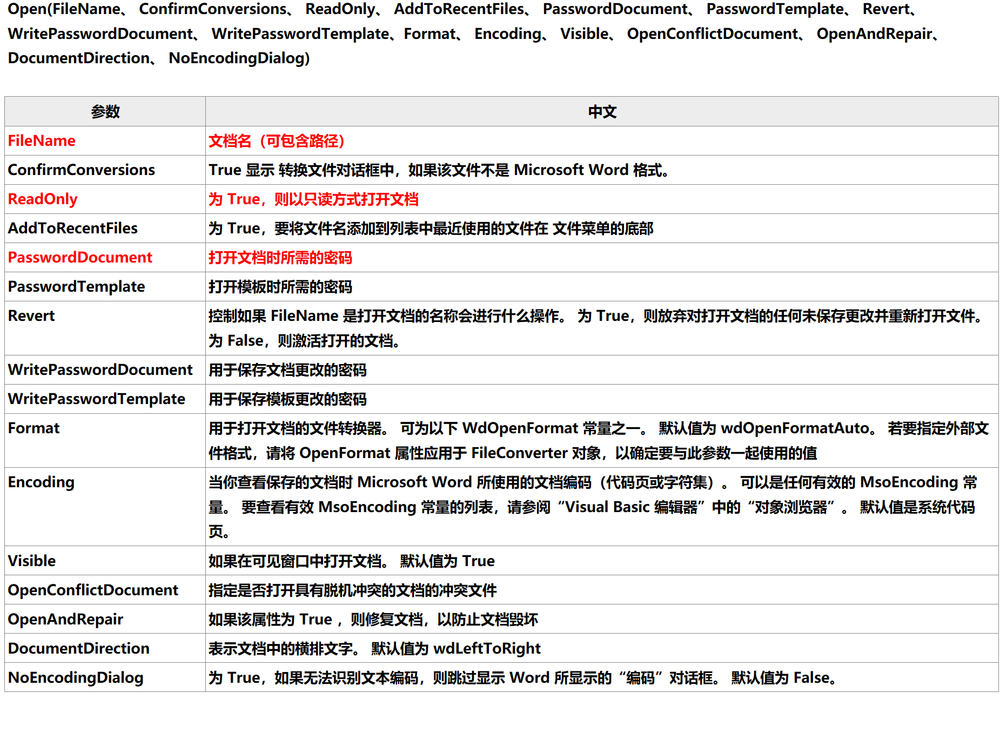

# Word VBA

## 预备知识

### 编辑器

右击功能区->自定义功能区


勾选开发工具->确定


开发工具选项卡->Visual Basic


右击Normal->插入->模块，然后就可以在右边的编辑框中编写代码了



在Visual Basic界面，工具 -> 选项 -> 编辑器格式，可以调整字体大小

### 函数

函数以`sub`开头，紧接着函数名与括号，最后以`end sub`结尾，语法如下所示：

```vb
sub 函数名()
    ...
end sub
```

### 声明变量

```vb
Dim string1 as String, integer1 as Integer, single1 as Single
```

若你如此 `Dim integer1,integer2 as Integer`，变量`integer1`只能会是`Variant`类型，即相当于`Dim integer1 `或者`Dim integer1 as Variant`

### 字符串拼接

使用`&`

```vb
set str = "1" & "2"
```

### 注释

以`'`开头，如下

```vb
' 我是注释
```

### 调用已有方法

call 方法名

```vb
sub a()
    call b
end

sub b()
end
```


### with 语法

不使用 with

```vb
Sub firstSub()
Range("a1").Value = "Who am I?"
Range("a1").Parent.Name = "go on"
Range("a1").Font.Size = 20
Range("a1").Font.Bold = True
End Sub
```

使用 with

```vb
Sub withSub()
With Range("a1")
    .Value = "With with withWho am I?"
    .Parent.Name = "With with withgo on"
    With .Font
        .Size = 30
        .Bold = True
    End With
End With
End Sub
```

## 基本操作

### 新建、打开、保存、关闭

```vb
sub add_open_save_close()
    ' 新建
    Documents.Add
    ' 打开指定路径文件
    Documents.Open "E:/test.docx"
    ' 保存，将已存在的文件保存
    ActiveDocument.Save
    ' 另存为
    ActiveDocument.SaveAs2 "E:/test.docx"
    ' 关闭文档
    ActiveDocument.Close
end sub
```

### 关闭文档时操作

| **序号** | **参数**                         | **中文**                             |
| -------- | -------------------------------- | ------------------------------------ |
| **0**    | wdDoNotSaveChanges               | **不保存待定的更改。**               |
| **-2**   | wdPromptToSaveChanges （默认值） | **提示用户保存待定更改。**           |
| **-1**   | wdSaveChanges                    | **自动保存待定更改，而不提示用户。** |

案例1：

```vb
Sub newDoc()
    Documents.Open "E:/test.docx"
    Selection.TypeText "123"
    ActiveDocument.Close savechanges:=wdSaveChanges
End Sub
```

当在word插入`123`并关闭后，并不会产生提示

案例2：

```vb
' 关闭活动文档（保存）
ActiveDocument.Close savechanges: = wdSaveChanges

' 关闭活动文档（不保存）
ActiveDocument.Close savechanges: = wdDoNotSaveChanges

'关闭单个文档,并保存变化：
Documents("文档名称").Close savechanges: = wdsavechanges

'不保存更改的情况下关闭所有文档：
Documents.Close savechange: = wdDonotsavechanges

'在每个文档关闭之前提示用户保存文档：
Dim doc As Document
For Each doc In Documents
    doc.Close savechanges: = wdpromptTosavechanges
Next doc
```

### 打开文档时操作



### 打印文档 

**打印当前页**

```vb
Sub 打印活动文档的当前页面()
	Set 文档 = ActiveDocument
	文档.PrintOut Range:=wdPrintCurrentPage
End Sub
```

**打印指定目录docx文件**

```vb
Sub 打印当前文件夹下的所有docx文件()
    '第二季笔记15课
    文件 = Dir(".docx")
    Do While 文件 <> ""
        Word.Application.PrintOut FileName:=文件
        文件 = Dir()
    Loop
End Sub
```

**打印指定页面**

```vb
Sub 打印前N页或指定页面()
    Set 文档 = ActiveDocument
    '打印起始页码1至结束页码3之间的页面
    文档.PrintOut Range:=wdPrintFromTo, From:="1", To:="3"
    '打印指定范围的页面,例如打印1，3，6页
    文档.PrintOut Range:=wdPrintRangeOfPages, Pages:="1,3,6"
End Sub
```


### 调整文档大小

```vb
Sub resize()
    With Word.Application
        '先设置为常规模式
        .WindowState = wdWindowStateNormal
        '再设置宽和高
        .Resize Width:=InchesToPoints(7), Height:=InchesToPoints(6)
    End With
End Sub
```

## Selection

### 不同窗口复制内容

```vb
Sub 将一个窗口选定内容复制到另一个窗口()
'如果窗口不止一个
If Windows.Count <> 1 Then
    '将第一个窗口所选内容复制
    Windows(1).Selection.Copy
    '激活第一个窗口的下一个窗口
    Windows(1).Next.Activate
    Selection.Paste
End If
End Sub
```

### 调整插入点至表格

```vb
Sub a()
'如果窗口不止一个
If Windows.Count <> 1 Then
    '将第一个窗口所选内容复制
    Windows(1).Selection.Copy
    '激活第一个窗口的下一个窗口
    Windows(1).Next.Activate
    If Selection.Information(wdWithInTable) = False Then
        Selection.GoToNext what:=wdGoToTable
    End If
    Selection.Paste
End If
End Sub
```


## 附录

### Application


+ Word.Application.PathSeparator：路劲分隔符

### Document


+ ActiveDocument.Name：文件名
+ ActiveDocument.FullName：文件全路径

### Documents


### Selection

Selection对象代表窗口或窗格中的当前所选内容。

1. 如果文档中**没有所选内容，则代表插入点（光标位置），否则代表所选中的内容**。
2. 每个文档窗格**只能有一个**活动的Selection对象，并且整个应用程序中**只能有一个**活动的Selection对象。
   与Range对象不同的是，Selection对象代表选定内容，可以是文档中的一个区域也可以仅仅是一个插入点。

#### Selection 对象属性


#### Selection 对象方法


+ InsertParagraphAfter：插入新的一个段落