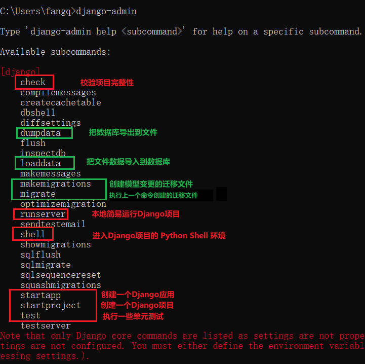
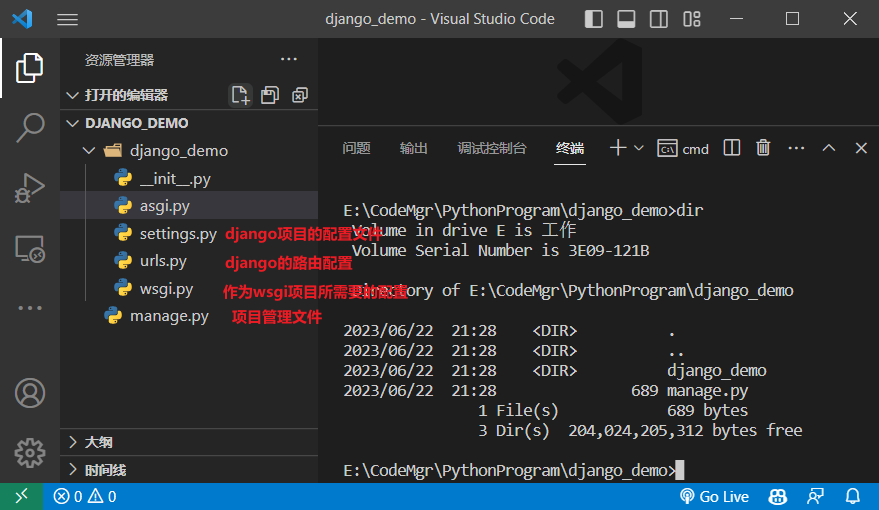
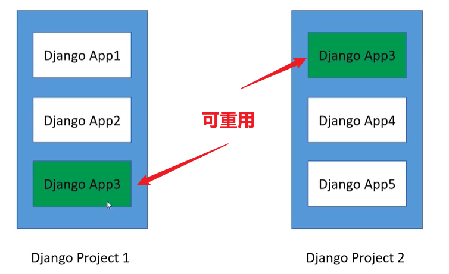
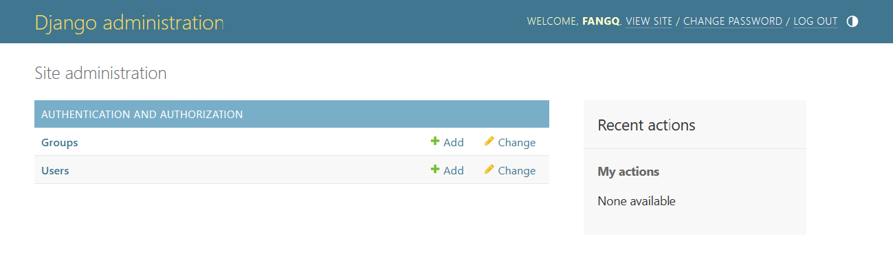
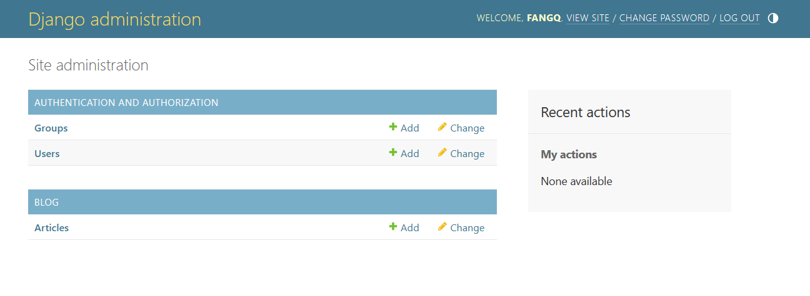
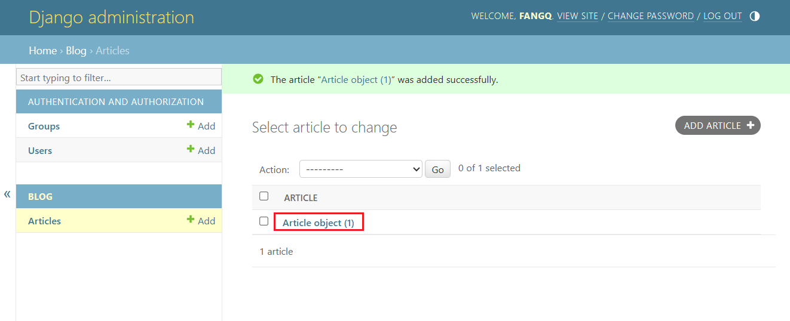
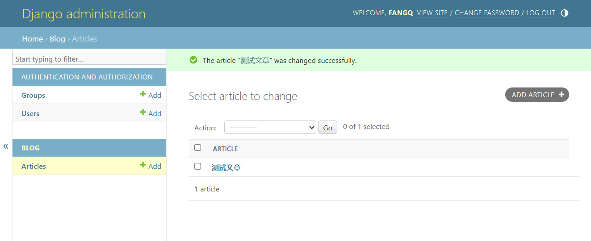

# Django快速入门

## 安装

```
pip install django
```

## 命令

`django-admin`



## 创建新项目

我们在`E:\CodeMgr\PythonProgram`目录下运行命令

```shell
django-admin startproject django_demo
```



它会为我们自动生成以上内容

```
├───django_demo
    │   manage.py
    │
    └───django_demo
            asgi.py
            settings.py
            urls.py
            wsgi.py
            __init__.py
```

## 运行项目

我们进入到外层的`django_demo`目录中，然后运行命令

```
python manage.py runserver
```

这样就可以运行一个django项目了

## 项目与应用的区别

+ 项目与应用是**一对多**的关系
+ 项目包含一组配置以及若干的Django应用

+ 应用相当于一个**可重用包**
+ 应用可以管理自己的模型、视图、模板、路由和静态文件等



## 创建新应用

在`django_demo`目录下运行

```cmd
python manage.py startapp blog
# 或者
django-admin startapp blog
```

我们就可以创建一个名为blog的新应用，创建新应用后`django_demo`的目录结构如下

```
django_demo
│   manage.py
│
├───blog
│   │   admin.py   # 定义 Admin 模型管理对象的地方
│   │   apps.py    # 声明应用的地方
│   │   models.py  # 定义应用模型的地方
│   │   tests.py   # 编写应用测试用例的地方
│   │   views.py   # 视图处理的地方
│   │   __init__.py
│   │   （自行创建）urls.py # 管理应用路由的地方
│   │
│   └───migrations
│           __init__.py
│
└───django_demo
        asgi.py
        settings.py
        urls.py
        wsgi.py
        __init__.py
```

## 编写界面 ☆

### 视图

我们在`django_demo/blog/views.py`文件中进行编写

```python
from django.http import HttpResponse
from django.shortcuts import render

# Create your views here.

def hello_world(request):
    return HttpResponse("Hello World!")
```

它的作用是访问界面时，返回`Hello World!`这样的字符串

### 路由

视图编写完成后，我们需要配置好正确的路由才能让请求正确处理

创建`django_demo/blog/urls.py`并编写

```python
from django.urls import path, include

from . import views

urlpatterns = [
    path('hello_world', views.hello_world),
]
```

上面代码表示，若路径等于 `hello_world` 则交给 `views.hello_world` 处理

**注意这只是应用层次的路由配置**，我们还需要配置项目层次的路由

下面编写`django_demo/django_demo/urls.py`

```python
from django.contrib import admin
from django.urls import path, include

urlpatterns = [
    path('admin/', admin.site.urls),
    path('blog/', include('blog.urls'))
]
```

我们添加的`path('blog/', include('blog.urls'))` 表示：若路由为 blog，则交给 blog.urls 处理

**注意我们还需要将blog应用添加到django_demo中**才能算真正完成

因此我们还需要编写`django_demo/django_demo/settings.py`文件，找到 <font color=red>INSTALLED_APPS</font> 并添加`blog.apps.BlogConfig`

```python
INSTALLED_APPS = [
    'django.contrib.admin',
    'django.contrib.auth',
    'django.contrib.contenttypes',
    'django.contrib.sessions',
    'django.contrib.messages',
    'django.contrib.staticfiles',

    # Add the blog app to the list of installed apps
    'blog.apps.BlogConfig',
]
```

其中`BlogConfig`为blog应用下`apps.py`中定义的配置类

## 模型层

### 配置

模型层的项目配置由 `django_demo/django_demo/settings.py` 中的 <font color=red>DATABASES</font>  对象定义，如下：

```python
DATABASES = {
    'default': {
        'ENGINE': 'django.db.backends.sqlite3',
        'NAME': BASE_DIR / 'db.sqlite3',
    }
}
```

+ ENGINE：项目使用的数据库引擎
+ NAME：数据库名称以及地址

### 模型以及迁移文件

首先在 `django_demo/blog/models.py` 定义模型

```python
from django.db import models

# Create your models here.

class Article(models.Model):
    # 文章的唯一ID
    article_id = models.AutoField(primary_key=True)
    # 文章标题
    title = models.TextField()
    # 文章摘要
    brief_content = models.TextField()
    # 文章主要内容
    content = models.TextField()
    # 文章发布日期
    publish_date = models.DateTimeField(auto_now=True)
```

然后执行 

```
python manage.py makemigrations
```

即可创建迁移文件，最后执行

```
python manage.py migrate
```

即可应用迁移文件

## Django Shell

```
python manage.py shell
```

## Django Admin

Django 提供的后台管理工具

能读取定义的模型元数据，提供强大的管理使用页面

### 创建管理员用户

```
python manage.py createsuperuser
```

### 注册自定义模型到Admin

我们登录到后台界面后



能发现只有默认的 `Groups` 以及 `Users`，没有我们自定义的 `Article`，这是因为我们没有将 `Article` 注册到 Admin 中，因此我们需要配置 `django_demo/django_demo/admin.py`文件

```python
from django.contrib import admin

# Register your models here.

from .models import Article

admin.site.register(Article)
```

配置好后界面如下



### 修改展示项

我们添加好一个数据后



可以发现页面只展示了 Article object，而我们无法知道它表示什么含义，因此我们需要对 models 进行修改

```python
from django.db import models

# Create your models here.

class Article(models.Model):
    # 文章的唯一ID
    article_id = models.AutoField(primary_key=True)
    # 文章标题
    title = models.TextField()
    # 文章摘要
    brief_content = models.TextField()
    # 文章主要内容
    content = models.TextField()
    # 文章发布日期
    publish_date = models.DateTimeField(auto_now=True)

    def __str__(self):
        return self.title
```

我们添加了`__str__` 方法，然后刷新界面看看效果



这样就能显示我们想要的效果了

## 模板

### 标签

1、变量标签：<font color=red>{{变量}}</font>

```html
<html>
    <body>
        {{ now }}
    </body>
</html>
```

2、for循环标签：<font color=red>, </font>

```html
<ul>
    
    <lit>{{item}}</lit>
    
</ul>
```

3、if-else分支标签：<font color=red>, , </font>

```html

	<p>it is ture part</p>

	<p>it is false part</p>

```

### 渲染模板

编写 `django_demo/blog/views.py` 文件

```python
from django.http import HttpResponse
from django.shortcuts import render

# Create your views here.

def get_article_content(request):
    data = {
        'title': '文章标题',
        'brief_content': '文章摘要',
        'content': '文章内容',
        'publish_date': '文章发布日期',
    }
    return render(request, 'blog/get_article_content.html', {
        'article': data,
    })
```

其中 

+ `blog/get_article_content.html` 表示模板路径，程序会自动在当前应用（blog）下的 templates 目录下查找
+ `{‘article’: data}`：是传递给模板的数据