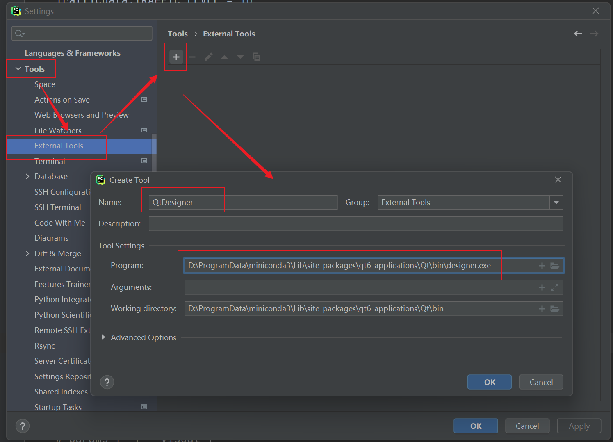
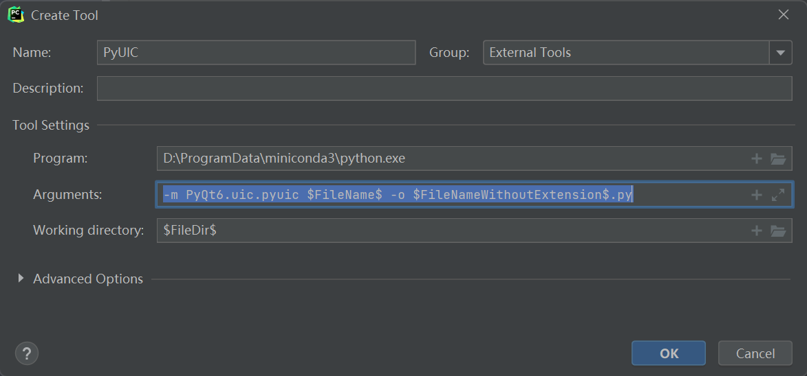

# 入门

## 安装

+ pyqt6：开发库
+ pyqt6-tools：QtDesigner 设计器工具支持库

```
pip install PyQt6
pip install pyqt6-tools
```

## 配置外部工具

### QtDesigner

UI 设计器

Setting -> Tools -> External Tools



### PyUIC

UI 界面转 Python 代码

+ Program：python路径
+ Arguments：`-m PyQt6.uic.pyuic $FileName$ -o $FileNameWithoutExtension$.py`
+ Working directory：`$FileName$`



## 入门程序

### 使用 ui 文件

```python
from PyQt6.QtWidgets import QApplication, QWidget, QLabel
from PyQt6 import uic
import sys


if __name__ == '__main__':
    app = QApplication(sys.argv)

    ui = uic.loadUi('GameSaveApplication.ui')

    ui.show()

    sys.exit(app.exec())
```

### 使用 uic 逆向代码

先通过 uic 将 ui 文件逆向为 python 代码，然后会得到一个 `Ui_xxx` 这样的类，后面就可以借助这个类型来编写程序

```python
if __name__ == "__main__":
    app = QApplication(sys.argv)

    w = QMainWindow()
    Ui_xxxClass().setupUi(w)
    w.show()

    sys.exit(app.exec())
```

### 使用代码

```python
from PyQt6.QtWidgets import QApplication, QWidget, QLabel
from PyQt6 import uic
import sys


app = QApplication(sys.argv)

window = QWidget()
window.setWindowTitle('PyQt6 App')
window.resize(800, 600)
window.move(60, 15)
window.show()

label = QLabel(window)
label.setText('Hello World!')
label.resize(200, 25)
label.setStyleSheet('background-color: yellow; font: 20pt Comic Sans MS;')
label.show()

sys.exit(app.exec())
```

