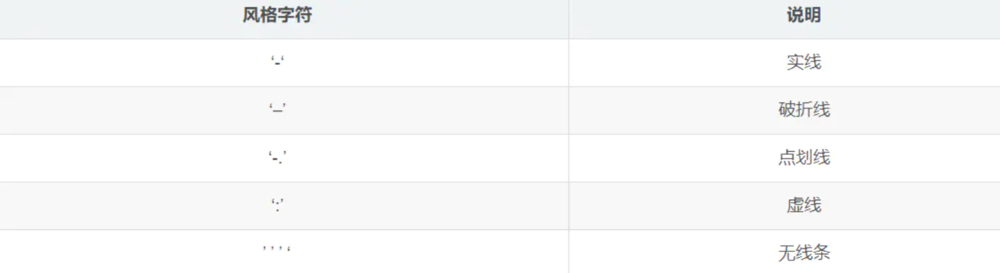
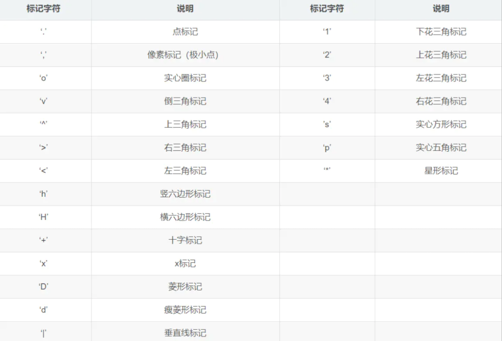
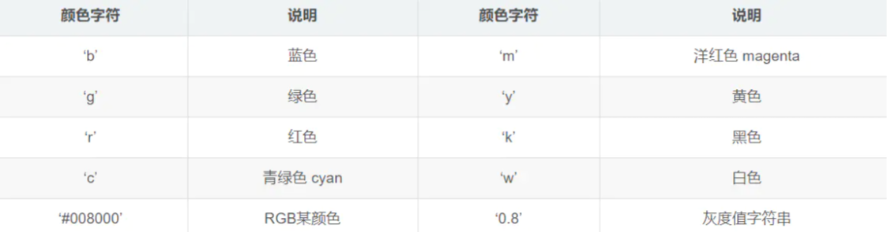
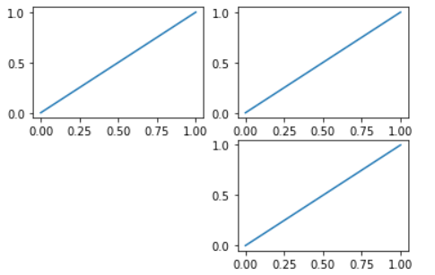
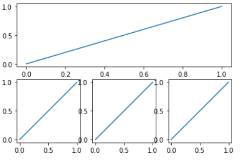

# Matplotlib

## 基本用法

```python
x = np.linspace(-1, 1, 100) # -1 到 1 生成 100 个点
y = 2 * x + 1
plt.plot(x, y)
plt.show()
```

1、`plot()`的参数

+ x, y：横纵坐标，如果仅输入y，则x会默认设置成0~len(y)
+ `color`、`c`：线的颜色，有`r`、`g`、`b`、`k`
+ `linewidth`、`lw`：线的宽度
+ `linestyle`、`ls`：线的形式，`--`为虚线，`-`为实线，`：`为小数点，`-.`点划线

`--+`虚线掺和叉号、`:o`小数点掺和实心点







2、使用`plt.figure()`就可以新创建一个图像

```python
x = np.array([1, 100])
y = x * 2 + 1

plt.figure(figsize=(8, 2))
plt.plot(x, y, 'go--')

plt.figure(figsize=(2, 2))
plt.plot(x, y)

plt.show()
```

## 坐标轴

1、`plt.xlim()`、`plt.ylim()`限制x，y轴范围

2、`plt.xlabel()`、`plt.ylabel()`设置x，y轴标签

3、`plt.xticks()`、`plt.yticks()`设置x，y轴刻度

```python
x = np.linspace(-3, 3, 100)
y1 = x * 2 + 1
y2 = x ** 2

# 限制x，y范围
plt.xlim((-1, 2))
plt.ylim((-2, 3))

# x，y轴描述
plt.xlabel('X axle')
plt.ylabel('Y axle')

# x，y轴刻度
plt.xticks(np.linspace(-2, 2, 11))
plt.yticks(
    [-1, 0, 1, 2, 3],
    ['level1', 'level2', 'level3', 'level4', 'level5']
)

# 修改刻度值的位置
ax.xaxis.set_ticks_position('top') # 将x轴刻度值的位置移到上边
ax.yaxis.set_ticks_position('left') # 将y轴刻度值的位置移到左边

# 修改坐标轴位置
ax.spines['bottom'].set_position(('data', 0))
ax.spines['left'].set_position(('data', 0))

plt.plot(x, y1)
plt.plot(x, y2)
plt.show()
```

## 线标注

```python
x = np.linspace(-3, 3, 100)
y1 = x * 2 + 1
y2 = x ** 2

line1, = plt.plot(x, y1)
line2, = plt.plot(x, y2)
plt.legend(handles=[line1, line2], labels=['test1', 'test2'], loc='best')
plt.show()
```

使用`plt.plot`将其返回值赋给一个变量，记得加逗号

## 点标注

```python
plt.annotate(
    '$2x + 1 = {:.2}$'.format(y1[60]),
    xy=(x[60], y1[60]),
    xytext=(+30, -20),
    textcoords='offset points',
    fontsize=16,
    arrowprops=dict(arrowstyle='->', connectionstyle='arc3,rad=.2')
)
```

+ `xy`：需要标注的点坐标
+ `xytext`：点标注偏移位置
+ `textcoords`：设置相对点偏移
+ `fontsize`：标注字体大小
+ `arrowprops`：箭头配置

## 绘制文字

```python
plt.text(0.5, 0.5, 'hello', fontdict={'size':'16', 'color': 'r'})
```

[文字坐标]、[文本]、[字体信息]

## 图示

### 散点图

```python
# 示例一
plt.scatter(np.arange(5), np.arange(5))

# 示例二
x = np.random.normal(0, 1, 500)
y = np.random.normal(0, 1, 500)

plt.scatter(x, y, s=50, c='b', alpha=0.5)

# 限制x,y坐标范围
plt.xlim((-2, 2))
plt.ylim((-2, 2))

# 取消刻度值
plt.xticks(())
plt.yticks(())

plt.show()
```

+ `s`：点大小
+ `c`：点颜色
+ `alpha`：点透明度

### 直方图

```python
x = np.range(10)
y = 2 ** x + 10
plt.bar(x, y, facecolor='#9999ff', edgecolor='white')
```

+ `facecolor`：柱子颜色
+ `edgecolor`：柱子边框颜色

### 等高线图

```python
def f(x, y):
    return (1 - x/2 + x**5 + y**3) * np.exp(-x ** 2 - y ** 2)

x = np.linspace(-3, 3, 100)
y = np.linspace(-3, 3, 100)

X, Y = np.meshgrid(x, y)

# 背景图，彩色
plt.contourf(X, Y, f(X, Y), 8, alpha=0.75, cmap=plt.cm.hot)

# 高度值描述
c = plt.contour(X, Y, f(X, Y), 8, linewidths=0.5, colors='black')
plt.clabel(c, inline=True, fontsize=10)
```

### 3D绘图

```python
import matplotlib.pyplot as plt
import numpy as np
from mpl_toolkits.mplot3d import Axes3D

fig = plt.figure()
ax = Axes3D(fig)

x = np.arange(-4, 4, 0.25)
y = np.arange(-4, 4, 0.25)
X, Y = np.meshgrid(x, y)
R = np.sqrt(X**2 + Y**2)
Z = np.sin(R)

# rstride、cstride代表网格的大小
ax.plot_surface(X, Y, Z, rstride=1, cstride=1, cmap=plt.get_cmap('rainbow'))
# offset对z轴的偏移
ax.contourf(X, Y, Z, zdir='z', offset=-2, cmap='rainbow')
ax.set_zlim(-2, 2)
plt.show()
```

### subplot

```python
plt.figure()

# 产生2行2列，图像放在第1个位置
plt.subplot(2, 2, 1)
plt.plot([0, 1], [0, 1])

# 产生2行2列，图像放在第2个位置
plt.subplot(222)
plt.plot([0, 1], [0, 1])

plt.subplot(2, 2, 4)
plt.plot([0, 1], [0, 1])

plt.show()
```



```python
plt.figure()
plt.subplot(2, 1, 1)
plt.plot([0, 1], [0, 1])

plt.subplot(234)
plt.plot([0, 1], [0, 1])

plt.subplot(235)
plt.plot([0, 1], [0, 1])

plt.subplot(236)
plt.plot([0, 1], [0, 1])

plt.show()
```



### 动态图

```
from matplotlib import animation
import matplotlib.pyplot as plt
import numpy as np

fig, ax = plt.subplots()

x = np.arange(0, 2*np.pi, 0.01)
line, = ax.plot(x, np.sin(x))

def animate(i):
    line.set_ydata(np.sin(x+i/10))
    return line,

def init():
    line.set_ydata(np.sin(x))
    return line,

ani = animation.FuncAnimation(fig=fig, func=animate, init_func=init, interval=100)
plt.show()
```

