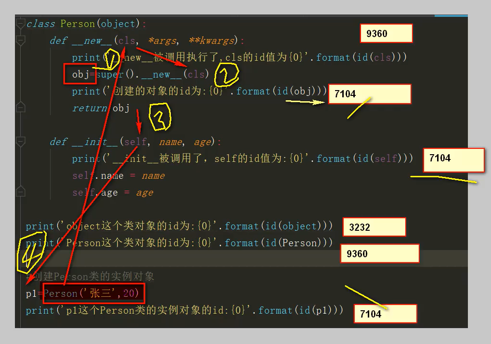

#  Python基础

## 前导知识

### 输入输出

`print()`函数的使用

+ 输出内容

  + 数字：`print(520)`

  + 字符串：`print('hello')`

  + 含有运算符的表达式：`print(3 + 1)`

  + 通过使用`ljust()`，`center()`，`rjust()`函数来实现输入字符串的左右对齐,居中,右对齐等操作

    ```python
    print("|","Ursula".ljust(20,"*"),"|")  # 左对齐
    print("|","Ursula".center(20,"*"),"|") # 居中对齐
    print("|","Ursula".rjust(20,"*"),"|")  # 右对齐
    
    运行结果：
    | **************Ursula |
    | *******Ursula******* |
    | Ursula************** |
    ```

  + **更多内容**可以看 [格式化字符串] 一节

+ 输出目的地

  + 显示器

  + 文件

    ```python
    fp = open('D:/text.txt', 'a+')
    print('hello', file=fp)
    fp.close()
    ```

+ 输出形式

  + 换行

  + 不换行：使用逗号分隔，就会只输出到一行，并以==空格隔开==

    ```python
    print('hello', 'world')
    ```

`input()`函数的使用

用来接受输入内容，接受输入的内容类型为`str`

### 字符编码转换

+ `ord(c)`：返回一个单字符字符串的Unicode码位，就是将字符转为2进制编码
+ `chr(i)`：返回一个单字符的Unicode字符串，就是将二进制编码转为对应字符

### 变量

变量由三部分组成

+ 唯一标识：表示对象所存储的==内存地址==，使用内置函数`id(obj)`来获取
+ 类型：表示的是对象的数据类型，使用内置函数`type(obj)`来获取
+ 值：表示对象所存储的具体数据，使用`print(obj)`可以将值进行打印输出

### 对象的布尔值

+ Python—切皆对象，所有对象都有一个布尔值
  + `bool()`：获取对象的布尔值

+ 以下对象的布尔值为False
  + 数值0 
  + None
  + 空字符串
  + 空列表
  + 空元组
  + 空字典
  + 空集合

### 对象的成员属性

假如有个类Student，如果你想知道他又哪些成员方法和属性，可以使用`dir`，如下

```python
dir(Student)
```

### 注释

1. 单行注释，以`#`开头，直到换行结束

2. 多行注释，由**一对**三引号`”“”`或者`'''`之间的代码

3. 中文编码声明注释，在文件开头加上中文声明注释，用以指定源码文件编码格式，如

   ```python
   #coding:gkb
   或者
   #coding:utf-8
   ```

   当文件保存时会以相应格式保存

## 运算符

### 算术运算符

+ `+`：加
+ `-`：减
+ `*`：乘
+ `/`：除
+ `//`：整除，若运算数一正一负，则结果向下取整
+ `%`：取余
+ `**`：幂运算，如`2**3 = 2^3 = 8` 

### 赋值运算符

+ 链式赋值

  ```python
  a = b = c = 20
  print(a, id(a))
  print(b, id(b))
  print(c, id(c))
  ```

+ 参数赋值

  + +=、-=、*=、/=、//=、%=

+ 解包赋值

  ```python
  a, b, c = 20, 30, 40
  ```

+ 交换赋值

  ```python
  a, b = 10, 20
  a, b = b, a
  ```

### 比较运算符

+ <，>, >=, <=, !=
  + 比较远算符的结果都是布尔值
+ ==
  + 对象 value 的比较
+ is、is not
  + 对象 id 的比较

### 布尔运算符

+ and、or、not
+ in、not in

### 位运算符

+ &：位与，对应数位都是1,结果数位才是1,否则为0
+ |：位或，对应数位都是0,结果数位才是0，否则为1
+ <<：左移运算符，高位溢出舍弃,低位补0
+ \>>：右移运算符，低位溢出舍弃,高位补0

### 优先级

先算乘除，再算加减，但是若有幂运算就先算幂运算。（算数运算符）

先位与，再位或，但是若有位移运算符，则先位移（位运算）

比较运算符

先 and，再 or （布尔运算符）

最后赋值运算符

**总结**：算术运算符 > 位运算符 > 比较运算符 > 布尔运算符 > 赋值运算符

## 流程控制

### 分支结构

`if else elif` 语法格式

```python
if 条件表达式1:
  条件执行体1
elif 条件表达式2:
  条件执行体2
[else:]
  条件执行体N
```

==条件表达式==：

```python
x if 判断条件 else y

a = 10
b = 20
print('a', '大于等于' if a >= b else '小于', b) # a 小于 20
```

### 循环结构

`while` 语法格式

```python
while 条件表达式1:
  条件执行体1
```

`for-in` 语法格式

```python
for 自定义的变量 in 可迭代对象:
  循环体
```

+ in：表达从(字符串、序列等)中依次取值，又称为遍历
+ 目标对象：遍历的对象必须是可迭代对象
+ 若循环体不需要访问自定义变量，可以将自定义变量写为下划线`_`


### pass语句

语句什么都不做，只是一个占位符，用在语法上需要语句的地方

+ 使用时机
  + 当没想好代码怎么写的时候可以使用
+ 使用场景
  + if 语句的条件执行体
  + for-in 语句的循环体
  + 定义函数的函数体

## 数据类型

### Number 数字

+ int：98

+ float：3.14159

  ```python
  # 浮点类型进行计算时，可能会不准确，如下
  print(1.1 + 2.2) # 3.3000000000000003
  print(1.1 + 2.1) # 3.2
  
  # 因此可以采取下面的措施来解决
  from decimal import Decimal
  print(Decimal('1.1') + Decimal('2.2')) # 3.3
  ```

+ bool：True、False

  ```python
  f1 = True
  f2 = False
  
  # 布尔值可以转成整数运算
  print(f1 + 1) # 2
  print(f2 + 1) # 1
  ```

+ complex：

> 进制转换：
>
> + 十进制：无前缀
> + 二进制：前缀为`0b`，如`0b10101111`
> + 八进制：前缀为`0o`
> + 十六进制：前缀为`0x`

### String 字符串

字符串又称为不可变的字符序列，只要加上`'`或者`"`的字符串就是 str 类型，而`‘’‘`或者`“”“`可多行书写，并保留`/n`。注意，str 类型是==可迭代对象==

```
str1 = 'hello world!'
str2 = "hello world!"
str3 = """hello
world!"""

str4 = '''hello
world!'''
```

> 类型转换
>
> ```python
> name = '张三'
> age = 20
> 
> print('我叫' + name + '今年' + age + '岁') # 当将str类型与int类型进行连接时，会报错，但是用逗号连接就不会报错
> ```
>
> + 使用`str()`可以将其他数据类型转为 string 类型
>
> ```python
> a = 10
> b = 198.8
> c = False
> print(str(a), str(b), str(c))
> ```
>
> + 使用`int()`可以将其他数据类型转为 int 类型
>
> ```python
> s1 = '128' 
> f1 = 98.7
> s2 = '76.77' # 转化会报错，因为是浮点数串
> ff = True
> s3 = 'hello'
> 
> print(type(s1)，type(fl)，type(s2)，type(ff)，type(s3))
> print(int(s1)，type(int(s1))) # 将str转成int类型，字符串为数字串
> print(int(f1)，type(int(f1))) # float转成int类型，截取整数部分，舍掉小数部分
> print(int(s2)，type(int(s2))) # 将str转成int类型，报错，因为字符串为小数串
> print(int(ff)，type(int(ff))) # 输出 1 <class 'int'>
> print(int(s3), type(int(s3))) # 报错，将str转为int类型时，必须是整数串，不然会报错
> ```
>
> + 使用`float()`可以将其他数据类型转成 float 类型
>
> ```
> s1 = '128' 
> print(float(s1)) # 输出 128.0
> ```

#### 驻留机制

仅保存一份相同且不可变字符串的方法，不同的值被存放在字符串的驻留池中， Python的驻留机制对相同的字符串只保留一份拷贝，后续创建相同字符串时，不会开辟新空间，而是把该字符串的地址赋给新创建的变量

+ 驻留机制的几种情况（交互模式）
  + 字符串的长度为0或1时
  + 符合标识符的字符串，如`abc%`就不符合标识符命名规则，所以不会驻留
  + 字符串只在编译时进行驻留，而非运行时
  + [-5, 256]之间的整数数字

+ sys中的intern方法强制2个字符串指向同一个对象

+ PyCharm对字符串进行了优化处理

  ```python
  a = 'abc'
  b = 'abc'
  print(a, id(a)) # abc 2251299979824
  print(b, id(b)) # abc 2251299979824
  
  a = 'abc%'
  b = 'abc%'
  print(a, id(a)) # abc 2251336056688
  print(b, id(b)) # abc 2251336064560 因为不满足命名规则，所以不会驻留
  
  # 不过可以使用 sys 的 intern 方法强制指向同一个对象
  a = 'abc%'
  b = 'abc%'
  a = sys.intern(b)
  a is b # True
  
  a = 'abc'
  b = 'ab' + 'c'
  a is b # True, 因为编译时 a 和 b 都是‘abc’，所以符合驻留机制
  
  a = 'abc'
  b = ''.join(['ab', 'c'])
  a is b # False, 上面是运行时拼接的，所以不符合驻留机制
  ```

+ 驻留机制的优缺点

  + 当需要值相同的字符串时，可以直接从字符串池里拿来使用，避免频繁的创建和销毁，提升效率和节约内存，因此拼接字符串和修改字符串是会比较影响性能的。
  + 在需要进行字符串拼接时建议使用str类型的`join`方法，而非`+` ，因为`join()`方法是先计算出所有字符中的长度，然后再拷贝，只new一次对象，效率比`+`高

#### 查找方法

| 方法名称   | 作用                                                         |
| ---------- | ------------------------------------------------------------ |
| `index()`  | 查找子串substr第一次出现的位置,如果查找的子串不存在时，则抛出ValueError |
| `rindex()` | 查找子串substr最后一次出现的位置，如果查找的子串不存在时，则抛出ValueError |
| `find()`   | 查找子串substr第一次出现的位置,如果查找的子串不存在时，则返回-1 |
| `rfind()`  | 查找子串substr最后一次出现的位置,如果查找的子串不存在时，则返回-1 |

#### 大小写转化

| 方法名称       | 作用                                                         |
| -------------- | ------------------------------------------------------------ |
| `upper()`      | 把字符串中所有字符都转成大写字母                             |
| `lower()`      | 把字符串中所有字符都转成小写字母                             |
| `swapcase()`   | 把字符串中所有大写字母转成小写字母，把所有小写字母都转成大写字母 |
| `capitalize()` | 把第一个字符转换为大写，把其余字符转换为小写                 |
| `title()`      | 把每个单词的第一个字符转换为大写，把每个单词的剩余字符转换为小写 |

#### 内容对齐

| 方法名称   | 作用                                                         |
| ---------- | ------------------------------------------------------------ |
| `center()` | 居中对齐，第1个参数指定宽度，第2个参数指定填充符,第2个参数是可选的，默认是空格,如果设置宽度小于实际宽度则则返回原字符串 |
| `ljust()`  | 左对齐，第1个参数指定宽度，第2个参数指定填充符,第2个参数是可选的，默认是空格如果设置宽度小于实际宽度则则返回原字符串 |
| `rjust()`  | 右对齐,第1个参数指定宽度，第2个参数指定填充符,第2个参数是可选的，默认是空格如果设置宽度小于实际宽度则则返回原字符串 |
| `zfill()`  | 右对齐，左边用0填充,该方法只接收一个参数，用于指定字符串的宽度，如果指定的宽度小于等于字符串的长度，返回字符串本身 |

#### 分割操作

| 方法名称   | 作用                                                         |
| ---------- | ------------------------------------------------------------ |
| `split()`  | 1）从字符串的左边开始劈分，默认的劈分字符是空格字符患,返回的值都是一个列表<br />2）以通过参数sep指定劈分字符串的劈分符<br />3）通过参数maxsplit指定劈分字符串时的最大劈分次数，在经过最大次劈分之后，剩余的子串会单独做为一部分 |
| `rsplit()` | 1）从字符串的右边开始劈分，默认的劈分字符是空格字符串,返回的值都是一个列表<br />2）以通过参数sep指定劈分字符串的劈分符<br />3）通过参数maxsplit指定劈分字符串时的最大劈分次数，在经过最大次劈分之后，剩余的子串会单独做为一部分 |

```python
s1 = 'hello|world|python'
print(s1.split(sep='|')) # ['hello', 'world', 'python']
print(s1.split(sep='|', maxsplit=2))  # ['hello', 'world|python']
```

#### 判断操作

| 方法名称         | 作用                                                         |
| ---------------- | ------------------------------------------------------------ |
| `isidentifier()` | 判断指定的字符串是不是合法的标识符                           |
| `isspace()`      | 判断指定的字符串是否全部由空白字符组成(回车、换行，水平制表符) |
| `isalpha()`      | 判断指定的字符串是否全部由字母组成                           |
| `isdecimal()`    | 判断指定字符串是否全部由十进制的数字组成                     |
| `isnumeric()`    | 判断指定的字符串是否全部由数字组成                           |
| `isalnum()`      | 判断指定字符串是否全部由字母和数字组成                       |

#### 其他操作 ★

| 方法名称    | 作用                                                         |
| ----------- | ------------------------------------------------------------ |
| `replace()` | 第1个参数指定被替换的子串，第2个参数指定替换子串的字符串,该方法返回替换后得到的字符串，替换前的字符串不发生变化,调用该方法时可以通过第3个参数指定最大替换次数 |
| `join()`    | 将列表或元组中的字符串合并成一个字符串                       |
| `strip()`   | 移除字符串头尾指定的字符（默认为空格）或字符序列             |

```python
lst = ['hello', 'world', 'python']
'|'.join(lst) # 'hello|world|python'
```

#### 比较操作

+ 运算符：>, >=, <, <=, ==， ！=
+ 比较规则：首先比较两个字符串中的第一个字符，如果相等则继续比较下一个字符，依次比较下去，直到两个字符串中的字符不相等时，其比较结果就是两个字符串的比较结果，两个字符串中的所有后续字符将不再被比较
+ 比较原理：比较原理:两上字符进行比较时，比较的是其ordinal value(原始值)调用内置函数ord可以得到指定字符的ordinal value。与内置函数ord对应的是内置函数chr调用内置函数chr时指定ordinalvalue可以得到其对应的字符

#### 格式化字符串 ★★

**方式一**：

`%`做占位符

```python
name = 'lisi'
age = 21
s = '我的名字叫%s, 今年%d岁了' % (name, age)
print(s) # '我的名字叫lisi, 今年21岁了'
```

**方式二**：

`{}`做占位符

```python
name = 'lisi'
age = 21
s = '我的名字叫{0}, 今年{1}岁了,我真的叫{0}'.format(name, age)
print(s) # '我的名字叫lisi, 今年21岁了,我真的叫lisi'
```

**方法三**：

```python
name = 'lisi'
age = 21
s = f'我的名字叫{name}, 今年{age}岁了'
print(s) # '我的名字叫lisi, 今年21岁了'
```

注意字符串前的`f`

**格式**：

下面两个含义一样，基本上和c语言差不多

```python
print('{0:.3}'.format(3.1415926)) # 表示共3位数
print('{0:.3f}'.format(3.1415926)) # 表示共3位小数
print('{0:10.3f}'.format(3.1415926)) # 表示宽度10，共3位小数
print('%.3f' % 3.1415926)

num = 42
print(f"'{f'{num:05}'}'")  # '00042'
print(f"'{f'{num:>5}'}'")  # '   42'
print(f"'{f'{num:<5}'}'")  # '42   '
print(f"'{f'{num:^5}'}'")  # ' 42  '
```

#### 防止转义

默认python会对字符串做转义处理，比如`\n`就会当成一个换行，如果就像保持原样，可以加一个前缀`r`（raw）

```python
str = r'c:/desktop/1.png'
```


#### 编码解码

```python
s = '我靠无情'
# 编码
print(s.encode(encoding='GBK'))
print(s.encode(encoding='UTF-8'))

# 解码
byte = s.encode(encoding='GBK')
print(byte.decode(encoding='UTF-8'))
```

### list 列表

变量可以存储一个元素，而列表是一个“大容器”可以存储N多个元素，程序可以方便地对这些数据进行整体操作列表相当于其它语言中的数组

+ 列表的创建

  + 使用中括号`[]`， 元素之间用英文的逗号进行分隔

  + 调用内置函数`list()`

    ```python
    # 方法一
    lst = ['hello', 'world', 98]
    print(lst) # ['hello', 'world', 98]
    
    # 方法二
    lst2 = list(['hello', 'world', 98])
    ```
    
  + 创建空列表

    ```python
    lst = []
    lst = list()
    ```

+ 列表的特点

  + 列表元素按顺序有序排序
  + 索引映射唯一一个数据，如 `lst[0] = 'hello'`，`lst[-3] = 'hello'`
  + 列表可以存储重复数据
  + 任意数据类型混存
  + 根据需要动态分配和回收内存，不用考虑存放数据过多的问题

+ 常用方法

  + 查询操作

    + `index(find, start[, stop])`：获取某元素的索引
      + 如查列表中存在N个相同元素，只返回相同元素中的第一个元素的索引
      + 如果查询的元素列表中不存在，则会抛出`ValueError`
      + 可以在指定的`start`和`stop`中查找，左闭右开区间
    + `lst[index]`：获取指定索引值的元素值
      + 正向索引从`0`到`N-1`，举例`lst[0]`
      + 逆向索引从`-N`到`-1`，举例`lst[-N]`
      + 指定索引不存在，会抛出`IndexError`

  + 切片操作，语法格式 `列表名[start: stop: step]`，==切片结果为源列表片段的一个拷贝==

    + 切片范围：`[start, stop)`
    + 步长默认为1：`list1[1:3]`   把第二个元素到第三个元素个提出来，
    + step 为正数
      + `[:stop:step]`：切片的第一个元素默认是列表的第一个元素
      + `[start::step]`：切片的最后一个元素默认是列表的最后一个元素
    + step 为负数
      + `[:stop:step]`：切片的第一个元素默认是列表的最后一个元素
      + `[start::step]`：切片的最后一个元素默认是列表的第一个元素
    + `list1[:]`提取所有的元素

  + 比较操作，可以用`is`还有`not in`判断元素是否在列表中

  + 增删改操作

    + `append()`向列表尾部添加元素，并不会创建新的对象

    + `extend()`向列表末尾至少添加一个元素

    + `insert(index, dat)`添加元素，第一个参数为要添加的索引值，第二个为要添加的元素

    + `remove(dat)`参数为需要删除的元素，如果有重复元素，只移除重复元素的第一个

    + `pop(index)`删除最后一个元素，并且返回删除的元素，如果带上参数，则移除指定索引元素，若指定索引元素不存在，则抛出`IndexError`

    + `clear()`清空列表

    + `del list1`参数为需要删除的列表

    + 切片修改元素

      ```python
      # 修改
      list1 = [1, 2, 3, 4]
      list1[1:] = [True, False, 'hello']
      print(list1) # [1, True, False, 'hello']
      
      # 删除
      list1[1:3] = []
      print(list1) # [1, 'hello']
      ```

  + 乘操作、加操作

    ```python
    list1 = [1, 'hello']
    print(list1 * 2) # [1, 'hello', 1, 'hello']
    print(list1 + list) # [1, 'hello', 1, 'hello']
    ```

  + 排序

    + 修改原列表

      ``` python
      # 升序
      list1 = [20, 40, 10, 92, 51]
      print(list1, id(list1)) # [20, 40, 10, 92, 51] 2791287105288
      
      list1.sort()
      print(list1, id(list1)) # [10, 20, 40, 51, 92] 2791287105288
      
      # 降序
      list1.sort(reverse=True)
      print(list1) # [92, 51, 40, 20, 10]
      ```

    + `sorted()`不修改原列表，产生新列表

      ```python
      # 升序
      list1 = [20, 40, 10, 92, 51]
      new_list = sorted(list1)
      print(list1, new_list) # [20, 40, 10, 92, 51] [10, 20, 40, 51, 92]
      
      # 降序
      new_list = sorted(list1, reverse=True)
      ```

  + ==列表生成式==

    ```python
    list1 = [i for i in range(1, 10)]
    print(list1) # [1, 2, 3, 4, 5, 6, 7, 8, 9]
    
    list1 = [i*i for i in range(1, 10)]
    print(list1) # [1, 4, 9, 16, 25, 36, 49, 64, 81]
    ```


### dict 字典

Python内置的数据结构之一，与列表一样是一个可变序列以键值对的方式存储数据，字典是一个**无序**的序列

字典的特点：

1. 字典中的所有元素都是一个key-value对， key不允许重复, value可以重复
2. 字典中的元素是无序的
3. 字典中的key必须是不可变对象
4. 字典也可以根据需要动态地伸缩 
5. 字典会浪费较大的内存，是一种使用空间换时间的数据结构

+ 字典的创建

  + 最常用的方式：

    ```python
    scores = {'zhangsan': 100, 'lisi': 90, 'wangwu': 45}
    ```
    
  + 使用内置函数 `dict()`

    ```python
    user = dict(name='jack', age=20)
    print(user) # {'name': 'jack', 'age': 20}
    ```
    
  + 创建空字典

    ```python
    d = {}
    d = dict()
    ```

+ 元素获取

  + `dict[key]`，例如`scores['zhansan']`，若指定 key 不存在，则抛出`KeyError`异常
  + `get(key[, defaultValue])`方法，例如`scores.get('zhangsan')`，若指定 key 不存在，会返回 Node，也可以设置参数返回默认的 value 值

+ 判断操作

  + 使用`in`或`not in`判断键是否在字典中存在

+ 增删改操作

  + 添加修改字典元素：`scores['lisi'] = 30`
  + 删除指定键值对：`del scores['张三']`
  + 清空字典元素：`scores.clear()`

+ 视图操作

  + `keys()`：获取字典中所有 key，返回值为`dict_keys`类型，但可以通过`list()`函数转为 list 类型
  + `values()`：获取字典中所有 value，返回值为`dict_values`类型
  + `items()`：获取字典中所有 key-value 对，返回值为`dict_items`类型

+ 字典元素遍历

  ```python
  for item in scores: # item 为字典的键
      print(item)
  ```

+ 字典生成式

  + 使用内置函数`zip()`，用于将可迭代的对象作为参数，将对象中对应的元素打包成一个元组，然后返回由这些元组组成的列表

    ```python
    # 语法格式，若zip的两个参数长度不相同，则以短的为基准生成
    # { item : price for item, price in zip(items, prices) }
    name = ['cc', 'hemou']
    age = ['99', '20']
    {n: a for n, a in zip(name, age)} # {'cc': '99', 'hemou': '20'}
    + zip(name, age) # 可迭代的对象
    + n #自定义表示key的变量
    + a #自定义表示value的变量
    ```
    
  + 或者使用 `fromkeys` 方法
  
    ```python
    seq = ('Google', 'Runoob', 'Taobao')
     
    dict = dict.fromkeys(seq)
    print "新字典为 : %s" %  str(dict)  
    # 新字典为 : {'Google': None, 'Taobao': None, 'Runoob': None}
     
    dict = dict.fromkeys(seq, 10)
    print "新字典为 : %s" %  str(dict)
    # 新字典为 : {'Google': 10, 'Taobao': 10, 'Runoob': 10}
    ```
  
    


### Tuple 元组

Python内置的数据结构之一，是一个不可变序列

> + 不变可变序：字符串、元组
>   + 不变可变序列：没有增、删，改的操作
> + 可变序列：列表、字典
>   + 可变序列：可以对序列执行增、删、改操作，对象地址不发生更改
> + 为什么要将元组设计成不可变序列
>   + 在多任务环境下，同时操作对象时不需要加锁
>   + 因此，在程序中尽量使用不可变序列
> + 注意事项：元组中存储的是对象的引用
>   + 如果元组中对象本身不可对象，则不能再引用其它对象
>   + 如果元组中的对象是可变对象，则可变对象的引用不允许改变，但数据可以改变

+ 创建方式

  + 直接用小括号，`t = ('python', 'hello', 99)`

  + 使用内置函数`tuple([arg])`，参数可以是个可迭代对象

    ```python
    t = tuple([1, 2]) # (1, 2)
    print(tuple(range(1, 10))) # (1, 2, 3, 4, 5, 6, 7, 8, 9)
    ```

  + 只包含一个元组的元素需要使用逗号和小括号，`t = (10,)`

  + 创建空元组

    ```python
    t = ()
    t = tuple()
    ```

+ 遍历
  + 使用索引
  + 使用`for-in`
  
+ 没有元组生成式，只能产生一个迭代器

  ```python
  e = (i for i in range(10))
  next(e) # 0
  next(e) # 1
  next(e) # 2
  ```

  

### set 集合

集合元素不允许重复，集合元素无序

+ 创建方式

  + 直接用话花括号，`t = {}`

  + 使用内置函数`set()`，`t = set(range(1, 5))`

  + 创建空集合

    ```python
    t = set() # 只有这一个方法
    ```

+ 判断操作，`in` 或者 `not in`

+ 新增操作

  + `add()`，依次添加一个元素
  + `update()`，至少添加一个元素

+ 删除操作

  + `remove(dat)`，一次删除一个指定元素，如果指定元素不存在则抛出`KeyError`
  + `discard(dat)`，一次删除一个指定元素，如果指定的元素不存在**不抛出异常**
  + `pop()`，一次删除任意一个元素，不能添加参数
  + `clear()`，清空集合

+ 集合操作

  + 可以使用`==`或者`!=`判断是否相等

  + 可以调用`issubset()`判断一个集合是否是另一个集合的子集

  + 可以调用`isssuperset()`判断一个集合是否是另一个集合的超集

  + 可以调用`isdisjoint()`判断一个集合和另一个集合是否有交集

  + 获取交集

    ```python
    s1.intersection(s2)
    s1 & s2
    ```

  + 获取并集

    ```python
    s1.union(s2)
    s1 | s2
    ```

  + 获取差集

    ```python
    s1.difference(s2)
    s1 - s2
    ```

  + 获取对称差集，就是两个集合的并集去掉交集

    ```python
    s1.symmetric_difference(s2)
    s1 ^ s2
    ```

+ 集合生成式

  ```python
  {i for i in range(1, 10)}
  ```

## 函数

函数就是执行特定任和以完成特定功能的一段代码

函数的作用：

+ 复用代码
+ 隐藏实现细节
+ 提高可维护性
+ 提高可读性便干调试

### 函数的创建

```python
def 函数名([输入参数]):
    函数体
    [return xxx]
```

### 参数传递

+ 位置实参：根据形参对应的位置进行实参传递

  ```python
  def calc(a, b):
      pass
  calc(10, 20) # a = 10, b = 20
  ```

+ 关键字实参：根据形参名称进行实参传递

  ```python
  def calc(a, b):
      pass
  calc(b = 10, a = 20) # a = 20, b = 10
  ```

+ ==默认参数==：函数定义时，给形参设置默认值，只有与默认值不符的时候才需要传递实参

  ```python
  def fun(a, b = 10):
      print(a, b)
      
  # 函数的调用
  fun(100)    # a = 100, b = 10
  fun(20, 30) # a = 20, b = 30
  ```

+ ==个数可变的位置参数==

  + 定义函数时，可能无法事先确定传递的位置实参的个数时，使用可变的位置参数
  + 使用`*`定义个数可变的位置形参
  + 结果为一个**元组**
  + **只能定义一个**，不然会报错

  ```python
  def fun(*args):
      print(args)
      
  fun(10)	# (10, )
  fun(10, 20, 30) # (10, 20, 30)
  
  def fun2(*args, *args1): # 会报错，个数可变的位置参数只能定义一个
      pass
  ```

+ ==个数可变的关键字形参==

  + 定义函数时，无法事先确定传递的关键字实参的个数时，使用可变的关键字形参
  + 使用`**`定义个数可变的关键字形参
  + 结果为一个**字典**
  + **只能定义一个**，不然会报错

  ```python
  def fun(**args):
      print(args)
      
  fun(a = 10)	# {'a': 10}
  fun(a = 10, b = 20, c = 30) # {'a': 10, 'b': 20, 'c': 30}
  ```

  在一个函数的定义过程中，**既有个数可变的关键字形参，也有个数可变的位置形参**，要求，==个数可变的位置形参，放在个数可变的关键字形参之前==

### 返回值

函数返回多个值时，结果为元组

```python
def fun(num):
    odd = []
    even = []
    for i in num:
        if i % 2:
            odd.append(i)
        else:
            even.append(i)
    return odd, even
print(fun([10, 29, 34, 23, 44, 53, 55])) # ([29, 23, 53, 55], [10, 34, 44])
```

### 变量作用域

程序代码能访问该变量的区域

根据变量的有效范围可分为

+ 局部变量

  + 在函数内定义并使用的变量，只在函数内部有效，局部变量使用`global`声明，这个变量
    就会就成全局变量

    ```python
    def fun():
        global age
        age = 20
        print(age)
    
    fun()
    print(age) # 20
    ```

    

+ 全局变量

  + 函数体外定义的变量，可作用予函数内外

## Bug

### Bug常见类型

+ `SyntaxError`：语法错误
+ `IndexError`：索引越界错误
+ `ZeroDivisionError`：被0除异常
+ `KeyError`：映射中没有这个键
+ `NameError`：未申明/初始化的对象（没有属性）
+ `ValueError`：传入无效的参数
+ `BaseException`：异常基类

### 异常处理

捕获异常的顺序按照先子类后父亲类的顺序,为了避免遗漏可能出现的异常，可以在最后增加`BaseException`

```python
try:
    n1 = int(input('请输入一个整数'))
    n2 = int(input('请输入另一个整数'))
    result = n1 / n2
    print('结果为', result)
except ZeroDivisionError:
    print('除数不能为0')
except ValueError:
    print('不能将字符串转化为数字')
except BaseException as e:
    print(e)
```

还有一种异常处理方式`try...catch...else`，如果try块中没有抛出异常，则执行else块，如果try中抛出异常，则执行except块

```python
try:
    n1 = int(input('请输入一个整数'))
    n2 = int(input('请输入另一个整数'))
    result = n1 / n2
except BaseException as e:
    print(e)
else:
    print('结果为', result)
```

还有最后一种异常处理方式`try...catch...finally`，finally块无论是否发生异常都会被执行，能常用来释放try块中申请的资源

```python
try:
    n1 = int(input('请输入一个整数'))
    n2 = int(input('请输入另一个整数'))
    result = n1 / n2
except BaseException as e:
    print(e)
else:
    print('结果为', result)
finally:
    print('无论是否产生异常，总会被执行的代码')
```

### 打印异常

通过`traceback`可以打印异常

```python
import traceback
try:
	print(1/0)
except:
    traceback.print_exc()
```

### 主动触发异常

```python
raise StopIteration
```

## 面向对象

### 类的创建

基本语法：

```python
class 类名:
    pass
```

类的组成：

+ 构造方法：
  + `__init__(self)`
  + 深入了解super [Python的super函数直观理解](https://zhuanlan.zhihu.com/p/356720970)
  
+ 类属性：

  + 定义在 Class 内，类似于JS中的原型属性

  + 通过`类名.类属性`即可调用，如下

    ```python
    print(Student.navtive_place)
    ```

+ 类方法：

  + 需要通过`@classmethod`修饰，方法第一个参数为`cls`，表示类对象

+ 实例方法

  + 不需要修饰，方法第一个参数为`self`，表示当前实例对象

+ 静态方法

  + 需要`@staticmethod`修饰，但是方法默认不需要传递参数

```python
class Student:
	navtive_place = 'beijing' # 类属性
    
    def __init__(self, name, age):
        self.name = name # name, age 为实例属性
        self.age = age
	# 实例方法
    def info(self):
        print('我的名字叫：', self.name, '年龄是:', self.age)
    # 类方法
    @classmethod
    def cm(cls):
        print('类方法')
	# 静态方法
	@staticmethod
    def sm():
        print('静态方法')
```

**调用实例方法的两种方式**：

```python
# 第一种方式
stu = Student()
stu.eat()

# 第二种方式
stu = Student()
Student.eat(stu)
```

**动态绑定属性和方法**

```python
stu = Student()
stu.gender = '女'

def show():
    pass

stu.show = show()
```

### 面向对象三大特性

#### 封装

提高程序安全性

+ 将数据（属性）和行为(方法）包装到类对象中。在方法内部对属性进行操作，在类对象的外部调用方法。这样，无需关心方法内部的具体实现细节，从而隔离了复杂度。
+ 在Python中没有专门的修饰符用于属性的私有，如果该属性不希望在类对象外部被访问，前边使用两个`_`。

```python
class Student:
    def __init__(self, name, age):
        self.name = name
        self.__age = age
	def show(self):
        print(self.name, self.__age)

stu = Student('张三', 20)
stu.show()
print(stu.name)
print(stu.__age) # 会报错：'Student' object has no attribute '__age'
# 当然如果非要使用__age这个属性，可以先使用命令 dir(Student)，会能发现有个属性_Student__age
print(stu._Student__age)
```

#### 继承

提高代码的复用性

+ 如果一个类没有继承任何类，则默认继承object

+ python 支持多继承

+ 定义子类时，必须在其构造函数中调用父类的构造函数

+ 语法格式：

  ```python
  class 子类类名(父类1, 父类2):
      pass
  ```

示例代码

```python
class Person:
    def __init__(self, name, age):
        self.name = name
        self.__age = age

    def info(self):
        print('姓名：{0}， 年龄：{1}'.format(self.name, self.__age))


class Student(Person):
    def __init__(self, name, age, score):
        super().__init__(name, age)
        self.score = score


stu = Student('张三', 20, 99)
stu.info()
```

##### 方法重写

+ 如果子类对继承自父类的某个属性或方法不满意，可以在子类中对其(方法体)进行重新编写
+ 子类重写后的方法中可以通过super().xxx()调用父类中被重写的方法

```python
class Person:
    def __init__(self, name, age):
        self.name = name
        self.__age = age

    def info(self):
        print('姓名：{0}， 年龄：{1}'.format(self.name, self.__age))


class Student(Person):
    def __init__(self, name, age, score):
        super().__init__(name, age)
        self.score = score

    def info(self):
        super(Student, self).info()
        print('，学号{0}'.format(self.score))


stu = Student('张三', 20, 99)
stu.info()
```

##### object类

- object类是所有类的父类，因此所有类都有object类的属性和方法。
- 内置函数`dir()`可以查看指定对象所有属性
- object有一个`__str__()`方法，用于返回一个对于“对象的描述"，对应于内置函数str()经常用于print()方法，帮我们查看对象的信息，所以我们经常会对`__str__()`进行重写，类似于java的 toString() 方法

#### 多态

提高程序的可拓展性和可维护性

+ 简单地说，多态就是“具有多种形态"，它指的是:即便不知道一个变量所引用的对象到底是什么类型，仍然可以通过这个变量调用方法，在运行过程中根据变量所引用对象的类型,动态决定调用哪个对象中的方法。

**示例代码**

```python
class Animal:
    def eat(self):
        print('动物要吃东西')


class Dog(Animal):
    def eat(self):
        print('狗吃骨头')


class Cat(Animal):
    def eat(self):
        print('猫吃鱼')


def fun(obj):
    obj.eat()


fun(Animal())
fun(Dog())
fun(Cat())
```

+ 静态语言实现多态的三个必要条件
  + 继承
  + 方法重写
  + 父类引用指向子类对象
+ 动态语言的多态崇尚“鸭子类型"当看到一只鸟走起来像鸭子、游泳起来像鸭子、收起来也像鸭子，那么这只鸟就可以被称为鸭子。在鸭子类型中，不需要关心对象是什么类型,到底是不是鸭子，只关心对象的行为。

### 特殊属性、方法

+ 特殊属性

  + `__dict__`：获得类对象或实例对象所绑定的所有属性和方法的字典
  + `__class__`：对象所属于的类
  + `__bases__`：类的所有父类**元组**（只有直系父类一个层级）
  + `__base__`：类的所继承的第一个父类
  + `__mro__`：类的继承的层次结构（所有父类层级）

+ 特殊方法

  + `__eq__(self, other)`：相当于重写java的equals方法

  + `__subclasses__()`：返回子类**列表**

  + `__getitem__()`：相当于重写[]，可以通过方括号下标取值
  
  + `__call__()`：使得类实例对象可以像调用普通函数那样，以**对象名()**的形式使用
  
    ```python
    class A:
        # 定义__call__方法
        def __call__(self,name,add):
            print("调用__call__()方法",name,add)
    a = A()
    a("啊", "a")
    ```
  
  + `__repr__()`：类似toString()方法
  
  + `__len__()`：通过重写`__len__()`方法，让内置函数`len()`的参数可以是自定义类型
  
    ```python
    class Person:
        def __init__(self, name, age):
            self.name = name
            self.__age = age
    
        def __len__(self):
            return len(self.name)
        
    stu1 = Student('张三', 20, 99)
    stu2 = Student('lisi', 20, 99)
    print(len(stu1)) # 2
    print(len(stu2)) # 4
    # 简单来说就是调用了类的 __len__() 方法
    ```
  
  + `__add__()`：通过重写`__add__()`方法，可使自定义对象具有“+”功能
  
    ```python
    class Person:
        def __init__(self, name, age):
            self.name = name
            self.__age = age
    
        def __add__(self, other):
            return self.name + other.name
    
    print(Person('张三', 20) + Person('李四', 20)) # 张三李四
    ```
  
  + `__sub__()`、`__mul__()`、`__truediv__()` 相当于 /、`__floordiv__()`相当于 //、`__mod__()`
  
  + `__new__()`：用于创建对象
  
  + `__init__()`：对创建的实例对象进行初始化
  
  + `__del__()`：析构方法
  



借助这个图来详细说明`__new__()`和`__init__()`这两个方法

1. 程序先走到 `p1 = Person('张三', 20)`
2. 然后他会把`Person`这个类对象传递到`__new__()`方法的`cls`参数中
3. 在`__new__()`中创建好对象后，他会返回这个对象值，并将这个对象传递到`__init__()`的`self`参数中
4. 然后在`__init__()`方法中进行初始化操作

## 文件操作

### 编码格式

+ 常见的字符编码格式
  + python的解释器使用的时Unicode（内存）
  + .py 文件在磁盘上使用 UTF-8 存储（外存）


可以在py文件的第一行添加如下代码

```
#encoding=gbk
```

这样就可以改变文件的默认编码为gbk

### 文件打开模式

| 打开模式 | 描述                                                         |
| -------- | ------------------------------------------------------------ |
| r        | 以只读模式打开文件，文件的指针将会放在文件的开头             |
| w        | 以只写模式打开文件，如果文件不存在则创建，如果文件存在，则覆盖原有内容，文件指针在文件的开头 |
| a        | 以追加模式打开文件，如果文件不存在则创建，文件指针在文件开头，如果文件存在，则在文件末尾追加内容，文件指针在原文件末尾 |
| b        | 以二进制方式打开文件，**不能单独使用**，需要与共它模式一起使用，rb或者wb |
| +        | 以读写方式打开文件，**不能单独使用**，需要与其它模式一起使用，a+ |

### 文件对象常用方法

+ `f.read(size=-1)`：从文件读取size个字符，当未给定size或给定负值的时候，读取剩余的所有字符，然后作为字符串返回
+ `f.readline()`：以读取模式打开，如果文件存在，则在末尾追加写入
+ `f.readlines()`：把文本文件中每一行都作为独立的字符串对象，并将这些对象放入列表返回
+ `f.write(str)`：将字符串str写入文件
+ `f.writenlines(seq)`： 像文件写入字符串序列，seq应该是一个返回字符串的可迭代对象
+ `f.seek(offset，from)`： 在文件中移动文件指针，从from（0代表文件起始位置，1代表当前位置，2代表文件末尾）偏移offset个字节
+ `f.tell()`：返回当前文件中的位置
+ `f.flush()`：把缓冲区的内容写入文件，但不关闭文件
+ `f.close()`：把缓冲区的内容写入文件，同时关闭文件，释放文件对象相关资源

### with语句

with语句相当于一个上下文管理器，他可以自动管理上下文资源，不论什么原因跳出with块，都能确保文件正确的关闭，以此来达到释放资源的目的

#### 语法

```python
with open(文件名, 模式) [as 匿名]:
    pass # 当离开上下文后，自动调用上下文管理器的特殊方法 __exit__()
```

+ with后面跟着的`open()`可以称为上下文管理器
+ 这个上下文管理器实现了`__enter__()`方法和`__exit__()`方法
+ with语句结束后他会产生一个运行时上下文，自动调用`__enter__()`方法并将返回值赋值给as后面的变量名

#### 上下文管理器

当一个类实现了`__enter__()`方法和`__exit__()`方法，那么说明他遵守了上下文协议，那他的实例对象就是一个上下文管理器

**示例代码**

```python
class MyContent:
    def __enter__(self):
        print('enter方法调用了')
        return self

    def __exit__(self, exc_type, exc_val, exc_tb):
        print('exit方法调用了')

    def show(self):
        print('show方法调用了', 1/0)


with MyContent() as mc:
    mc.show()
```

同理open方法也遵守了这个协议

### 目录操作

参考拓展->常用内建模块->os

### pickle

```python
import pickle
my_list = [123, 3.14, ['another list']]
pickle_file = open('my_list.pkl', 'wb')
pickle.dump(my_list, pickle_file)
pickle_file.close()
pickle_file = open('my_list.pkl', 'rb')
my_list2 = pickle.load(pickle_file)
print(my_list2)
```

## 模块化

### 包

> 包是一个分层次的目录结构,它将一组功能相近的模块组织在一个目录下

+ 作用：
  + 代码规范
  + 避免模块名称冲突
+ 包和目录的区别
  + 包含`__init__.py`文件的目录称为包
  + 目录里通常不包含`__init__.py`
+ 包的导入
  + `import 包名.模块名`


如图，`package1`就是一个包，因为这个文件夹内有个`__init__.py`文件，而这个包中可以有多个模块，比如module1.py、module2.py ... 等等。如果想要引用这个包内的某个模块，需要如下方式导入

```python
import package1.module1 as pm1
print(pm1.add(1, 2))
```

### import用法

| 方式                        | 引用方式                    |
| --------------------------- | --------------------------- |
| import <库名>               | <库名>.<函数名>(<函数参数>) |
| from <库名> import <函数名> | <函数名>(<函数参数>)        |
| from <库名> import *        | <函数名>(<函数参数>)        |
| import <库名> as 别名       | <别名>.<函数名>(<函数参数>) |

**简易描述**

+ `import 模块名称 [as 别名]`
+ `from 模块名称 import 函数/变量/类`

### 主程序运行

```python
if __name__ == '__main__':
    pass
```

+ 如果运行入口文件为当前文件，则`__name__`的值为`__main__`
+ 否则`__name__`的值为模块的名称，也就是文件名（不包括后缀，如`test.py`模块名就是`test`）

## 拓展

### 浅拷贝深拷贝

#### 浅拷贝

Python拷贝一般都是浅拷贝，拷贝时，对象包含的子对象内容不拷贝因此，源对象与拷贝对象会引用同一个子对象

copy包的copy()方法可以进行浅拷贝

```python
class CPU:
    pass


class Disk:
    pass


class Computer:
    def __init__(self, cpu, disk):
        self.disk = disk
        self.cpu = cpu


import copy
cpu = CPU()
disk = Disk()
computer = Computer(cpu, disk)
com1 = copy.copy(computer) # 2282156698688 <__main__.CPU object at 0x000002135B23AB50> <__main__.Disk object at 0x000002135B23A850>
com2 = copy.copy(computer) # 2282156698880 <__main__.CPU object at 0x000002135B23AB50> <__main__.Disk object at 0x000002135B23A850>
```

如上代码能发现，拷贝的computer类id不同，但是cpu和disk都是同一个

#### 深拷贝


copy包的deepcopy()方法可以进行浅拷贝，递归拷贝对象中包含的子对象，源对象和拷贝对象所有的子对象也不相同


### 常用内建函数

#### range()

+ `range(stop)`：创建一个 (0, stop) 之间的整数序列，步长为1，左闭右开，后同
+ `range(start, stop)`：创建一个 (start, stop) 之间的整数序列，步长为1
+ `range(start, stop, step)`：创建一个 (start, stop) 之间的整数序列，步长为 step

返回值是一个迭代器对象

优点：

1、不管range对象表示的整数序列有多长，所有range对象占用的内存空间都是相同的，因为仅仅需要存储start,stop和step，只有当用到range对象时，才会去计算序列中的相关元素

2、`in`与`not in`可以判断整数序列中是否存在(不存在)指定的整数

```python
r = range(10)
print(list(r)) # [2, 3, 4, 5, 6, 7, 8, 9]
```

#### issubclass()

`issubclass(class, classinfo)`

用于判断一个类是否是另一个类的子类

1. 这种检测不严格，一个类会被认为是其自身的子类
2. classinfo 可以是类对象组成的元组，只要class与其中任何一个候选类的子类，则返回 True

#### isinstance()

`isinstance(object, classinfo)`

用于判断一个对象是否是另一个类的实例，可以是被继承的类的实例

1. 如果第一个参数不是对象，则永远返回False
2. 如果第二个参数不是类或者由类组成的元组，会抛出一个 TypeError 一场

#### hasattr()

`hasattr(object, name)`

判断对象是否含有某个属性

1. name这个参数必须用单引号或双一号包含住

#### getattr()

`hasattr(object, name, [default])`

判断对象的某个属性值，如果没有设置默认值，则获取不存在的属性值会报错，否则返回默认值

#### setattr()

`setattr(object, name, value)`

设置对象的属性值，不存在的属性，会自动添加上

#### delattr()

`delattr(object, name)`

删除对象某个指定的属性

#### property()

`property(fget=None, fset=None, fdel=None, doc=None)`

可以通过设置属性，来删除对象属性，示例代码如下

```python
class C:
    def __init(self, size = 10):
        self.size = size
    def getSize(self):
        return self.size
    def setSize(self, size):
        self.size = size
	def delSize(self):
        del self.size
	x = property(getSize, setSize, delSize)

c1 = C()
c1.x 		# 相当于 c1.getSize()
c1.x = 20	# 相当于 c1.setSize(20)
del c1.x	# 相当于 c1.delSize()
```

这个函数的作用可以保证项目的api接口内部变动，而不影响外边人员调用

#### sorted()

排序，方法格式如下

```
sorted(iterable, key=key, reverse=reverse)
```

+ iterable：Required. The sequence to sort, list, dictionary, tuple etc.
+ key：Optional. 要进行排序的关键字
+ reverse：Optional. A Boolean. False will sort ascending, True will sort descending. Default is False

#### 属性访问


#### 迭代器

+ `iter()`
  + `__iter__()`：获取迭代器本省
+ `next()`
  + `__next__()`：迭代器的具体逻辑

```python
str = 'hello'
it = iter(str)
next(it) # h
next(it) # e
next(it) # l

class Fibs:
    def __init(self, n=10):
        self.a = 0
        self.b = 1
        self.n = n
        
	def __iter__(self):
        return self
    def __next__(self):
        self.a, self.b = self.b, self.a + self.b
        if self.a > self.n:
            raise StopIteration
        return self.a
    
fibs = Fibs()
for each in fibs:
    print(each)
# 1 1 2 3 5 8
```

#### 生成器

```python
def libs():
    a = 0
    b = 1
    while True:
        a, b = b, a + b
        yield a
        
for each in libs():
    if each > 10:
		break
	print(each, end=' ')
# 1 1 2 3 5 8
```


### 常用内建模块

| 模块名   | 描述                                                         |
| -------- | ------------------------------------------------------------ |
| sys      | 与Python解释器及其环境操作相关的标准库                       |
| time     | 提供与时间相关的各种函数的标准库                             |
| os       | 提供了访问操作系统服务功能的标准库                           |
| calendar | 提供与日期相关的各种函数的标准库                             |
| urllib   | 用于读取来自网上（服务器）的数据标准库                       |
| json     | 用于使用JSON序列化和反序列化对象                             |
| re       | 用于在字符串中执行正则表达式匹配和替换                       |
| math     | 提供标准算术运算函数的标准库                                 |
| decimal  | 用于进行精确控制运算精度、有效数位和四舍五入操作的十进制运算 |
| logging  | 提供了灵活的记录事件、错误、警告和调试信息等目志信息的功能   |

#### sys

+ `getsizeof(xxx)`：获取任意对象所占内存大小

#### time

+ `time()`：获取当前时间总秒数
+ `localtime(time)`：获取所有类型时间、如时、分、秒等
+ `sleep(seconds)`：程序暂停多少秒

#### os

> `os`模块是Python内置的与操作系统功能和文件系统相关的模块,该模块中的语句的执行结果通常与操作系统有关，在不同的操作系统上运行，得到的结果可能不一样。
>
> `os`模块与`os.path`模块用于对目录或文件进行操作

**os模块**

+ `os.system()`：执行cmd命令
+ `os.startfile()`：打开文件并运行
+ `os.getcwd() `：返回当前工作目录
+ `os.chdir(path) `：改变工作目录
+ `os.listdir(path='.') `：列举指定目录中的文件名（'.'表示当前目录，'..'表示上一级目录）
+ `os.mkdir(path)： `创建单层目录，如该目录已存在抛出异常
+ `os.makedirs(path)： `递归创建多层目录，如该目录已存在抛出异常，注意：'E:\\a\\b'和'E:\\a\\c'并不会冲突
+ `os.remove(path)` ：删除文件
+ `os.rmdir(path) `：删除单层目录，如该目录非空则抛出异常
+ `os.removedirs(path) `：递归删除目录，从子目录到父目录逐层尝试删除，遇到目录非空则抛出异常
+ `os.rename(old, new) `：将文件old重命名为new
+ `os.system(command)： `运行系统的shell命令
+ `os.walk(top) `：遍历top路径以下所有的子目录，返回一个可迭代三元组对象：(路径, [包含目录], [包含文件])

**os.path模块**

+ `os.path.abspath()`：获取文件的绝对路径
+ `exists(path) `：判断指定路径（目录或文件）是否存在
+ `join(path1[, path2[, ...]]) `：将path1, path2各部分组合成一个路径名
+ `split(path) `：分离目录与文件名，返回(dir_path, f_name)元组
+ `splitext(path) `：分离文件名与扩展名，返回(f_name, f_extension)元组
+ `basename(path) `：去掉目录路径，单独返回文件名
+ `dirname(path) `：去掉文件名，单独返回目录路径
+ `isdir(path) `：判断指定路径是否存在且是一个目录

### turtle库

画布以窗体正中心为(0, 0)

| 函数                                 | 解释                           |
| ------------------------------------ | ------------------------------ |
| setup(width, height, startx, starty) | 绘制窗体                       |
| goto(x, y)                           | 绝对移动                       |
| fd(d)                                | 向前运动                       |
| bk(d)                                | 向后运动                       |
| circle(r, angle)                     | 以画笔左侧的一个点进行曲线运动 |
| seth(angle)                          | 设置画笔偏移角度               |
| left(angle)                          | 设置画笔向左偏移角度           |
| right(angle)                         | 设置画笔向左偏移角度           |
| penup                                | 抬起画笔                       |
| pendown()                            | 落下画笔                       |
| pencolor()                           | 画笔颜色                       |
| done()                               | 停止绘画，并保持窗体不关闭     |
