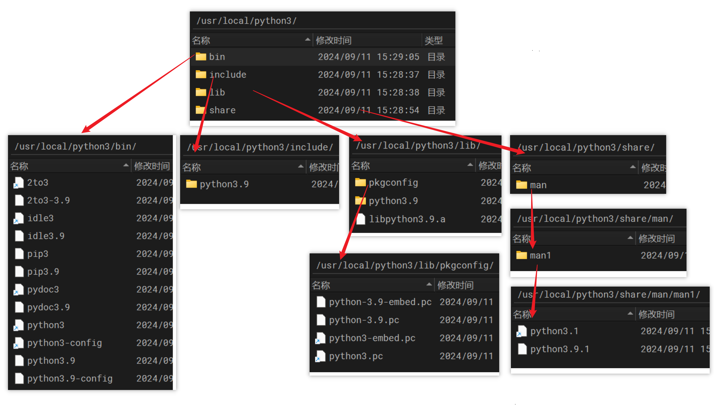

# 离线安装环境

## 安装 Python 

### 安装编译环境

```shell
yum install zlib-devel bzip2-devel openssl-devel ncurses-devel sqlite-devel readline-devel tk-devel gcc make libffi-devel
```

### 下载源码包

```shell
wget https://www.python.org/ftp/python/3.9.0/Python-3.9.0.tgz
```

### 解压安装

```shell
# 解压压缩包
tar -zxvf Python-3.9.0.tgz

# 进入文件夹
cd Python-3.9.0

# 配置安装位置
./configure prefix=/usr/local/python3

./configure --prefix=/usr/local/python3 --with-openssl=/usr/local/openssl

# 安装
make && make install
```

### 添加软链接

```shell
#添加python3的软链接 
ln -s /usr/local/python3/bin/python3.9 /usr/bin/python3 

#添加 pip3 的软链接 
ln -s /usr/local/python3/bin/pip3.9 /usr/bin/pip3
```

## 安装多版本 Python

编译后的内容如下，可以看到他都有相应版本的后缀，因此可以根据以上方式安装不同的python版本，只不过部分链接文件会被替换。



## pip 安装依赖

1. 创建一个和无法联网机器一样的环境
2. 使用 `pip download -d [path] [packages...]` 下载相关依赖，它会自动下载 package 所依赖的其他包
3. 将这些依赖打包发送到无法联网的机器
4. 使用 `pip install [package...] --no-index --find-links=.` 安装依赖
	+ `--find-links`：用来指定离线包所在的路径

对于压缩文件格式的离线包比如说 `iopath-0.10.xx.tar.gz`，先将其解压，然后得到文件夹 `iopath-0.10.xx`，这时返回到这个文件夹的父级目录使用以下命令既可安装：
```shell
pip install ./iopath-0.10.xx
```

