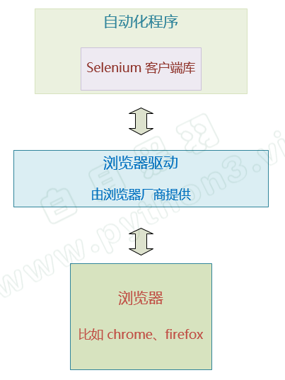
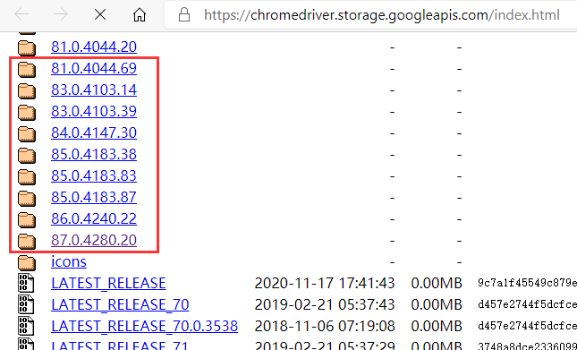
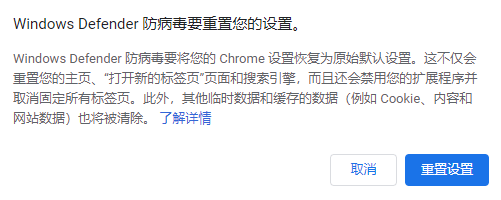

# Selenium笔记

## 原理和安装

### 原理

Selenium 是一套 Web网站 的程序自动化操作 解决方案。

通过它，我们可以写出自动化程序，像人一样在浏览器里操作web界面。 比如点击界面按钮，在文本框中输入文字 等操作。

而且还能从web界面获取信息。 比如获取 火车、汽车票务信息，招聘网站职位信息，财经网站股票价格信息 等等，然后用程序进行分析处理。



selenium 自动化流程如下：

1. 自动化程序调用Selenium 客户端库函数（比如点击按钮元素）
2. 客户端库会发送Selenium 命令 给浏览器的驱动程序
3. 浏览器驱动程序接收到命令后 ,驱动浏览器去执行命令
4. 浏览器执行命令
5. 浏览器驱动程序获取命令执行的结果，返回给我们自动化程序
6. 自动化程序对返回结果进行处理


### 安装

**安装客户端库**

不同的编程语言选择不同的Selenium客户端库。

对应我们Python语言来说，Selenium客户端库的安装非常简单，用 pip 命令即可。

打开 命令行程序，运行如下命令

```
pip install selenium
```

如果安装不了，可能是网络问题，可以指定使用国内的豆瓣源

```
pip install selenium -i https://pypi.douban.com/simple/
```


**安装浏览器和驱动**

浏览器驱动 是和 浏览器对应的。 不同的浏览器 需要选择不同的浏览器驱动。

目前主流的浏览器中，谷歌 Chrome 浏览器对 Selenium自动化的支持更加成熟一些。

推荐大家使用 Chrome浏览器 。

[可以点击这里，下载安装谷歌浏览器](https://www.google.cn/chrome/)

确保Chrome浏览器安装好以后，请大家打开下面的连接，访问Chrome 浏览器的驱动下载页面

[Chrome 浏览器驱动下载地址](https://chromedriver.storage.googleapis.com/index.html)

注意浏览器驱动 必须要和浏览器版本匹配，下图红圈里面的版本号 就是和浏览器版本号对应的



比如：当前Chrome浏览器版本是98, 通常就需要下载98开头的目录里面的驱动程序 。

注意：驱动和浏览器的版本号越接近越好，但是略有差别，比如98和97 ，通常也没有什么问题。

### 简单示例

下面的代码, 可以自动化的 打开Chrome浏览器，并且自动化打开百度网站，可以大家可以运行一下看看。

```py
from selenium import webdriver
from selenium.webdriver.chrome.service import Service

# 创建 WebDriver 对象，指明使用chrome浏览器驱动
wd = webdriver.Chrome(service=Service(r'd:\tools\chromedriver.exe'))

# 调用WebDriver 对象的get方法 可以让浏览器打开指定网址
wd.get('https://www.baidu.com')
```

详细解析：

1、其中，下面这行代码，就会运行浏览器驱动，并且运行Chrome浏览器

```py
wd = webdriver.Chrome(service=Service(r'd:\tools\chromedriver.exe'))
```

注意，等号右边 返回的是 `WebDriver` 类型的对象，我们可以通过这个对象来操控浏览器，比如 打开网址、选择界面元素等。
2、而下面这行代码，就是使用 `WebDriver` 的 get 方法 打开网址 百度

```py
wd.get('https://www.baidu.com')
```

执行上面这行代码时，自动化程序就发起了 打开百度网址的 `请求消息` ，通过浏览器驱动， 给 Chrome浏览器。

Chrome 浏览器接收到该请求后，就会打开百度网址，通过浏览器驱动， 告诉自动化程序 打开成功。

> 执行完自动化代码，如果想关闭浏览器窗口可以调用 `WebDriver` 对象的 quit 方法，像这样 `wd.quit()`

### 省略浏览器驱动路径

前面，我们的代码创建 WebDriver对象时，需要指定浏览器驱动路径，比如

```py
from selenium.webdriver.chrome.service import Service
wd = webdriver.Chrome(service=Service(r'd:\tools\chromedriver.exe'))
```

这样写有几个问题：

一是，比较麻烦， 每次写自动化代码都 要指定路径。

二是，如果你的代码给别人运行，他的电脑上存放浏览器驱动的路径不一定和你一样（比如他的电脑是苹果Mac电脑），得改脚本。

有什么好办法呢？

我们可以把浏览器驱动 `所在目录` 加入环境变量 `Path` ， 写代码时，就可以无需指定浏览器驱动路径了，像下面这样

```py
wd = webdriver.Chrome()
```

因为，Selenium会自动在环境变量 Path 指定的那些目录里查找名为chromedriver.exe 的文件。

而且设置完环境变量后，别忘了重启IDE（比如 PyCharm） 新的环境变量才会生效。

### 常见问题

#### 关闭 chromedriver 日志

缺省情况下 chromedriver被启动后，会在屏幕上输出不少日志信息，如下

```
DevTools listening on ws://127.0.0.1:19727/devtools/browser/c19306ca-e512-4f5f-b9c7-f13aec506ab7
[21564:14044:0228/160456.334:ERROR:device_event_log_impl.cc(211)] [16:04:56.333] Bluetooth: bluetooth_adapter_winrt.cc:1072 Getting Default Adapter failed.
```

可以这样关闭

```py
from selenium import webdriver

# 加上参数，禁止 chromedriver 日志写屏
options = webdriver.ChromeOptions()
options.add_experimental_option('excludeSwitches', ['enable-logging'])

wd = webdriver.Chrome(
    options=options  # 这里指定 options 参数
)
```

#### 浏览器首页显示防病毒重置设置

有的朋友的电脑上Selenium自动化时，浏览器开始显示如下




可以这样解决：

- 命令行输入 `regedit` ，运行注册表编辑器
- 在左边的目录树找到 `HKEY_CURRENT_USER\Software\Google\Chrome`
- 删除其下的 `TriggeredReset` 子项
- 关闭 注册表编辑器

## 选择元素

### 方法

```python
from selenium import webdriver
from selenium.webdriver.common.by import By

# 创建 WebDriver 对象
wd = webdriver.Chrome()

# 调用WebDriver 对象的get方法 可以让浏览器打开指定网址
wd.get('https://www.byhy.net/_files/stock1.html')

# 根据id选择元素，返回的就是该元素对应的WebElement对象
element = wd.find_element(By.ID, 'kw')

# 通过该 WebElement对象，就可以对页面元素进行操作了
# 比如输入字符串到 这个 输入框里
element.send_keys('通讯\n')
```

其他选择方式如下：

```python
from selenium.webdriver.common.by import By

# 初始化代码 ....

wd.find_element(By.ID, 'username').send_keys('byhy')
wd.find_element(By.CLASS_NAME, 'password').send_keys('sdfsdf')
wd.find_element(By.TAG_NAME, 'input').send_keys('sdfsdf')
wd.find_element(By.CSS_SELECTOR,'button[type=submit]').click()
```

> **find_element 和 find_elements 的区别**
>
> + 使用 `find_elements` 选择的是符合条件的 `所有` 元素， 如果没有符合条件的元素， `返回空列表`
>
> + 使用 `find_element` 选择的是符合条件的 `第一个` 元素， 如果没有符合条件的元素， `抛出 NoSuchElementException 异常`

### 等待元素出现

在我们进行网页操作的时候， 有的元素内容不是可以立即出现的， 可能会等待一段时间。

为了解决这个问题，Selenium提供了一个更合理的解决方案，是这样的：

当发现元素没有找到的时候， **并不立即返回** 找不到元素的错误。而是周期性（每隔半秒钟）重新寻找该元素，直到该元素找到，或者超出指定最大等待时长，这时才 抛出异常（如果是 `find_elements` 之类的方法， 则是返回空列表）。

Selenium 的 `Webdriver` 对象 有个方法叫 `implicitly_wait` ，可以称之为 `隐式等待` ，或者 `全局等待` 。该方法接受一个参数， 用来指定 最大等待时长。如果我们 加入如下代码

```py
wd.implicitly_wait(10)
```

那么后续所有的 `find_element` 或者 `find_elements` 之类的方法调用 都会采用上面的策略：

如果找不到元素， 每隔 半秒钟 再去界面上查看一次， 直到找到该元素， 或者 过了10秒 最大时长。这样，我们的百度搜索的例子的最终代码如下：


