[toc]

# Qt 学习笔记

# 一、入门

## 1、对象树


在Qt中创建的每个对象都有一个parent指针，下面来详细解释parent是干什么的

+ `QObject`是以对象书的形式组织起来的
  + 每当创建一个`QObject`对象时，会看到`QObject`的构造函数接收一个`QObject`指针作为参数，这个参数就是 parent，也就是父对象指针。这相当于给自己parent的属性赋值，值就是传递过来的参数，**就是给创建的`QObject`对象提供一个父对象，我们创建的这个`QObject`对象会自动添加到其父对象的children()列表。**
  + **当父对象析构的时候，这个列表中的所有对象也会被析构。（注意，这里的父对象并不是继承意义上的父类！）**
+ `QWidget`是能够在屏幕上显示的一切组件的父类
  + **`QWidget`继承自`QObject`，因此也继承了这种对象树关系。一个孩子自动地成为父组件的一个子组件**。因此，它会显示在父组件的坐标系统中，被父组件的边界剪裁。例如，当用户关闭一个对话框的时候，应用程序将其删除，那么，我们希望属于这个对话框的按钮、图标等应该一起被删除。事实就是如此，因为这些都是对话框的子组件。
  + **我们也可以自己删除子对象，它们会自动从其父对象列表中删除。**比如，当我们删除了一个工具栏时，其所在的主窗口会自动将该工具栏从其子对象列表中删除，并且自动调整屏幕显示。
+ 当一个QObject对象在堆上创建的时候，Qt 会同时为其创建一个对象树。不过，对象树中对象的顺序是没有定义的。这意味着，销毁这些对象的顺序也是未定义的。
+ 任何对象树中的 QObject对象 delete 的时候，如果这个对象有 parent，则自动将其从 parent 的children()列表中删除；如果有孩子，则自动 delete 每一个孩子。Qt 保证没有QObject会被 delete 两次，这是由析构顺序决定的。

## 2、入门案例

**2.1 创建项目**

**1、首先新建项目**

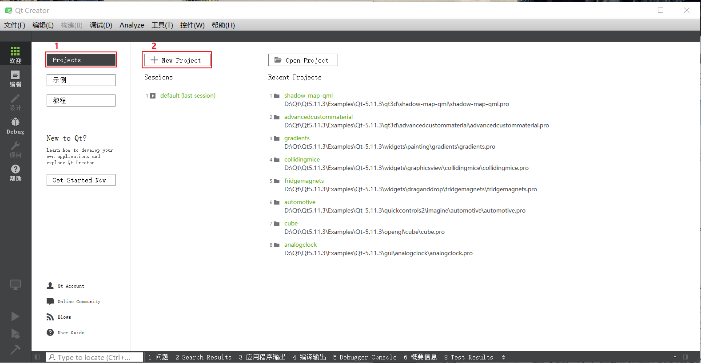

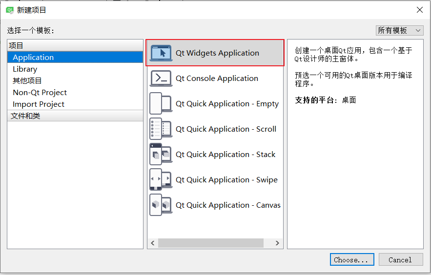

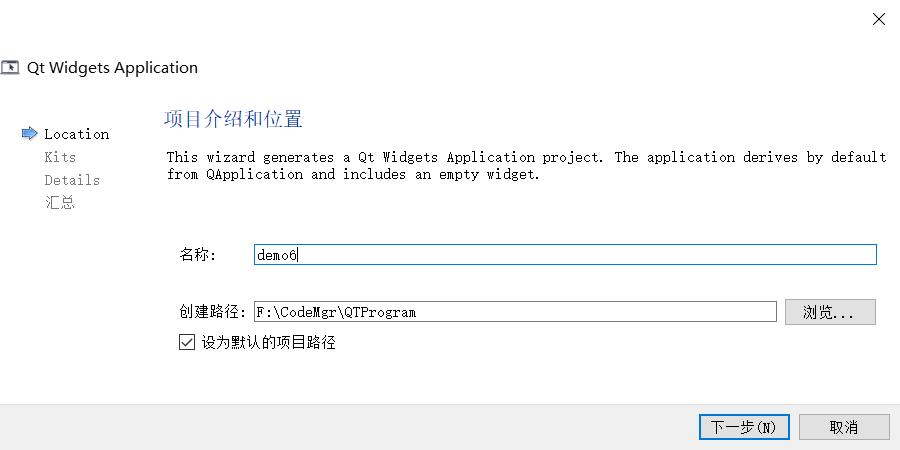

在这里唯一要注意的是项目`名称`不能有空格，否则会报错

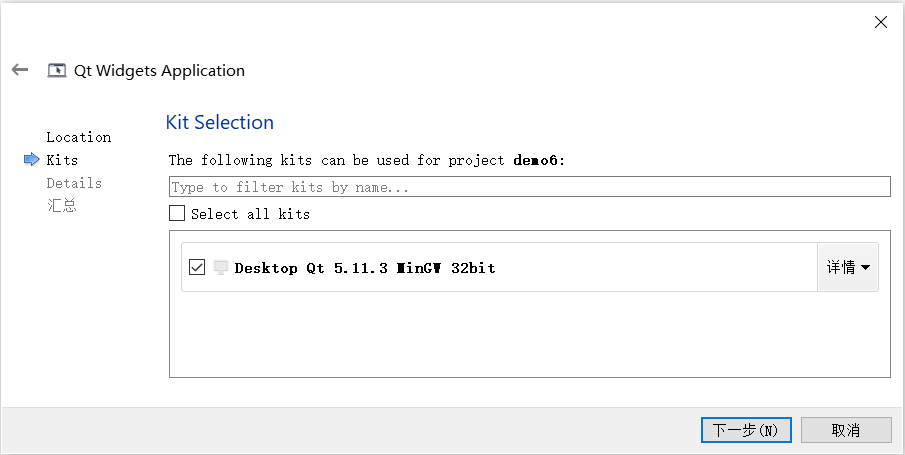

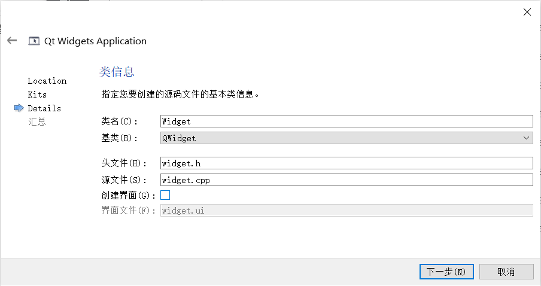

`QWidget`就是qt项目中的顶级类

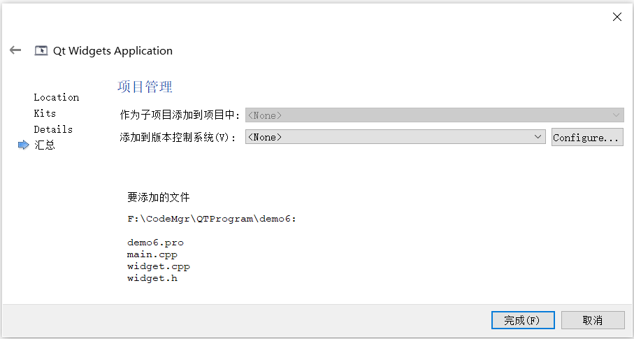

+ `.pro`：就是项目文件
+ `main.cpp`：主函数文件

**2.2 主函数**

```c++
#include "widget.h"
#include <QApplication>

//main 程序入口 argc命令行变量的数量argv命令行变量的数组
int main(int argc, char *argv[])
{
    //a - 应用程序对象，有且仅有一个
    QApplication a(argc, argv);
    
    //窗口对象
    Widget w;
    
    //窗口对象默认不会显示，必须调用show（）方法显示窗口
    w.show();

    //让程序进入消息循环，而不是一闪而过
    return a.exec();
}
```

`QApplication`就是Qt中的应用程序类的头文件

**2.3 Qt模块**

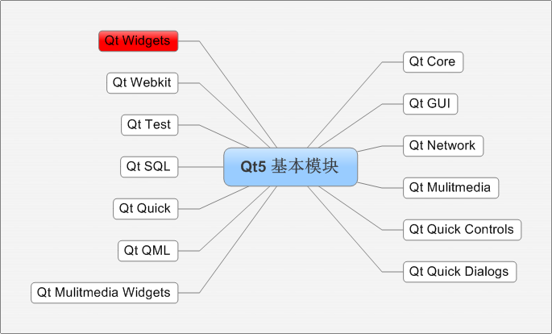

**2.4 项目文件**

打开`.pro`文件

```
QT       += core gui	# qt项目包含的模块

greaterThan(QT_MAJOR_VERSION, 4): QT += widgets	# 大于Qt4版本的时候包含widgets

TARGET = demo6			# 目标：生成exe文件名称
TEMPLATE = app			# 模板：应用程序模板 Application

DEFINES += QT_DEPRECATED_WARNINGS

CONFIG += c++11

SOURCES += \			# 源文件
        main.cpp \
        widget.cpp

HEADERS += \			# 头文件
        widget.h

qnx: target.path = /tmp/$${TARGET}/bin
else: unix:!android: target.path = /opt/$${TARGET}/bin
!isEmpty(target.path): INSTALLS += target
```

**2.5 头文件**

打开`.h`文件

```c++
#ifndef WIDGET_H
#define WIDGET_H

#include <QWidget>

class Widget : public QWidget
{
    Q_OBJECT	//是一个宏，允许类中使用信号和槽机制

public:
    Widget(QWidget *parent = 0);
    ~Widget();
};

#endif // WIDGET_H

```

`c++`有一个关键字`explicit`为了防止隐式转化

## 3、编译器快捷键

`ctrl+/`：注释

`ctrl+r`：运行

`ctrl+b`：编译

`ctrl+f`：查找

`ctrl+i`：自动对齐

`ctrl+shift+{up}`：整行向上移动

`ctrl+shift+{down}`：整行向下移动

`f4`：同名`.h` 文件和`.cpp`文件切换

设置自动补全：工具->选项->环境->键盘

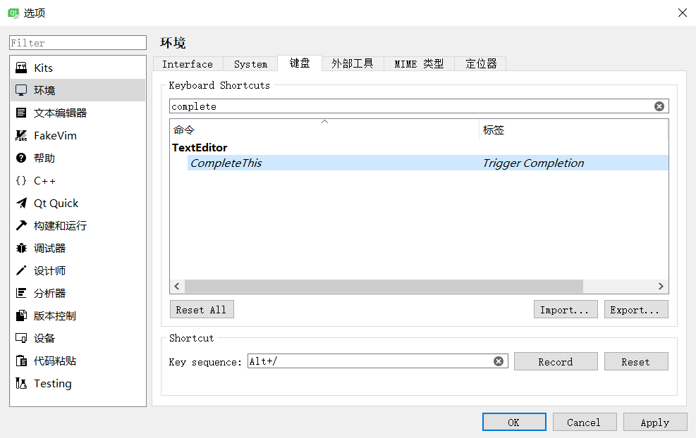

## 4、帮助文档

+ `F1`
+ 编译器左侧按钮
+ 路径`D:\Qt\Qt5.11.3\5.11.3\mingw53_32\bin\assistant.exe`（参考）

## 5、其他

1、格式化字符串

```c++
QString str = QString("我是 %1，年龄 %2").arg("hel").arg(20);
```

2、Debug输出

```c++
qDebug()<<"output"
```

# 二、信号和槽机制

> 信号槽是 Qt 框架引以为豪的机制之一。所谓信号槽，实际就是观察者模式。**当某个事件发生之后**，比如，按钮检测到自己被点击了一下，**它就会发出一个信号（signal）**。这种发出是没有目的的，类似广播。**如果有对象对这个信号感兴趣，它就会使用连接（connect）函数**，意思是，**将想要处理的信号和自己的一个函数（称为槽（slot））绑定来处理这个信号**。也就是说，**当信号发出时，被连接的槽函数会自动被回调**。这就类似观察者模式：当发生了感兴趣的事件，某一个操作就会被自动触发。

## 1、connect() 函数

connect()函数最常用的一般形式：

```c++
connect(sender, signal, receiver, slot);
```

参数解释：

+ `sender`：发出信号的对象
+ `signal`：发送对象发出的信号
+ `receiver`：接收信号的对象
+ `slot`：接收对象在接收到信号之后所需要调用的函数（槽函数）

disconnect()函数：用户断开连接参数同connect()

## 2、系统自带的信号和槽

示例代码：

```c++
QPushButton * quitBtn = new QPushButton("关闭窗口",this);
connect(quitBtn,&QPushButton::clicked,this,&MyWidget::close);
```

## 3、自定义的信号和槽

1、新建一个`Teacher`类，并查看`teacher.h`

```c++
#ifndef TEACHER_H
#define TEACHER_H

#include <QObject>

class Teacher : public QObject
{
    Q_OBJECT
public:
    explicit Teacher(QObject *parent = nullptr);

signals:

public slots:
};

#endif // TEACHER_H
```

`signals`：用来定义信号函数，返回值是`void`，**只需要声明，不需要实现**，可以有参数，可以重载

`slots`：用来定义槽函数，早期版本必须写到`slots`标签下，高级版本可以直接定义到`public`标签下，**需要声明，也需要实现**，可以有参数，可以重载

## 4、带参数的槽函数处理

1、信号函数

```c++
void Widget::classOver(){
	emit teacher->hungry("鸡肉");
}
```

2、槽函数

```c++
void Student::treat(QString food){
	qDebug() << "老师要吃：" << food
}
```

3、连接

```c++
//函数指针定义：函数返回值类型 (* 指针变量名)(函数参数列表);

//函数指针 -> 地址
void(Teacher:: *teacherSignal)(QString) = &Teacher::hungry;
void(Student:: *studentSlot)(QString) = &Student::treat;
connect(teacher, teacherSignal, st)
```

## 5、Qt4版本信号槽连接

```c++
connect(zt, SINGAL(hungry()), st, SLOT(treat()));
```

优点：参数直观

缺点：类型不做检测，类型不一致时照样可以编译成功，不利于排错

## 6、Lambda表达式

Lambda表达式**用于定义并创建匿名的函数对象**，以便简化编程工作，基本构成如下

```c++
[capture](parameters) mutable ->return-type
{
	statement
}

[函数对象参数](操作符重载函数参数)mutable ->返回值{函数体}
```

+ 函数对象参数
  + 空：没有使用任何函数对象参数
  + `=`：按照**值传递方式**使用Lambda所在作用域范围内的变量
  + `&`：按照**引用传递方式**使用Lambda所在作用域范围内的变量
  + `this`：使用Lambda所在**类**作用范围内的成员变量
  + `a`：将a按值进行传递，函数体内不能修改传递进来的a的拷贝，因为默认情况下函数是`const`的。**要修改传递进来的a的拷贝**，可以添加mutable修饰符。
  + `&a`：将a按引用进行传递。
  + `a, &b`：将a按值进行传递，b按引用进行传递。
  + `=，&a, &b`：除a和b按引用进行传递外，其他参数都按值进行传递。
  + `&, a, b`：除a和b按值进行传递外，其他参数都按引用进行传递。
+ 操作符重载函数参数
  + 标识重载的()操作符的参数，没有参数时，这部分可以省略。参数可以通过按值（如：(a,b)）和按引用（如：(&a,&b)）两种方式进行传递
+ 可修改标示符
  + mutable声明，这部分可以省略。按值传递函数对象参数时，加上mutable修饰符后，可以修改按值传递进来的拷贝（注意是能修改拷贝，而不是值本身）

## 7、注意事项

+ **发送者和接收者都需要是`QObject`的子类**（槽函数是全局函数、Lambda 表达式等无需接收者的时候除外）；
+ **信号和槽函数返回值是 void**
+ **信号只需要声明，不需要实现**
+ **槽函数需要声明也需要实现**
+ **槽函数是普通的成员函数，作为成员函数，会受到 public、private、protected 的影响**
+ **使用 emit 在恰当的位置发送信号**
+ **使用connect()函数连接信号和槽。**
+ **任何成员函数、static 函数、全局函数和 Lambda 表达式都可以作为槽函数**
+ **信号槽要求信号和槽的参数一致，所谓一致，是参数类型一致**
+ **在槽函数中可以忽略信号传来的数据，也就是槽函数的参数比信号的少**

# 三、QMainWindow

> QMainWindow是一个为用户提供主窗口程序的类，包含一个菜单栏（menu bar）、多个工具栏(tool bars)、多个锚接部件(dock widgets)、一个状态栏(status bar)及一个中心部件(central widget)，是许多应用程序的基础，如文本编辑器，图片编辑器等。

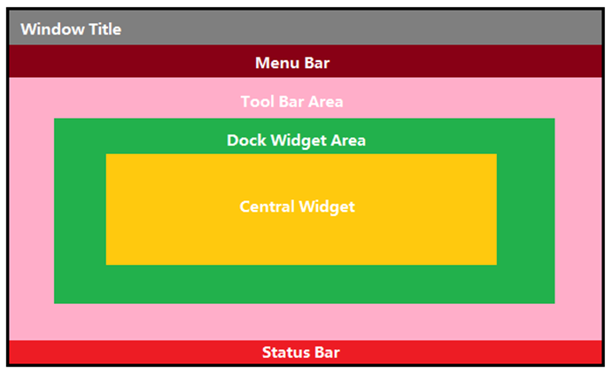

**常用方法**

**（1）重置窗体大小**

```c++
resize(600, 400);
```

**（2）设置窗口的标题**

```C++
setWindowTitle("myWindow")
```

**（3）设置窗口大小不可变**

```c++
setFixedSize(600, 400)
```

**（4）设置菜单栏**

```c++
setMenuBar(bar)
```

## 1、菜单栏

> 菜单栏在任何程序中最多只能有一个

（1）引入头文件

```c++
#include<QMenuBar>
```

（2）创建菜单栏

```c++
QMenuBar * bar = menuBar();
```

（3）设置设置菜单栏

```c++
setMenuBar(bar)
```

（4）创建菜单

```c++
QMenu * fileMenu = bar->addMenu("文件");
```

（5）创建菜单项

```c++
fileMenu->addAction("新建");
```

（6）创建分隔线

```C++
fileMenu->addSeparator();
```

## 2、工具栏

（1）引入头文件

```c++
#include<QToolBar>
```

（2）创建工具栏

```c++
QToolBar * toolBar = new QToolBar(this);
```

（3）设置工具栏

```c++
addToolBar(toolBar);	//默认在上方，可拖拽
addToolBar(Qt::LeftToolBarArea, toolBar); //停靠在左边，可拖拽
```

（4）设置允许停靠区域

```c++
toolBar->setAllowedAreas(Qt::LeftToolBarArea, Qt::RightToolBarArea);
```

（5）设置浮动

```c++
toolBar->setMovable(false);//不可浮动
```

（6）添加控件

```c++
QPushButton * btn = new QPushButton("myButton", this);
toolBar->addWidget(btn); //添加widget

toolBar->addAction(); // 添加QAction
```

## 3、状态栏

> 最多也只能有一个

（1）引入头文件

```
#include<QStatusBar>
```

（2）创建窗台栏

```c++
QStatusBar * statusBar = QStatusBar();
```

（3）设置状态栏

```c++
setStatusBar(statusBar);
```

（4）添加控件

```c++
QLabel * label = new QLabel("提示信息", this);
statusBar->addWidget(label);//默认在最左边

QLabel * label = new QLabel("右边提示信息", this);
statusBar->addPermanentWidget(label);
```

## 4、铆接部件

> 浮动窗口

（1）引入头文件

```
#include<QDockWidget>
```

（2）创建浮动窗口

```c++
QDockWidget * dockWidget = new QDockWidget("浮动", this);
```

（3）添加浮动窗口

```c++
addDockWidget(Qt::BottomDockWidgetArea, dockwidget);//添加到核心部件下边
```

（4）设置允许停靠区域

```c++
//允许停靠在上下
dockWidget->setAllowedAreas(Qt::TopDockWidgetArea | Qt::BottomDockWidgetArea);
```

## 5、核心部件（中心部件）

> 只能有一个

（1）引入头文件

```
#include<QTextEdit>
```

（2）创建中心部件

```
QTextEdit * edit = new QTextEdit(this);
```

（3）设置中心部件

```c++
setCentralWidget(edit);
```

## 6、资源文件

（1）添加资源到项目目录中

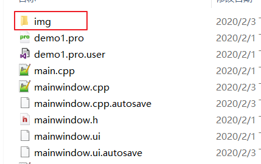

（2）添加资源文件

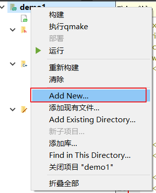


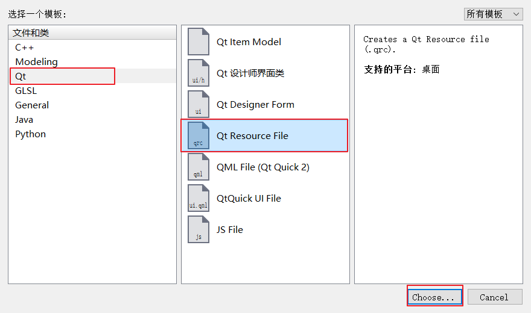

（3）给资源文件起个名字

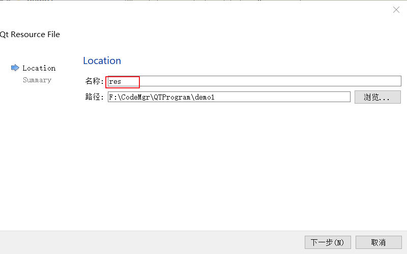

（4）添加前缀

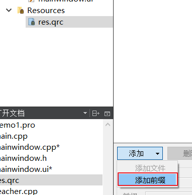

（5）添加文件，然后选中第一步我们放进去的资源就行了

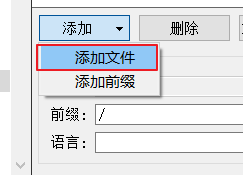


（6）使用资源，设置图标

```c++
//如何使用： “前缀 + 文件相对路径”
//或者更简单的方式，右键想要使用的文件，可以复制url
ui->actionnew->setIcon(QIcon(":/img/folder.ico"));
//在这里actionnew是一个菜单项对应的变量名
```


## 7、使用creator ui设计

**注意**

+ 添加菜单栏时先输入英文，然后在右边属性栏中设置`text`显示值
+ 可以拖拽`Action Editor`内的控件，以便复用，如下

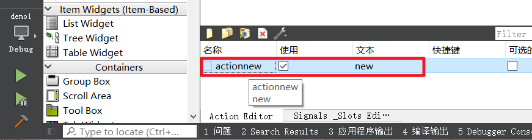


# 四、QDialog 对话框

首先引入头文件

```c++
#include<QDialog>
```

## 1、模态窗口

（1）创建窗口对象

```c++
QDialog dialog(this); //注意这是在栈上创建的
```

（2）使用`exec()`方法显示窗口

```c++
dialog.exec(); //exec()方法会让控件进入消息循环，所以即使在栈上创建的对象不会立即释放
```

## 2、非模态窗口

（1）在堆上创建对象，一般都在堆上创建，上面只是举个例子

```c++
QDialog *dialog = new QDialog(this);
dialog->show();//使用show就是非模态方式

//若还使用之前在栈上创建的对象，运行程序仅会看到一闪而逝的窗口，所以对象一般要在堆上创建

//设置属性让其在dialog叉掉后自动释放内存
dialog->setAttribute(Qt::WA_DeleteOnClose);
```

## 3、系统内置对话框

+ `QColorDialog`：选择颜色

+ `QFileDialog`：选择文件或者目录

+ `QFontDialog`：选择字体
+ `QInputDialog`：允许用户输入一个值，并将其值返

+ `QPageSetupDialog`：为打印机提供纸张相关的选项
+ `QPrintDialog`：打印机配置
+ `QPrintPreviewDialog`：打印预览
+ `QProgressDialog`：显示操作过程

+ `QMessageBox`：模态对话框，用于显示信息、询问问题等
  + `QMessageBox`通过静态成员函数创建对话框，例如`QMessageBox::question(……)`
  + 参数1：父亲，参数2：标题，参数3：显示内容，参数4：案件类型，参数5：默认关联回车按键
  + 返回值是`StandardButton`类型，利用返回值判断用户的输入

# 五、布局管理器

## 1、系统提供的布局控件

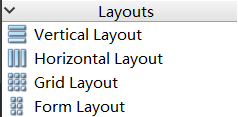

使用起来不灵活

## 2、利用widget做布局

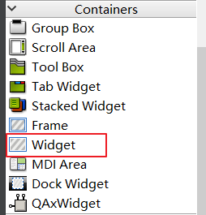

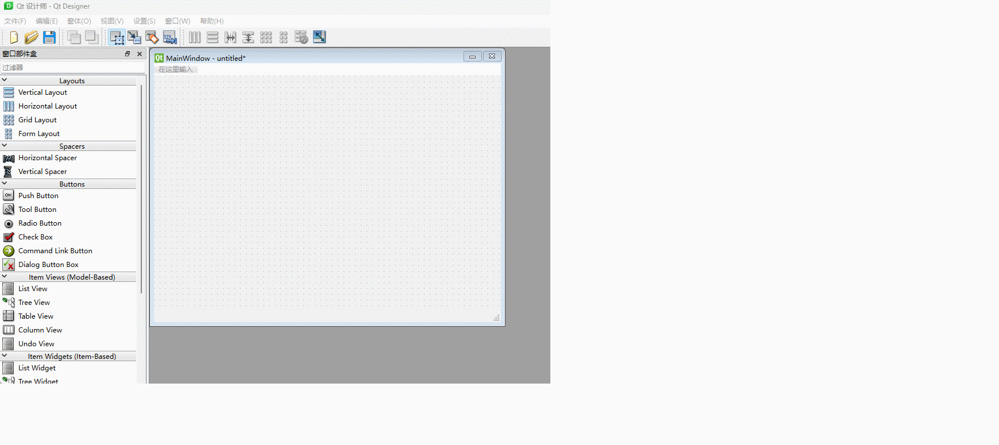

# 六、常用控件

## 1、按钮相关

**（1）QPushButton 常用按钮**

+ 方法一

**1、引入头文件**

```c++
#include<QPushButton>
```

**2、创建button组件**

```c++
QPushButton *btn = new QPushButton;
```

**3、显示button**

```c++
btn->setParent(this);
```

不能直接调用`show()`方法，因为他会以顶层的方式弹出，正确的方式因该是让btn对象依赖在父对象中

**4、设置button文字**

```c++
btn->setText("myButton");
```

+ 方法二

1、第一步同上

**2、创建组件**

```c++
QPushButton * btn = new QPushButton("myButton", this);
```

这种方式将方式二简化了，但存在一个问题，就是父窗体的大小是根据组件的大小确定的，从而导致窗体非常小

**重置窗体大小**

```c++
resize(600, 400);
```

这样重置一下大小，窗体就会变得正常了

虽然现在button组件是创建出来了，但是他的位置默认是在左上角，所以我们要将他移动到我们想要的位置

**移动button**

```c++
btn->move(600, 400)
```

**设置窗口的标题**

```C++
setWindowTitle("myWindow")
```

**设置窗口大小不可变**

```c++
setFixedSize(600, 400)
```

**（2）QToolButton 工具按钮**

用于显示图片，如想显示文字，需要修改风格按钮：`toolButtonStyle`，凸起风格`autoRaise`

**（3）radioButton 单选按钮**

设置默认

```
ui->myradiobtn->setChecked(true);
```

**（4）checkbox 多选按钮**

监听状态：2 选中，1 半选， 0 未选中

```
connect(ui->cbox, &QCheckBox::stateChange, [=](int state){

})
```


## 2、标签

（1）引入头文件

```
#include<QLabel>
```

（2）创建标签

```c++
QLabel * label = new QLabel("myLabel", this);
```

（3）利用label显示图片

```c++
ui->lb_image->setPixmap(QPixmap(":/img/1.png"));
```

（4）显示动图

```c++
QMovie * movie = new QMovie(":/img/mario.gif");//创建动图
ui->lb_movie->setMovie(movie);//设置动图
movie->start();//播放动图
```

## 3、列表相关

（1）引入列表项头文件

```c++
#include<QListWdgetItem>
```

（2）创建列表项

```
QListWidgetItem *item =  new QlistWidgetItem("list1");
```

（3）添加列表项至列表

```
ui->listWidget->addItem(item);
```

（4）设置列表项文本对齐方式

```c++
item->setTextAlignment(Qt::AlignHCenter);
```

（5）添加多个列表项至列表

```
QStringList list;
list << "list1" << "list2" << "list3"
ui->listWidget->addItems(list);
```

## 4、树形控件

（1）设置水平头

```c++
ui->treeWidget->setHeaderLabels(QStringList()<<"姓名"<<"年龄");
```

（2）创建节点

```c++
QTreeWidgetItem * item = new QTreeWidgetItem(QString()<<"老师");
```

（3）设置顶层节点

```c++
ui->treeWidget->addTopLevelItem(item);
```

（4）追加子节点

```c++
QTreeWidgetItem * itemChild = new QTreeWidgetItem(QString()<<"李四" << "20");
item->addChild(itemChild);
```

## 5、表格控件

（1）设置列数

```c++
ui->tableWidget->setColumnCount(3);
```

（2）设置水平头

```c++
ui->tableWidget->setHorizontalHeaderLabels(QStringList()<<"姓名"<<"性别"<<"性别");
```

（3）设置行数

```c++
ui->tableWidget->setRowCount(3);
```

（4）设置正文

```c++
ui->tableWidget->setItem(0, 0, new QTableWidgetItem("亚瑟"));
```

## 6、其他控件

（1）滚动区域：`Scroll Area`

（2）工具盒：`Tool Box`，类似与QQ的联系分类列表

（3）选项卡：`tabWidget`

（4）栈部件：`Stacked Widget`，类似于java swing中的卡片布局控制器

```c++
//设置当前页面
ui->satckedWidget->setCurrentIndex(1);
```

（5）下拉框：`comboBox`

```c++
//添加项
ui->comboBox->addItem("item1");
//设置选中项
ui->comboBox->setCurrentIndex(1);
```

（6）当行文本编辑框：`Line Edit`

可以通过设置`echo mode`设置输入模式

（7）文本区域：`Text Edit`，支持文本加粗等样式的文本

（8）普通文本区域：`Plain Text Edit`，仅支持纯文本

# 七、事件

## 1、鼠标事件

（1）鼠标进入事件：`enterEvent(QWidget *event=0)`

（2）鼠标离开事件：`leaveEvent(QEvent *)`

（3）鼠标按下事件：`mousePressEvent(QMouseEvent *ev)`

（4）鼠标释放事件：`mouseReleaseEvent(QMouseEvent *ev)`

（5）鼠标移动事件：`mouseMoveEvent(QMouseEvent *ev)`

（6）坐标：`ev->x()`，`ev->y()`

（7）判断按键：`ev->button()`，判断事件的类型`ev->type()`

（8）判断组件按键：`ev->buttons()`，通过`&`操作符

（9）设置鼠标追踪状态：`setMouseTracking(true)`，默认是`false`

## 2、定时器

### 1、重写方法

（1）重写`timerEvent(QTimerEvent *ev)`实现定时功能

（2）启动定时器

```c++
startTimer(1000);

//函数会返回timerId
int timerId = startTimer(1000);
```

（3）获取`timerId`

```c++
ev->timerId()
```

### 2、定时器类

（1）创建定时器对象

```c++
QTimer * timer = new QTimer(this);
```

（2）启动定时器

```c++
timer->start(500);
```

（3）信号函数

定时器事件到了会发送一个信号：`QTimer::timerout`

（4）停止定时器

```c++
timer->stop();
```

## 3、事件分发器

通过重写`bool event(QEvent *ev)`方法，返回true代表用户进行拦截，不在向下分配

## 4、事件拦截器

通过事件拦截器，可以在程序分发到event事件之前再做一次高级拦截

使用步骤：

1、给控件安装事件过滤器

```c++
ui->label->installEventFilter(this);
```

2、重写eventFilter事件

```
bool Widget::eventFilter(QObject *obj, QEvent *e){

}
```

# 八、绘图

## 1、基本用法

通过重写`void paintEvent(QPaintEvent * ev)`事件

1、实例化画家对象

```c++
QPainter painter(this);
```

2、画线

```c++
painter.drawLine(this);
```

3、画圆

```c++
painter.drawEllipse(QPoint(100, 100), 50, 50);
```

4、画矩形

```c++
painter.drawRect(QRect());
```

5、画文字

```c++
painter.drawText(QRect(10, 200, 100, 500), "文字");
```

6、画笔

```c++
QPen pen(QColor(255, 0, 0));//创建画笔对象
pen.setWidth(1);			//设置画笔宽度
pen.setStyle(Qt::DotLine);	//设置画笔风格
painter.setPen(pen);		//设置画笔
```

7、画刷

```c++
QBrush brush(QColor(0, 255, 0));//创建画刷对象
brush.setStyle(Qt::Dense7Pattern);//设置画刷风格
painter.setBrush(brush);		//设置画刷
```

8、抗锯齿

```c++
painter.setRenderHint(QPainter::Antialiasing);
```

9、画家相对基址偏移

```c++
painter.translate(100, 0);
```

10、保存画家状态

```
painter.save();
```

11、还原画家保存状态

```c++
painter.restore();
```

12、绘制图片

```c++
painter.drawPixmap(0, 0, QPixmap(":/img/1.png"));
```

## 2、绘图设备

+ `QPixmap`专门为图像在屏幕上的显示做了优化

（1）创建pixmap对象

```c++
QPixmap pix(300, 300);
```

（2）填充颜色

```cc++
pix.fill(Qt::white);
```

（3）设置画家

```
QPainter painter(&pix);
painter.setPen(QPen(Qt::green));
painter.drawEllipse(QPoint(100, 100), 50, 50);
```

（4）保存

```c++
pix.save("D://1.png");
```

+ `QBitmap`是`QPixmap`的一个子类，它的色深限定为1，可以使用`QPixmap`的`isQBitmap()`函数来确定这个`QPixmap`是不是一个`QBitmap`
+ `QImage`专门为图像的像意级访问做了优化

操作基本同`QPixmap`，特色操作如下

```c++
//创建
QImage img(300, 300, QImage::Format_RGB32);
//加载图片
img.load(":/img/1.png");
//设置像素
QRgb value = qRgb(255, 0, 0);
img.setPixel(x, y, value);
```

+ `QPicture` 则可以记录和重现`QPainter`的各条命令

```c++
//创建绘图对象
QPicture pic;
//创建画家
QPainter painter;
//设置绘图设备，开始绘制
painter.begin(&pic);
painter.drawEllipse(QPoint(150, 150), 50, 50);
//结束绘制
painter.end();
```

# 九、文件读写

## 1、文件对象

（1）获取文件路径

```c++
QString path = QFileDialog::getOpenFileName(this, "打开文件");
```

（2）创建文件对象

```c++
QFile file(Path);//参数就是文件的路径
```

（3）设置打开方式

```c++
file.open(QIODevice::ReadOnly);//只读
file.open(QIODevice::Append);//追加
```

（4）读取全部数据

```c++
QByteArray array = file.readAll();
```

（5）读取一行数据

```c++
file.readLine();
```

（6）判断文件是否结尾

```
file.atEnd();//返回true代表结束
```

（7）写文件

```c++
file.write();
```

（8）关闭文件

```
file.close();
```

## 2、文件信息对象

+ size()：大小
+ suffix()：后缀
+ fileName()：文件名称
+ created()：创建日期
+ lastModified()：最后修改信息