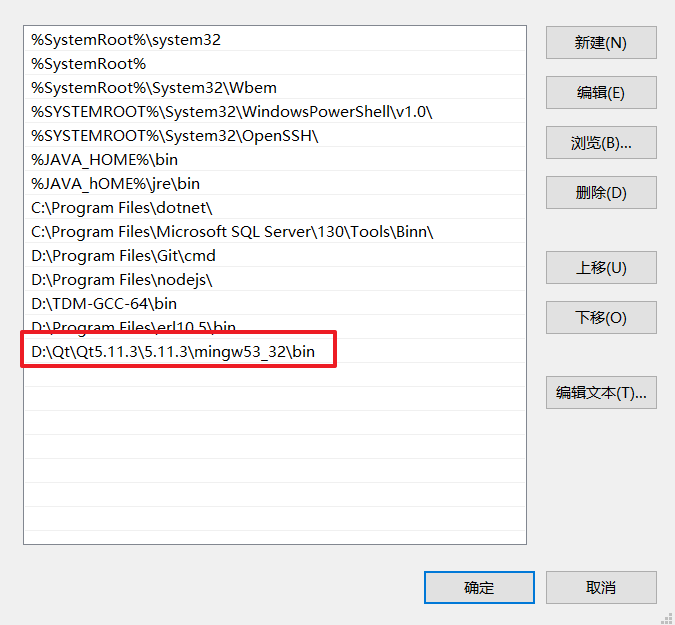
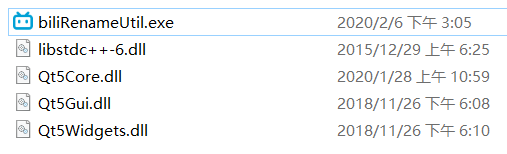
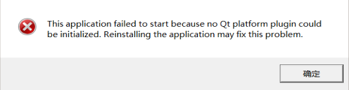
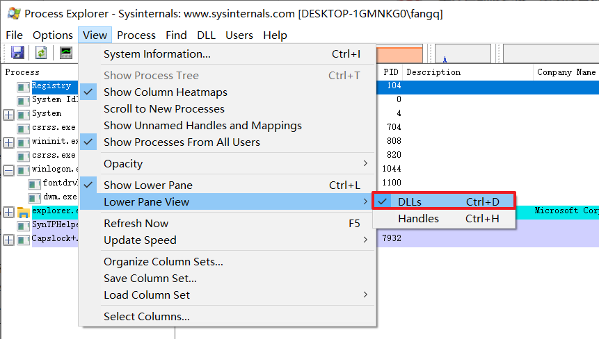
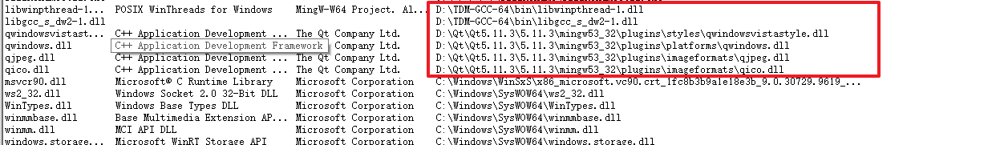
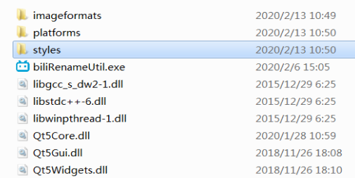

# Qt项目的发布

**（1）首先将项目调为发布版**

**（2）找到缺失的DLL文件**

发布好了后，双击生成的exe文件可能会出现如下的问题

像这样的错误警告可能会弹出好几个，对于这种错误有2种解决方案。

+ 第一种：配置环境变量

1、复制Qt bin目录添加到环境变量

+ 第二种：将缺失的DLL复制到生成的exe同一个文件夹下

去Qt的bin目录下找到缺少的DLL

我所写的一个小程序缺少了3个DLL文件，将他们复制到同一个文件夹下，如下

最后我们再双击exe文件发现还是报错了

错误的原因可以自己上网搜，这里给出解决方案

**去Qt的bin目录下找到`libstdc++-6.dll`文件，并复制到同一个文件夹**

现在双击exe文件，程序就能成功运行了。

**（3）在不同的电脑上运行**

上面说的方法可以解决发布的exe在本机运行出错的问题，但是并不能保证能在其他电脑上能正常运行，如下这是我在**虚拟机**里测试的情况

出现这种错误，可以向上面所说的方法，找到缺失的DLL

但是找到所有缺失的DLL后还是会发生错误，如下

在网上查找资料得知，将`plugins/platforms`目录下的DLL复制到同一目录，若所写的程序还包括image组件还需要把`plugins/imageformats`下的DLL复制过去，这样程序就能无误的运行了。

虽然这能解决问题，但是我们复制过去这么多的依赖，并不一定全部需要，为了精确的得知程序所需要的依赖，可以借助一个软件**Process Explorer**，[下载链接](https://docs.microsoft.com/zh-cn/sysinternals/downloads/process-explorer)，通过它可以精确的得知所需要的DLL

首先打开软件，并调出DLL面板

然后找到自己编写的Qt程序，就能看到相关依赖的DLL文件了

按照路劲找到他们，复制到同一个文件夹，程序就能正常运行了，唯一要注意的是`plugins`目录下的DLL文件需要带上他所在的文件夹

这样程序就能在不同的电脑自由运行了。