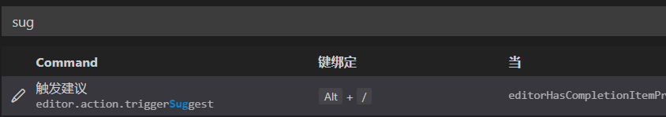
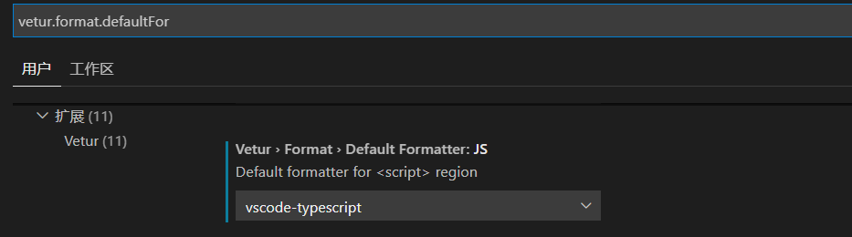
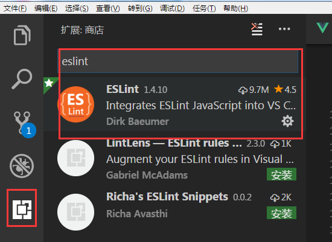
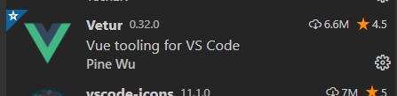
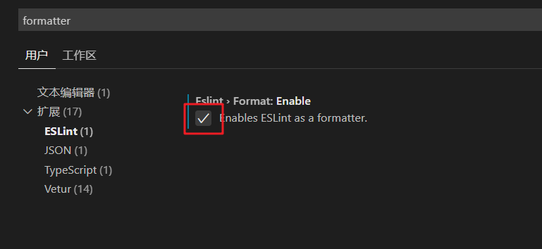
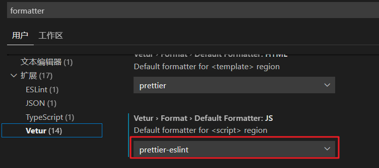

# VSCode设置


> 首先打开`settings.json`配置文件
> 1. 打开设置，可以按快捷键`CTRL + ,`
> 2. 在搜索栏搜索`settings.json`，看到`在settings.json中编辑`超链后点进去

### 滚动调整字体大小

```json
"editor.mouseWheelZoom": true,
```

### 修改HTML默认语言为中文

添加如下设置
```json
"emmet.variables": {
    "lang": "zh_CN",
    "charset": "UTF-8"
}
```
### emmet的tab触发时灵时不灵
添加如下设置
```
"emmet.triggerExpansionOnTab": true
```

### 自定义智能提示
左下角设置按钮->键盘快捷方式->搜索栏搜"*sug*"->修改
完成后可以用`Alt+/`自动提示了



### vscode的vetur插件格式化代码不自动加分号

把"vetur.format.defaultFormatter.js": “prettier”,改为 “vetur.format.defaultFormatter.js”: “vscode-typescript”



### 设置不同语言的缩进格式

```json
"[javascript]": {
    "editor.tabSize": 2
},
"editor.tabSize": 4
```
这样就可以设置全局缩进为 4，而 js 的缩进为 2 了


### 修复eslint报错

1、下载 ESlint 插件 和 vetur 插件




2、按住 `ctrl + , ` 打开设置

3、搜索formatter，并将 ESlint 设置为一个 formatter



4、更改默认格式化插件



这样就可以使用 `shift + alt + F` 修复代码了

### jsconfig.json

当我们配置了路径昵名时，编译器就不能对昵名开头的文件进行智能提示了，如下方法可解决

在项目根目录，说通俗点，就是和 package.json 同一个文件夹下，创建一个名为 `jsconfig.json` 的文件，内容如下

```js
{ 
  "compilerOptions": {
    "baseUrl": "./",
    "paths": {
        "@/*": ["src/*"]
    }
  },
  "exclude": ["node_modules", "dist"]
}
```

重点是 `paths` 的配置，它可以将 `@/` 开头的文件路径映射成我们想要的路径

————————————
更多设置参考[文档](https://code.visualstudio.com/docs/editor/codebasics)