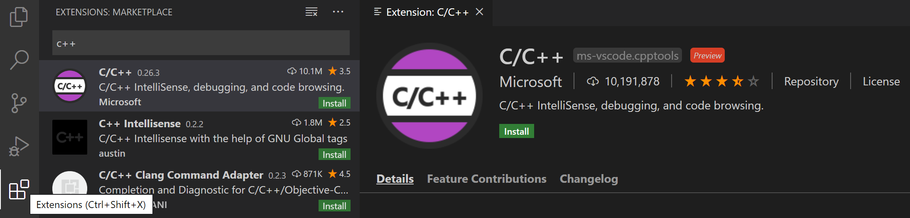
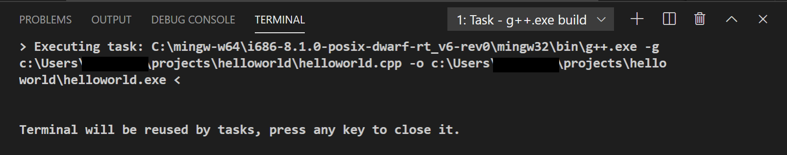
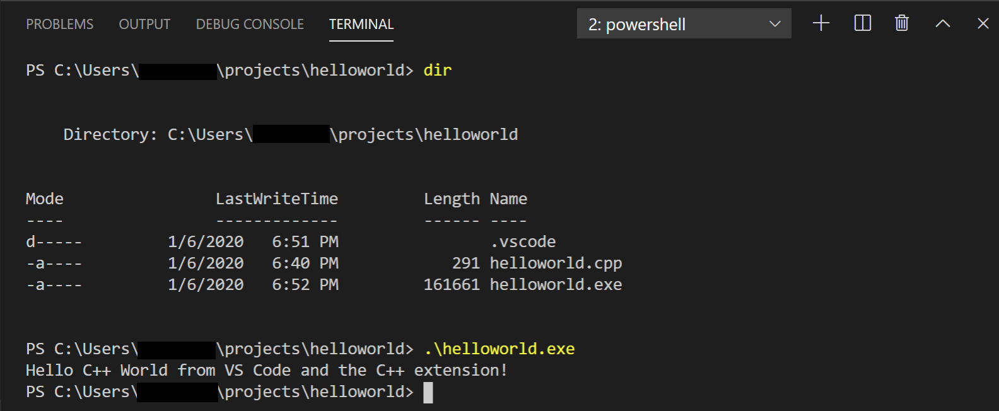
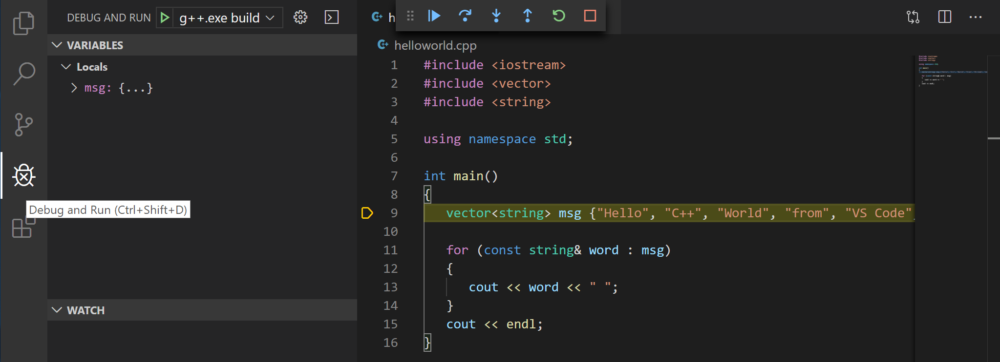
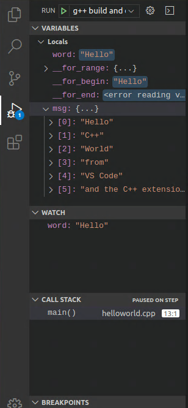
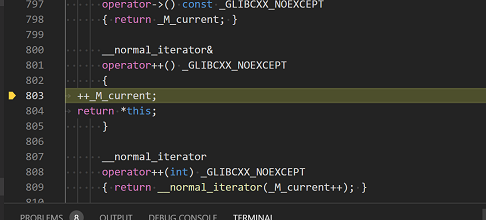
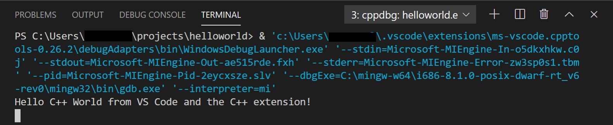
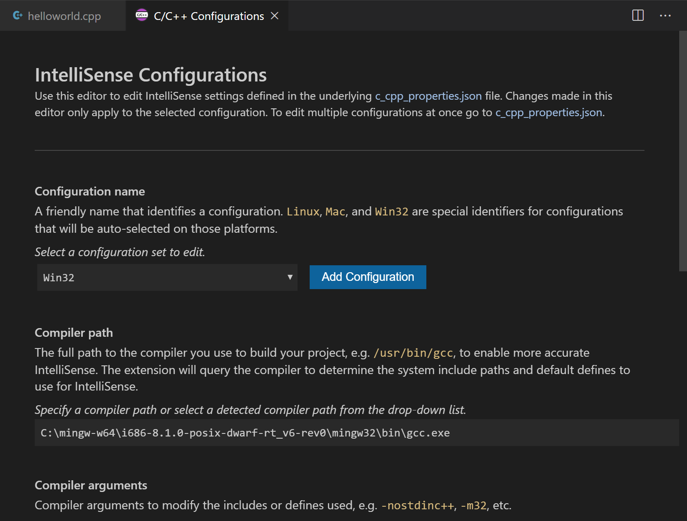

# 在MinGW中使用GCC

在本教程中，您将Visual Studio Code配置为使用[Mingw-w64中](http://mingw-w64.org/doku.php/start)的GCC C ++编译器（g ++）和GDB调试器来创建在Windows上运行的程序。

配置VS Code之后，您将在VS Code中编译和调试一个简单的Hello World程序。本教程不会教您有关GCC或Mingw-w64或C ++语言的信息。对于这些主题，Web上有许多不错的资源。

如果您有任何问题，请随时在[VS Code文档库中提交](https://github.com/microsoft/vscode-docs/issues)本教程的问题。

## 先决条件

要成功完成本教程，您必须执行以下步骤：

1. 安装[Visual Studio代码](https://code.visualstudio.com/download)。

2. 安装[VS Code](https://marketplace.visualstudio.com/items?itemName=ms-vscode.cpptools)的[C / C ++扩展](https://marketplace.visualstudio.com/items?itemName=ms-vscode.cpptools)。您可以通过在“扩展”视图（Ctrl + Shift + X）中搜索“ c ++”来安装C / C ++扩展。

   

3. 您将通过SourceForge网站安装Mingw-w64。单击[Mingw-w64](https://sourceforge.net/projects/mingw-w64/files/Toolchains targetting Win32/Personal Builds/mingw-builds/installer/mingw-w64-install.exe/download)开始下载压缩的存档文件。将工具从压缩文件中提取到路径中没有空格的文件夹。在本教程中，我们假设将其安装在下`C:\mingw-w64`。

4. 将您的Mingw-w64 `bin`文件夹的路径添加到Windows PATH环境变量。

   1. 在Windows搜索栏中，键入“设置”以打开Windows设置。
   2. 搜索**您的帐户的“编辑”环境变量**。
   3. 选择`Path`变量，然后选择“ **编辑”**。
   4. 选择“ **新建”，**然后将Mingw-w64路径添加到系统路径。确切的路径取决于您安装的Mingw-w64版本和安装位置。这是一个示例：`c:\mingw-w64\x86_64-8.1.0-win32-seh-rt_v6-rev0\mingw64\bin`。
   5. 选择**确定**以保存`Path`更新。您将需要重新打开任何控制台窗口，以使新的PATH位置可用。

### 检查您的MinGW安装

要检查您的Mingw-w64工具是否正确安装并可用，请打开新的命令提示符并键入：

```
g++ --version
gdb --version
```

如果您没有看到预期的输出或者`g++`或者`gdb`没有一个公认的命令，请检查您的安装（Windows **控制面板** > **程序**），并确保您的路径条目MinGW的-W64位置相匹配。

## 创建Hello World

在Windows命令提示符下，创建一个名为的空文件夹`projects`，您可以在其中放置所有VS Code项目。然后创建一个名为的子文件夹`helloworld`，进入其中，并通过输入以下命令在该文件夹中打开VS Code：

```
mkdir projects
cd projects
mkdir helloworld
cd helloworld
code .
```

"code ." 命令在当前工作文件夹中打开VS Code，这将成为您的“工作空间”。在学习本教程的过程中，您将看到`.vscode`在工作区的文件夹中创建的三个文件：

- `tasks.json` （制作说明）
- `launch.json` （调试器设置）
- `c_cpp_properties.json` （编译器路径和IntelliSense设置）

### 添加源代码文件

在文件资源管理器标题栏中，选择“ **新建文件”**按钮并命名该文件`helloworld.cpp`。


### 添加Hello World源代码

现在粘贴此源代码：

```
#include <iostream>
#include <vector>
#include <string>

using namespace std;

int main()
{
    vector<string> msg {"Hello", "C++", "World", "from", "VS Code", "and the C++ extension!"};

    for (const string& word : msg)
    {
        cout << word << " ";
    }
    cout << endl;
}
```

现在按Ctrl + S保存文件。请注意，刚刚添加的文件如何显示在VS Code侧栏中的**文件资源管理器**视图（Ctrl + Shift + E）中：


您还可以通过选中“ **文件** ”主菜单中的“ **自动保存”**，启用“ [自动保存”](https://code.visualstudio.com/docs/editor/codebasics#_saveauto-save)以自动保存文件更改。

最左侧的活动栏使您可以打开不同的视图，例如“ **搜索”**，“ **源代码管理** ”和**“运行”**。您将在本教程后面的**“运行”**视图中查看。您可以在VS Code [用户界面文档中](https://code.visualstudio.com/docs/getstarted/userinterface)找到有关其他视图的更多信息。

> **注意**：保存或打开C ++文件时，您可能会看到来自C / C ++扩展名的有关Insiders版本可用性的通知，该通知可让您测试新功能和修复。您可以通过选择`X`（**清除通知**）来忽略此通知。

## 探索智能感知

在新`helloworld.cpp`文件中，将鼠标悬停在`vector`或上`string`以查看类型信息。声明`msg`变量后，`msg.`像在调用成员函数时一样开始键入。您应该立即看到一个显示所有成员函数的完成列表，以及一个显示该`msg`对象的类型信息的窗口：


您可以按Tab键插入所选成员。然后，当您添加左括号时，您将看到有关该函数所需的任何参数的信息。

## 编译helloworld.cpp

接下来，您将创建一个`tasks.json`文件来告诉VS Code如何构建（编译）程序。该任务将调用g ++编译器以基于源代码创建可执行文件。

在主菜单中，选择**Terminal** > **Configure Default Build Task**。在下拉列表中，将显示任务下拉列表，其中列出了C ++编译器的各种预定义构建任务。选择**g ++.exe构建活动文件**，该**文件**将构建编辑器中当前显示（活动）的文件。


这将`tasks.json`在`.vscode`文件夹中创建一个文件，然后在编辑器中将其打开。

您的新`tasks.json`文件应类似于以下JSON：

```
{
  "version": "2.0.0",
  "tasks": [
    {
      "type": "shell",
      "label": "g++.exe build active file",
      "command": "C:\\mingw-w64\\i686-8.1.0-posix-dwarf-rt_v6-rev0\\mingw32\\bin\\g++.exe",
      "args": ["-g", "${file}", "-o", "${fileDirname}\\${fileBasenameNoExtension}.exe"],
      "options": {
        "cwd": "C:\\mingw-w64\\i686-8.1.0-posix-dwarf-rt_v6-rev0\\mingw32\\bin"
      },
      "problemMatcher": ["$gcc"],
      "group": {
        "kind": "build",
        "isDefault": true
      }
    }
  ]
}
```

该`command`设置指定要运行的程序；在这种情况下是g ++。该`args`数组指定将传递给g ++的命令行参数。必须按照编译器期望的顺序指定这些参数。此任务告诉g ++获取活动文件（`${file}`），对其进行编译，然后在当前目录（`${fileDirname}`）中创建一个与活动文件同名但`.exe`扩展名为（`${fileBasenameNoExtension}.exe`）的可执行文件，`helloworld.exe`以我们的示例为例。

> **注意**：您可以`task.json`在[变量参考中](https://code.visualstudio.com/docs/editor/variables-reference)了解有关变量的更多信息。

该`label`值就是您将在任务列表中看到的值；您可以随意命名。

对象中的`"isDefault": true`值`group`指定当您按Ctrl + Shift + B时将运行此任务。此属性仅出于方便起见；如果将其设置为false，仍然可以从“终端”菜单中使用“ **任务：运行构建任务”**来运行它。

### 运行构建

1. 回到`helloworld.cpp`。您的任务将生成活动文件，并且您要生成`helloworld.cpp`。

2. 要运行中定义的构建任务`tasks.json`，请按Ctrl + Shift + B或从**终端**主菜单中选择“ **任务：运行构建任务”**。

3. 任务开始时，您应该看到“集成终端”面板出现在源代码编辑器下方。任务完成后，终端将显示编译器的输出，指示构建成功还是失败。对于成功的g ++构建，输出看起来像这样：

   

4. 使用**+**按钮创建一个新终端，您将拥有一个新终端（运行PowerShell），并将该`helloworld`文件夹作为工作目录。运行`dir`，您现在应该看到可执行文件`helloworld.exe`。

   

5. 您可以`helloworld`在终端中输入来运行`.\helloworld.exe`。

> **注意**：最初可能需要几次按Enter键才能在终端中看到PowerShell提示。Windows的将来版本中应解决此问题。

### 修改task.json

您可以`tasks.json`使用`"${workspaceFolder}\\*.cpp"`代替的参数来修改以构建多个C ++文件`${file}`。这将生成`.cpp`当前文件夹中的所有文件。您还可以通过替换`"${fileDirname}\\${fileBasenameNoExtension}.exe"`为硬编码的文件名（例如`"${workspaceFolder}\\myProgram.exe"`）来修改输出文件名。

## 调试helloworld.cpp

接下来，您将创建一个`launch.json`文件来配置VS Code，以在您按F5调试程序时启动GDB调试器。从主菜单中，选择**“运行”** >“ **添加配置...”**，然后选择“ **C ++（GDB / LLDB）”**。

然后，您将看到各种预定义调试配置的下拉列表。选择**g ++。exe构建并调试活动文件**。


VS Code创建一个`launch.json`文件，在编辑器中将其打开，然后生成并运行“ helloworld”。

```
{
  "version": "0.2.0",
  "configurations": [
    {
      "name": "g++.exe build and debug active file",
      "type": "cppdbg",
      "request": "launch",
      "program": "${fileDirname}\\${fileBasenameNoExtension}.exe",
      "args": [],
      "stopAtEntry": false,
      "cwd": "${workspaceFolder}",
      "environment": [],
      "externalConsole": false,
      "MIMode": "gdb",
      "miDebuggerPath": "C:\\mingw-w64\\i686-8.1.0-posix-dwarf-rt_v6-rev0\\mingw32\\bin\\gdb.exe",
      "setupCommands": [
        {
          "description": "Enable pretty-printing for gdb",
          "text": "-enable-pretty-printing",
          "ignoreFailures": true
        }
      ],
      "preLaunchTask": "g++.exe build active file"
    }
  ]
}
```

该`program`设置指定要调试的程序。在这里它被设置为活动文件文件夹`${fileDirname}`和`.exe`扩展名的活动文件名`${fileBasenameNoExtension}.exe`，如果`helloworld.cpp`是，则为活动文件`helloworld.exe`。

默认情况下，C ++扩展不会在您的源代码中添加任何断点，并且该`stopAtEntry`值设置为`false`。将`stopAtEntry`值更改`true`为会导致调试器`main`在启动调试时在该方法上停止。

> **注意**：该`preLaunchTask`设置用于指定启动前要执行的任务。确保它与`task.json`文件`label`设置一致。

### 开始调试会话

1. 返回到`helloworld.cpp`它是活动文件。
2. 按F5或从主菜单中选择**“运行”>“开始调试”**。在开始浏览源代码之前，让我们花一点时间注意用户界面中的一些更改：

- 集成终端出现在源代码编辑器的底部。在“ **调试输出”**选项卡中，您将看到指示调试器已启动并正在运行的输出。

- 编辑器突出显示方法中的第一条语句`main`。这是C ++扩展自动为您设置的断点：

  

- 左侧的“运行”视图显示调试信息。您将在本教程的后面看到一个示例。

- 在代码编辑器的顶部，将显示一个调试控制面板。您可以通过抓住左侧的点在屏幕上移动它。

## 单步执行代码

现在，您准备开始逐步执行代码。

1. 单击或按调试控制面板中的“ **跳过”**图标。

   

   这会将程序执行推进到for循环的第一行，并跳过在创建和初始化变量时调用的`vector`和`string`类中的所有内部函数调用`msg`。注意左侧“ **变量”**窗口中的更改。

   

   在这种情况下，可能会出现错误，因为尽管调试器现在可以看到循环的变量名，但该语句尚未执行，因此此时无任何内容可读取。的内容`msg`是可见的，但是，因为该声明已完成。

2. 再次按**Step over**前进到该程序中的下一条语句（跳过为初始化循环而执行的所有内部代码）。现在，“ **变量”**窗口显示有关循环变量的信息。

3. 再次按**Step over**执行`cout`语句。（请注意，自2019年3月发行版起，直到循环退出，C ++扩展才将任何输出输出到**调试控制台**。）

4. 如果愿意，可以继续按**Step over，**直到将引导程序中的所有单词都打印到控制台为止。但是，如果您感到好奇，请尝试按“ **跳入”**按钮以逐步浏览C ++标准库中的源代码！

   

   要返回自己的代码，一种方法是按住“ **跳过”**。另一种方法是通过`helloworld.cpp`在代码编辑器中切换到选项卡，将插入点放在`cout`循环内的语句中的某个位置，然后按F9来在代码中设置断点。在左侧的装订线中出现一个红点，指示已在此行上设置断点。

   

   然后按F5键从标准库标题中的当前行开始执行。执行将中断`cout`。如果愿意，可以再次按F9键以关闭断点。

   循环完成后，您可以在Integrated Terminal中看到输出以及GDB输出的其他一些诊断信息。

   

## 设置手表

有时，您可能希望在程序执行时跟踪变量的值。您可以通过在变量上设置**监视**来做到这一点。

1. 将插入点放在循环内。在“ **监视”**窗口中，单击加号，然后在文本框中键入`word`，这是循环变量的名称。现在，当您逐步执行循环时，请查看“监视”窗口。

   

2. 通过在循环之前添加此语句来添加另一只手表`int i = 0;`。然后，在循环中，加上这样一句话：`++i;`。现在，`i`像上一步一样添加手表。

3. 要在断点处暂停执行时快速查看任何变量的值，可以使用鼠标指针悬停在其上。

   

## C / C ++配置

如果要对C / C ++扩展进行更多控制，可以创建一个`c_cpp_properties.json`文件，该文件将允许您更改设置，例如编译器的路径，包含路径，C ++标准（默认为C ++ 17）等。

您可以通过运行命令**C / C ++：**从命令面板（Ctrl + Shift + P）**编辑配置（UI）**来查看C / C ++配置UI 。


这将打开“ **C / C ++配置”**页面。当您在此处进行更改时，VS Code会将其写入到文件夹中称为`c_cpp_properties.json`的`.vscode`文件中。



Visual Studio Code将这些设置放在中`.vscode\c_cpp_properties.json`。如果直接打开该文件，则它应如下所示：

```
{
  "configurations": [
    {
      "name": "Win32",
      "includePath": ["${workspaceFolder}/**"],
      "defines": ["_DEBUG", "UNICODE", "_UNICODE"],
      "compilerPath": "C:\\mingw-w64\\i686-8.1.0-posix-dwarf-rt_v6-rev0\\mingw32\\bin\\gcc.exe",
      "cStandard": "c11",
      "cppStandard": "c++17",
      "intelliSenseMode": "clang-x86"
    }
  ],
  "version": 4
}
```

仅当程序包含不在工作空间或标准库路径中的头文件时，才需要添加到“ **包含路径**数组”设置中。

### 编译路径

该`compilerPath`设置是您配置中的重要设置。该扩展使用它来推断C ++标准库头文件的路径。当扩展知道在哪里可以找到这些文件时，它可以提供有用的功能，例如智能补全和“ **转到定义”**导航。

C / C ++扩展尝试`compilerPath`根据其在系统上找到的内容填充默认的编译器位置。该扩展在几个常见的编译器位置中查找。

该`compilerPath`搜索顺序是：

- 首先检查Microsoft Visual C ++编译器
- 然后在Windows Subsystem for Linux（WSL）上寻找g ++
- 然后是用于Mingw-w64的g ++。

如果安装了Visual Studio或WSL，则可能需要进行更改`compilerPath`以匹配项目的首选编译器。例如，如果您使用Win32线程和SEH异常处理选项在C：\ mingw-w64下安装Mingw-w64版本8.1.0，则路径如下所示：`C:\mingw-w64\x86_64-8.1.0-win32-seh-rt_v6-rev0\mingw64\bin\g++.exe`。