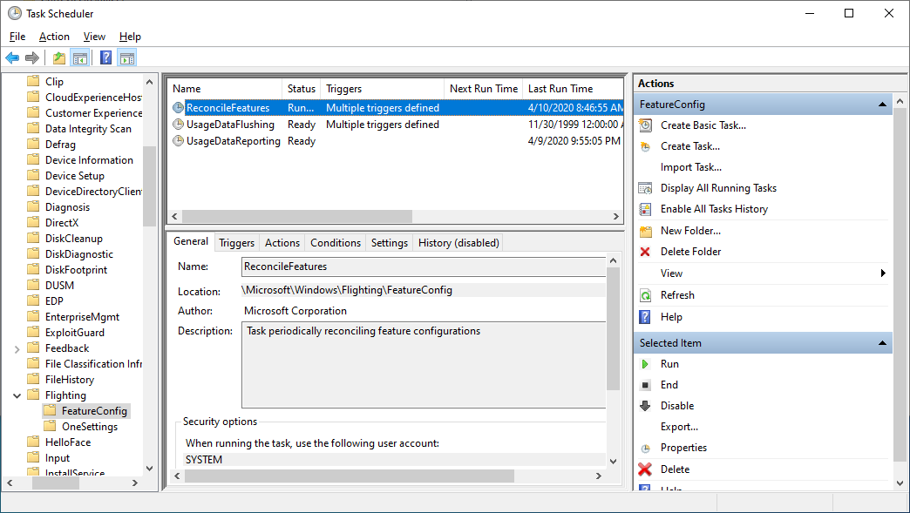

# vivetool关闭window特性

## 关闭特征更新

如果您注意到您的功能覆盖正在重置，那是因为在后台运行的静默任务将值重置为 Microsoft 提供的值。如果您想完全控制，请禁用它。




## 任务栏无法透明

[Translucent TB not working in windows 11 (work around) · Issue #672 · TranslucentTB/TranslucentTB (github.com)](https://github.com/TranslucentTB/TranslucentTB/issues/672)

Okay so I managed to figure it out. Download vivetool GUI (its just easier than the terminal command version if you ask me) I used version 1.62. In the top left box where it says select build just select the first build it shows. In my case it showed 25236 vivetool GUI will start loading features. when its done type in the search box **26008830** that should bring you to STTest highlighted. Now click on Perform action in vivetool GUI and select deactivate feature. then it should say disabled next to STTest. Close all windows, reboot your computer and your task bar should be transparent again. Thats what worked for me.

## 关闭文件夹多标签

```text
.\vivetool /disable /id:36354489
.\vivetool /disable /id:39145991
.\vivetool /disable /id:37634385
```

