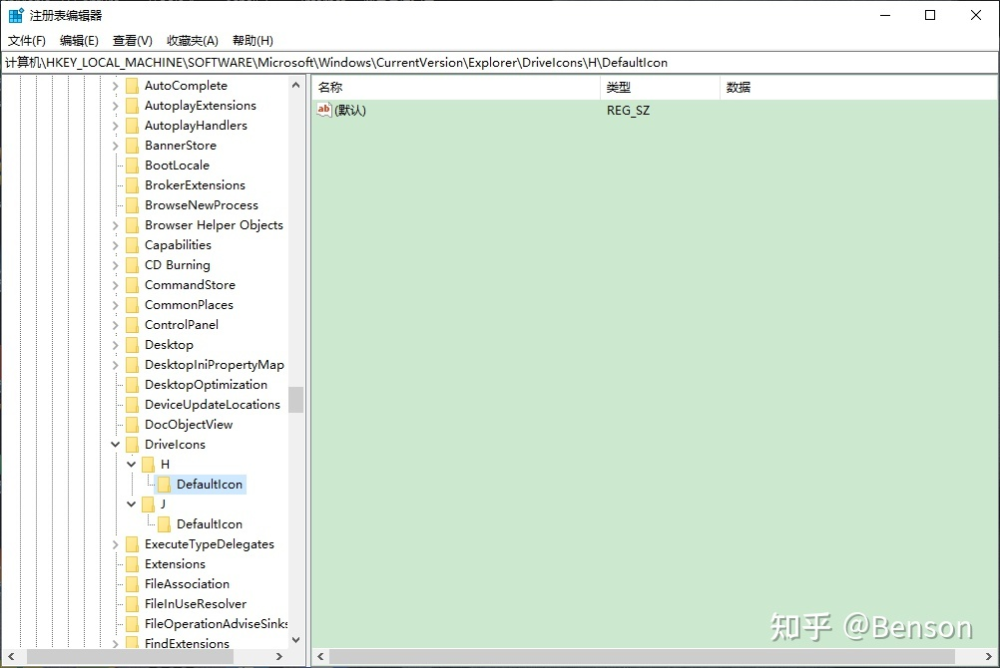
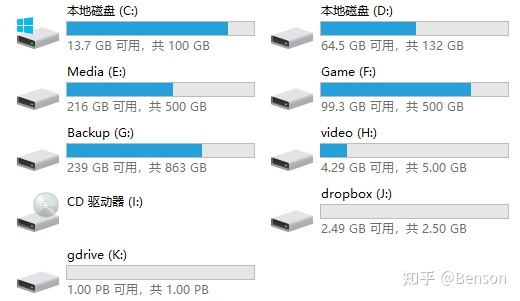

# Window盘符空白

1. 按下组合键 Win+R ，输入 regedit 再按回车运行。

2. 一层一层找到 计算机\HKEY_LOCAL_MACHINE\SOFTWARE\Microsoft\Windows\CurrentVersion\Explorer\DriveIcons\ 这个路径，或者也可以直接在上方地址栏输入。

3. 根据自己变成空白的硬盘盘符（我这里是盘符H），右键点击DriveIcons建立一个跟你硬盘盘符同名的项，然后再次右击刚建立的项，建立一个名为 DefaultIcon的项。

4. 选中刚刚创建的 DefaultIcon，在右边面板双击默认，然后会弹出一个面板，直接确定即可。

5. 回到资源管理器刷新一下，可以看到硬盘图标已经恢复正常。

