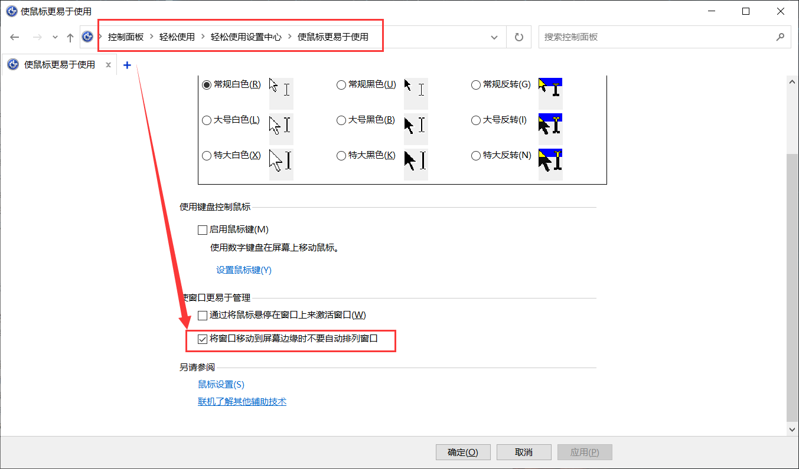

# 关闭窗口最小化手势以及自动排列

1、先要关闭自动排列




或者修改注册表

```
HKEY_CURRENT_USER\Software\Microsoft\Windows\CurrentVersion\Explorer\Advanced
```

下新建 `DisallowShaking` ，`DWORD`值说明：
0 = Enable
1 = Disable


2、然后打开用户策略组`gpedit.msc`


