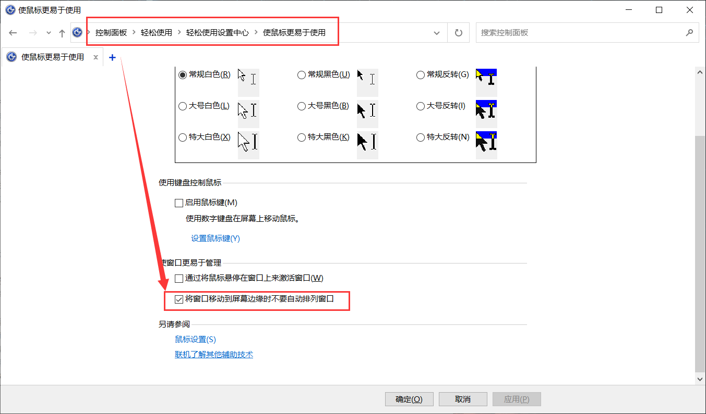

# 常见问题

## Windows7 系统默认此电脑

Windows7系统下设置打开文件夹/资源管理器默认为我的电脑

1、在桌面上右键点击任务栏上的【资源管理器】图标，在弹出菜单中找到【Windows资源管理器】菜单项。

2、再次**鼠标右键点击【Windows资源管理器】**菜单项，在弹出菜单中选择【属性】菜单项。

3、我们打开【Windows资源管理器】属性窗口后，**点击【快捷方式】**选项卡，然后找到【**目标**】选项。

4、在打开的【目标】文本框中命令行的**后面再加一个空格与逗号**（注意要用英文字符），最后点击按【确定】钮。

也可以直接复制这句话：

```javascript
%windir%\explorer.exe ,
```

## Window 10 预览桌面

个性化 -> 任务栏 -> 当你将鼠标移动系件务栏未端的显示桌面“按细时，使用速览”预览桌面

## 启用策略组

```bat
@echo off
pushd "%~dp0"
dir /b C:\Windows\servicing\Packages\Microsoft-Windows-GroupPolicy-ClientExtensions-Package~3*.mum >List.txt
dir /b C:\Windows\servicing\Packages\Microsoft-Windows-GroupPolicy-ClientTools-Package~3*.mum >>List.txt
for /f %%i in ('findstr /i . List.txt 2^>nul') do dism /online /norestart /add-package:"C:\Windows\servicing\Packages\%%i"
pause
```

执行如上脚本即可开启策略组，然后cmd中输入`gpedit.msc`

## 关闭窗口最小化手势以及自动排列

1、先要关闭自动排列




或者修改注册表

```
HKEY_CURRENT_USER\Software\Microsoft\Windows\CurrentVersion\Explorer\Advanced
```

下新建 `DisallowShaking` ，`DWORD`值说明：
0 = Enable
1 = Disable


2、然后打开用户策略组`gpedit.msc`


## 快速删除文件夹

> 问题：windows下无法删除node_modules文件夹，提示文件名或扩展名太长无法删除，即使能够删除，速度也是不敢恭维。特此百度一番，找到了一个很好的方法解决这个问题，特此记录。

解决方法：使用npm的一个名为`rimraf`的模块进行删除

官方描述：The UNIX command `rm -rf` for [node](https://so.csdn.net/so/search?q=node&spm=1001.2101.3001.7020)，即node环境下模拟unix或者linux下的`rm -rf`（强制删除命令）

- 安装（推荐全局安装）：
  `npm install -g rimraf`
- 使用：
  `cd xxx [the folder which includes node_modules folder]`
  `rimraf node_modules`

**注意事项：**
该方法也可用于删除其他文件，类似于Windows的彻底删除`Ctrl+Shift+Delete`，一旦删除就不能恢复（回收站里没有），所以删除之前一定要确保文件已经不再被需要！

## 网卡分流配置

双网卡，同一网段，一个内网，一个外网，如何设置两张网卡能同时访问网络？ - Winston的回答 - 知乎 https://www.zhihu.com/question/27425719/answer/2298685566

## 文件占用无法删除

1. 打开任务管理器，找到`详细信息`，将`explorer.exe`结束进程
2. win+R，运行 `explorer.exe`

## 任务管理器消失

处理方法同【文件占用无法删除】

## 休眠以及分页文件

休眠文件

```
HKEY_LOCAL_MACHINE\SYSTEM\ControlSet001\Control\BackupRestore\FilesNotToBackup

Power Management=D:\hiberfil.sys
```

关闭 `powercfg -hibernate off `

开启 `powercfg -h on`

## Window盘符空白

1. 按下组合键 Win+R ，输入 regedit 再按回车运行。

2. 一层一层找到 计算机\HKEY_LOCAL_MACHINE\SOFTWARE\Microsoft\Windows\CurrentVersion\Explorer\DriveIcons\ 这个路径，或者也可以直接在上方地址栏输入。

3. 根据自己变成空白的硬盘盘符（我这里是盘符H），右键点击DriveIcons建立一个跟你硬盘盘符同名的项，然后再次右击刚建立的项，建立一个名为 DefaultIcon的项。


4. 选中刚刚创建的 DefaultIcon，在右边面板双击默认，然后会弹出一个面板，直接确定即可。

5. 回到资源管理器刷新一下，可以看到硬盘图标已经恢复正常。

