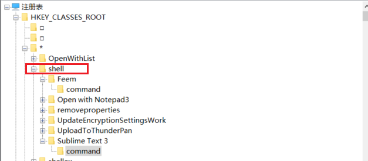
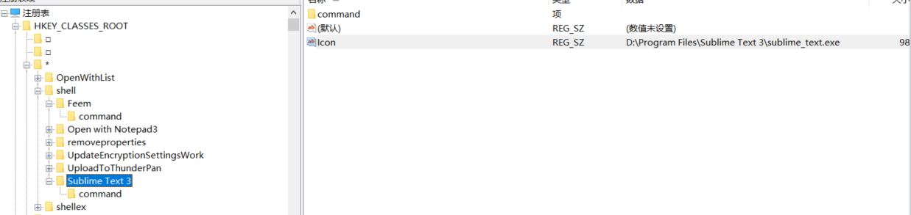
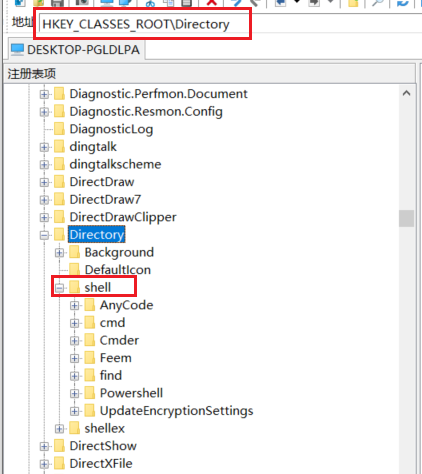

# 注册表

## 文件右击附加项

1、打开注册表，找到 `HKEY_CLASSESS_ROOT\*\Shell`

2、右击新建项，命名为 xxx，这个名字会显示在右击上下文菜单上

3、为这个新的项添加一个图标

在新建的项 xxx 下，新建字符串值，命名为 Icon，值为软件所在的路径，如 `D:\Program Files\Sublime Text 3\sublime_text.exe,0`，逗号前面为Sublime Text的安装路径，后面为0。

> 经测试，貌似不加`,0` 也行

4、添加指令

在项 xxx 下新建项`command`，`command`项下的默认值修改为`path %1`，如 `D:\Program Files\Sublime Text 3\sublime_text.exe %1`

## 文件夹右击附加项

1、找到`HKEY_CLASSES_ROOT\Directory\shell`

2、添加图标，同上节

3、添加指令，同上节