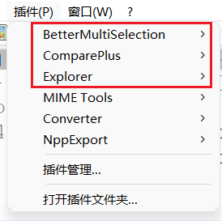

# 重装手册

## 快捷键

+ 联想
  + <kbd>F2</kbd>：BIOS
  + <kbd>F12</kbd>：快速启动

## 重装前

+ 关闭数据库
+ 保存油猴脚本
+ 保存vscode插件，（貌似vscode有自带的同步功能）
+ 导出微软拼音词典
+ nvm删除node
+ 查看teamviewer绑定
+ clash 配置
+ ssh 配置

## 链接文件

均需要管理员身份打开cmd

+ pip
  + 进入到文件夹`cd C:\Users\fangq\AppData\Local`
  + 输入命令`mklink /D pip E:\Cache\AppData\Local\pip`
+ Tencent
  + 进入文件夹`cd C:\Users\fangq\AppData\Roaming`
  + 输入命令`mklink /D Tencent E:\Cache\AppData\Roaming\Tencent`
  + 进入文件夹`cd C:\Users\fangq\AppData\Local`
  + 输入命令`mklink /D Tencent E:\Cache\AppData\Local\Tencent`
+ Genymobile
  + 进入文件夹`cd C:\Users\fangq\AppData\Local`
  + 输入命令`mklink /D Genymobile E:\Cache\AppData\Local\Genymobile`
+ Yarn
  + 进入`cd C:\Users\fangq\AppData\Local`
  + 输入命令`mklink /D Yarn E:\Cache\AppData\Local\Yarn`


## 安装软件

+ qtbar  1043版本

+ Typora

+ nomacs

+ 网易邮件大师

+ 360 压缩

+ ~~notepad++~~

  + 插件
    

+ potplayer

+ ~~网易uu~~

+ steam

+ 火绒  弹窗

+ node

+ FileConverter

+ NVM安装：https://github.com/coreybutler/nvm-windows

+ f.lux   39N 116E

+ eclipse

+ QQ   E:\Cache\Tencent\QQ received

+ 微信    E:\Cache\Tencent

+ 关闭系统更新（无用，仅作记录，替代方案Lenovo Quick Fix）

  + ```bat
    # 打开策略则
    @echo off
    pushd "%~dp0"
    dir /b C:\Windows\servicing\Packages\Microsoft-Windows-GroupPolicy-ClientExtensions-Package~3*.mum >List.txt
    dir /b C:\Windows\servicing\Packages\Microsoft-Windows-GroupPolicy-ClientTools-Package~3*.mum >>List.txt
    for /f %%i in ('findstr /i . List.txt 2^>nul') do dism /online /norestart /add-package:"C:\Windows\servicing\Packages\%%i"
    pause
    ```

  + 以管理员运行

  + gpedit.msc

  + 计算机配置 -》管理模板-》Windows组件-》Windows更新

    + 配置自动更新-》已禁用
    + 指定intranet microsoft 更新服务位置-》启用，瞎吉儿写一个服务地址

+ idea

+ 火柴

+ idm

+ vscode

+ fork

+ edrawsoft

+ manictime

+ fences

+ ditto

+ navicat

+ clash

+ SimpleTex

+ EL display hub

+ AirPlay Screen Mirroring Receiver

+ EarTrumpet

+ TranslucentTB

+ bilibili

+ Logitech Options

+ massCode

+ KLatexFormula

<table>
    <tr>
		<td></td>
        <td></td>
	</tr>
</table>

360 安全管家最后安装！！！，或不装

## 配置文件

### Maven

`~/.m2/settings.xml`

```xml
<?xml version="1.0" encoding="UTF-8"?>
<settings xmlns="http://maven.apache.org/SETTINGS/1.0.0"
          xmlns:xsi="http://www.w3.org/2001/XMLSchema-instance"
          xsi:schemaLocation="http://maven.apache.org/SETTINGS/1.0.0 http://maven.apache.org/xsd/settings-1.0.0.xsd">

<localRepository>F:/repository</localRepository>

  <pluginGroups>
  </pluginGroups>
    
  <proxies>
  </proxies>

  <servers>
  </servers>

  <mirrors>
	<mirror>
      <id>alimaven</id>
      <mirrorOf>central</mirrorOf>  
      <name>aliyun maven</name>
      <url>http://maven.aliyun.com/nexus/content/groups/public/</url>    
	</mirror>
  </mirrors>

  <profiles>
  </profiles>
</settings>
```

## 环境变量

+ 设置protable git 环境变量
+ 设置 temp 环境变量
+ Java 环境变量
+ GRADLE_USER_HOME：`E:\Config\.gradle`，这样AndroidStudio无需配置就能检测到这个gradle的所在
+ Android Sdk：
  + ANDROID_HOME：E:\Android\Sdk  ★
    +  include `ANDROID_HOME/tools`, `ANDROID_HOME/tools/bin`, and `ANDROID_HOME/platform-tools`.
  + ANDROID_USER_HOME：E:\Android
    + avd 会被放在这里
  + 更多配置：https://developer.android.google.cn/studio/command-line/variables?authuser=0#android_home

`xxx_USER_HOME` 一般指用户目录下的路径，通常是一个隐藏文件夹（`.`开头），它下面可能会包含其他版本的东西

`xxx_HOME` 一般具体指某个版本的目录

+ `M2_HOME`：
