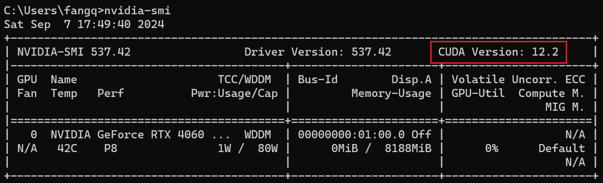

# Pytorch 安装

## CUDA Version

```
nvidia-smi
```

可以查看 cuda 版本，以及最大所支持的运行时版本（也就是要符合以下公式）

```
CUDA Version >= CUDA Runtime Version
```



## CUDA Runtime Version

```
nvcc -V
```

可以查看 cuda 运行时版本

## 安装Pytorch

[PyTorch官网](https://pytorch.org/get-started/locally/)

需注意，下载的 Pytorch 对应 CUDA 版本不能超过 nvidia-smi 所查看的。

## 安装 CUDA

[CUDA Toolkit Archive | NVIDIA Developer](https://developer.nvidia.com/cuda-toolkit-archive)

在网站上下载 CUDA 对应的版本，注意必须和 Pytorch 中的 CUDA 版本一致

