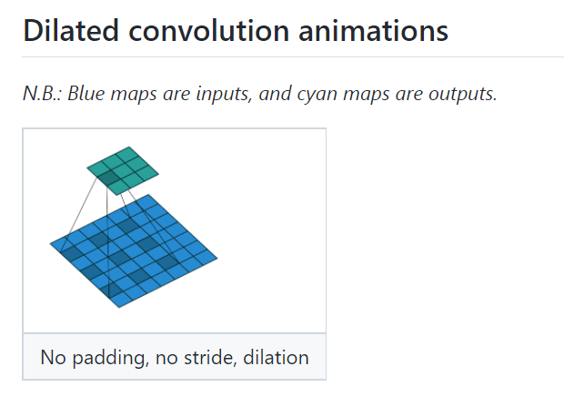
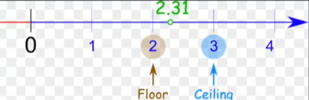
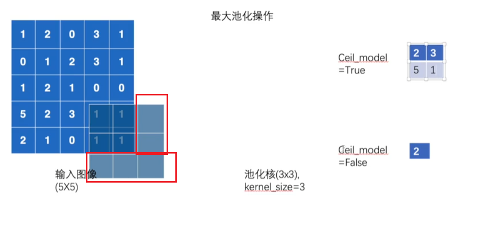

#   PyTorch基础

## 预备

### 环境

先wget下载miniconda

然后`bash [下载安装包名]`，接下来通过enter或者空格快进，一直yes，最后输入`bash`（是bash不是base）就可以进入conda环境了

记得换conda源

环境准备

```cmd
conda create -n torch python=3.8
```

查看显卡，打开cmd，输入如下指令

```cmd
nvidia-smi
```

CUDA9.2版本之后的要求Nvidia的版本号在396.26之上

然后前往pytorch官网查看conda安装torch的指令，安装完毕后检验是否安装成功

```python
import torch
torch.cuda.is_available()
```

安装jupyter，使用下面的安装命令后可以将启动在base环境的jupyter切换到其他环境

```
conda install nb_conda
```

### “法宝”函数

+ `dir()`：查看 package 内里面有什么内容
+ `help()`：查看具体的使用方法

## 基本操作

### 求和 sum

向量求和

```python
x = torch.arange(4, dtype=torch.float32)
x.sum() # tensor(6.)
```

多维向量求和

```python
A = torch.arange(20*2).reshape(2, 5, 4)

A.sum(axis=0) # 对第一个维度求和，A.shape=torch.Size([5, 4])

A.sum(axis=1) # 对第二个维度求和，A.shape=torch.Size([2, 4])

A.sum(axis=[0, 1]).shape # torch.Size([4])

A.sum(axis=1, keepdims=True) # 求和时保持纬度不变，方便后续广播

A.cumsum(axis=0) # 累加求和
tensor([[ 0,  1,  2,  3],
        [ 4,  6,  8, 10],
        [12, 15, 18, 21],
        [24, 28, 32, 36],
        [40, 45, 50, 55]])
```

### 平均 mean

```python
# 所有维度
A.mean(), A.sum() / A.numel()  # A.numel() 元素的个数

# 指定维度
A.mean(axis=0), A.sum(axis=0) / A.shape[0]
```

### 点积 dot

相同位置按元素乘积的和

```
x = torch.arange(4, dtype=torch.float32)
y = torch.ones(4, dtype=torch.float32)
torch.dot(x, y) # tensor(6.)
```

### 乘积 mv、mm

Ax - 矩阵向量相乘

```python
A = torch.ones((5, 4))  # 5个方程组，4个自变量
x = torch.ones(4)
torch.mv(A, x) # 计算结果
torch.mv(A, x).shape # torch.Size([5])
```

AA - 矩阵乘法 - torch.mm 要求两边都是矩阵， torch.matmul不要求

```python
B = torch.ones(4, 3)
torch.mm(A, B).shape # torch.Size([5, 3])
```

### 范数 norm

1范数

```python
u = torch.tensor([3., -4])
u.abs(u).sum()
```

2范数

```python
u = torch.tensor([3., -4])
torch.norm(u) # tensor(5.) ,就是向量元素平方和，再开方
```

F范数

```python
torch.norm(torch.ones((4, 9))) # 矩阵元素平方和，再开方
```

## 计算形状

分子布局符号，详情参考[矩阵求导的本质与分子布局、分母布局的本质](https://zhuanlan.zhihu.com/p/263777564)

使用`torch.matmul(X, w)`时，系数矩阵（行代表不同的样本，列代表不同的参数）放在第一参数中，第二个参数是投入的向量，也可以看成代入x1、xn等等

pytorch中所有矩阵的第一个维度都是数据的索引

## 数据

### Dataset

```python
from torch.utils.data import Dataset
from PIL import Image
import os


class MyData(Dataset):

    def __init__(self, root_dir, label_dir):
        self.root_dir = root_dir
        self.label_dir = label_dir
        self.path = os.path.join(self.root_dir, self.label_dir)
        self.img_path = os.listdir(self.path)

    def __getitem__(self, index):
        img_name = self.img_path[index]
        img_item_path = os.path.join(self.root_dir, self.label_dir, img_name)
        img = Image.open(img_item_path)
        label = self.label_dir
        return img, label

    def __len__(self):
        return len(self.img_path)


root_dir = "../dataset/train"
ants_dataset = MyData(root_dir, "ants")
bees_dataset = MyData(root_dir, "bees")

train_dataset = ants_dataset + bees_dataset

img, label = ants_dataset[0]
img.show()
```

### TensorDataset

pytorch内置的简易数据集，传入数据是一个数组，第一个维度用来索引

### torchvision数据集

因为获取数据集的参数都很类似，所以以CIFAR为例

```python
train_set = torchvision.datasets.CIFAR10(root="./dataset", train=True, download=True)
```

- **root** (*string*) – 数据集下载后存放的位置
- **train** ([*bool*](https://docs.python.org/3/library/functions.html#bool)*,* *optional*) – 如果为True则下载的是训练集，否则为测试集
- **transform** (*callable**,* *optional*) – 对数据集的一些变换操作E.g, `transforms.RandomCrop`
- **target_transform** (*callable**,* *optional*) – A function/transform that takes in the target and transforms it.
- **download** ([*bool*](https://docs.python.org/3/library/functions.html#bool)*,* *optional*) – 如果为True的话，他就会将数据集给下载下来，已下载的不会重复下载

### DataLoader

官方文档[torch.utils.data](https://pytorch.org/docs/stable/data.html#torch.utils.data.DataLoader)

- **dataset** ([*Dataset*](https://pytorch.org/docs/stable/data.html#torch.utils.data.Dataset)) – dataset from which to load the data.
- **batch_size** ([*int*](https://docs.python.org/3/library/functions.html#int)*,* *optional*) – how many samples per batch to load (default: `1`).
- **shuffle** ([*bool*](https://docs.python.org/3/library/functions.html#bool)*,* *optional*) – set to `True` to have the data reshuffled at every epoch (default: `False`).
- **sampler** ([*Sampler*](https://pytorch.org/docs/stable/data.html#torch.utils.data.Sampler) *or* *Iterable**,* *optional*) – defines the strategy to draw samples from the dataset. Can be any `Iterable` with `__len__` implemented. If specified, `shuffle` must not be specified.
- **num_workers** ([*int*](https://docs.python.org/3/library/functions.html#int)*,* *optional*) – how many subprocesses to use for data loading. `0` means that the data will be loaded in the main process. (default: `0`)，在window下num_workers大于0可能会有问题
- **drop_last** ([*bool*](https://docs.python.org/3/library/functions.html#bool)*,* *optional*) – set to `True` to drop the last incomplete batch, if the dataset size is not divisible by the batch size. If `False` and the size of dataset is not divisible by the batch size, then the last batch will be smaller. (default: `False`)

```python
import torchvision
from torch.utils.data import DataLoader
from torch.utils.tensorboard import SummaryWriter

transform = torchvision.transforms.Compose([
    torchvision.transforms.ToTensor()
])

test_set = torchvision.datasets.CIFAR10(root="./dataset", transform=transform, train=False, download=True)


test_loader = DataLoader(dataset=test_set, batch_size=64, shuffle=True, drop_last=False)

print(test_set[0][0].shape)

writer = SummaryWriter("../logs")

for epoch in range(2):
    for i, data in enumerate(test_loader):
        img, target = data
        writer.add_images(f"epoch_{epoch}", img, i)

writer.close()
```

## TensorBoard

打开tensorboard服务

```
tensorboard --logdir=logs --port=6007
```

相关操作

```python
from torch.utils.tensorboard import SummaryWriter
from PIL import Image
import numpy as np

writer = SummaryWriter("logs")

img = Image.open("train\\ants\\0013035.jpg")
img_array = np.array(img)

# 添加图片
writer.add_image("test", img_array, 1, dataformats="HWC")

for i in np.linspace(-3, 3, 100):
    print(i)
    # t
    writer.add_scalar("y = x", i * 2, i)

writer.close()
```

## Transform

```python
from torch.utils.tensorboard import SummaryWriter
from torchvision import transforms
from PIL import Image

img_path = "..\\dataset\\train\\ants\\0013035.jpg"
img = Image.open(img_path)

writer = SummaryWriter("../logs")

# ToTensor
trans_toTensor = transforms.ToTensor()
img_tensor = trans_toTensor(img)
writer.add_image("toTensor", img_tensor)

# Normalize
trans_norm = transforms.Normalize([0.5, 0.5, 0.5], [0.5, 0.5, 0.5])
img_norm = trans_norm(img_tensor)
writer.add_image("normalize", img_norm)

# Resize
trans_resize = transforms.Resize((512, 512))
# trans_resize传递的参数为PIL类型
# img初始是PIL类型，经过trans_resize后他还是PIL类型
img_resize = trans_resize(img)
# 可以通过trans_toTensor进行转换
img_resize = trans_toTensor(img_resize)
writer.add_image("resize", img_resize)

# Compose - 可以将一系列transform变换压缩成一步
trans_compose = transforms.Compose([transforms.Resize(360), trans_toTensor])
img_compose = trans_compose(img)
writer.add_image("compose", img_resize)

# RandomCrop
trans_random = transforms.RandomCrop(360)
trans_compose2 = transforms.Compose([trans_random, trans_toTensor])
for i in range(10):
    img_crop = trans_compose2(img)
    writer.add_image("randomCrop", img_crop, i)

writer.close()
```

## 神经网络层

### nn.Module

```python
import torch
from torch import nn


class Model(nn.Module):

    def __init__(self):
        super().__init__()

    def forward(self, input):
        output = input + 1
        return output


model = Model()
x = torch.tensor(1.0)
rs = model()
print(rs)
```

任何一个神经网络都要继承`nn.Module`，**前向传播方法在`forward`中定义**

### nn.Conv2d 卷积层

[Conv2d — PyTorch 1.9.1 documentation](https://pytorch.org/docs/stable/generated/torch.nn.Conv2d.html#torch.nn.Conv2d)

一般只设置`in_channels`、`out_channels`、`kernel_size`，直接输入参数

`stride`、`padding`，用key指示

其余使用默认

- **in_channels** (*int*) – 输入图片的通道数
- **out_channels** (*int*) – 输入图片的通道数
- **kernel_size** (*int or tuple*) – 卷积核大小
- **stride** (*int or tuple*, *optional*) – 卷积核移动步数. Default: 1
- **padding** (*int tuple or str*, *optional*) – Padding added to all four sides of the input. Default: 0
- **padding_mode** (*string*, *optional*) – `'zeros'`, `'reflect'`, `'replicate'` or `'circular'`. Default: `'zeros'`
- **dilation** ([*int*](https://docs.python.org/3/library/functions.html#int) *or* [*tuple*](https://docs.python.org/3/library/stdtypes.html#tuple)*,* *optional*) – 卷积核的间隙. Default: 1
  
- **groups** ([*int*](https://docs.python.org/3/library/functions.html#int)*,* *optional*) – Number of blocked connections from input channels to output channels. Default: 1
- **bias** ([*bool*](https://docs.python.org/3/library/functions.html#bool)*,* *optional*) – 是否为输出添加偏置. Default: `True`

### nn.MaxPool2d 池化层

一般设置`kernel_size`就行

- **kernel_size** – 池化核大小
- **stride** – 步长默认和池化核大小一致. Default value is `kernel_size`
- **padding** – implicit zero padding to be added on both sides
- **dilation** – a parameter that controls the stride of elements in the window
- **return_indices** – 很少用，if `True`, will return the max indices along with the outputs. 
- **ceil_mode** – when True, will use ceil instead of floor to compute the output shape
  
  类比过来，因为画红框的区域不存在，所以floor模式就会忽略这个池化操作，而ceil模式任然会进行输出。最终看到的效果就是ceil模式输出的池化层更大，而floor模式的小一些
  

### nn.ReLU 非线性层

+ **inplace** – 为True的话会对原输入进行操作，否则会返回操作结果. Default: `False`

```python
import torch
from torch import nn
from torch.nn import ReLU

input = torch.tensor([[1, -.05], [-1, 3]])

class Model(nn.Module):
	def  __init__(self):
        super(Module, self).__init__()
        self.relu1 = ReLU()
        
    def forward(self, input):
        output = self.relu1(input)
        return output
    
model = Model()
output = model(input)
print(output)
```

### nn.Linear 线性层

- **in_features** – 输入样本数
- **out_features** – 输出样本数
- **bias** – 如果设置成False，就不会训练偏置项. Default: `True`

### nn.Sequential

```python
import torch
from torch import nn
from torch.utils import data
from torch.utils.tensorboard import SummaryWriter


class Cifar10Model(nn.Module):

    def __init__(self):
        super().__init__()
        self.model = nn.Sequential(
            nn.Conv2d(3, 32, 5, padding=2),
            nn.MaxPool2d(2),
            nn.Conv2d(32, 32, 5, padding=2),
            nn.MaxPool2d(2),
            nn.Conv2d(32, 64, 5, padding=2),
            nn.MaxPool2d(2),
            nn.Flatten(),
            nn.Linear(1024, 64),
            nn.Linear(64, 10)
        )

    def forward(self, inputs):
        return self.model(inputs)


model = Cifar10Model()
print(model)
inputs = torch.ones((64, 3, 32, 32))
output = model(inputs)
print(len(output))

writer = SummaryWriter('../logs')
writer.add_graph(model, inputs)
writer.close()
```

## 损失函数

### nn.L1loss

mean absolute error - 平均绝对误差

- **reduction** (*string*, *optional*) – 指定应用结算方式: `'none'` | `'mean'` | `'sum'`. . Default: `'mean'`

### nn.MSELoss

 mean squared error - 均方损失误差

+ **reduction** (*string*, *optional*) – Specifies the reduction to apply to the output: `'none'` | `'mean'` | `'sum'`. `'none'`.Default: `'mean'`

### nn.CrossEntropyLoss

- **reduction** (*string**,* *optional*) – Specifies the reduction to apply to the output: `'none'` | `'mean'` | `'sum'`. `'none'`.Default: `'mean'`

交叉熵

```python
outputs = torch.tensor([0.1, 0.5, 0.3])
target = torch.tensor([1])

loss = nn.CrossEntropyLoss()
loss(inputs, target)
```

## 反向传播

```python
for input, target in dataset:
    # 对优化器进行梯度清零操作
    optimizer.zero_grad()
    output = model(input)
    loss = loss_fn(output, target)
	# 对损失函数产生的对象执行反向传播函数
    loss.backward()
    # 优化器通过上一步反向传播得出的梯度进行优化参数
    optimizer.step()
```

## 优化器

常见参数

- **params** (*iterable*) – 需要优化的参数
- **lr** ([*float*](https://docs.python.org/3/library/functions.html#float)) – 学习率

```python
optim = torch.optim.SGD(model.parameters(), lr)
```

## 内置模型

```python
import torchvision
from torch import nn

vgg16_model = torchvision.models.vgg16(pretrained=False)

# 添加新层
vgg16_model.add_module('add_module', nn.Linear(1000, 10))
# 对指定层进行修改
vgg16_model.classifier[6] = nn.Linear(4096, 10)
# 对指定层添加新层
vgg16_model.classifier.add_module('add_module', nn.Linear(1000, 10))
```

## 模型保存读取

```python
vgg16 = torchvision.models.vgg16()

# 方法一
# 保存模型结构+模型参数
torch.save(vgg16, 'vgg16_m1.pth')
# 加载
model = torch.load('vgg16_m1.pth')

# 方法二
# 保存模型参数（推荐）
torch.save(vgg16.state_dict(), 'vgg16_m2.pth')
# 加载模型，所有继承nn.Module的模型都有load_state_dict()方法
model.load_state_dict(torch.load('vgg16_m2.pth'))
```

## 使用GPU加速训练

找到下面三个变量

+ 数据（特征，标签）
+ 网络模型
+ 损失函数

然后后接`.cuda()` ，然后重新赋值给当前变量

> CUDA：Compute Unified Device Architecture，统一计算设备架构。是一种由NVIDIA推出的通用并行计算架构，该架构使GPU能够解决复杂的计算问题。

或者首先定义硬件设备，然后再指定使用的设备

```python
device = torch.device('cpu')
device = torch.device('cuda' if torch.cuda.is_available() else 'cpu')
device = torch.device('cuda:0')

model = model.to(device)
loss_fn = loss_fn.to(device)
data = data.to(device)
```

**对于模型、损失函数不需要重新赋值，但是数据必须要重新赋值**
