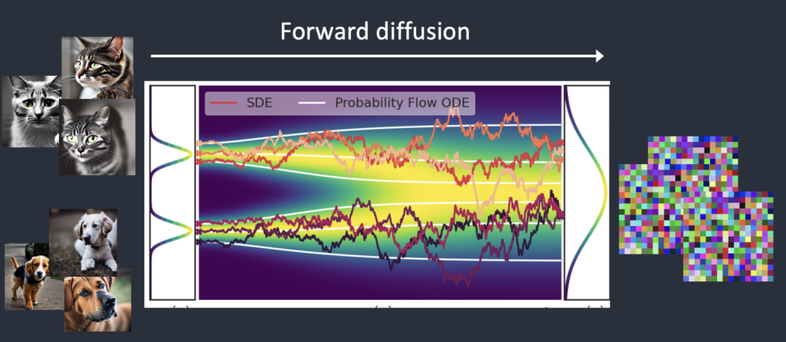

# StableDiffusion理论

> 参考：
>
> + [How does Stable Diffusion work? (stable-diffusion-art.com)](https://stable-diffusion-art.com/how-stable-diffusion-work/)
> + [深入浅出讲解Stable Diffusion原理，新手也能看明白 - 知乎 (zhihu.com)](https://zhuanlan.zhihu.com/p/627133524)

## StableDiffusion可以做什么

在最简单的形式中，Stable Diffusion是一种**文本到图像模式**。给它一个**文本提示(Text Prompt)。** 它将返回与文本匹配的图像。

## 扩散模型（Diffusion Model）

Stable Diffusion属于一类称为扩散模型（diffusion model）的深度学习**模型**。它们是生成模型，这意味着它们的目的是生成类似于它们训练数据的新数据。对于Stable Diffusion来说，数据就是图像。

为什么叫扩散模型？因为它的数学看起来很像物理学中的扩散。让我们来解释这个理念。假设我训练了一个只有两种图像的扩散模型：猫和狗。在下图中，左边的两个山峰代表猫和狗这两组图像。

### 前向扩散(Forward diffusion)

**前向扩散**过程将噪声添加到训练图像中，逐渐将其转换为没有特点的噪声图像。前向过程会将任何猫或狗的图像变成噪声图像。最终，您将无法分辨它们最初是狗还是猫。就像一滴墨水掉进了一杯水里。墨滴在水中**扩散**。几分钟后，它会随机分布在整个水中。你再也分不清它最初是落在中心还是边缘附近。

下面是一个进行前向扩散的图像示例。猫的图像变成随机噪音。

