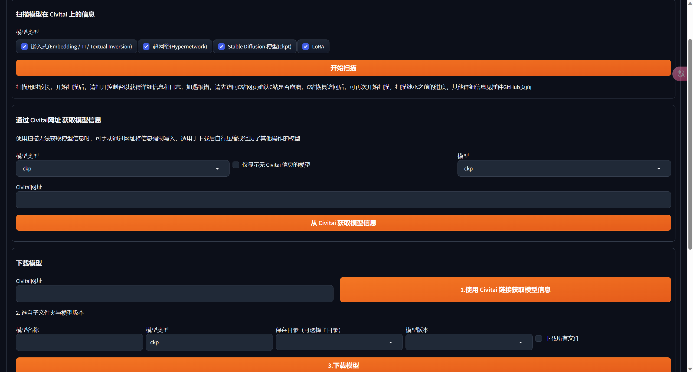
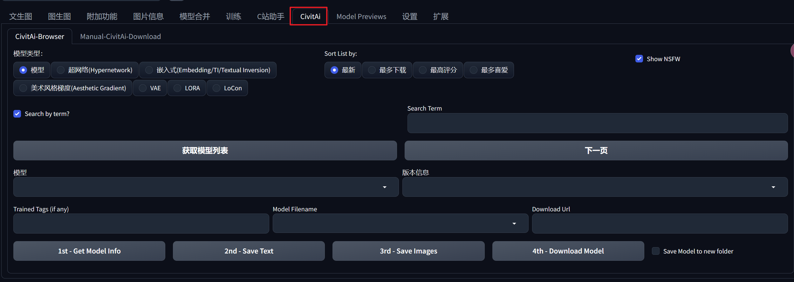

## C站助手(Civitai Helper)

> 可以下载模型，为已有的模型下载封面
>
> 链接：https://github.com/butaixianran/Stable-Diffusion-Webui-Civitai-Helper

## CivitAi

> 主要用来搜索并下载模型，推荐使用
>
> 链接：https://github.com/Vetchems/sd-civitai-browser

## ControlNet

> 控制网络
>
> 链接：https://github.com/Mikubill/sd-webui-controlnet

## 3D OpenPose

> 姿态3D编辑器
>
> 链接：https://github.com/nonnonstop/sd-webui-3d-open-pose-editor.git

## 汉化包

> 链接：`git@github.com:dtlnor/stable-diffusion-webui-localization-zh_CN.git`

