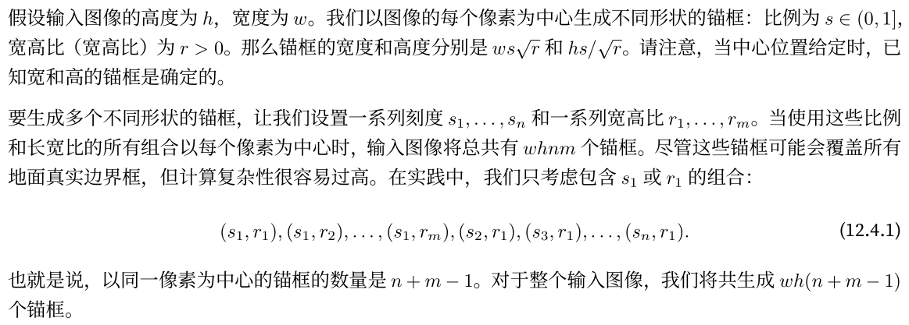
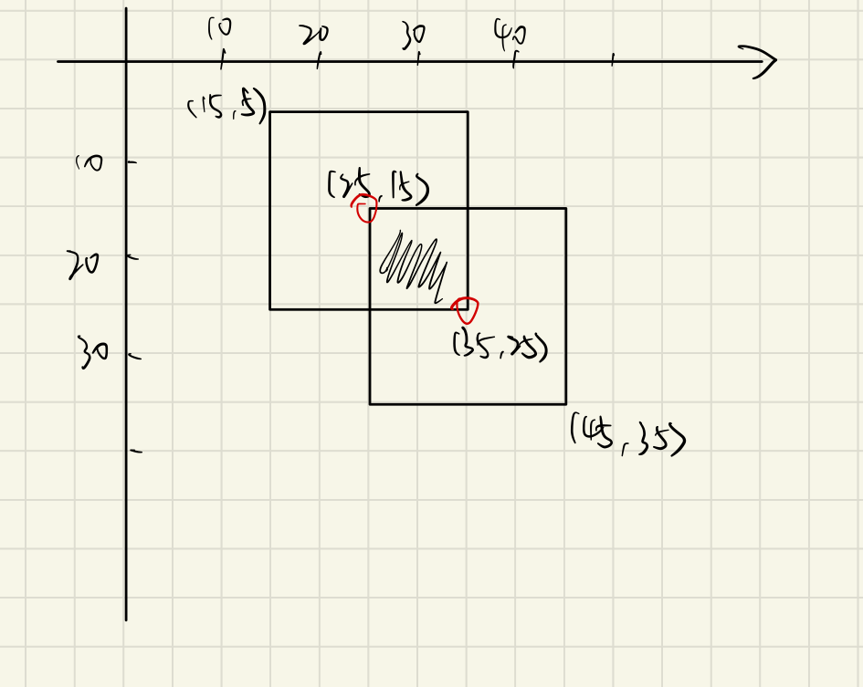

# 目标检测

## 坐标格式转换

```python
def box_corner_to_center(boxes):
    """
    从（左上，右下）转换到（中心坐标，宽⾼）
    :boxes: 边界框（左上，右下）
    """
    x1, y1, x2, y2 = boxes[:, 0], boxes[:, 1], boxes[:, 2], boxes[:, 3]
    cx = (x1 + x2) / 2
    cy = (y1 + y2) / 2
    w = x2 - x1
    h = y2 - y1
    boxes = torch.stack((cx, cy, w, h), -1)
    return boxes

def box_center_to_corner(boxes):
    """
    从（中心坐标，宽⾼）转换到（左上，右下）
    :boxes: 边界框（中心坐标，宽⾼）
    """
    cx, cy, w, h = boxes[:, 0], boxes[:, 1], boxes[:, 2], boxes[:, 3]
    x1 = cx - 0.5 * w
    y1 = cy - 0.5 * h
    x2 = cx + 0.5 * w
    y2 = cy + 0.5 * h
    boxes = torch.stack((x1, y1, x2, y2), -1)
    return boxes


def bbox_to_rect(bbox, color):
    """
    边界框（左上，右下）转换为绘图所需的 Rectangle
    :bbox: 边界框（左上，右下）
    :color: 颜色
    """
    return plt.Rectangle(
        xy=(bbox[0], bbox[1]),
        width=bbox[2] - bbox[0],
        height=bbox[3] - bbox[1],
        fill=False, edgecolor=color, linewidth=2)
```

## 生成锚框



```python
def multibox_prior(data, sizes, ratios):
    """⽣成以每个像素为中⼼具有不同形状的锚框。"""
    in_height, in_width = data.shape[-2:]
    device, num_sizes, num_ratios = data.device, len(sizes), len(ratios)
    boxes_per_pixel = (num_sizes + num_ratios - 1)
    size_tensor = torch.tensor(sizes, device=device)
    ratio_tensor = torch.tensor(ratios, device=device)

    # 为了将锚点移动到像素的中⼼，需要设置偏移量。
    # 因为⼀个像素的的⾼为1且宽为1，我们选择偏移我们的中⼼0.5
    offset_h, offset_w = 0.5, 0.5
    steps_h = 1.0 / in_height  # Scaled steps in y axis
    steps_w = 1.0 / in_width  # Scaled steps in x axis

    # ⽣成锚框的所有中⼼点
    center_h = (torch.arange(in_height, device=device) + offset_h) * steps_h
    center_w = (torch.arange(in_width, device=device) + offset_w) * steps_w
    shift_y, shift_x = torch.meshgrid(center_h, center_w)
    shift_y, shift_x = shift_y.reshape(-1), shift_x.reshape(-1)

    # ⽣成“boxes_per_pixel”个⾼和宽，
    # 之后⽤于创建锚框的四⻆坐标 (xmin, xmax, ymin, ymax)
    w = torch.cat((size_tensor * torch.sqrt(ratio_tensor[0]), sizes[0] * torch.sqrt(ratio_tensor[1:]))) * in_height / in_width  # Handle rectangular inputs
    h = torch.cat((size_tensor / torch.sqrt(ratio_tensor[0]), sizes[0] / torch.sqrt(ratio_tensor[1:])))
        
    # 除以2来获得半⾼和半宽
    anchor_manipulations = torch.stack((-w, -h, w, h)).T.repeat(in_height * in_width, 1) / 2

    # 每个中⼼点都将有“boxes_per_pixel”个锚框，
    # 所以⽣成含所有锚框中⼼的⽹格，重复了“boxes_per_pixel”次
    out_grid = torch.stack([shift_x, shift_y, shift_x, shift_y],
        dim=1).repeat_interleave(boxes_per_pixel, dim=0)
    output = out_grid + anchor_manipulations
    return output.unsqueeze(0)
```

## 显示边界框

```python
def show_bboxes(axes, bboxes, labels=None, colors=None):
    """
    显⽰边界框
    """
    def _make_list(obj, default_values=None):
        """
        制作数组，若传入obj为空则返回默认数组
        :default_values: 默认数组
        """
        if obj is None:
            obj = default_values
        elif not isinstance(obj, (list, tuple)):
            obj = [obj]
        return obj

    labels = _make_list(labels)
    colors = _make_list(colors, ['b', 'g', 'r', 'm', 'c'])

    # 遍历所有bboxes
    for i, bbox in enumerate(bboxes):
        # 选择颜色
        color = colors[i % len(colors)]
        # 根据 bbox 生成 Rectangle
        rect = bbox_to_rect(bbox.detach().numpy(), color)
        # 绘制边框
        axes.add_patch(rect)
        # 边框标注文字
        if labels and len(labels) > i:
            text_color = 'k' if color == 'w' else 'w'
            axes.text(rect.xy[0], rect.xy[1], labels[i], va='center',
                ha='center', fontsize=9, color=text_color,
                bbox=dict(facecolor=color, lw=0))
```

## IOU



`boxes1[:, None, :2]`：其中None用来升维

```python
def box_iou(boxes1, boxes2):
    """
    计算两个锚框或边界框列表中成对的交并⽐
    边框格式（左上右下）
    """
    # 计算边界框面积函数
    box_area = lambda boxes: ((boxes[:, 2] - boxes[:, 0]) * (boxes[:, 3] - boxes[:, 1]))
    # boxes1 面积
    areas1 = box_area(boxes1)
    # boxes2 面积
    areas2 = box_area(boxes2)
    
    # 计算相交区域的左上角坐标，形状: (boxes1的数量, boxes2的数量, 2)
    inter_upperlefts = torch.max(boxes1[:, None, :2], boxes2[:, :2])
    # 计算相交区域的右下角坐标
    inter_lowerrights = torch.min(boxes1[:, None, 2:], boxes2[:, 2:])
	# 计算相交区域宽高
    inters = (inter_lowerrights - inter_upperlefts).clamp(min=0)
    # 计算相交区域面积，形状: (boxes1的数量, boxes2的数量)
    inter_areas = inters[:, :, 0] * inters[:, :, 1]
    # 计算整个区域面积，形状: (boxes1的数量, boxes2的数量)
    union_areas = areas1[:, None] + areas2 - inter_areas
    return inter_areas / union_areas
```

其中涉及到以下函数

```
torch.clamp(input, min, max, out=None) → Tensor
```

它将输入`input`张量每个元素的夹紧到区间 \[min,max]，并返回结果到一个新张量

## 边界框分配

```python
def assign_anchor_to_bbox(ground_truth, anchors, device, iou_threshold=0.5):
    """将最接近的真实边界框分配给锚框。"""
    # 获取锚框、边界框数量
    num_anchors, num_gt_boxes = anchors.shape[0], ground_truth.shape[0]
    # 计算所有锚框与所有边界框的IoU
    jaccard = box_iou(anchors, ground_truth)
    # 生成长度为锚框数量num_anchors的张量，用来分配边界框
    anchors_bbox_map = torch.full((num_anchors,), -1, dtype=torch.long, device=device)
    # 获取最大的iou值，以及相应的索引值
    max_ious, indices = torch.max(jaccard, dim=1)
    # 分配边界框
    anc_i = torch.nonzero(max_ious >= iou_threshold).reshape(-1)
    box_j = indices[max_ious >= iou_threshold]
    anchors_bbox_map[anc_i] = box_j
    # 用来标记抛弃元素的辅助数组
    col_discard = torch.full((num_anchors,), -1)
    row_discard = torch.full((num_gt_boxes,), -1)
    for _ in range(num_gt_boxes):
        max_idx = torch.argmax(jaccard)
        box_idx = (max_idx % num_gt_boxes).long()
        anc_idx = (max_idx / num_gt_boxes).long()
        anchors_bbox_map[anc_idx] = box_idx
        jaccard[:, box_idx] = col_discard
        jaccard[anc_idx, :] = row_discard
    return anchors_bbox_map
```

涉及到下面的函数，第一个参数代表形状

```python
torch.full((5,), -1)
# tensor([-1, -1, -1, -1, -1])

torch.full((3, 3), -1)
#tensor([[-1, -1, -1],
#        [-1, -1, -1],
#        [-1, -1, -1]])

torch.nonzero(max_ious >= iou_threshold) # 获取非0元素的索引值
```

## 标记类和偏移

假设⼀个锚框 A 被分配了⼀个真实边界框 B。一方面，锚框 A 的类将被标记为与 B 相同。另一方面，锚框 A 的偏移量将根据 B 和 A 中心坐标的相对位置、以及这两个框的相对大小进行标记。鉴于数据集内不同的框的位置和大小不同，我们可以对那些相对位置和大小应用变换，使其获得更均匀分布、易于适应的偏移量，下面是一种常见的变换。

给定框 A 和 B，中心坐标分别为 $(x_a, y_a)$ 和 $(x_b, y_b)$，宽度分别为 $w_a$ 和 $w_b$，高度分别为 $h_a$ 和 $h_b$。我们可以将 A 的偏移量标记为


其中常量的默认值是 $\mu_x = \mu_y = \mu_w = \mu_h = 0, \sigma_x = \sigma_y = 0.1$ 和 $\sigma_w = \sigma_h = 0.2$。

```python
def offset_boxes(anchors, assigned_bb, eps=1e-6):
    """对锚框偏移量的转换。"""
    c_anc = box_corner_to_center(anchors)
    c_assigned_bb = box_corner_to_center(assigned_bb)
    offset_xy = 10 * (c_assigned_bb[:, :2] - c_anc[:, :2]) / c_anc[:, 2:]
    offset_wh = 5 * torch.log(eps + c_assigned_bb[:, 2:] / c_anc[:, 2:])
    offset = torch.cat([offset_xy, offset_wh], axis=1)
    return offset
```


使用真实边界框标记锚框

```python
def multibox_target(anchors, labels):
    """
    使⽤真实边界框标记锚框。
    根据真实边界框，标注这些锚框的分类和偏移量
    :param anchors: 真实分类以及锚框信息
    :param labels: 标记的边界框
    """
    # 小批量数、处理传入的anchors
    batch_size, anchors = labels.shape[0], anchors.squeeze(0)
    # 待返回的数据
    batch_offset, batch_mask, batch_class_labels = [], [], []
    # 设备、锚框数量
    device, num_anchors = anchors.device, anchors.shape[0]
    for i in range(batch_size):
        label = labels[i, :, :]
        anchors_bbox_map = assign_anchor_to_bbox(label[:, 1:], anchors, device)
        bbox_mask = ((anchors_bbox_map >= 0).float().unsqueeze(-1)).repeat(1, 4)
        # 将类标签和分配的边界框坐标初始化为零
        class_labels = torch.zeros(num_anchors, dtype=torch.long, device=device)
        assigned_bb = torch.zeros((num_anchors, 4), dtype=torch.float32, device=device)
        # 使⽤真实边界框来标记锚框的类别。
        # 如果⼀个锚框没有被分配，我们标记其为背景（值为零）
        indices_true = torch.nonzero(anchors_bbox_map >= 0)
        bb_idx = anchors_bbox_map[indices_true]
        class_labels[indices_true] = label[bb_idx, 0].long() + 1
        assigned_bb[indices_true] = label[bb_idx, 1:]
        # 偏移量转换
        offset = offset_boxes(anchors, assigned_bb) * bbox_mask
        batch_offset.append(offset.reshape(-1))
        batch_mask.append(bbox_mask.reshape(-1))
        batch_class_labels.append(class_labels)
    bbox_offset = torch.stack(batch_offset)
    bbox_mask = torch.stack(batch_mask)
    class_labels = torch.stack(batch_class_labels)
    return bbox_offset, bbox_mask, class_labels
```

## 恢复偏移

```python
def offset_inverse(anchors, offset_preds):
    """根据带有预测偏移量的锚框来预测边界框。"""
    anc = box_corner_to_center(anchors)
    pred_bbox_xy = (offset_preds[:, :2] * anc[:, 2:] / 10) + anc[:, :2]
    pred_bbox_wh = torch.exp(offset_preds[:, 2:] / 5) * anc[:, 2:]
    pred_bbox = torch.cat((pred_bbox_xy, pred_bbox_wh), axis=1)
    predicted_bbox = box_center_to_corner(pred_bbox)
    return predicted_bbox
```

## NMS非极大值抑制

对于一个预测边界框B，计算出相应所有类别的预测概率。最大的预测概率p称之为这个边界框B的置信度，p所对应的类别就是B的预测类别。在同一张图片中，将所有非背景的预测框按置信度降序排列，以生成列表L，然后做如下处理：

1. 选择L中置信度最高的预测边框$B_1$做为基准，然后剔除L中其他与$B_1$的IoU大于指定阈值的预测边框。
   + 这样L中保留了置信度最高的预测边框$B_1$，去除了其他相似度太高的预测边框，简而言之，那些具有非极大值置信度的边界框被抑制了
2. 从L中选取置信度第二高的预测边界框$B_2$做为基准，然后将所有与$B_2$的IoU大于阈值的预测边界框从L中移除
3. 重复上述过程，直到L中所有的预测边界框都做过基准

```python
def nms(boxes, scores, iou_threshold=0.5):
    """
    对预测边界框的置信度进⾏排序
    boxes: xyxy
    """
    B = torch.argsort(scores, dim=-1, descending=True)
    keep = []
    # 保留预测边界框的指标
    while B.numel() > 0:
        i = B[0]
        keep.append(i)
        if B.numel() == 1:
            break
        iou = box_iou(boxes[i, :].reshape(-1, 4),
                      boxes[B[1:], :].reshape(-1, 4)).reshape(-1)
        # iou <= iou_threshold 用来调除相似度较低的边界框，也就是过于相似的边界框被剔除了
        # 然后通过 nonzero 获取索引值
        inds = torch.nonzero(iou <= iou_threshold).reshape(-1)
        # 通过 +1 获取除置信度最高的边框
        B = B[inds + 1]
    return torch.tensor(keep, device=boxes.device)
```

涉及到如下函数

```python
scores.argsort() # 将置信度升序排序，返回其索引值
```

## 使用NMS来预测边界框

```python
def multibox_detection(cls_probs, offset_preds, anchors, nms_threshold=0.5, pos_threshold=0.009999999):
    """使⽤⾮极⼤值抑制来预测边界框。"""
    device, batch_size = cls_probs.device, cls_probs.shape[0]
    anchors = anchors.squeeze(0)
    num_classes, num_anchors = cls_probs.shape[1], cls_probs.shape[2]
    out = []
    for i in range(batch_size):
        cls_prob, offset_pred = cls_probs[i], offset_preds[i].reshape(-1, 4)
        conf, class_id = torch.max(cls_prob[1:], dim=0)
        predicted_bb = offset_inverse(anchors, offset_pred)
        keep = nms(predicted_bb, conf, nms_threshold)

        # 找到所有的 non_keep 索引，并将类设置为背景
        all_idx = torch.arange(num_anchors, dtype=torch.long, device=device)
        combined = torch.cat((keep, all_idx))
        uniques, counts = combined.unique(return_counts=True)
        non_keep = uniques[counts == 1]
        all_id_sorted = torch.cat((keep, non_keep))
        class_id[non_keep] = -1
        class_id = class_id[all_id_sorted]
        conf, predicted_bb = conf[all_id_sorted], predicted_bb[all_id_sorted]

        # `pos_threshold` 是⼀个⽤于⾮背景预测的阈值
        below_min_idx = (conf < pos_threshold)
        class_id[below_min_idx] = -1
        conf[below_min_idx] = 1 - conf[below_min_idx]
        pred_info = torch.cat((class_id.unsqueeze(1), conf.unsqueeze(1), predicted_bb), dim=1)
        out.append(pred_info)
    return torch.stack(out)
```

**输入数据：**

cls_probs：类别预测概率数组，每一个数组元素都是一个二维数组，这个二维数组记录了所有锚框在各类别上的概率

offset_preds：相对于锚框的偏移值数组，每个数组元素也是一个数组，记录对每一个锚框的偏移量

anchors：所有的锚框，是个二维数组，记录了不同锚框的位置信息

pos_threshold：背景阈值，如果置信度小于这个阈值，则设置预测框为背景

**算法逻辑：**

对每个批量进行如下操作

1. 由类别预测概率获取所有锚框在各类别上最高的置信分，以及相应的类别索引
2. 通过锚框和锚框偏移获取预测框信息
3. 由预测框和置信分进行**极大值抑制**，获取保留下来的预测框索引值
4. 获取**没有保留**下的所有预测框，并**设置其类别为背景**
   + 文中用了个巧妙的方法，首先我们已知保留下的索引值
   + 利用`torch.arange`函数构造所有的索引值，然后与保留下的索引值合并
   + 使用torch的`unique`方法，传入参数`return_counts=True`，他会返回一个元素唯一的数组以及对饮位置元素的数量
   + `non_keep = uniques[counts == 1]`就能得到想要的值了
5. 将所有**置信度低于背景阈值**的预测框**设置为背景**，并调整为背景的概率
   + 注意因为传入的都是类概率，所以调整背景概率时要取与概率100%的补数（1-类别概率）
6. 最终返回**类别索引、置信度、以及预测框位置信息**

