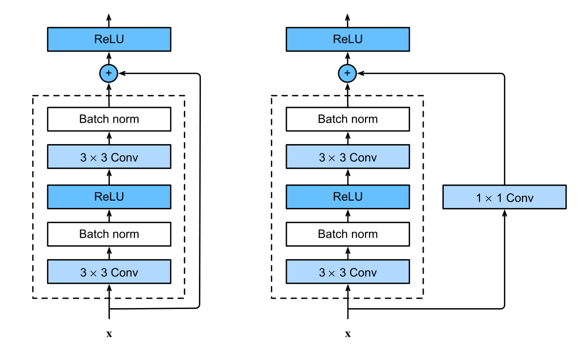

# 神经网络

## 卷积块

```python
def conv3x3(in_planes: int, out_planes: int, stride: int = 1, dilation: int = 1) -> nn.Conv2d:
    """3x3 convolution with padding"""
    return nn.Conv2d(in_planes, out_planes, kernel_size=(3, 3), stride=(stride, stride), padding=dilation, bias=False)


def conv1x1(in_planes: int, out_planes: int, stride: int = 1) -> nn.Conv2d:
    """1x1 convolution"""
    return nn.Conv2d(in_planes, out_planes, kernel_size=(1, 1), stride=(stride, stride), bias=False)
```

+ 3x3的卷积：
  + 一般用来上升通道数，并提取特征，一般情况下保持形状不变，所以padding默认为1
+ 1x1的卷积：
  + 上升通道数

## ResNet

### Basic残差块

```python
class Residual(nn.Module):
    expansion: int = 1

    def __init__(self, in_channels, channels, stride=1, downsample=None):
        super(Residual, self).__init__()
        self.downsample = downsample
        self.conv1 = conv3x3(in_channels, channels, stride=stride)
        self.conv2 = conv3x3(channels, channels)
        self.bn1 = nn.BatchNorm2d(channels)
        self.bn2 = nn.BatchNorm2d(channels)
        self.relu = nn.ReLU(inplace=True)

    def forward(self, x):
        identity = x

        out = self.conv1(x)
        out = self.bn1(out)
        out = self.relu(out)

        out = self.conv2(out)
        out = self.bn2(out)

        if self.downsample is not None:
            identity = self.downsample(x)

        out += identity
        out = self.relu(out)
        return out
```



1、现在来解释一下左图和右图的区别

+ 左图——没有使用1x1卷积
  + 适用于输入通道和输出通道数量相同，就是**通道数不变**
+ 左图——使用1x1卷积
  + 适用于输入通道和输出通道数量不同的情况，就是**通道数发生变化**

2、再说一下为什么要1x1的卷积，以及strides参数的作用

+ 1x1的作用
  + 假设残差的in_channels=3，out_channels=6，输入数据的shape为(1, 3, 6, 6)
  + 经过第一层3x3的卷积，它会将in_channels直接变换到out_channels也就是(1, 3, 6, 6) -->  (1, 6, 6, 6)
  + 第二层卷积的输入和输出通道数量是相同的
  + 现已知输入tensor和经过卷积处理后的tensor尺寸大小分别为(1, 3, 6, 6)、(1, 6, 6, 6)
  + 如果没有1x1的卷积，将输入的通道数变换到(1, 6, 6, 6)，那么中间做残差运算（也就是加法运算）会计算失败
+ strides的作用
  + 有时需要将图片尺寸缩小一倍，这时就需要strides=2了
  + 需要注意第一个 layer 因为通道上升太快(3 --> 64)，所以指定stride=1无需再次缩小特征图

3、 什么时候需要conv1x1来调整通道数？

+ 当 stride = 2 的时候
+ 当属于每个layer层的第一个残差块时，都需要调整通道数
  + 比如resnet34，它的结构是[3, 4, 6, 3]，已知 layer1 无需调整通道数，而 layer2 的第一个残差块需要调整通道数
  + 原因是跳到下一个layer时，通道数会变化，需要conv1x1来进行调整
  + 代码可以通过`in_channel != out_channel`来判断
  + 现象：以resnet34[3, 4, 6, 3]为例
    + layer1 因为没有调整通道数，3个卷积都是`conv(in_channel=64, out_channel=64)`
    + 而 layer2 因为使用了调整通道数，除了第一个卷积是`conv(in_channel=64, out_channel=128)`，其他的3个卷积都是`conv(in_channel=128, out_channel=128)`

Basic残差块只用2两个卷积层来进行提取特征，后面会有一个Bottleneck残差块用3个卷积层来提取特征

### Bottleneck残差块

```python
class Bottleneck(nn.Module):
    expansion: int = 4

    def __init__(self, in_channels, channels, stride=1, downsample=None):
        super(Bottleneck, self).__init__()
        self.stride = stride
        self.downsample = downsample
        self.relu = nn.ReLU(inplace=True)

        self.conv1 = conv1x1(in_channels, channels)
        self.bn1 = nn.BatchNorm2d(channels)

        self.conv2 = conv3x3(channels, channels, stride)
        self.bn2 = nn.BatchNorm2d(channels)

        self.conv3 = conv1x1(channels, channels * self.expansion)
        self.bn3 = nn.BatchNorm2d(channels * self.expansion)

    def forward(self, x):
        identity = x

        out = self.conv1(x)
        out = self.bn1(out)
        out = self.relu(out)

        out = self.conv2(out)
        out = self.bn2(out)
        out = self.relu(out)

        out = self.conv3(out)
        out = self.bn3(out)

        if self.downsample is not None:
            identity = self.downsample(x)

        out += identity
        out = self.relu(out)

        return out
```

1、Bottleneck流程

+ 首先利用 conv1x1 直接将通道数调整为 out_channels
+ 然后利用 conv3x3 提取特征，如果需要可以使用 stride 缩小特征图
+ 最后再使用 conv1x1 将通道数变换为 out_channels 的 4 倍

### 构建ResNet

```python
class ResNet(nn.Module):
    def __init__(self, block, layers: List[int]):
        super(ResNet, self).__init__()
        self.in_channels = 64
        self.conv1 = nn.Conv2d(3, self.in_channels, kernel_size=7, stride=2, padding=3, bias=False)
        self.bn1 = nn.BatchNorm2d(self.in_channels)
        self.relu = nn.ReLU(inplace=True)
        self.maxpool = nn.MaxPool2d(kernel_size=3, stride=2, padding=1)

        self.layer1 = self._make_layer(block, 64, layers[0])
        self.layer2 = self._make_layer(block, 128, layers[1], stride=2)
        self.layer3 = self._make_layer(block, 256, layers[2], stride=2)
        self.layer4 = self._make_layer(block, 512, layers[3], stride=2)

    def _make_layer(self, block, channels, num_block, stride=1):
        layers = []
        downsample = None
        if stride != 1 or self.in_channels != channels * block.expansion:
            downsample = nn.Sequential(
                conv1x1(self.in_channels, channels * block.expansion, stride),
                nn.BatchNorm2d(channels * block.expansion),
            )
        layers.append(block(self.in_channels, channels, stride=stride, downsample=downsample))
        self.in_channels = channels * block.expansion
        for _ in range(1, num_block):
            layers.append(block(self.in_channels, channels))
        return nn.Sequential(*layers)

    def forward(self, x):
        x = self.conv1(x)
        x = self.bn1(x)
        x = self.relu(x)
        x = self.maxpool(x)

        x = self.layer1(x)
        x = self.layer2(x)
        x = self.layer3(x)
        x = self.layer4(x)

        return x
```

残差网络会进行32倍的下采样

+ 首先使用kernel_size=7，stride=2，padding=3的**卷积**，这样尺寸会缩小一倍
+ 然后使用kernel_size=3，stride=2，padding=1的**Maxpool2d**，尺寸又缩小一倍
+ 一般情况下，在上升通道的同时，还会缩小特征图的尺寸
+ 第一个层将通道数3提升到64，==上升通道的倍数较大，所以没有使用下采样==，尺寸没变化
+ 第二个层将通道数64提升到128，并进行下采样，尺寸缩小一倍
+ 第三个层将通道数128提升到256，并进行下采样，尺寸缩小一倍
+ 第四个层将通道数256提升到512，并进行下采样，尺寸缩小一倍
+ 总共缩小了5次，所以$2^5=32$倍

真正的残差网络还会在最后一层残差块进行Flatten，然后全局平均池化，最后在进行一次全连接

```python
...
self.avgpool = nn.AdaptiveAvgPool2d((1, 1))
self.fc = nn.Linear(512 * block.expansion, num_classes)
...
x = self.avgpool(x)
x = torch.flatten(x, 1)
x = self.fc(x)
...
```

### ResNet-xx

ResNet有18、34、50、101、152层，5种版本的网络结构

1、前两种18、34使用的都是Basic残差块（也就是使用2层卷积来提取特征的残差块）

```python
def resnet18(pretrained=False, progress=True):
    model = ResNet(Residual, [2,])
    if pretrained:
        state_dict = load_state_dict_from_url(model_urls['resnet34'], progress=progress)
        model.load_state_dict(state_dict, strict=False)
    return model
```

因为公共的层为，第一层7x7的卷积层、最后的全连接层；而且如果不算1x1这个恒等映射的卷积层的话，每个残差块有2个卷积，那么`(2+2+2+2)*2 + 2 = 18`

```python
def resnet32(pretrained=False, progress=True):
    model = ResNet(Residual, [3, 4, 6, 3])
    if pretrained:
        state_dict = load_state_dict_from_url(model_urls['resnet34'], progress=progress)
        model.load_state_dict(state_dict, strict=False)
    return model
```

而resnet34就是`(2 + (3+4+6+3)*2) = 34`


## SPP

空间金字塔池化，以下三个池化操作并不会造成特征图大小的变化

+ MaxPool2d, kernel_size = 5, stride=1, padding=2
+ MaxPool2d, kernel_size = 9, stride=1, padding=4
+ MaxPool2d, kernel_size = 13, stride=1, padding=6

```python
class SPP(nn.Module):
    def __init__(self):
        super(SPP, self).__init__()
        self.maxpool1 = nn.MaxPool2d(5, stride=1, padding=2)
        self.maxpool2 = nn.MaxPool2d(9, stride=1, padding=4)
        self.maxpool3 = nn.MaxPool2d(13, stride=1, padding=6)

    def forward(self, x):
        out1 = self.maxpool1(x)
        out2 = self.maxpool2(out1)
        out3 = self.maxpool3(out2)
        out = torch.cat([x, out1, out2, out3], dim=1)
        return out
```

## Reorg

详情参见[搭建更好的YOLOv2+网络](https://zhuanlan.zhihu.com/p/433119288)

```python
class Reorg(nn.Module):
    def __init__(self, stride):
        super(Reorg, self).__init__()
        self.stride = stride

    def forward(self, x):
        (batch_size, channels, height, width), stride = x.size(), self.stride
        height, width = height // stride, width // stride

        x = x.view(batch_size, channels, height, stride, width, stride).transpose(3, 4).contiguous()
        x = x.view(batch_size, channels, height * width, stride * stride).transpose(2, 3).contiguous()
        x = x.view(batch_size, channels, stride * stride, height, width).transpose(1, 2).contiguous()
        x = x.view(batch_size, -1, height, width)

        return x
```
