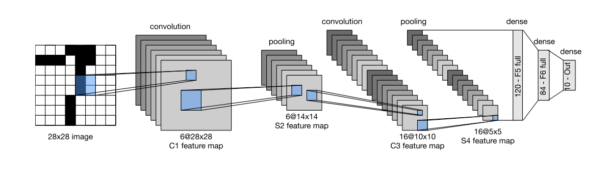
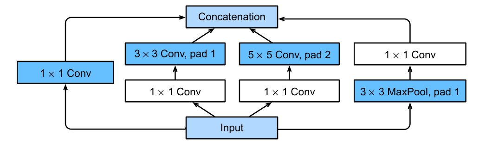

# 卷积神经网络

## LeNet



第一层卷积：28 - 5 + 2 * 2 + 1 = 28 ，所以卷积核5，padding2

第一层非线性：sigmod

第一层池化：(28 - 2 ) / 2 + 1 = 14，核大小2，stride2

————————————————————————

第二层卷积：14 - 5 + 1 = 10，核大小5，其他默认

第二层非线性：sigmod

第二层池化：(10 - 2 ) / 2 + 1 = 5，核大小2，stride2

————————————————————————

拉直为 16 * 5 * 5 ，并输出120个特征，然后非线性

120 -> 84，然后非线性

84 -> 10，然后非线性

```python
import torch
from torch import nn

class Reshape(torch.nn.Module):
    def forward(self, inputs):
        return inputs.view(-1, 1, 28, 28)


net = nn.Sequential(
    Reshape(), 
    nn.Conv2d(1, 6, kernel_size=5, padding=2), nn.Sigmoid(), nn.AvgPool2d(kernel_size=2, stride=2),
    nn.Conv2d(6, 16, kernel_size=5), nn.Sigmoid(), nn.AvgPool2d(kernel_size=2, stride=2),
    nn.Flatten(),
    nn.Linear(16 * 5 * 5, 120), nn.Sigmoid(),
    nn.Linear(120, 84), nn.Sigmoid(),
    nn.Linear(84, 10)
)
```

## AlexNet

第一层

+ 11 * 11 Conv(96), stride 4， pad 1
+ 3 * 3 MaxPool, stride 2

第二层

+ 5 * 5 Conv(256), pad 2
+ 3 * 3 MaxPool, stride 2

第三层，3个连续的卷积层

+ 3 * 3 Conv（384），pad 1
+ 3 * 3 Conv（384），pad 1
+ 3 * 3 Conv（256），pad 1
+ 3 * 3 MaxPool， stride 2

全连接层

+ Dense（4096）
+ Dense（4096）
+ Dense（1000）

```python
import torch
import torchvision
from torch import nn
from torch.utils import data
from torchvision import transforms

net = nn.Sequential(
    nn.Conv2d(1, 96, kernel_size=11, stride=4, padding=1), nn.ReLU(),
    nn.MaxPool2d(kernel_size=3, stride=2),
    nn.Conv2d(96, 256, kernel_size=5, padding=2), nn.ReLU(),
    nn.MaxPool2d(kernel_size=3, stride=2),
    nn.Conv2d(256, 384, kernel_size=3, padding=1), nn.ReLU(),
    nn.Conv2d(384, 384, kernel_size=3, padding=1), nn.ReLU(),
    nn.Conv2d(384, 256, kernel_size=3, padding=1), nn.ReLU(),
    nn.MaxPool2d(kernel_size=3, stride=2),
    nn.Flatten(),
    nn.Linear(6400, 4096), nn.ReLU(), nn.Dropout(),
    nn.Linear(4096, 4096), nn.ReLU(), nn.Dropout(),
    nn.Linear(4096, 10)
)
```

## VGG

更深的3*3的卷积层，比少一点但大5 * 5的卷积核更好

和AlexNet相比，就是多了很多vgg块，每个vgg块都是由多个卷积层加上一个最大池化层构成

```python
def vgg_block(num_convs, in_channels, out_channels):
    layers = []
    for _ in range(num_convs):
        layers.append(nn.Conv2d(in_channels, out_channels, kernel_size=3, padding=1))
        layers.append(nn.ReLU()),
        in_channels = out_channels
    layers.append(nn.MaxPool2d(kernel_size=2, stride=2))
    return nn.Sequential(*layers)


conv_arch = ((1, 64), (1, 128), (2, 256), (2, 512), (2, 512))

def vgg(conv_arch):
    conv_blks = []
    in_channels = 1
    for (num_convs, out_channels) in conv_arch:
        conv_blks.append(vgg_block(num_convs, in_channels, out_channels))
        in_channels = out_channels

    return nn.Sequential(
        *conv_blks, nn.Flatten(),
        nn.Linear(out_channels * 7 * 7, 4096), nn.ReLU(), nn.Dropout(),
        nn.Linear(4096, 4096), nn.ReLU(), nn.Dropout(),
        nn.Linear(4096, 10)
    )

ratio = 4 # 缩小模型比例
conv_arch = [(pair[0], pair[1] // 4) for pair in conv_arch]
net = vgg(conv_arch)
```

## NiN

NiN使用类似于vgg的方式，构造了一个NiN块，它由一个卷积层，外加2两个1*1的卷积层构成

NiN使用全局平均池化层来替代VGG和AlexNet中的全连接层

不容易过拟合，更少的参数个数

```python
def nin_block(in_channels, out_channels, kernel_size, strides, padding):
    return nn.Sequential(
        nn.Conv2d(in_channels, out_channels, kernel_size=kernel_size, stride=strides, padding=padding), nn.ReLU(),
        nn.Conv2d(out_channels, out_channels, kernel_size=1), nn.ReLU(),
        nn.Conv2d(out_channels, out_channels, kernel_size=1), nn.ReLU()
    )


net = nn.Sequential(
    nin_block(1, 96, kernel_size=11, strides=4, padding=0),
    nn.MaxPool2d(3, stride=2),
    nin_block(96, 256, kernel_size=5, strides=1, padding=2),
    nn.MaxPool2d(3, stride=2),
    nin_block(256, 384, kernel_size=3, strides=1, padding=1),
    nn.MaxPool2d(3, stride=2),
    nn.Dropout(),
    nin_block(384, 10, kernel_size=3, strides=1, padding=1),
    nn.MaxPool2d(3, stride=2),
    nn.AdaptiveAvgPool2d((1, 1)),
    nn.Flatten()
)
```


## GoogLeNet



使用Inception块（像盗梦空间，一层里面又嵌套一层）

```python
class Inception(nn.Module):
    # `c1`--`c4` 是每条路径的输出通道数
    def __init__(self, in_channels, c1, c2, c3, c4, **kwargs):
        super(Inception, self).__init__(**kwargs)
        # 线路1，单1 x 1卷积层
        self.p1_1 = nn.Conv2d(in_channels, c1, kernel_size=1)
        # 线路2，1 x 1卷积层后接3 x 3卷积层
        self.p2_1 = nn.Conv2d(in_channels, c2[0], kernel_size=1)
        self.p2_2 = nn.Conv2d(c2[0], c2[1], kernel_size=3, padding=1)
        # 线路3，1 x 1卷积层后接5 x 5卷积层
        self.p3_1 = nn.Conv2d(in_channels, c3[0], kernel_size=1)
        self.p3_2 = nn.Conv2d(c3[0], c3[1], kernel_size=5, padding=2)
        # 线路4，3 x 3最⼤汇聚层后接1 x 1卷积层
        self.p4_1 = nn.MaxPool2d(kernel_size=3, stride=1, padding=1)
        self.p4_2 = nn.Conv2d(in_channels, c4, kernel_size=1)


    def forward(self, x):
        p1 = F.relu(self.p1_1(x))
        p2 = F.relu(self.p2_2(F.relu(self.p2_1(x))))
        p3 = F.relu(self.p3_2(F.relu(self.p3_1(x))))
        p4 = F.relu(self.p4_2(self.p4_1(x)))
        # 在通道维度上连结输出
        return torch.cat((p1, p2, p3, p4), dim=1)
    
b1 = nn.Sequential(
    nn.Conv2d(1, 64, kernel_size=7, stride=2, padding=3), nn.ReLU(),
    nn.MaxPool2d(kernel_size=3, stride=2, padding=1)
)

b2 = nn.Sequential(
    nn.Conv2d(64, 64, kernel_size=1), nn.ReLU(),
    nn.Conv2d(64, 192, kernel_size=3, padding=1),
    nn.MaxPool2d(kernel_size=3, stride=2, padding=1)
)

b3 = nn.Sequential(
    Inception(192, 64, (96, 128), (16, 32), 32),
    Inception(256, 128, (128, 192), (32, 96), 64),
    nn.MaxPool2d(kernel_size=3, stride=2, padding=1)
)


b4 = nn.Sequential(
    Inception(480, 192, (96, 208), (16, 48), 64),
    Inception(512, 160, (112, 224), (24, 64), 64),
    Inception(512, 128, (128, 256), (24, 64), 64),
    Inception(512, 112, (144, 288), (32, 64), 64),
    Inception(528, 256, (160, 320), (32, 128), 128),
    nn.MaxPool2d(kernel_size=3, stride=2, padding=1)
)

b5 = nn.Sequential(
    Inception(832, 256, (160, 320), (32, 128), 128),
    Inception(832, 384, (192, 384), (48, 128), 128),
    nn.AdaptiveAvgPool2d((1, 1)), nn.Flatten()
)

net = nn.Sequential(b1, b2, b3, b4, b5, nn.Linear(1024, 10))

lr, num_epochs, batch_size = 0.1, 10, 128
train_iter, test_iter = d2l.load_data_fashion_mnist(batch_size, resize=96)
d2l.train_ch6(net, train_iter, test_iter, num_epochs, lr, d2l.try_gpu())
```


## 批量归一化

全连接层和卷积层输出上，激活函数前

