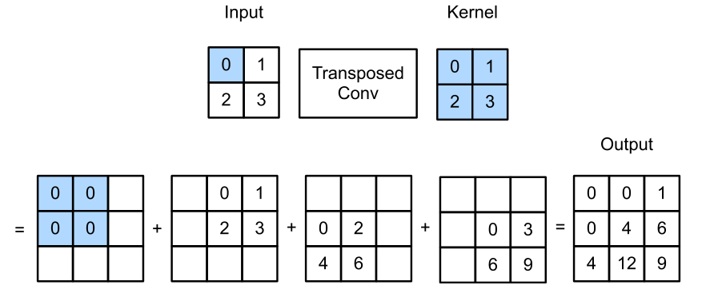
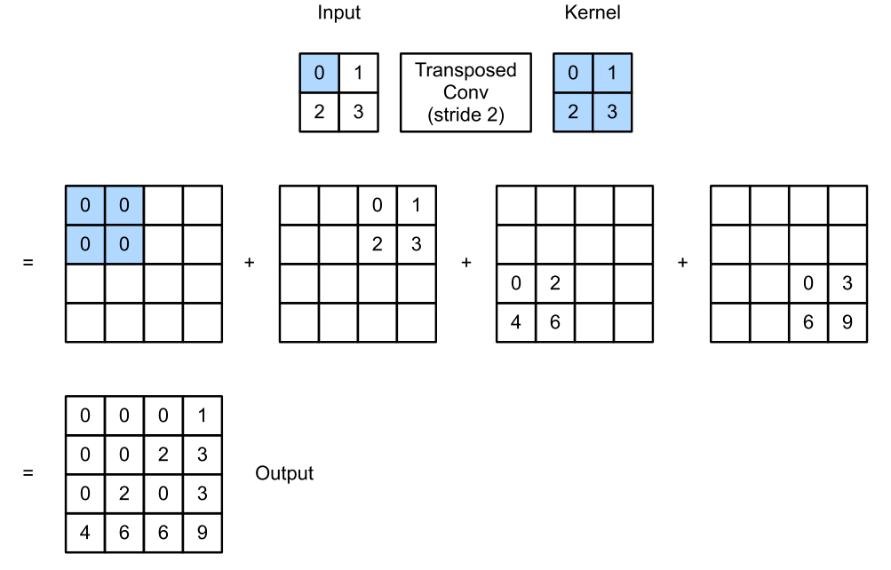
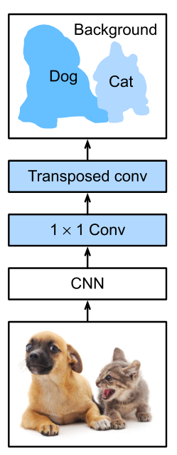

# 数据增广和微调

# 目标检测

# 语义分割

## 转置卷积

+ 卷积不会增大输入的高宽，通常要么不变、要么减半
+ 转置卷积则可以用来增大输入高宽



```python
X = torch.tensor([[0.0, 1.0], [2.0, 3.0]])
K = torch.tensor([[0.0, 1.0], [2.0, 3.0]])

X, K = X.reshape(1, 1, 2, 2), K.reshape(1, 1, 2, 2)

tconv = nn.ConvTranspose2d(1, 1, kernel_size=2, bias=False)
tconv.weight.data = K
tconv(X)
# tensor([[[[ 0.,  0.,  1.],
#           [ 0.,  4.,  6.],
#           [ 4., 12.,  9.]]]], grad_fn=<SlowConvTranspose2DBackward>)
```

与常规卷积不同，在转置卷积中，填充被应用于的输出（常规卷积将填充应用于输入）。例如，当将高和宽两侧的填充数指定为1时，转置卷积的输出中将删除第⼀和最后的行与列。

```python
tconv = nn.ConvTranspose2d(1, 1, kernel_size=2, padding=1, bias=False)
tconv.weight.data = K
tconv(X)
# tensor([[[[4.]]]], grad_fn=<SlowConvTranspose2DBackward>)
```




```python
X = torch.tensor([[0.0, 1.0], [2.0, 3.0]])
K = torch.tensor([[0.0, 1.0], [2.0, 3.0]])

X, K = X.reshape(1, 1, 2, 2), K.reshape(1, 1, 2, 2)

tconv = nn.ConvTranspose2d(1, 1, kernel_size=2, padding=1, bias=False)
tconv.weight.data = K
tconv(X)
# tensor([[[[0., 0., 0., 1.],
#           [0., 0., 2., 3.],
#           [0., 2., 0., 3.],
#           [4., 6., 6., 9.]]]], grad_fn=<SlowConvTranspose2DBackward>)
```

**为什么称之为转置？**

+ 对于卷积$Y=X\times W$
  + 可以对$W$构造一个$V$，使得卷积等价于矩阵乘法$Y^{'}= V X^{'}$
  + 这里$Y,X'$是$Y,X$对应的向量版本
+ 转置卷积则等价于$Y=V^TX'$
+ 如果卷积将输入从$(h,w)$变成了$(h', w')$
  + 同样超参数的转置卷积则从$(h',w')$变成$(h, w)$

## FCN

> 全连接神经网络

+ FCN是用深度神经网络来做语义分割的奠基性工作

+ 它用转詈卷来替换CNN最后的全连接层，从而可以实现每个像素的预测



# 样式迁移

协方差矩阵、格莱姆矩阵能获取一阶信息，直方图能获取高阶信息

