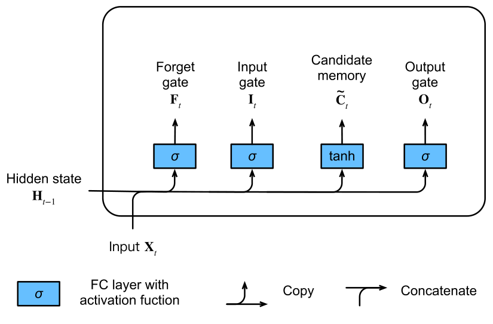

# 循环神经网路

到目前为止，我们遇到了两种类型的数据：表格数据和图像数据。对于后者我们设计出一种专门的网络模型来处理数据中的规律。上面的**这些数据基本上都来自于某种分布**，但是大多数数据并非如此。

比如文本数据，只有按照正确的顺序将其编排才能阅读通畅，否则很难理解其中的意思，所以我们要为这种类型的数据再专门设计一种模型来处理，那就是循环神经网络（recurrent neural network, RNN）这种设计可以更好地处理序列信息。循环神经网络通过**引入状态变量存储过去的信息和当前的输入，从而可以确定当前的输出**。

## 序列模型

在序列模型方式中，每一步都需要将前面的输出作为当前步的输入，是一种自回归（AutoRegressive）的方式。因此这一类模型也称为自回归生成模型（AutoRegressive Generative Model）

### 马尔可夫假设

原始的序列模型如下，当前的输出会与之前所有的数据相关：
$$
p(x) = p(x_1)\cdotp(x_2|x_1)\cdotp(x_3|x_1,x_2)\cdot...\cdot p(x_T|x_1,...,x_{T-1})
$$
而马尔可夫假设中，当前数据只与$\tau$个过去数据点相关，如下：
$$
p(x_t|x_1,...,x_{t-1}) = p(x_t|x_{t-\tau},...,x_{t-1}) = p(x_t|f(x_{t-\tau},...,x_{t-1}))
$$
而这就可以用线性回归或多层感知机（MLP）来实现了

### 潜变量模型

在这个模型中，它会额外使用一个变量来保留当前变量之前所有的数据，额外的这个变量称之为潜变量$h_t$，其中$h_t = f(x_1, ...,x_{t_1})$，这样$x_t=p(x_t|h_t)$。模型如下图所示


### 总结

+ 时序模型中，当前数据跟之前观察到的数据相关
+ 自回归模型**使用自身过去数据来预测未来**
+ 马尔科夫模型假设当前只跟最近少数数据相关，从而简化模型
+ 潜变量模型使用潜变量来概括历史信息

### 练习

首先引入依赖，并生成原始序列数据，这里使用的是正弦函数加上一点扰动

```python
import torch
from torch import nn
from d2l import torch as d2l

T = 1000
time = torch.arange(1, T+1, dtype=torch.float32)
x = torch.sin(0.01 * time) + torch.normal(0, 0.2, (T,))
d2l.plot(time, [x], 'time', 'x', xlim=[1, 1000], figsize=(6, 3))
```

然后再将其转换为训练数据，这里使用的是马尔可夫假设的序列模型

```python
tau = 4
# 训练样本一共 T - tau 个，在本例中就是996个，每个样本 tau 个数据
features = torch.zeros((T - tau, tau))
# 将原始正弦序列数据转移到训练样本中
for i in range(tau):
    features[:, i] = x[i: T - tau + i]
labels = x[tau:].reshape((-1, 1))

# 构成训练集
batch_size, n_train = 16, 600
train_iter = d2l.load_array((features[:n_train], labels[:n_train]), batch_size)
```

接着确定网络模型以及损失函数，网络使用**多层感知机模型**，其输入层为 tau 个数据，隐藏层使用10个神经元，因为是回归问题所以损失函数采用**均方误差**

```python
# 初始化⽹络权重的函数
def init_weights(m):
    if type(m) == nn.Linear:
    	nn.init.xavier_uniform_(m.weight)
    	
# ⼀个简单的多层感知机
def get_net():
    net = nn.Sequential(nn.Linear(4, 10), nn.ReLU(), nn.Linear(10, 1))
    net.apply(init_weights)
    return net
	
# 平⽅损失
loss = nn.MSELoss()
```

然后就开始训练5个epoch

```python
def train(net, train_iter, loss, epochs, lr):
    trainer = torch.optim.Adam(net.parameters(), lr)
    for epoch in range(epochs):
        for X, y in train_iter:
            trainer.zero_grad()
            l = loss(net(X), y)
            l.backward()
            trainer.step()
        print(f'epoch {epoch + 1}, 
              'f'loss: {d2l.evaluate_loss(net, train_iter, loss):f}')
        
net = get_net()
train(net, train_iter, loss, 5, 0.01)
```

## 语言模型

### 文本预处理

常见的文本预处理操作步骤如下：

1、将文本作为字符串加载到内存中

一个简单暴力的操作就是将所有除英文字母的标点符号等全部变为空格，如下
`re.sub('[^A-Za-z]+', ' ', str)`

2、将字符串拆分为词元（如单词和字符）

```python
def tokenize(lines, token='word'):
    """将⽂本⾏拆分为单词或字符词元。"""
    if token == 'word':
    	return [line.split() for line in lines]
    elif token == 'char':
    	return [list(line) for line in lines]
    else:
    	print('错误：未知令牌类型：' + token)
```

3、建立⼀个词汇表，将拆分的词元映射到从0开始的数字索引中

词元的类型是字符串，而==模型需要的输入是数字==，因此这种类型不方便模型使用。现在，让我们构建一个字典，通常也叫做词汇表（vocabulary），用来将字符串类型的词元映射到从0开始的数字索引中。

先将训练集中的所有文档合并在一起，对它们的唯一词元进行统计，得到的统计结果称之为==语料==（corpus）。然后根据每个唯一词元的岀现频率，为其分配一个数宇索引。

下面的函数可以==统计数组中各个单词出现的次数==，并以字典的格式返回

```python
def count_corpus(tokens):
    """统计词元的频率。"""
    # 这⾥的 `tokens` 是 1D 列表或 2D 列表
    if len(tokens) == 0 or isinstance(tokens[0], list):
        # 将词元列表展平成使⽤词元填充的⼀个列表
        tokens = [token for line in tokens for token in line]
    return collections.Counter(tokens)
```

很少岀现的词元通常被移除，这可以降低复杂性。另外，语料库中不存在或已删除的任何词元都将映射到一个特定的未知词元“\<unk>”。我们可以选择增加个列表，用于保存那些被保留的词元，例如：填充词元（“\<pad>”）；序列开始词元（“\<bos>”）；序列结束词元（“\<eos>”）。

4、将文本转换为数字索引序列，方便模型操作

### 模型

#### 计数建模

1、假设序列长度为2，也就是2个单词连续出现，我们预测
$$
p(x,x')=p(x)p(x'|x)=\frac{n(x)}{n} \frac{n(x,x')}{n(x)}
$$
n指总词数，$n(x),n(x,x')$是单个单词和2个连续单词出现的次数

2、拓展到序列长度为3的情况
$$
p(x,x',x'')=p(x)p(x'|x)p(x''|x,x')=\frac{n(x)}{n} \frac{n(x,x')}{n(x)} \frac{n(x,x',x'')}{n(x,x')}
$$

#### n元语法

当序列很长时，文本量又不够大，怎可能发生$n(x_1,...,x_T)\le1$的情况，这就可以使用马尔科夫假设来缓解这个问题

1、一元语法
$$
p(x_1, x_2, x_3, x_4) = p(x_1)p(x_2)p(x_3)p(x_4) \\
= \frac{n(x_1)}{n} \frac{n(x_2)}{n} \frac{n(x_3)}{n} \frac{n(x_4)}{n}
$$

```python
tokens = d2l.tokenize(d2l.read_time_machine())
# 因为每个⽂本⾏不⼀定是⼀个句⼦或⼀个段落，因此我们把所有⽂本⾏拼接到⼀起
# 下面的代码不仅可以合并，还可以将所有的**空行**给去掉
corpus = [token for line in tokens for token in line]
vocab = d2l.Vocab(corpus)
vocab.token_freqs[:10]

# 输出如下
[('the', 2261),
('i', 1267),
('and', 1245),
('of', 1155),
('a', 816),
('to', 695),
('was', 552),
('in', 541),
('that', 443),
('my', 440)]
```

正如我们所看到的，事实上最流行的词看起来很无聊。这些词通常被称为==停用词（stop words）==，因此**可以被过滤**掉。尽管如此，它们本身仍然是有意义的，我们仍然会在模型中使用它们。此外，还有个明显的问题是词频衰减的速度相当地快。

```python
freqs = [freq for token, freq in vocab.token_freqs]
d2l.plot(freqs, xlabel='token: x', ylabel='frequency: n(x)',
         xscale='log', yscale='log')
```


2、二元语法
$$
p(x_1, x_2, x_3, x_4) = p(x_1)p(x_2|x_1)p(x_3|x_2)p(x_4|x_3) \\
= \frac{n(x_1)}{n} \frac{n(x_1,x_2)}{n(x_1)} \frac{n(x_2|x_3)}{n(x_2)} \frac{n(x_3,x_4)}{n(x_3)}
$$

```python
bigram_tokens = [pair for pair in zip(corpus[:-1], corpus[1:])]
bigram_vocab = d2l.Vocab(bigram_tokens)
bigram_vocab.token_freqs[:10]
```

稍微解释以下为什么这是二元语法，关键就是要知道`corpus`代表的是按文章顺序的整篇文章的单词，要想获取文章的所有相邻的2个单词，只要`[:-1]`和`[1:]`交错拼接一下就行

3、三元语法
$$
xp(x_1, x_2, x_3, x_4) = p(x_1)p(x_2|x_1)p(x_3|x_1,x_2)p(x_4|x_2,x_3)
$$

```python
trigram_tokens = \
	[triple for triple in zip(corpus[:-2], corpus[1:-1], corpus[2:])]
trigram_vocab = d2l.Vocab(trigram_tokens)
trigram_vocab.token_freqs[:10]
```


将他们绘制在同一个坐标系后能发现==词频以⼀种明确的方式迅速衰减==。将前几个单词作为例外消除后，剩余的所有单词大致**遵循双对数坐标图上的一条直线**。这意味着单词的频率满足齐普夫定律，如下：
$$
log\ n_i=-\alpha\ log\ i+c
$$

### 读取批量数据

和图片分类类似，每次训练迭代时都要选择一个小批量一起训练，但是序列模型和图片分类又不一样，图片分类只要从第一张图片开始，并往后选择批量大小的图片数据就行。

但序列模型不行，以文本为例，一般数个单词组成一句话，如果每次选择批量时都从第一数据开始，那么句子总是从某一个固定的地方断开，随机性是否差，不利于最终的训练结果，下面的算法不仅能解决数据的**随机性**还能解决数据**覆盖性**的问题。

#### 随机采样

随机采样在保证序列分割的随机性外，还保证了每个批量之间的随机性，也就是相邻批量的序列也不一定在原始序列上相邻

```python
def seq_data_iter_random(corpus, batch_size, num_steps):
    """使⽤随机抽样⽣成⼀个⼩批量⼦序列。"""
    # 从随机偏移量开始对序列进⾏分区，随机范围包括`num_steps - 1`
    corpus = corpus[random.randint(0, num_steps - 1):]
    # 减去1，是因为我们需要考虑标签
    num_subseqs = (len(corpus) - 1) // num_steps
    # ⻓度为`num_steps`的⼦序列的起始索引
    initial_indices = list(range(0, num_subseqs * num_steps, num_steps))
    # 在随机抽样的迭代过程中，
    # 来⾃两个相邻的、随机的、⼩批量中的⼦序列不⼀定在原始序列上相邻
    random.shuffle(initial_indices)

    def data(pos):
        # 返回从`pos`位置开始的⻓度为`num_steps`的序列
        return corpus[pos:pos + num_steps]

    num_batches = num_subseqs // batch_size
    for i in range(0, batch_size * num_batches, batch_size):
        # 在这⾥，`initial_indices`包含⼦序列的随机起始索引
        initial_indices_per_batch = initial_indices[i:i + batch_size]
        X = [data(j) for j in initial_indices_per_batch]
        Y = [data(j + 1) for j in initial_indices_per_batch]
        yield torch.tensor(X), torch.tensor(Y)
```

**输入参数：**

corpus：文本索引化后的数字数组

batch_size：批量大小

num_steps：每个批量的数据个数

1. 为保证序列分割的随机性，随机对原始序列进行偏移，在此基础上再生成批量
2. 根据num_steps计算子序列数量，因为最后一个数字要作为标签，所以要减一

#### 顺序分区

与随机采样不同之处在于，每个批量之间的序列是连续的

```python
def seq_data_iter_sequential(corpus, batch_size, num_steps):
    """使⽤顺序分区⽣成⼀个⼩批量⼦序列。"""
    # 从随机偏移量开始划分序列
    offset = random.randint(0, num_steps)
    num_tokens = ((len(corpus) - offset - 1) // batch_size) * batch_size
    Xs = torch.tensor(corpus[offset:offset + num_tokens])
    Ys = torch.tensor(corpus[offset + 1:offset + 1 + num_tokens])
    Xs, Ys = Xs.reshape(batch_size, -1), Ys.reshape(batch_size, -1)
    num_batches = Xs.shape[1] // num_steps
    for i in range(0, num_steps * num_batches, num_steps):
        X = Xs[:, i:i + num_steps]
        Y = Ys[:, i:i + num_steps]
        yield X, Y
```

### 小结

+ 语言模型就是估计一个文本序列出现的联合概率
+ 统计时最常用的是n元语法

## 循环神经网络

下来来了解第一个对于序列模型的神经网络——循环神经网络。在此之前先回忆一下开始的潜变量模型。这个模型简单来说就是当前 $x_t$ 的状态由当前隐藏状态 $h_t$ 和上一个状态 $x_{t-1}$ 相关


下面的就是循环神经网络，$o_t$ 代表当前的**输出，而它的值由当前的隐变量 $h_t$ 决定**，而隐变量由上一个隐变量 $h_{t-1}$ 和上一个的输入 $x_{t-1}$ 决定，如下图所示。


下面用公式来表达：

+ 隐变量状态：$h_t = \phi(W_{hh}h_{t-1} + W_{hx}x_{t-1} + b_h)$
  + $W_{hh}$ 代表隐藏层之间的权重，$h_{t-1}$ 表示上一个隐藏变量，**如果将这个隐藏层去掉，模型就退化成了 MLP**
  + $W_{hx}$ 代表隐藏层与输入层之间的权重，$x_{t-1}$ 代表上一个输入变量
  + $b_h$ 代表当前层偏置
+ 输出：$o_t = \phi(W_{ho}h_t + _o)$

> hidden variables：现实中存在但是没有观察到的变量
>
> latent variables：现实中不能存在，人们赋予的变量，如 label 标签

### 困惑度(perplexity)

衡量一个语言模型的好坏可以用平均交叉熵
$$
\pi=\frac{1}{n} \sum_{i=1}^{n}-\log  p\left(x_{t} \mid x_{t-1}, \ldots\right)
$$
$p$ 代表语言模型的预测概率，$x_t$ 为真实词。大体过程就是先计算交叉熵损失，然后累和求平均

> 历史原因 NLP 使用困惑度 $exp(\pi)$ 来衡量模型好坏（因为可以拉大数值，即使模型有了一点小改进，exp 也会将这个数值放大，写在论文中更好看），通过平均每次可能选项。
>
> 困惑度为 1 代表完美，无穷大代表最差情况。为 1 代表我确信只有这一个输出，所以完美，而无穷则表示，我根本不确定我有多少个输出。

### 梯度剪裁 ★

迭代中计算这 $T$ 个时间步上的梯度，在反向传播过程中产生长度为 $O(T)$ 的矩阵乘法链，导致数值不稳定.

而梯度裁剪能有效预防梯度爆炸，如下：
$$
g \leftarrow min(1, \frac{\theta}{||g||}) g
$$
其中 $g$ 代表网络中的整个梯度向量。那这个梯度裁剪是如何运作的呢？首先 $\theta$ 一般会设置成 5 或 10，现假设 $\theta = 5$

+ 若 $g \le 5$ ，也就是梯度较小的时候：那么 $\frac{\theta}{||g||}$ 的值会大于 1，则 $min(1, \frac{\theta}{||g||}) = 1$， 该公式不会对梯度产生任何影响
+ 若 $g > 5$，也就是梯度有点大了，那么 $min(1, \frac{\theta}{||g||}) g$  的值会等于 $\theta$ 也即是将梯度拖到了 $\theta$
+ 通过以上操作就可以有效的避免梯度爆炸

### RNN 应用


+ 一对多：文本生成
+ 多对一：文本分类
+ 多对多：问答、机器翻译 以及 tag 生成

### 小结

+ 循环神经网络的输出取决于当下输入和前一时间的隐变量
+ 应用到语言模型中时，循环神经网络根据当前词预测下一次时刻词
+ 通常使用困惑度来衡量语言模型的好坏

### 实现

1、读取数据集

```python
batch_size, num_steps = 32, 35  # 批量数，读入的单词长度
train_iter, vocab = d2l.load_data_time_machine(batch_size, num_steps)
```

2、初始化参数

很清楚的能知道模型有三个尺寸

1. 输入向量大小：因为要使用 one-hot 编码确定输入的什么，所有输入向量长度为 vocab_size
2. 隐藏层大小：自己决定
3. 输出向量大小：和输入向量大小一样

```python
def get_params(vocab_size, num_hiddens, device):
    num_inputs = num_outputs = vocab_size
    def normal(shape):
        return torch.randn(size=shape, device=device) * 0.01
    W_xh = normal((num_inputs, num_hiddens))
    W_hh = normal((num_hiddens, num_hiddens))
    b_h = torch.zeros(num_hiddens, device=device)
    W_hq = normal((num_hiddens, num_outputs))
    b_q = torch.zeros(num_outputs, device=device)
    params = [W_xh, W_hh, b_h, W_hq, b_q]
    for param in params:
        param.requires_grad_(True)
    return params
   
def init_rnn_state(batch_size, num_hiddens, device):
    return (torch.zeros((batch_size, num_hiddens), device=device),)
```

3、前向传播

先了解一下需要的参数，首先要知道网络的隐藏状态以及各层的参数这个由 state 和 params 就可以指出了。最主要的就是输入，输入的向量形状为 (num_vocab, batch_size, total_vocab_size)

```python
def rnn(inputs, state, params):
    W_xh, W_hh, b_h, W_hq, b_q = params
    H, = state
    outputs = []
    for X in inputs:
        H = torch.tanh(torch.mm(X, W_xh) + torch.mm(H, W_hh) + b_h)
        Y = torch.mm(H, W_hq) + b_q
        outputs.append(Y)
    return torch.cat(outputs, dim=0), (H,)
```

4、定义模型

在前面的第2点，我们分析了三种数据的尺寸，所以这里我们主要输入 vocab_size 和 num_hiddens 的大小就能决定网络的结构。其他的网络参数、初始状态以及前向传播的计算上面已经给出

```python
class RNNModelScratch:
    def __init__(self, vocab_size, num_hiddens, device, get_params, init_state, forward_fn):
        self.vocab_size, self.num_hiddens = vocab_size, num_hiddens
        self.params = get_params(vocab_size, num_hiddens, device)
        self.init_state, self.forward_fn = init_state, forward_fn
    
    def __call__(self, X, state):
        X = F.one_hot(X.T, self.vocab_size).type(torch.float32)
        return self.forward_fn(X, state, self.params)
    
    def begin_state(self, batch_size, device):
        return self.init_state(batch_size, self.num_hiddens, device)
```

5、测试输出形状

```python
# 1、输入，假设2个批量，每个批量5个字母
X = torch.arange(10).reshape(2, 5)

# 2、测试输出
num_hiddens = 512
net = RNNModelScratch(
    len(vocab), num_hiddens, d2l.try_gpu(), get_params, init_rnn_state, rnn)
state = net.begin_state(X.shape[0], d2l.try_gpu())
Y, new_state = net(X.to(d2l.try_gpu()), state)

# 3、查看结果
Y.shape, len(new_state), new_state[0].shape
# (torch.Size([10, 28]), 1, torch.Size([2, 512]))
```

根据RNN的原理，我们每投入一个字母，也就是一个 one-hot 网络都要预测并输出下一个单词的 one-hot 编码。

因为总共有 2*5 个字母，所以网络也要输出 10 个预测的字母，因此网络的输出形状相符

6、预测函数

```python
def predict_ch8(prefix, num_preds, net, vocab, device):
    """在`prefix`后⾯⽣成新字符。"""
    state = net.begin_state(batch_size=1, device=device)
    outputs = [vocab[prefix[0]]]
    get_input = lambda: torch.tensor([outputs[-1]], device=device).reshape((1, 1))
    # 1、使用 prefix 也就是已知的字符串初始化 RNN 网络
    for y in prefix[1:]:
        # 预热期
        _, state = net(get_input(), state)
        outputs.append(vocab[y])
	# 2、开始预测 num_preds 步
    for _ in range(num_preds):
        # 预测`num_preds`步
        y, state = net(get_input(), state)
        outputs.append(int(y.argmax(dim=1).reshape(1)))
    return ''.join([vocab.idx_to_token[i] for i in outputs])
```

7、梯度裁剪

```python
def grad_clipping(net, theta):
    """裁剪梯度。"""
    if isinstance(net, nn.Module):
        params = [p for p in net.parameters() if p.requires_grad]
    else:
        params = net.params
    norm = torch.sqrt(sum(torch.sum((p.grad**2)) for p in params))
    if norm > theta:
        for param in params:
        	param.grad[:] *= theta / norm
```

8、训练


# 现代循环神经网络

## 门控循环单元

在前面计算循环神经网络的梯度时，我知道当梯度链过长时可能会导致梯度爆炸，现在来进一步讨论这些异常状况的意义。

+ **早期预测的值**对未来预测值有非常**非常重要**的意义，因此我们希望它能有一个较大的梯度，能及时进行更新，因为它的值比其他的值更为重要
+ **一些值**对预测的结果没有帮助，我们**希望能跳过**它
+ 序列之间没有逻辑关系，我们希望有一总方法能快速的过渡，这时最好的解决办法就是对内部状态**进行重置**

为了能达到上面三种要求，学术界已经提出了很多方法来解决这个问题，最早的办法是长短期记忆网络 （long-short-term memory, LSMT） ，但是它相对复杂，所以后面再介绍。

而现在要了解的是门控循环单元 （gated recurrent unit, GRU），它是 LSTM 的简化变体，计算速度更快，而且更简单，所以下面先介绍这个。

### 门控隐藏状态

门控循环单元（GRU）与普通循环网络的最大差别，就是 GRU 能对隐藏状态进行控制（门控），基于这种机制 GRU 就能知道何时更新隐藏状态，何时重置隐藏状态，这样就能轻松解决上面所说的三个问题。

1、重置门和更新门

重置门（reset gate）和更新门（update gate）是 $(0,1)$ 区间中的向量（因为使用sigmoid，所以在0~1之间）

+ 重置门：控制可能还想记住的过去状态的数量
+ 更新门：允许我们控制新状态中有多少个是旧状态的副本


$$
\begin{aligned}
&\mathbf{R}_{t}=\sigma\left(\mathbf{X}_{t} \mathbf{W}_{x r}+\mathbf{H}_{t-1} \mathbf{W}_{h r}+\mathbf{b}_{r}\right) \\
&\mathbf{Z}_{t}=\sigma\left(\mathbf{X}_{t} \mathbf{W}_{x z}+\mathbf{H}_{t-1} \mathbf{W}_{h z}+\mathbf{b}_{z}\right)
\end{aligned}
$$
首先了解一下这两个门所输出的东西，它们会输出长度为 hidden_size 的向量，因为经过sigmoid处理，所以其中的值都在 0~1 之间，因此这样就可以控制相应隐藏状态的值是否参与计算（很容易联想到通过按元素相乘来实现）。

2、候选隐藏状态

正常计算当前隐藏状态时我们需要上一步的隐藏状态和当前的输入，如下
$$
\tilde{\mathbf{H}}_{t}=\tanh \left(\mathbf{X}_{t} \mathbf{W}_{x h}+ \mathbf{H}_{t-1} \mathbf{W}_{h h}+\mathbf{b}_{h}\right),
$$
而为了对隐藏状态进行控制，所以我们要在这个过程中引入重置门所输出的向量。
$$
\tilde{\mathbf{H}}_{t}=\tanh \left(\mathbf{X}_{t} \mathbf{W}_{x h}+\left(\mathbf{R}_{t} \odot \mathbf{H}_{t-1}\right) \mathbf{W}_{h h}+\mathbf{b}_{h}\right),
$$
其中 $\odot$ 代表按元素相乘，因此如果某一个位置的值为 0，那么这个位置的隐藏状态就不参与计算，更详细的讨论如下。

+ 若某位置 $R=1$，则该位置上一步的隐藏状态参与计算，就相当于普通的 RNN 的输出结果
+ 若某位置 $R=0$，则该位置上一步的隐藏状态不参与计算，就相当于 MLP 的输出结果

最后我们使用 $tanh$ 非线性激活函数将输出限制在 $(-1,1)$ 中，整个过程如下图所示。


那为什么称之为候选隐藏状态呢，因为后面我们要继续结合更新门来确定最终输出的隐藏状态

3、隐藏状态

更新门要能实现最后输出的隐藏状态 $H_{t}$ 需要使用多少的旧状态 $H_{t-1}$ 和多少的候选新状态 $\tilde{H}_{t}$ ，通过如下公式就能轻松控制
$$
\mathbf{H}_{t}=\mathbf{Z}_{t} \odot \mathbf{H}_{t-1}+\left(1-\mathbf{Z}_{t}\right) \odot \tilde{\mathbf{H}}_{t}
$$

+ 若某一位置 $Z=0$，则该位置的最终输出 $H_t$ 全部由候选隐藏状态 $\tilde{H}_t$ 构成
+ 若某一位置 $Z=1$，则该位置的最终输出 $H_t$ 全部由旧隐藏状态 $H_{t-1}$ 构成

这样就能轻松处理梯度消失的问题，比如当 Z=1，就算序列超级的长，它的隐藏状态还是由最开始的旧状态决定。

整个过程如下所示


4、小结

+ 重置门有助于捕获序列中的短期依赖关系。
+ 更新门有助于捕获序列中的长期依赖关系。

## 长短期记忆网络

LSTM 相对于 GRU 复杂一点，却比 GRU 早诞生了20年

### 门控记忆单元

LSTM 的灵感来源于计算机的逻辑门，它通过引入的**存储单元**实现对隐藏状态的控制。有文献认为存储单元是隐藏状态的一种特殊类型，**与隐藏状态有着相同的形状**，就是**用来记录附加的信息**。

为了控制存储单元，我们需要许多的门：

+ 输出门(output gate)：从单元中读取条目
+ 输入门(input gate)：用来决定何时将数据读入单元
+ 遗忘门(forget gate)：重置单元的内容

1、输出门、输入门、遗忘门


和 GRU 类似，这三个门都是全连接层经过一个 sigmoid 函数，计算方法如下：
$$
\begin{aligned}
\mathbf{I}_{t} &=\sigma\left(\mathbf{X}_{t} \mathbf{W}_{x i}+\mathbf{H}_{t-1} \mathbf{W}_{h i}+\mathbf{b}_{i}\right) \\
\mathbf{F}_{t} &=\sigma\left(\mathbf{X}_{t} \mathbf{W}_{x f}+\mathbf{H}_{t-1} \mathbf{W}_{h f}+\mathbf{b}_{f}\right) \\
\mathbf{O}_{t} &=\sigma\left(\mathbf{X}_{t} \mathbf{W}_{x o}+\mathbf{H}_{t-1} \mathbf{W}_{h o}+\mathbf{b}_{o}\right)
\end{aligned}
$$
2、候选记忆单元

这个候选记忆单元和上面的三个门类似，但是使用的是 $tanh$ 激活函数



计算公式如下
$$
\tilde{\mathbf{C}}_{t}=\tanh \left(\mathbf{X}_{t} \mathbf{W}_{x c}+\mathbf{H}_{t-1} \mathbf{W}_{h c}+\mathbf{b}_{c}\right)
$$
3、记忆单元

和 GRU 类似我们需要一种机制控制最终的输出有多少来自新数据，多少来自旧数据。在 LSTM 中，这是由遗忘门和输入门控制的

+ 输入门 $I_t$ 决定有多少来自新数据 $\tilde{C}_t$ 
+ 遗忘门 $F_t$ 决定有多少来自旧数据 $C_{t-1}$ 也就是旧的记忆单元中的数据

$$
\mathbf{C}_{t}=\mathbf{F}_{t} \odot \mathbf{C}_{t-1}+\mathbf{I}_{t} \odot \tilde{\mathbf{C}}_{t}
$$

流程如下图


4、隐藏状态

最后我们要输入最终的隐藏状态，前面说到 LSTM 是通过记忆单元来实现对隐藏状态控制，如下
$$
\mathbf{H}_{t}=\mathbf{O}_{t} \odot \tanh \left(\mathbf{C}_{t}\right)
$$
但是在这里起门控作用的不是记忆单元 $C_t$ ，而是输出门 $O_t$

+ 若 $O=0$，则所有的数据都不要了，相当于重置
+ 若 $O=1$，则保留所有的数据

## 深度循环神经网络

我们通过将多层循环神经网络堆叠在一起，就构成了一个深度的循环神经网络，通过几个简单层的组合，就产生了一个灵活的机制，数据保持的时间可能与层的堆叠相关。比如高层数据能记录长期的时间动态，而底层数据只能记录短期的时间动态。

## 双向循环神经网络

目前为止 RNN 的预测它只看过去，而有些场景，比如填空，它不仅要考虑过去，还要考虑未来的上下文。

双向循环神经网络由两个方向不同的 RNN 的隐藏层合并构成的


+ 双向循环神经网络通过反向更新的隐藏层

+ 来利用方向时间信息通常用来对序列抽取特征、填空，而不是预测未来

## 机器翻译与数据集

## 编码器-解码器

**结构**


+ 编码器
  + 接受一个长度可变的序列作为输入，并将其转换为具有固定形状的编码状态。

+ 解码器
  + 将固定形状的编码状态映射到长度可变的序列。

以上这被称为编码器-解码器

## seq2seq

机器翻译中输入序列和输出序列长度都是可变，为此可以来设计“编码器-解码器”的结构解决这个问题

+ 编码器是个 RNN，用来读取输入的句子，这个 RNN 可以是双向的
+ 解码器是另外一个 RNN

###  衡量预测的好坏

先来了解一下 n-gram 的概念，就是 n 个长度的预测序列在原句中出现的次数

+ 假设标签序列 A B C D E F，预测序列为 A B B C D，$p_i$ 代表相应的 i-gram 精度
  + 对于 1-gram，总共有5个单序列， A B 都能匹配上，第二个 B 由于上一个匹配过了，所以不算，C D 匹配上了，因此 $p_1=\frac{4}{5}$
  + 对于 2-gram，总共有4个两序列，AB +1，BB+0，BC+1，CD+1，所以 $p_2=\frac{3}{4}$
  + 对于 3-gram，总共有3个三序列，ABB+0，BBC+0，BCD+1，所以 $p_3=\frac{1}{3}$
  + 剩下没有匹配上的，所以 $p_4=0$

----

而用来评判生成序列好坏的标准是 BLEU，其值越大越高，最大值为1，定义如下：
$$
exp(min(0, 1-\frac{len_{label}}{len_{pred}})) \prod_{n=1}^k p_n^{\frac{1}{2^n}}
$$

+ 如果 $len_{pred} << len_{label}$ 的话，也就是预测序列过短，$1-\frac{len_{label}}{len_{pred}} < 0$，这样就可以**对预测过短的序列进行惩戒**
+ 再看右侧的值
  + 如果 n 越长，那么 $2^n$ 就越大，$\frac{1}{2^n}$ 就越小
  + 而因为 $p_n$ 是小于 1 的数
  + 所以 n 越大，整体值就会越大
  + 因此**越长的匹配就有越高的权重**

### 小结

+ Seq2seq从一个句子生成另一个句子
+ 编码器和解码器都是RNN
+ 将编码器最后时间隐状态来初始解码器隐状态来完成信息传递
+ 常用BLEU来衡量生成序列的好坏

### 实现

#### 组件

1、`nn.Embedding(vocab_size, embed_size)`

+ vocab_size：代表整个词典的大小
+ embed_size：想要用多长的向量表示一个序列

它的作用主要是将一个标记转化为一个长度为 embed_size 的特征向量，这个标记必须是 LongTensor 类型，而且这个标记的值必须在 [0, vocab_size] 之间。

nn.Embedding 对于任何形状的输入，都会在最后一个维度添加一个长度为 embed_size 的向量，如下

```
embed = nn.Embedding(vocab_size, embed_size)

x = torch.ones(1, 2, 3)
embed(x).shape # (1, 2, 3, embed_size)

x = torch.ones(batch_size, seq_len)
embed(x).shape # (batch_size, seq_len, embed_size)
```

2、我们都知道有三种不同结构的循环神经网络，第一个就是最普通 RNN，后面两个分别是 LSTM 和 GRU，它们和 RNN 最大的不同就是对隐藏状态进行门控选择，而它们内部具体实现不同，但是功能有些类似，所以pytorch为我们封装的这些模块构造参数都非常接近。

`nn.GRU(in_dim, num_hiddens, num_layers, dropout=dropout)`

`nn.RNN(in_dim, num_hiddens, num_layers)`

+ in_dim：输入元素长度
+ num_hiddens：隐藏层元素数
+ num_layers：隐藏层个数
+ dropout：dropout 概率

此外这三个模块都严格要求我们输入三个维度的向量$(L, N, H_{in})$，其中

+ $L$：序列长度
+ $N$：批量大小
+ $H_{in}$：输入元素数
+ $H_{out}$：输出元素，与 num_hiddens 大小一致


#### 编码器


