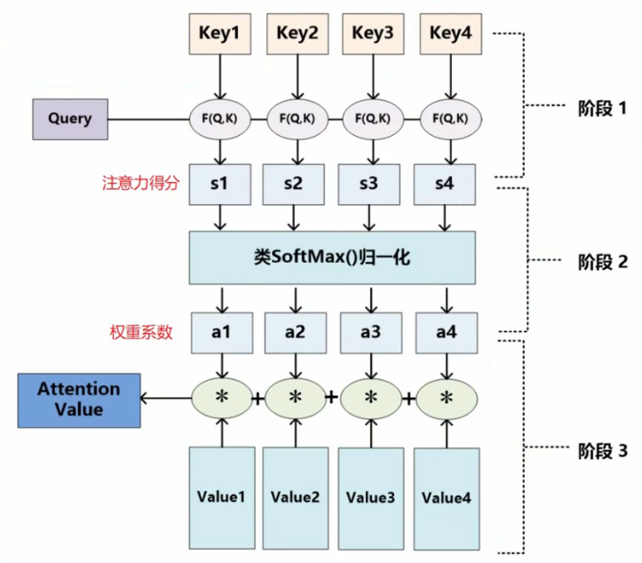

# 注意力机制

## 快速了解

### 本质思想

可以把 Attention 理解为**从大量信息中**，**有选择**的**筛选**出少量的**重要信息**并**聚焦**到这些重要信息上面，忽略掉大多数不重要的信息。

+ 在模型上就可以体现为权重系数，权重越大越聚焦于相应的 value 上，即权重代表信息的重要性，value 代表对应的信息。
+ 从相似度、相关性角度理解：attention 就是将特征和目标进行相似度匹配

### 计算过程

1、根据 Query 和 key 计算两者的相似性或相关性

拿机器翻译来说，我们需要翻译“tom chase marry”这一句话，首先我们翻译“Tom”，这时 Query 就是“tom”，这句话的所有单词就是相应的“key”。那么这第一步的意义就是计算 tom 和这句话中所有单词的相关性。比如有以下方法：

+ 向量点积： $Similarity\left(Q u e r y, K e y_{i}\right)=Q u e r y \cdot K e y_{i}$
+ cosine 相似性：就是余弦相似度，$Similarity(Query,Key_i)=\frac{Query \cdot Key_i}{||Query|| \cdot ||Key_i||} $
+ 引入额外的神经网络：$Similarity(Query, Key_i)=MLP(Query,Key_i)$

甚至还可以将以上方法合并起来计算相似度

2、对第一步计算的原始分值进行归一化（softmax）处理，得到权重系数

3、计算注意力得分

比如对所有的 value 乘上相应的权重系数，然后在进行累和
$$
Attention(Query, Source) = \sum^{L_x}_{i=1} a_i \cdot Value_i
$$

## 注意力提示

有两种不同的注意力提示分别是**非自主性提示**和**自主性提示**

+ 非自主性提示：注意力会不由自主的转向一个方面
+ 自主性提示：注意力根据自己的主观意愿转向一个方面

这两种提示解释了注意力的方式，下面将设计一种能合并这两个注意力提示的注意力机制

我们通过设计注意力汇聚，对给定的查询（自主性提示）与键（非自主性提示）进行交互，这将引导选择偏向于某个值。简单来说就是设计一种方法让网络更加聚焦于某个值。

## 注意力汇聚

查询（自主提示）和键（非自主提示）之间的交互形成了注意力汇聚（attention pooling）。注意力汇聚有选择地聚合了值（感官输入）以生成最终的输出。

1、平均汇聚

通过平均汇聚计算所有训练样本输出值的平均值
$$
f(x)=\frac{1}{n} \sum^n_{i=1} y_i
$$
这样最终的输出值都是一样的，所以平均汇聚是“最愚蠢”的估计器，我们会在其上慢慢改进

2、非参数注意力汇聚

平均汇聚忽略了输入 $x_i$，因此 Nadaraya 和 Waston 提出了一个更好的想法，**根据输入对相应的输出位置进行加权**，其中下述公式的 $K$ 是核，所以公式也可以被称为 Nadaraya-Waston 核回归。
$$
f(x)=\sum_{i=1}^{n} \frac{K\left(x-x_{i}\right)}{\sum_{j=1}^{n} K\left(x-x_{j}\right)} y_{i}
$$
上述公式中 $x$ 表示查询值，$(x_i, y_i)$ 是键值对，通过将查询 $x$ 和键 $x_i$ 之间的关系建模为注意力权重 $\alpha(x, x_i)$。因此上面公式的分母是根据 $K$ 计算所有的注意力权重分量，然后进行累和，分子是某一个权重分量，那么可知这整个分数是一个非负数，并且总和为 1.

为了更好的理解注意力汇聚，仅考虑一个高斯核，定义为：
$$
K(u)=\frac{1}{\sqrt{2 \pi}} \exp \left(-\frac{u^{2}}{2}\right)
$$
将其代入到核回归公式
$$
\begin{aligned}
f(x) &=\sum_{i=1}^{n} \alpha\left(x, x_{i}\right) y_{i} \\
&=\sum_{i=1}^{n} \frac{\exp \left(-\frac{1}{2}\left(x-x_{i}\right)^{2}\right)}{\sum_{j=1}^{n} \exp \left(-\frac{1}{2}\left(x-x_{j}\right)^{2}\right)} y_{i} \\
&=\sum_{i=1}^{n} \operatorname{softmax}\left(-\frac{1}{2}\left(x-x_{i}\right)^{2}\right) y_{i}
\end{aligned}
$$
如果⼀个键 $x_i$ 越是接近给定的查询 $x$, 那么分配给这个键对应值 $y_i$ 的注意力权重就会越大, 也就是“获得了更多的注意力”。

现在结合之前“快速了解“所说的第2步，注意力汇聚就是先通过 $\alpha$ 函数计算 Query 和 Key 的相关性，然后使用 softmax 进行归一化，将相应的权重赋给相应的 value，以此来计算最终的注意力得分。

3、带参数注意力汇聚

与非参数注意力汇聚不同的地方就是多学习一个 $w$ 参数
$$
\begin{aligned}
f(x) &=\sum_{i=1}^{n} \alpha\left(x, x_{i}\right) y_{i} \\
&=\sum_{i=1}^{n} \frac{\exp \left(-\frac{1}{2}\left((x-x_{i})w\right)^{2}\right)}{\sum_{j=1}^{n} \exp \left(-\frac{1}{2}\left((x-x_{j})w\right)^{2}\right)} y_{i} \\
&=\sum_{i=1}^{n} \operatorname{softmax}\left(-\frac{1}{2}\left((x-x_{i})w\right)^{2}\right) y_{i}
\end{aligned}
$$
与非参数的注意力汇聚模型相比，带参数的模型加入可学习的参数后，在输出可视化的结果图上，曲线在注意力权重较大的区域变得更不平滑。

## 打分函数

第一节所说判断 Query 和 Key 相似度的方法在这里我们称之为 “打分函数”。并且之前还介绍了三个不同判断 Query 和 Key 相似性的方法，在这里来更加详细的介绍。

> 在此之前先了解一个屏蔽 softmax 操作的概念。上一步所说的计算 Query 和 Key 相关性的过程会产生与 Key 数量相同的向量，但是有时为了方便处理数据我们会为 Key 多添加几个数据标记，而这些附加的数据是不需要通过注意力汇聚的，所以在计算时我们需要通过 mask 将这些数据屏蔽。

### 加性注意力

当 Query 和 Key 是**不同长度**的矢量时，可以使用加性注意力作为打分函数，如下。
$$
\alpha = (q, k) = w_v^{T} tanh(W_q q + W_k k)
$$
其中 $q \in \mathbb{R}^q,\ k\in \mathbb{R}^k$，并且 $W_q \in \mathbb{R}^{h\times q},\ W_k \in \mathbb{R}^{h \times k},\ w_v \in \mathbb{R}^h$ 都是可学习的参数。

### 缩放点积注意力

当 Query 和 Key 是**长度相同**的矢量时（长度为 d），因为两个向量的点积均值为 0，但方差为 d，所以为了使得结果标准化，在任何长度下方差均为 1，则可以使用简单一点的缩放点积注意力作为打分函数，如下。
$$
\alpha(q, k) = \frac{q^T k}{\sqrt{d}}
$$

### 注意力的输出

假设

+ 查询形状为（批量数，查询向量个数，查询向量长度）
+ 键形状为（批量数，键-值对个数，键向量长度）
+ 值形状为（批量数，键-值对个数，值向量长度）

那么经过注意力后的输出形状为（批量数，查询向量个数，值向量长度）

# 自注意力 

## 简介

+ 给定序列 $X_1, ..., X_n$，每个序列由长度为 d 的向量组成，$\forall X_i \in \mathbb{R}^d$
+ 自注意力池化层将 $X_i$ 同时作为 key、value 和 query 来对序列抽取特征，最终得到 $y_1,...y_n$，其中 $y_i = f(X_i, (X_1, X_1), ..., (X_n, X_n))$

## 对比

与 CNN、RNN 对比

|            | CNN      | RNN     | 自注意力 |
| ---------- | -------- | ------- | -------- |
| 计算复杂度 | O(knd^2) | O(nd^2) | O(n^2d)  |
| 并行度     | O(n)     | O(1)    | O(n)     |
| 最长路径   | O(n/k)   | O(n)    | O(1)     |

## 位置编码

和 CNN/RNN 不同，自注意力并没有记录位置信息，所以我们需要一种方法将位置信息在输入中体现出来。

我们可以选择将位置编码信息注入到输入里

+ 假设长度为 $n$ 的序列是 $X\in \mathbb{R}^{n \times d}$，那么使用位置编码矩阵 $P \in \mathbb{R}^{n \times d}$ 来输出 $X+P$ 作为自编码输入

$P$ 的元素计算如下：
$$
p_{i, 2 j}=\sin \left(\frac{i}{10000^{2 j / d}}\right), \quad p_{i, 2 j+1}=\cos \left(\frac{i}{10000^{2 j / d}}\right)
$$

### 位置编码矩阵

$P \in \mathbb{R}^{n \times d}$ ：$p_{i, 2 j}=\sin \left(\frac{i}{10000^{2 j / d}}\right), \quad p_{i, 2 j+1}=\cos \left(\frac{i}{10000^{2 j / d}}\right)$

**绝对位置信息**

计算机使用的二进制编码

**相对位置信息**

位置于计δ处的位置编码可以线性投影位置i处的位置编码来表示

通过将输入中加入位置编码信息，可以使得自注意力能够记忆位置信息
