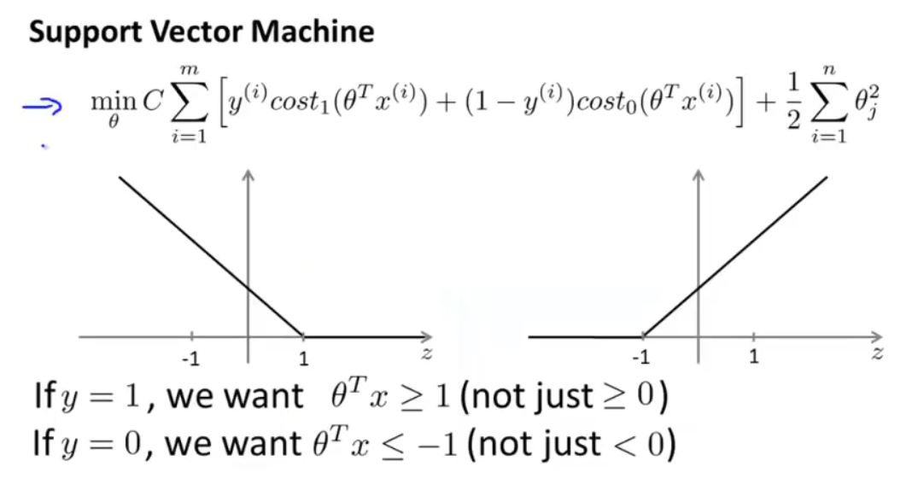

# Unit12 - SVM

## 优化目标

这里面$C$的值越大，因为分割面造成的损失就越大，同时若两个族不线性可分的话，那么会造成损失函数过大。因此可以给$C$的值设置小一点，让其分割的平面有更好的鲁棒性

## 数学解释

$$
\frac{1}{2} \sum_{i=1}^{n} \theta_j^2 = \frac{1}{2}(\theta_1^2+\theta_2^2)=\frac{1}{2}(\sqrt{ \theta_1^2+\theta_2^2 })^2=\frac{1}{2}\Arrowvert\theta\Arrowvert^2 \\
\theta^Tx^{(i)} = p^{(i)}\Arrowvert\theta\Arrowvert
$$

+ $\theta$：分割超平面的法向量
+ $p^{(i)}$：$x^{(i)}$在$\theta$上的投影长度，

对于正样例，我们希望$\theta^Tx^{(i)}$要非常大，也就是$x^{(i)}$在$\theta$上的投影长度要越长，这样分割平面就越能正确的将两个族给分开

## 核函数

若想要分割的平面是非线性的，比如是个曲线，那么之前所说的方法就不满足了

核函数的思想就是将数据映射到一个更高维的空间进行比较，比如平面上有各种大小不一的豆粒，想要将这些豆子按照大小来区分开来，仅在一个二维平面空间中是完全做不到的，这是可以狠狠的拍一下桌子，不同大小的豆子会震到不同的高度，然后在某个瞬间就可以用一个平面将这些豆子区分在不同的高度中。

而核函数的作用就是将豆子放置在z轴不同的高度当中