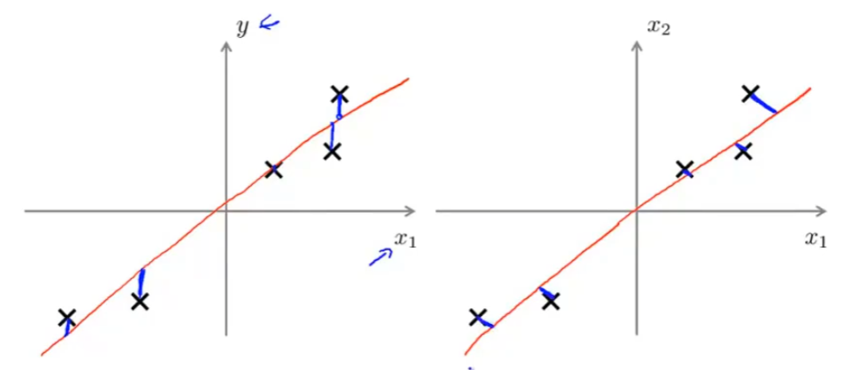

# 降维 

> Dimensionality Reduction

## 作用

### 压缩数据

如果特征高度相关的时候就需要用到降维，比如说第一个维度用来表示物体的厘米长度，第二个维度表示物体的英寸长度

2维中，可以将坐标点投影到一个直线上

3维中，可以将空间中的散点投影到一个平面中

### 可视化

假设需要评价一个物体的好坏，有非常多的评判标准，那么就很难让这些数据展现二维或者三维空间中，这时可以将数据压缩的较低的维度

## PAC

principal components analysis：主成分分析方法，用来进行数据降维

pac与线性回归并不相同。在线性回归中计算的是一个点与相同横坐标直线上的点的距离，而pac计算的是点与直线的距离

对于2维图像我们需要获取1个向量，并将数据点投影到向量上

对于3维图像我们需要获取2个向量，将数据点投影到2个向量构成的平面上

## 注意

不能使用pac防止过拟合，pca只是用来提高算法的运行速度

不要一上来就选择使用pca，当原始数据集进行训练时不行可以再考虑一下