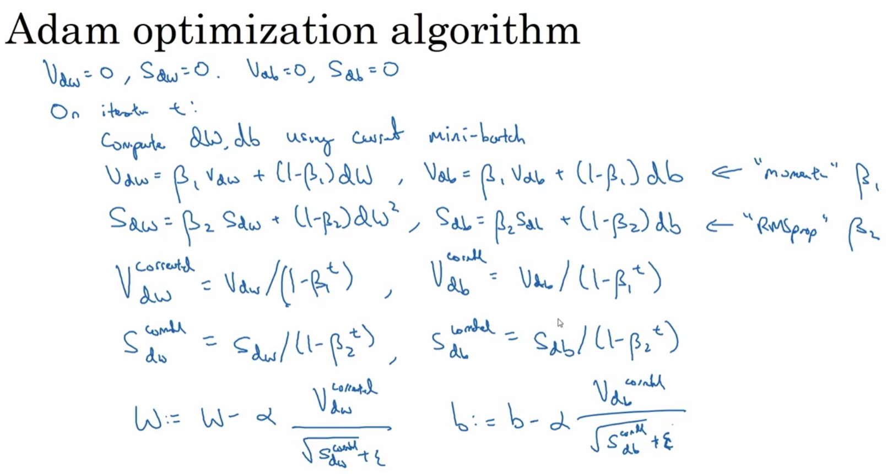

# 优化算法

## mini-batch

先确定一个批量batch_size，然后每次从训练集中选取batch_size个样本数进行训练

## 指数加权平均数

一种近似求解平均值的方法

### 简单介绍

$$
v_t = \beta v_{t-1} + (1-\beta)\theta_t
$$

以一段时间的温度作为例子，这时$v_t$代表到第t天时的平均温度

若当前的$\beta = 0.9$ ，就相当于$v_t$取得是10天温度的平均值，对应的是红线部分

若当前的$\beta=0.98$（$\frac{1}{1-0.98}=\frac{1}{50}$），就相当于50天温度的平均值，对应的是绿线部分，可能看到有一点延迟，因为平局值取的太多了

若当前的$\beta = 0.5$ ，就相当于$v_t$取得是2天温度的平均值，对应的是黄线部分，可能看到曲线虽然能更快的适应温度变化，但是可能有太多的噪声值

### 理解

对公式进行展开
$$
v_{100} = 0.1\theta_{100}+0.9 v_{99}   \\
 v_{99} = 0.1\theta_{99}+0.9 v_{98}   \\
 v_{98} = 0.1\theta_{98}+0.9 v_{97}   \\
 ...
$$
然后进行带入，可得
$$
v_{100} = 0.1\theta_{100}+0.9 (0.1\theta_{99}+0.9 (0.1\theta_{98}+0.9 (...)) ) \\
= 0.1\theta_{100} + 0.1\times0.9\theta_{99} + 0.1\times0.9^2\theta_{98} + ...
$$
$V_{100}$等于每一个时刻天数的温度值再乘以一个权值，并且这个权值会随时间指数递减，越近期的数据加权越重，但较旧的数据也给予一定的加权

### 意义

指数加权平均的求解过程实际上是一个递推的过程，那么这样就会有一个非常大的好处，每当我要求从0到某一时刻（n）的平均值的时候，并不需要像普通求解平均值的作为，保留所有的时刻值，求和然后除以n

而是只需要保留0-(n-1)时刻的平均值和n时刻的温度值即可。也就是每次只需要保留常数值，然后进行运算即可，这对于深度学习中的海量数据来说，是一个很好的减少内存和空间的做法。

### 偏差修正

在求解的前期，因为$v_0=0$，所以开始时平均值会比较低，误差较大，这时可以用到偏差修正
$$
v_t = \beta v_{t-1} + (1-\beta)\theta_t \\
v_t = \frac{v_t}{1-\beta^t}
$$
随着t的增大，$\theta^t$会变的越来越小

## 动量梯度下降

一般的梯度下降法收敛的比较慢，波动较多和频繁

实现细节：

在迭代每个小批量的时候计算dW,db

$v_{dW} = \beta v_{dW} + (1 - \beta)dW$

$v_{db} = \beta v_{db} + (1 - \beta)db$

一般的 $\beta = 0.9$ 是一个非常鲁邦的值

还有一种在写法就是省略 (1 - $\beta$)这个值，这就相当于$dW$或$db$乘以 $\frac{1}{1-\beta}$，但是一般都不这么写，因为调整参数时可能会对学习率以及其他很多参数都有影响

## RMSprop

> root mean square，因为是对微分进行了平方操作，最后又进行了平方根操作

实现细节：

在迭代每个小批量的时候计算dW,db

$S_{dW} = \beta v_{dW} + (1 - \beta)dW^2$

$S_{db} = \beta v_{db} + (1 - \beta)db^2$

$w = w - \alpha \frac{dW}{\sqrt{S_{dw}}}$

$b = b - \alpha \frac{db}{\sqrt{S_{db}}}$

为了确保分母除以0，一般平方根会加上一个很小的数$\epsilon$

## Adam

Adam代表Adaptive Moment Estmation

通常 

$\alpha$：需要被调整

$\beta_1$:作者建议设置为0.9 -> dW -> 计算这个微分称之为第一矩（first moment）

$\beta_2$:作者建议设置为 0.999 -> dW^2 -> 计算平方数的指数加权平均数，位置为第二矩（second moment）

$\epsilon$:建议设置为$10^{-8}$

## 学习率衰减

刚开始时由于学习率较大，所以能较快的到达最优点附近，但是在这个附近时，这个学习率可能不久太适合，稍微有点大了，导致计算的结果在最优点附近不断波动。

所以我们希望在训练初期，学习率的步伐较大，但是随着训练的进行，模型开始收敛时，我们希望这个学习率步伐小一点，使得搜寻更加精确的

我们定义：

$\alpha = \frac{1}{1 \ +  \ decay\_late \ * \ epoch}$

这里decay_late是一个新的超参数

当然还有其他定义方式

如

$\alpha = 0.95^{epoch\_num} * \alpha_0$

$\alpha = \frac{k}{\sqrt{epoch\_num}} * \alpha_0$

# 超参数调试、Batch正则化和程序框架

## 超参数调试

### 调试处理

尝试随机值，而不是网格，因为当一个超参的重要程度远大于另一个超参时，那么所进行的超参调试就只取决于重要的那个超参了

并且考虑使用粗粒度到细粒度的搜索，比如上面的第二幅图，先搜索某区域的几个点，然后在这几个点周围在选取几个点进行测试

### 超参数选择范围

普通的超参选取方式是 均匀取值，打个比方就是$0.0001\sim1$之间均匀取值，假设均匀取10个值，那么每份就是$(1 - 0.0001 ) / 10 = 0.09999 \approx 0.1$，在$0.0001\sim0.1$之间占用了10%的资源，而在$0.1\sim1$之间占用了90%的资源，先验这样的做法不太好

一个好点的做法就是按刻度取值，还是之间的例子$0.0001\sim 1$之间，但是这次不按均匀取值，而是将刻度分为4个区域，每份分别为0.0001、0.001、0.01、0.1、1，然后在这4个区间区域内均匀取值

### 超参数训练实践

Pandas 模式：一次只训练一组超参数，然后不停的调整，适用于那些十分耗资源的网络模型

Caviar 模式：一次并行进行多组超参数训练，然后选择效果最好的那一组

## Batch正则化

### BatchNorm 

归一化输入特征可以加速网络的学习过程，如下图它可以帮助我们提高寻找最优解的过程

以单层的逻辑回归为基础，我们先计算输入特征的平均值以及方差来进行归一化

**使用BatchNorm时偏置b是不必要的**，它会在计算过程中被抵消掉

BatchNorm它可以减少每个层的分布变化，通过将数据规整到一个由方差和均值决定的一个分布中，避免在传播过程中产生较大分布偏移，能让我们训练更深的网络，让我们的学习算法运行速度更快

**总结**：BatchNorm归一化一次只能处理一个mini-batch的数据，他在mini-batch上计算均值和方差，在测试时，如果你想做出预测或者评估神经网络，你可能没有一个mini-catch的样本，你可能一次只能进行一个单独样本的测试。

### 测试时的BatchNorm

训练时m代表的是一个mini-batch的大小，但是在测试时这个m的值为1，这样计算出的均值和方差就没有意义了，所以我们需要一个方法单独估算测试时的均值和方差

在所有的mini-batch上的结果应用**指数加权平均**是一个很好的方法

假设我们有$x^1,x^2,x^3...$等几个mini-batch

批量$x^1$计算出的均值为$\mu^1$，批量$x^2$计算出的均值为$\mu^2$，其他批量也类似，然后我们将其应用到指数加权平均公式上，就获得了相应的估算值，方差同理计算

