# 实例探究

## 经典网络

### LeNet-5

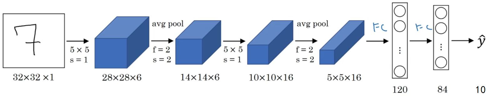

+ 大约60k个参数
+ 池化后会进行非线性函数处理，sigmod
+ 因为有2次卷积操作，3次全连接操作，所以称之为LeNet-5

### AlexNet

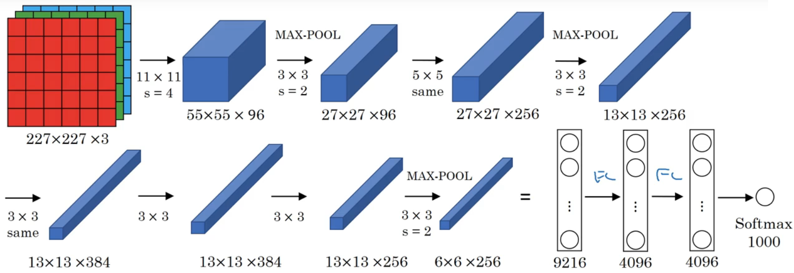

+ 大约60M个参数
+ 使用了ReLU激活函数
+ 使用了多个GPU
+ 使用了局部响应归一层[local response normalized]{LRN}

### VGG

首先要了解一下VGG块的概念，它由数个卷积层和一个池化层构成

这几个卷积也很有特点，**只有第一个卷积层用来提升通道**，后面的卷积层通道数输入和输出都不会有任何变化。而池化的作用就是来缩小特征图。

```python
def vgg_block(num_convs, in_channels, out_channels):
    layers = []
    for _ in range(num_convs):
        layers.append(nn.Conv2d(
            in_channels, out_channels, kernel_size=3, padding=1))
        layers.append(nn.ReLU()),
        in_channels = out_channels
    layers.append(nn.MaxPool2d(kernel_size=2, stride=2))
    return nn.Sequential(*layers)
```

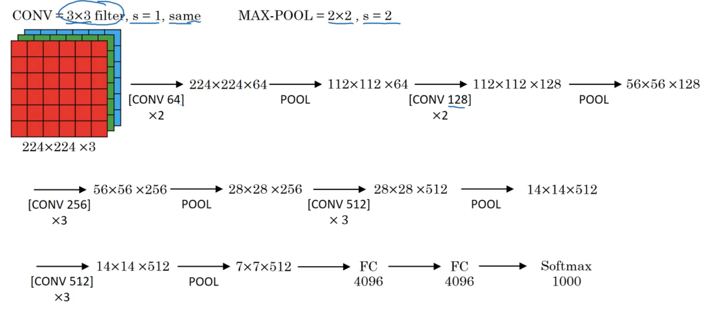

上图是VGG-16的结构图，因为共（2+2+3+3+3）= 13 个卷积层，3个全连接层，所以称之为VGG-16.

## 残差网络

残差网络为什么有用

暂略

## 1×1 卷积

对于单通道的6x6x1的特征图来说，1x1卷积没什么大用，就是将这个特征图乘了个倍数。

但是对于多通道的，如6x6x32的特征图来说，==1x1卷积所实现的功能就相当于一个全连接层==，下面举个例子：

1. 假设输入还是6x6x32的特征图，与1x1x6的卷积核进行运算。
2. 我们从输入中取出一个网格区域，也就是一个1x1x32的特征图，取出一个卷积核，也就是1x1x1的核
3. 这样就相当于一个输入层有32个神经元，输出层有1个神经元的全连接神经网络
4. 现在取出所有的卷积核，那么就相当于有了个32x6的全连接神经网络
5. 现在取出所有的输入，那么最后的输出就是6x6x6（特征图的大小不变，数量和卷积核的数量一致），有时还会对单张特征图做非平凡计算得到一个值，也就是最后的输出1x1x6

总结一下：

1、用1*1卷积可以代替全连接

不过有人说他只适用于已经有了一层FC, 如“D_in = 512, D_out = 4096”，现在想再次叠加一个2048的FC，则可设定参数为“filter size = 1, padding = 0, stride = 1, D_in = 4096, D_out = 2048”的卷积层操作

2、卷积是权值共享的（全连接不能）

3、常用来增加或减少特征图层数

4、输入的尺寸可以变（但是全连接不行）

## Inception网络

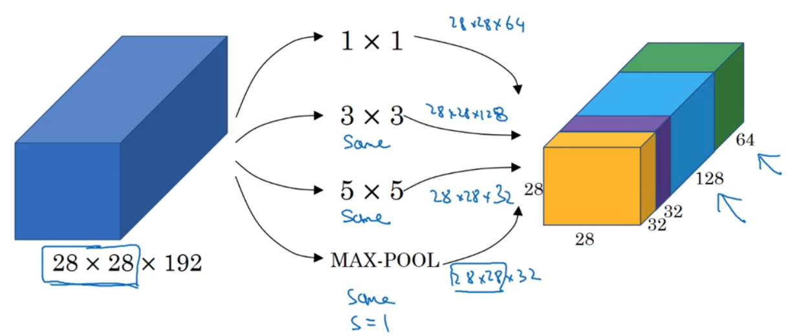

Inception块使用不同计算，最后将输出结果拼接在一起

## 训练技巧

### 迁移学习

1、假设有个分类，如果自己只有非常**少量的数据**，那么可以先在网络上下载别人预训练好的模型与权重，然后将**除softmax层的网络全部冻结**，这样我们只需要训练和softmax层有关的参数就行，即使我们的数据量很小，也能产生不错的结果

或者先利用这个训练好的网络，实现计算所有输入的结果，把他们存在硬盘中，然后将这个结果作为输入来训练softmax层

2、或者取训练好的网络后面几层，其他层冻结，或者直接去掉后面几层，拼接上自己需要的网络结构来训练

3、最极端的，只是用预训练好的权重做初始化，用全部的网络训练

### 数据扩充

+ 镜像/水平翻转
+ 随机剪裁
+ 颜色转变，比如各通道的数值增加或减少，PCA颜色增强
+ 在训练时添加扰动


# 人脸识别

## 相关术语

+ 人脸检测（Face Detection）
  + 是指对于任意一幅给定的图像，采用一定的策略对其进行搜索以确定其中是否含有人脸，如果是则返回脸的位置、大小和姿态。说简单点，人脸检测解决“是不是人脸”的问题。
+ 人脸识别（Face Recognition）
  + 是基于人的脸部特征信息进行身份识别的一种生物识别技术。说简单点，人脸识别解决“这是谁的脸”问题。

## One-Shot 学习

人脸识别所面临的一个问题就是“One-Shot”问题，这就意味在绝大多数人脸识别系统中，只需要通过一张图片或单个人脸样例就能识别这个人。

但是在深度学习中只有一个样例时，他的表现并不怎么好，比如公司有4个员工，一种办法就是构建一个神经网络，然后使用softmax单元来输出这4个概率值，但是这种办法很不好，首先数据集实在太小了，并且如果公司多了一个员工，就需要修改一下softmax单元，并重新进行训练。

一个更好的解决办法就是学习一个函数，他能判断两个函数直接的相似度，然后再设置一个阈值，相似度大于这个阈值，则说明是同一个人

## Siamese 网络

Siamese网络要给出输入图像X1和X2的相似度，所以它必须能接受两个图像作为输入，如下图：

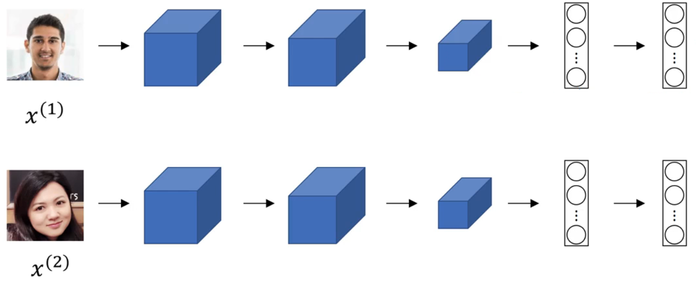

图中上下两个模型，都由CNN构成，两个模型的参数值完全相同。不同于传统CNN的地方，是`Siamese网络`并不直接输出类别，而是输出一个向量(比如上图中是128个数值组成的一维向量)：

- 若输入的图像X1和X2为同一个人，则上下两个模型输出的一维向量欧氏距离较小
- 若输入的图像X1和X2不是同一个人，则上下两个模型输出的一维向量欧氏距离较大

所以通过对上下两个模型输出的向量做欧氏距离计算，就能得到输入两幅图像的相似度。

**学习目标**

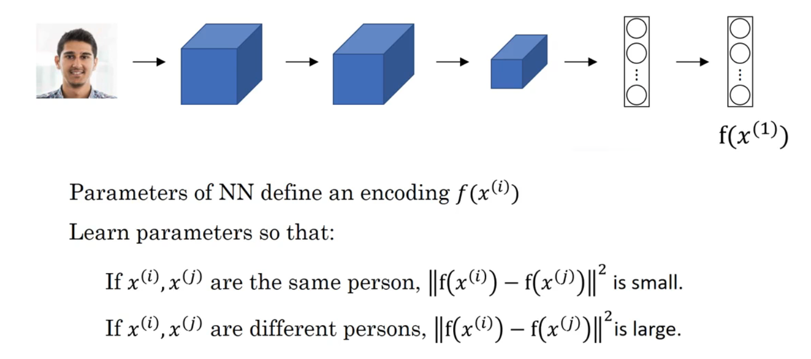

又因为上下两个模型具有相同的参数，所以训练模型时，只需要训练一个模型即可。那问题来了，这样的模型该怎么训练呢？模型的输出label该标注为什么呢？

## Triplet 损失

模型的训练，就是给定`cost function`后，用梯度下降法寻找最优值的过程。

训练Siamese网络，需要引入新的cost function。我们先看模型的学习目标（下图），再一步一步讲解cost function的最终表达式。

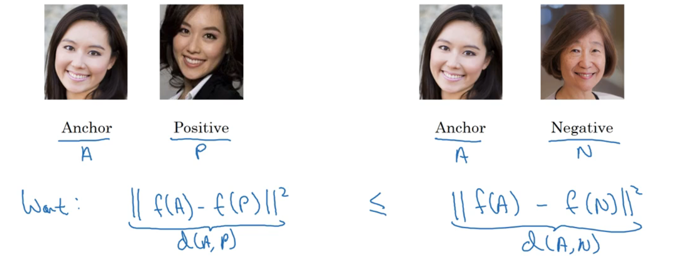

对图中的一幅照片 A，如果给定了同一个人的另一幅照片 P，则模型的输出向量$f(A)$和$f(P)$应该是距离比较小的。如果给定了另外一个人的照片N，我们希望 A 与 P 之间的差距小于等于 A 与 N 之间的差距，也就是
$$
d(A,P)\le d(A,N) \ \ \ \ \rightarrow \ \ \ \ d(A,P) - d(A,N) \le 0
$$
但是还有一种情况，神经网络对任何的输入，它都产生输出0，那么$0 - 0\le 0$也符合这个等式，为了避免这种情况的出现，需要对上面的公式做一点点变化。
$$
d(A,P) - d(A,N) + \alpha \le 0
$$
这个$\alpha$称之为间隔（margin），多了这个参数就避免训练出一个无用的神经网路了。

假设$\alpha=0.2，d(A,P)=0.5$，那么至少$d(A,N)=0.7$，这样参数$\alpha$就能拉大A与P和A与N之间的差距。

根据这个目标，就得到了cost function的定义：
$$
\begin{flalign*}
& Given\ 3\ images\ A,P,N \\ 
& L(A,P,N) = max(\ \|f(A)-f(P)\|^2 - \|f(A)-f(N)\|^2 + \alpha\ , \ 0\ ) \\
& J = \sum_{i=1}^ML(A^{(i)}, P^{(i)}, N^{(i)})  &
\end{flalign*}
$$
首先看一下$L(A,P,N)$的左半边，我们一般希望损失越小越好

+ 如果左半边$\lt$0，就说明A与P的差距远小于A与N的差距，这时我们希望的，所以函数返回0
+ 如果左半边$\gt$0，就说明A与P的差距和A与N的差距不够大，我们希望改正他，所以就返回这个计算值

**如何选择三元组A,P,N**

如果训练时我们随机选择APN，虽然这样很容易满足$d(A,P) + \alpha \le d(A,N)$，因为随机选取大多数图片之间都是不相等，但是这样对网络训练没有任何帮助。

只有选择一些“hard”的三元组，才能让网络有效应用梯度下降进行训练。比如 $d(A,P)\approx d(A,N)$ 这样的情况。详情可以参见论文`FaceNet`

## 面部验证与二分类

还有一中思路，就是将人脸识别变成一个二分类的问题，简单来说输入两张图片，如果是同一个人，则输出1，不是同一个人，则输出0。

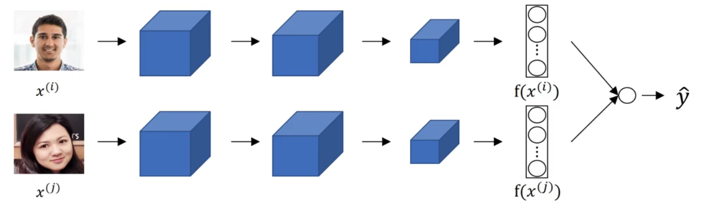

那么现在看一下最后的输出预测是什么
$$
\hat{y}=\sigma(\sum_{k=1}^{n} w_i |f(x^{(i)})_k- f(x^{(j)})_k| + b)
$$
其中$|f(x^{(i)})_k- f(x^{(j)})_k|$还可以另外的写法，如`DeepFace`论文中：
$$
\frac{( f(x^{(i)})_k - f(x^{(j)})_k )^2}{f(x^{(i)})_k + f(x^{(j)})_k}
$$
总结一下这种形式的网络，输入x是一对图片，输出是0或1，具体结果取决于输入的图片是否相似，并且这个网络的卷积层公用参数，实际上就是一个卷积网络进行了两次计算而已。

有一种**提高该系统效率**的方法，预先将所有人员的图片都投入到这个网络，并将结果保存到硬盘，然后需要的时候再取出来，避免每次重新计算。

# 神经风格转换

具体的结果如下图所示

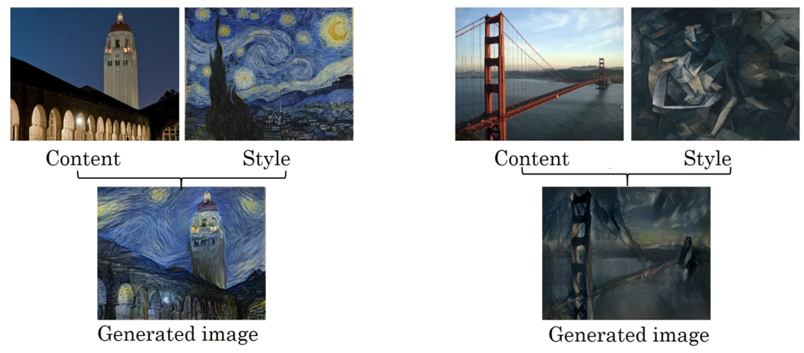

## 损失函数

要构建一个神经风格迁移系统，首先需要定义一个代价函数，通过最小化代价函数，生成我们想要的图像。
$$
J(G)=\alpha J_{content}(C,G) + \beta J_{style}(S,G)
$$

+ $J_{content}(C,G)$：内容代价函数，用来度量生成图片G与内容图片C的内容有多相似
+ $J_{style}(S,G)$：风格代价函数，用来度量生成图片G和风格图片S的风格的相似度
+ $\alpha 、\beta$：确定内容代价和风格代价，两者之间的权重，其实1个就够用，但是论文使用的是2个

**算法步骤**：

1. 随机初始化生成图像G，可以是任何我们想要的大小尺寸
2. 使用上面的代价函数，利用梯度下降的方法将其最小化

## 内容代价函数

$$
J_{content}(C,G)=\frac{1}{2} \| a^{[l][C]} - a^{[l][G]} \|^2
$$


1. 假设你使用隐藏层`l`来计算内容成本
   + 这个层`l`，在网络中既不能选的太浅，也不能选的太深
   + 通常`l`会选择在网络的中间层
2. 使用预训练的卷积网络，如vgg
3. 假设$a^{[l][C]}、a^{[l][G]}$分别代表内容图片和生成图片在`l`层经过激活函数处理的两个向量
   + 如果$a^{[l][C]}、a^{[l][G]}$非常相似则说明它们有相似的内容

## 风格代价函数

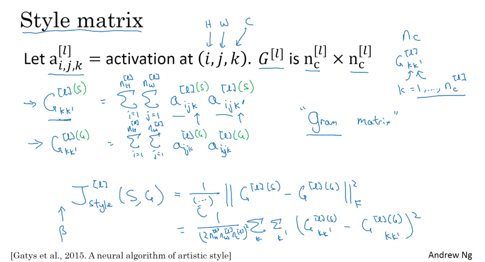

首先我们定义Gkk’函数，代表了某张图片的k与k'通道对应点的乘积之和，乘积之和越大，则代表他们关联性越强。

然后我们把风格图片模型和生成图片的模型同时进行计算，这样就得到了两个模型的值，当我们评估生成模型的值的时候，只需要把这个差值作为损失函数进行计算即可，差值越小，则代表他们的风格越相近。

在计算损失函数的时候，还可以对他们进行归一化的操作，或者是在前面乘上一个超参数。

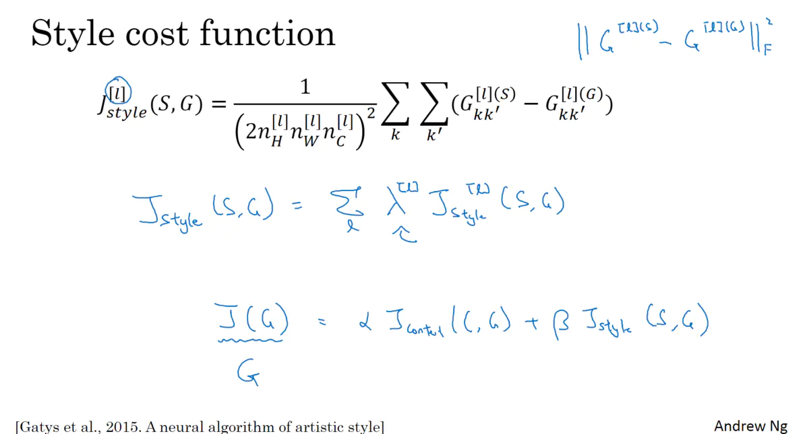

这个就是我们得到的风格代价函数完整的式子了，结合我们之前使用的内容代价函数，结合起来就是整个风格迁移的函数，在风格代价函数跟内容代价函数前面都需要加上一个超参数，来代表他们不同的权重。