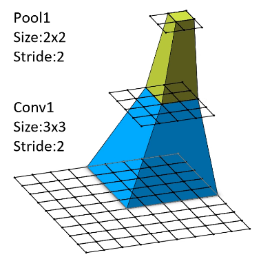

# CNN感受野

感受野计算公式：
$$
F(i) = (F(i+1) - 1) \times Stride + Ksize
$$

+ `F(i)`：第 i 层感受野
+ `Stride`：第 i 层步距
+ `Ksize`：第 i 层卷积核或池化层尺寸

举个例子，我们来观察一个特征图经过一次池化和一次卷积后的感受野变化

1. 假设原图一个方格的感受野 $F = 1$
2. 经过池化后 $F = (1 - 1) \times 2 + 2 = 2$
3. 经过卷积后 $F=(2-1)\times 2 + 3=5$

而 VGG 论文中曾说过，3 个 3x3 的卷积堆叠在一起相当于一个 7x7 的卷积，如下

1. 最初感受野 $F = 1$
2. 经过 conv1 后  $F = (1 - 1) \times 1 + 3 = 3$
3. 经过 conv2 后  $F = (3 - 1) \times 1 + 3 = 5$
4. 经过 conv3 后  $F = (5 - 1) \times 1 + 3 = 7$

那么这样替换的卷积核的意义何在呢？因为这样会减少计算的参数量降低计算量，假设通道数为 C，如下。

+ 对于 7x7 的卷积核参数量：$7\times7\times C \times C =49 C^2$
+ 对于 3x3 的卷积核参数量：$3\times3\times C \times C + 3\times3\times C \times C + 3\times3\times C \times C =27 C^2$

