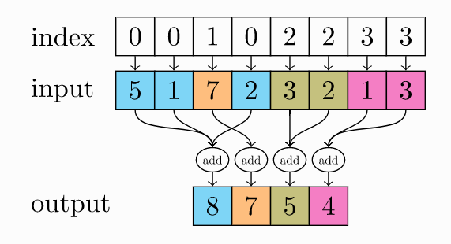

## torch_geometric

### Data

> ==Data(**x**: Optional[torch.Tensor] = None, **edge_index**: Optional[torch.Tensor] = None, **edge_attr**: Optional[torch.Tensor] = None, **y**: Optional[torch.Tensor] = None, **pos**: Optional[torch.Tensor] = None, \*\***kwargs**)==
>
> ​	A data object describing a homogeneous graph. The data object can hold node-level, link-level and graph-level attributes. In general, `Data` tries to mimic the behaviour of a regular Python dictionary. In addition, it provides useful functionality for analyzing graph structures, and provides basic PyTorch tensor functionalities.
>
> ​	描述同构图的数据对象。数据对象可以保存节点级、链接级和图形级属性。一般来说，数据试图模仿常规Python字典的行为。此外，它还提供了分析图结构的有用功能，并提供了基本的PyTorch张量功能。

**参数**：

+ **x**：节点的特征矩阵，`[num_nodes, node_feature]`，node_feautre 可以是多维的
+ **y**：节点的标签
+ **edge_index**：描述边的信息，`[2, num_edges]`，第一个维度表示起点，第二位维度表示终点
+ **edge_attr**：描述边的特征，`[num_edges, edge_feature]`，同样 edge_feature 也是多维的

## torch_geometric.data

### Batch


```python
import torch
from torch_geometric.data import Data
from torch_geometric.data.batch import Batch


edge_index_s = torch.tensor([
    [0, 0, 0, 0],
    [1, 2, 3, 4],
])
x_s = torch.randn(5, 16)  # 5 nodes.
edge_index_t = torch.tensor([
    [0, 0, 0],
    [1, 2, 3],
])
x_t = torch.randn(4, 16)  # 4 nodes.

edge_index_3 = torch.tensor([[0, 1, 1, 2],
                           [1, 0, 2, 1]], dtype=torch.long)
x_3 = torch.randn(4, 16)

data1= Data(x=x_s,edge_index=edge_index_s)
data2= Data(x=x_t,edge_index=edge_index_t)
data3= Data(x=x_3,edge_index=edge_index_3)
# 上面是构建3张Data图对象
# `Batch(Data)` in case `Data` objects are batched together
# `Batch(HeteroData)` in case `HeteroData` objects are batched together

data_list = [data1, data2,data3]

# 调用该函数data_list里的data1、data2、data3 三张图形成一张大图，也就是batch
loader = Batch.from_data_list(data_list)

print('data_list:\n',data_list)
#data_list: [Data(edge_index=[2, 4], x=[5, 16]), Data(edge_index=[2, 3], x=[4, 16]), Data(edge_index=[2, 4], x=[4, 16])]

print('batch:',loader.batch)
#batch: tensor([0, 0, 0, 0, 0, 1, 1, 1, 1, 2, 2, 2, 2])

print('loader:',loader)
#loader: Batch(batch=[13], edge_index=[2, 11], x=[13, 16])

print('loader.edge_index:\n',loader.edge_index) # batch的边的元组
#loader.edge_index:
#tensor([[ 0,  0,  0,  0,  5,  5,  5,  9, 10, 10, 11],
#        [ 1,  2,  3,  4,  6,  7,  8, 10,  9, 11, 10]])

# 该batch的图的个数，这里是3个
print('loader.num_graphs:',loader.num_graphs)
#loader.num_graphs: 3

# 大图Batch变回成3张小图
Batch=Batch.to_data_list(loader)
print(Batch)
#[Data(edge_index=[2, 4], x=[5, 16]), Data(edge_index=[2, 3], x=[4, 16]), Data(edge_index=[2, 4], x=[4, 16])]
```

## torch_scatter

### scatter_add

`scatter_add(src, index, dim=-1, out=None, dim_size=None)`



主要就涉及到4个参数

+ Paramenter：
  + src：源张量
  + index：将源张量散射的索引位置
  + dim：索引要沿着的维度
  + out：输出到的变量
  + dim_size：
    + 如果`out`未设置，自动使用大小`dim_size`在维度`dim`创建输出
    + 如果`dim_size`未设置，则使用`index.max()+1`为大小进行输出

大概功能就是将 index 所处位置的源张量，派遣到 index 所指定的位置，然后再用 add 进行处理

## torch_geometric.nn

### GATConv


图结构如上，我们需要对它进行一次图卷积。首先定义好相关变量

```python
# 边：(2, num_edges)
edge_index = torch.tensor([[1, 2, 3], [0, 0, 0]], dtype=torch.long)
# 顶点：(num_nodes, in_dim)
x = torch.tensor([[1], [1], [1], [1]], dtype=torch.float)
```

然后我们可以直接使用 `GATConv` 来进行图注意力卷积：

```python
net = GATConv(1, 2)
output = net(x, edge_index)
```

这样原始顶点特征通道数将会从 1 变成 2

#### 泛化定义

$$
 \mathbf{x}_{i}^{(k)}=\operatorname{UPDATE}\left(\mathbf{x}_{i}, \operatorname{AGGR}_{j \in \mathcal{N}(i)} \operatorname{MESSAGE}^{(k)}\left(\mathrm{x}_{i}^{(k-1)}, \mathbf{x}_{j}^{(k-1)}, \mathbf{e}_{i j}\right)\right) 
$$


上述公式和对应的图标则表示具体卷积的细节：

+ $\text{MESSAGE}(x_i,x_j,e_{ij})$：从节点对和边得到的嵌入向量
+ $\text{AGGR}$：表示如何聚合之前得到的 $\text{MESSAGE}$，通常有 add、max、mean
+ $\text{UPDATE}$：对聚合的内容进行更新，通常加入偏差或其他信息（比如 Multi-head）

#### 详细

对于 GAT（Graph Attention Network）来说，卷积过程可以表示如下：
$$
\mathbf{x}_{i}^{\prime}=\alpha_{i, i} \Theta \mathbf{x}_{i}+\sum_{j \in \mathcal{N}(i)} \alpha_{i, j} \Theta \mathbf{x}_{j}
$$
新节点 $i$ 的信息 = “它的注意力权重乘以转换过的节点信息” + 它的“邻接点各自的注意力权重乘以各自转换后的节点信息”。

注意力权重计算方式如下：
$$
 \alpha_{i, j}=\frac{\exp \left(\operatorname{LeakyReLU}\left(\mathrm{a}^{\top}\left[\Theta \mathbf{x}_{i} \| \Theta \mathbf{x}_{j}\right]\right)\right)}{\sum_{k \in \mathcal{N}(i) \cup\{i\}} \exp \left(\operatorname{LeakyReLU}\left(\mathbf{a}^{\top}\left[\Theta \mathbf{x}_{i} \| \Theta \mathbf{x}_{k}\right]\right)\right)} 
$$
下面开始逐步解析 GATConv 的源码：

0、定义变量

```python
# theta
self.weight = Parameter(torch.Tensor(in_channels, heads * out_channels))
# alpha: separate into two parts, 因为要对两个节点信息进行聚合，所以要乘以2
self.att = Parameter(torch.Tensor(1, heads, 2 * out_channels))
self.bias = Parameter(torch.Tensor(out_channels))
```

1、转换节点特征

```python
# (num_nodes, heads, out_dim)
x = torch.mm(x, self.weight).view(-1, self.heads, self.out_channels)
```

2、给节点添加自连接

```
edge_index, _ = remove_self_loops(edge_index)
edge_index, _ = add_self_loops(edge_index, num_nodes=x.size(0))
```


3、消息传播并聚合

```
self.propagate(edge_index, x=x)
```

要注意的是在源码中`x`表示一个元组，`x[0]` 表示源信息，`x[1]` 表示目标信息

3.1 消息传播：concat + softmax

```python
def message(self, x_i, x_j, size_i, edge_index_i):
    x_i = x_i.view(-1, self.heads, self.out_channels)   
    alpha = (torch.cat([x_i, x_j], dim=-1) * self.att).sum(dim=-1)
    alpha = F.leaky_relu(alpha, self.negative_slope)
    alpha = softmax(alpha, edge_index_i, size_i)

    if self.training and self.dropout > 0:
        alpha = F.dropout(alpha, p=self.dropout, training=True)
    return x_j * alpha.view(-1, self.heads, 1)  # (E+N) x H x emb(out)
```

在源码中`message`函数比较特殊，它能解析上面`propagate`函数中的字典参数：

+ 如果想要获取**目标信息**则在键名后面添加`_i`
+ 如果想要获取**源信息**则在键名后添加`_j`
+ 如果想直接获取元组值，则直接通过键名获取

### MessagePassing

1. 接收传入参数，确定传入传出维度；
2. 继承父类属性，初始化参数聚合函数aggr，消息传递流向flow，传播维度node_dim
3. 检查子类是否实现message_and_aggregate()方法；
4. 进入forward逻辑，调用propagate函数：
   + 调用message方法；
   + 调用aggregate方法；
   + 调用update方法；


