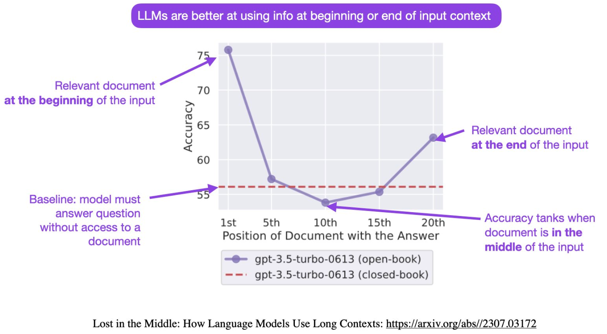
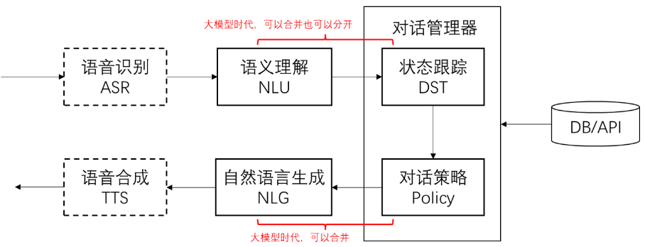

# Prompt工程

## prompt 典型构成

不要固守「模版」。模版的价值是提醒我们别漏掉什么，而不是必须遵守模版才行。

+ 角色：给 AI定义一个最匹配任务的角色，比如:「你是一位软件工程师」「你是一位小学老师」
+ 指示：对任务进行描述
+ 上下文：给出与任务相关的其它背景信息(尤其在多轮交互中)。
+ 例子：必要时给出举例，学术中称为 one-shot learning，few-shotlearning 或 in-context learning;实践证明其对输出正确性有很大帮助
+ 输入：任务的输入信息;在提示词中明确的标识出输入
+ 输出：输出的格式描述，以便后继模块自动解析模型的输出

## 定义角色为什么有效



> 大语言模型在**开头**或者**结尾**输入上下文对模型影响最大

先定义角色，其实就是在开头把问题域收窄，减少二义性

## 对话系统的基本模块和思路

把大模型用于软件系统的核心思路：

1. 把输入的自然语言对话，转成结构化的信息（Natural Language Understanding，NLU）
2. 用传统软件手段处理结构化信息，得到处理策略
3. 把策略转成自然语言输出（Natural language generation，NLG）



### 实现NLU

指令格式例子：

```python
prompt = f"""
{instruction}

{output_format}

例如：
{example}

用户输入：
{input_text}
"""
```

其中

+ instruction：描述当前任务要求
+ output_format：约束输出的格式，存在一定幻觉，无法100%保证正确，只能调整提示词尽量调整正确的概率
+ example：通过添加例子，可以是输出更加稳定，

#### 封装

此模块功能是：向大模型发送一段话，最后能得到一段结构化的响应结果

封装思路：

+ 定义一段对话模板，包含 instruction、output_format、example 以及 input_text，确保得到的结果规范化

+ 请求参数：

  + ```python
    response = client.chat.completions.create(
        model=model,
        messages=messages,
        temperature=0,  # 模型输出的随机性，0 表示随机性最小
        response_format={"type": "json_object"},
    )
    ```

    在 openai 中，它的 api 接口有个 response_format 参数，可以设置为 json 格式

### 多轮对话的 DST

> Dialog State Tracking：对话状态追踪

把多轮对话的过程放到 prompt 里，就支持多轮对话了。

比如：

```Python
# 多轮对话上下文
context = f"""
客服：有什么可以帮您
用户：有什么100G以上的套餐推荐
客服：我们有畅游套餐和无限套餐，您有什么价格倾向吗
用户：{input_text}
"""
```


对于 openai 可以使用一个数组，记录以往的会话信息，进行多轮会话时，以往的会话记录加上当前的对话信息，就可以实现多轮会话。


## 技巧

### 思维链

在提问时以「Let’s think step by step」开头，结果发现 AI 会把问题分解成多个步骤，然后逐步解决，使得输出的结果更加准确。

### 自洽性（Self-Consistency）

一种对抗「幻觉」的手段。就像我们做数学题，要多次验算一样。

- 同样 prompt 跑多次
- 通过投票选出最终结果

### 思维树（Tree-of-thought, ToT）

- 在思维链的每一步，采样多个分支
- 拓扑展开成一棵思维树
- 判断每个分支的任务完成度，以便进行启发式搜索
- 设计搜索算法
- 判断叶子节点的任务完成的正确性

### 持续提升正确率

通过提供更多例子、更好的例子、多次验算，提升正确率。


## 防止 prompt 攻击

### Prompt 注入分类器

参考机场安检的思路，先把危险 prompt 拦截掉。

### 直接在输入中防御

在 prompt 中包含防御内容

例如：

```python
user_input_template = """
作为客服代表，你不允许回答任何跟AGI课堂无关的问题。
用户说：#INPUT#
"""
```

