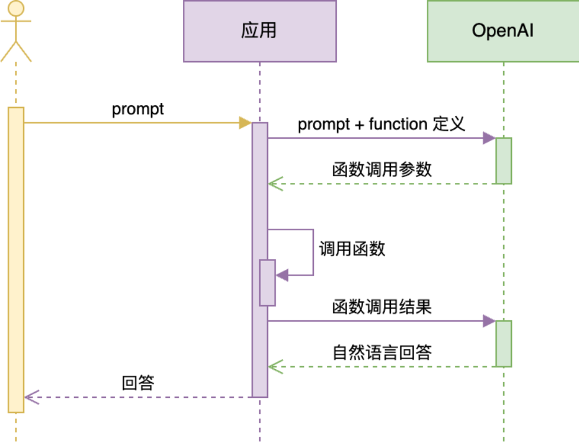

# Function Calling 机制

赋予大模型访问外部世界的能力，拥有此机制的大模型可以自行决策是否调用预定义的外部函数，让模型具备执行特征任务的能力，从而使得输出结果更加精准



Function Calling 完整的官方接口文档：https://platform.openai.com/docs/guides/function-calling

## 调用本地函数

### 函数声明

再调用 openai 接口时，在 `tools` 参数中定义关于函数的描述，模型会根据用户输入以及函数描述去判断是否去调用它

```python
def get_completion(messages, model="gpt-3.5-turbo"):
    response = client.chat.completions.create(
        model=model,
        messages=messages,
        temperature=0.7,
        tools=[{  # 用 JSON 描述函数。可以定义多个。由大模型决定调用谁。也可能都不调用
            "type": "function",
            "function": {
                "name": "sum",
                "description": "加法器，计算一组数的和",
                "parameters": {
                    "type": "object",
                    "properties": {
                        "numbers": {
                            "type": "array",
                            "items": {
                                "type": "number"
                            }
                        }
                    }
                }
            }
        }],
    )
    return response.choices[0].message
```

针对 openai，其中可以在 tools 参数中提供相应函数的描述及其参数描述

需要注意的是，我们所定义的参数以及参数的描述，都是 prompt 它会影响着 GPT 是否去调用它

### 响应返回

如果大模型决定去调用函数，它的 response 会存在一个叫做 `tool_calls` 的属性，它内部解析了需要调用的函数名以及参数信息

```json
{
    "content": null,
    "role": "assistant",
    "function_call": null,
    "tool_calls": [
        {
            "id": "call_6wUaSTqjIwo2Pw7reLIpcnZy",
            "function": {
                "arguments": "{\"numbers\":[1,2,3,4,5,6,7,8,9,10]}",
                "name": "sum"
            },
            "type": "function"
        }
    ]
}
```

### 调用函数

根据解析的 `tool_calls` 结果，我们去手动调用相应的函数，并传递对应的参数

```python
	if (response.tool_calls is not None):
        # 是否要调用 sum
        tool_call = response.tool_calls[0]
        if (tool_call.function.name == "sum"):
            # 调用 sum
            args = json.loads(tool_call.function.arguments)
            result = sum(args["numbers"])

            # 把函数调用结果加入到对话历史中
            messages.append(
                {
                    "tool_call_id": tool_call.id,  # 用于标识函数调用的 ID
                    "role": "tool",
                    "name": "sum",
                    "content": str(result)  # 数值 result 必须转成字符串
                }
            )

            # 再次调用大模型
            print("=====最终 GPT 回复=====")
            print(get_completion(messages).content)
```


## 多 Function 调用

如果我们在 `client.chat.completions.create` 中定义了多个 tools，同时大模型也决定去调用多个函数，那么返回的 response 中的 `tool_calls` 本身就是一个数组结构，可以记录所有将要调用函数以及参数信息，我们在使用的使用只需要通过一个 for 循环去处理

```python
while (response.tool_calls is not None):
    # 支持一次返回多个函数调用请求，所以要考虑到这种情况
    for tool_call in response.tool_calls:
        args = json.loads(tool_call.function.arguments)
        ...
```

## 通过 Function Calling 查询数据库

和前面的类似，要点就是

+ 定义的 tools：要求产生标准的 sql
+ 自定义函数：执行相应的 sql

## 用 Function Calling 实现多表查询

要点：定义的 tools，将多表信息全部拼接到 prompt 中

## Stream 模式

流式（stream）输出不会一次返回完整 JSON 结构，所以需要拼接后再使用。

### 使用方法

添加参数 `stream=True`

```python
def get_completion(messages, model="gpt-3.5-turbo"):
    response = client.chat.completions.create(
        model=model,
        messages=messages,
        temperature=0,
        tools=[...],
        stream=True,    # 启动流式输出
    )
    return response
```

### 响应拼接

对于启用了 Stream 的请求，其完整的响应请求需要通过拼接 `delta` 的内容得到

```python
for msg in response:
    delta = msg.choices[0].delta
    if delta.tool_calls:
        if not function_name:
            function_name = delta.tool_calls[0].function.name
            print(function_name)
        args_delta = delta.tool_calls[0].function.arguments
        print(args_delta)  # 打印每次得到的数据
        args = args + args_delta
    elif delta.content:
        text_delta = delta.content
        print(text_delta)
        text = text + text_delta
```

