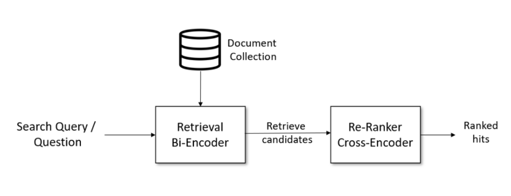

# RAG

> RAG是Retrieval-Augmented Generation的缩写，即检索增强生成。通过结合检索和生成技术，RAG模型能够利用外部知识库中的信息来指导文本生成过程，从而提高生成文本的质量、准确性和相关性。
>
> 传统的语言模型在生成文本时可能会产生与事实不符的“幻觉”内容。RAG模型通过引入外部检索机制，减少了这类问题的发生，提高了生成内容的可信度。

## RAG 系统搭建流程

1. 文档加载，并按一定条件**切割**成片段
2. 将切割的文本片段灌入**检索引擎**
3. 封装**检索接口**
   + 需要用户自己定义方法，去搜索库中最匹配的片段
4. 构建**调用流程**：Query -> 检索 -> Prompt -> LLM -> 回复

### 文本切割

可以使用python库 `pdfminer.six`，其中 `extract_pages` 函数可以提取页面文字

```python
from pdfminer.high_level import extract_pages
from pdfminer.layout import LTTextContainer

def extract_text_from_pdf(filename, page_numbers=None, min_line_length=1):
    '''从 PDF 文件中（按指定页码）提取文字'''
    paragraphs = []
    buffer = ''
    full_text = ''
    # 提取全部文本
    for i, page_layout in enumerate(extract_pages(filename)):
        # 如果指定了页码范围，跳过范围外的页
        if page_numbers is not None and i not in page_numbers:
            continue
        for element in page_layout:
            if isinstance(element, LTTextContainer):
                full_text += element.get_text() + '\n'
    # 按空行分隔，将文本重新组织成段落
    lines = full_text.split('\n')
    for text in lines:
        if len(text) >= min_line_length:
            buffer += (' '+text) if not text.endswith('-') else text.strip('-')
        elif buffer:
            paragraphs.append(buffer)
            buffer = ''
    if buffer:
        paragraphs.append(buffer)
    return paragraphs
```

### 文本灌库

#### 预处理

对切割后的文本片段也需要做一些预处理，可以使用 `nltk` 这个python 库

```python
from nltk.stem import PorterStemmer
from nltk.tokenize import word_tokenize
from nltk.corpus import stopwords
import nltk

# 需要事先下载资源，下载一次既可
nltk.download('punkt')  # 英文切词、词根、切句等方法
nltk.download('stopwords')  # 英文停用词库
```

`word_tokenize` 这个函数会用到 punkt 这个资源，进行一些切词切句的处理

```python
def to_keywords(input_string):
    '''（英文）文本只保留关键字'''
    # 使用正则表达式替换所有非字母数字的字符为空格
    no_symbols = re.sub(r'[^a-zA-Z0-9\s]', ' ', input_string)
    word_tokens = word_tokenize(no_symbols)
    # 加载停用词表
    stop_words = set(stopwords.words('english'))
    ps = PorterStemmer()
    # 去停用词，取词根
    filtered_sentence = [ps.stem(w)
                         for w in word_tokens if not w.lower() in stop_words]
    return ' '.join(filtered_sentence)
```

`PorterStemmer` 还可以进行一些去停用词，取词根的操作

## 向量检索

构建知识库时可以使用检索引擎作为数据库，也可以使用向量数据库，但是它们各有优缺点：

+ 检索引擎：
  + 优点：通过关键字匹配，适合于查询专业名词
  + 缺点：同一语义，用词不同就无法检索成功
+ 向量检索：
  + 优点：根据向量相似度查询最匹配的片段，适合于语义相同，用词不同的场景
  + 缺点：不适用于专业名词查询

### chromadb

1、创建客户端：用于创建 collection

```python
import chromadb
from chromadb.config import Settings

chroma_client = chromadb.Client(Settings(allow_reset=True))


chroma_client.reset() # 重置数据库，将会清空所有的 collection 以及 entries
```

2、创建 collection：用于添加文档与向量信息

```python
collection = chroma_client.get_or_create_collection(name=collection_name)
```

3、向 collection 添加数据

```python
collection.add(
    embeddings=embedding_fn(documents),  # 每个文档的向量
    documents=documents,  # 文档的原文
    ids=[f"id{i}" for i in range(len(documents))]  # 每个文档的 id
)
```

4、搜索向量数据库的内容

```python
collection.query(
    query_embeddings=embedding_fn([query]),
    n_results=top_n
)
```

### Embedding 模型

OpenAI 提供的两个模型：

- text-embedding-3-large
- text-embedding-3-small

 ***越大越准、越小越快。***

其最大特点是，支持自定义的缩短向量维度，从而在几乎不影响最终效果的情况下降低向量检索与相似度计算的复杂度。

## Prompt

prompt 的写法必须要包括我们通过向量数据库检索到的信息，下面是一个示例

```python
prompt_template = """
你是一个问答机器人。
你的任务是根据下述给定的已知信息回答用户问题。

已知信息:
{context}

用户问：
{query}

如果已知信息不包含用户问题的答案，或者已知信息不足以回答用户的问题，请直接回复"我无法回答您的问题"。
请不要输出已知信息中不包含的信息或答案。
请用中文回答用户问题。
"""
```

其中 context 表示我们从数据库中获取到的内容

## 进阶

### 文本分割粒度

文本切割不可以生硬的将一大段文本划分为若干个部分，这样有时可能会导致切割时损失上下文信息，因此切割的内容需要包含一定的冗余信息，也就是切割时需要存在堆叠

```python
from nltk.tokenize import sent_tokenize
import json


def split_text(paragraphs, chunk_size=300, overlap_size=100):
    '''按指定 chunk_size 和 overlap_size 交叠割文本'''
    sentences = [s.strip() for p in paragraphs for s in sent_tokenize(p)]
    chunks = []
    i = 0
    while i < len(sentences):
        chunk = sentences[i]
        overlap = ''
        prev_len = 0
        prev = i - 1
        # 向前计算重叠部分
        while prev >= 0 and len(sentences[prev])+len(overlap) <= overlap_size:
            overlap = sentences[prev] + ' ' + overlap
            prev -= 1
        chunk = overlap+chunk
        next = i + 1
        # 向后计算当前chunk
        while next < len(sentences) and len(sentences[next])+len(chunk) <= chunk_size:
            chunk = chunk + ' ' + sentences[next]
            next += 1
        chunks.append(chunk)
        i = next
    return chunks
```

其中 `sent_tokenize` 函数可以将一段话分为若干个句子。

### 检索后排序

通过向量数据库检索到的多个结果，有时合适的并不一定在最前面，为了获得最佳的对话结果，需要对结果进行重排序

方法：

1. 检索时过招回一部分文本
2. 通过一个排序模型对 query 和 document 重新打分排序



借助于 python 库 `sentence_transformers`，定义评分模型

```python
from sentence_transformers import CrossEncoder

model = CrossEncoder('cross-encoder/ms-marco-MiniLM-L-6-v2', max_length=512) # 英文，模型较小
model = CrossEncoder('BAAI/bge-reranker-large', max_length=512) # 多语言，国产，模型较大
```

将检索到的结果与用户搜索内容进行评分排序

```python
user_query = "how safe is llama 2"
# user_query = "llama 2安全性如何"
scores = model.predict([(user_query, doc)
                       for doc in search_results['documents'][0]])
# 按得分排序
sorted_list = sorted(
    zip(scores, search_results['documents'][0]), key=lambda x: x[0], reverse=True)
```

### 混合检索

关键字检索与向量检索（稠密表示）各有优劣。当文档中包含很长的专有名词，关键字检索往往更精准而向量检索容易引入概念混淆。

所以，有时候我们需要结合不同的检索算法，来达到比单一检索算法更优的效果。这就是***混合检索***。

混合检索的核心是，综合文档 $d$ 在不同检索算法下的排序名次（rank），为其生成最终排序。一个最常用的算法叫 **Reciprocal Rank Fusion（RRF）**
$$
rrf(d)=\sum_{a\in A}\frac{1}{k+rank_a(d)}
$$
其中 $A$ 表示所有使用的检索算法的集合，$rank_a(d)$ 表示使用算法 $a$ 检索时，文档 $d$ 的排序，$k$ 是个常数。

```python
def rrf(ranks, k=1):
    ret = {}
    # 遍历每次的排序结果
    for rank in ranks:
        # 遍历排序中每个元素
        for id, val in rank.items():
            if id not in ret:
                ret[id] = {"score": 0, "text": val["text"]}
            # 计算 RRF 得分
            ret[id]["score"] += 1.0/(k+val["rank"])
    # 按 RRF 得分排序，并返回
    return dict(sorted(ret.items(), key=lambda item: item[1]["score"], reverse=True))
```

