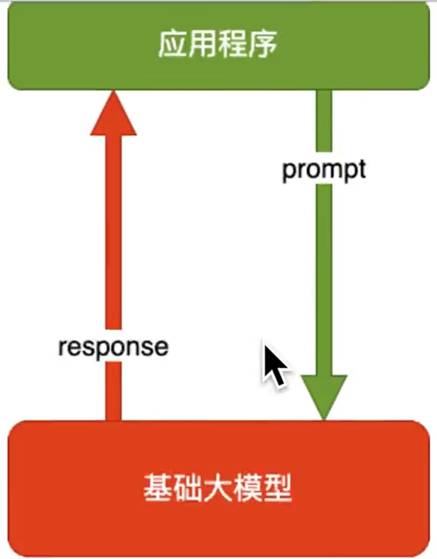
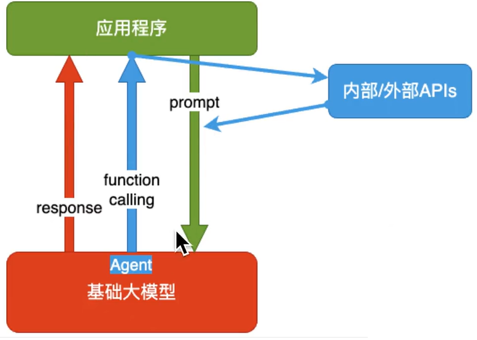
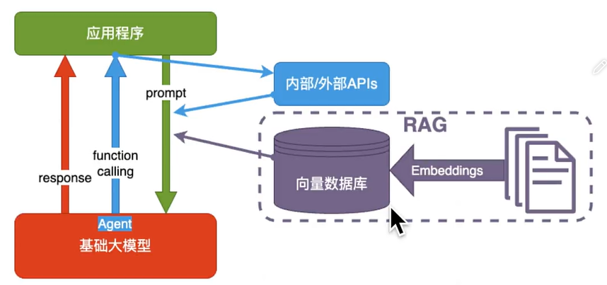
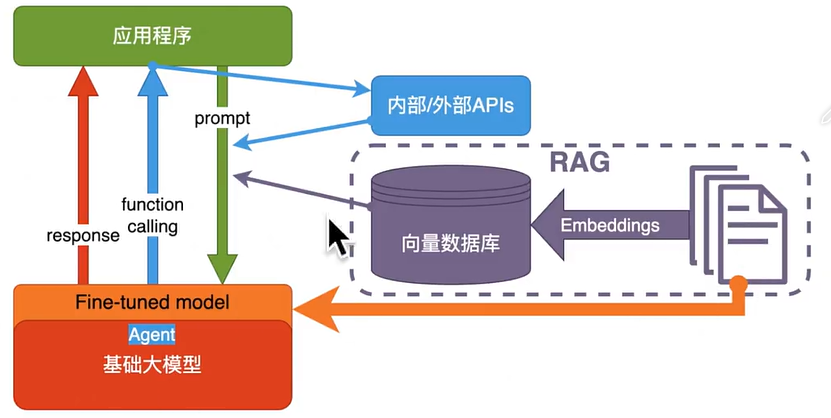

# 了解大模型

> AGl(Artificial General inteligence)：通用人工智能
>
> AI可能的问题：幻觉

## 生成机制

| 架构        | 设计者                     | 特点                                     |
| ----------- | -------------------------- | ---------------------------------------- |
| Transformer | Google                     | 最流行，几乎所有大模型都用它             |
| RWKV        | PENG BO                    | 可并行训练，推理性能极佳，适合在端侧使用 |
| Mamba       | CMU & Princeton University | 性能更佳，尤其适合长文本生成             |

目前只有 transformer 被证明了符合 scaling-law。

> 定义：Scaling-law（尺度定律）在大语言模型中指的是一种观察到的现象，即当模型规模（如参数量、训练数据量等）增加时，模型的性能（如预测准确性、生成文本的质量等）也会以某种方式提升。
>
> 核心要点：
>
> + **模型规模与性能的关系**：大语言模型的研究者发现，通过增加模型的参数量（N）、训练数据量（D）以及计算量（C），模型的性能（L）会随之提升。这意味着，更大的模型通常能处理更复杂的任务，产生更精确的结果。
> + **幂律关系**：scaling-law揭示了一个重要现象，即模型性能的提升与模型规模（参数量、数据量、计算量）的增加之间存在幂律关系。简单来说，就是当模型规模翻倍时，模型性能的提升幅度可能不仅仅是一倍，而是更高。
> + **模型结构与性能**：尽管模型的具体结构（如层数、深度、宽度等）对性能有一定影响，但相对于模型规模来说，这些因素的影响较小。在给定足够的模型规模时，不同的结构设计往往能带来相近的性能。

## 用好AI的核心方法

把AI当人看，数字神经网络和人脑的生物神经网络，在数学原理上是一样的。

## 大模型应用业务架构

+ AI Embedded 模式：假设有一个流程，针对某一个环节将AI给加进来（人脸识别项目）
+ AI Copilot 模式：针对每一个流程，都使用AI加以辅助（代码智能提示）
+ AI Agent 模式：用户提出一个要求，直接交给AI，AI自动生成所有的流程，全权交给AI处理事情

当前的关键：理清业务，拆出SOP。（SOP其实就像是一份详细的“说明书”或“菜谱”，它告诉我们如何一步一步地完成某个任务或操作。）

## 大模型应用技术架构

### 纯 Prompt

问一句，它回一句。。。

### Agent + Function Calling

+ Agent：AI 主动提要求
  + 这里的 Agent 和前面说的 Agent 模式不一样，这个 Agent 只能提出一个小的问题，不能生成完整的流程
+ Function Calling：AI 要求执行某个函数。
+ 举例：你问 ta 过年去哪玩，ta 先问你有多少预算

### RAG(Retrieval-Augmented Generation)

+ Embeddings：把文字转换为更易于相似度计算的编码。这种编码叫向量
+ 向量数据库：把向量存起来，方便查找
+ 向量搜索：根据输入向量，找到最相似的向量
+ 举例：考试答题时，到书上找相关内容，再结合题目组成答案，模型不会记忆输入

### Fine-tuning

适合微调的场景：

1. 提高模型输出的稳定性
2. 用户量大，降低推理成本的意义很大
3. 提高大模型的生成速度
4. 需要私有部署

## 大模型榜单推荐

[LMSYS Org](https://lmsys.org/)

[Chat with Open Large Language Models (lmsys.org)](https://arena.lmsys.org/)
