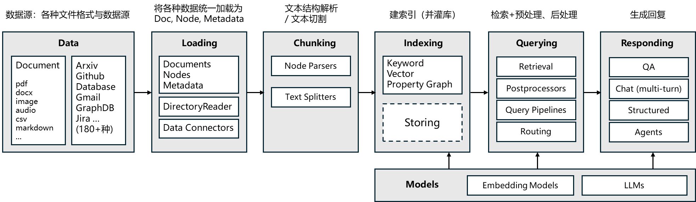

# LlamaIndex

> 开发大语言模型应用的框架
>
> LlamaIndex 是一个为开发「上下文增强」的大语言模型应用的框架（也就是SDK）。***上下文增强***，泛指任何在私有或特定领域数据基础上应用大语言模型的情况。
>
> 

## 安装

```shell
pip install llama-index
```

## Loading - 加载数据

### 加载本地数据

通过 `SimpleDirectoryReader` 可以便捷的加载本地文件，它会遍历指定目录，并根据文件扩展名自动加载文件。

```python
from llama_index.core import SimpleDirectoryReader

reader = SimpleDirectoryReader(
        input_dir="./data", # 目标目录
        recursive=False, # 是否递归遍历子目录
        required_exts=[".pdf"] # (可选)只读取指定后缀的文件
    )
documents = reader.load_data()
```

#### 特定文件加载器

对于 PDF 文件，默认的`PDFReader`效果并不理想，可以更换好一点的文件加载器。

```shell
pip install pymupdf
```

然后对指定后缀文件使用相应加载器

```python
from llama_index.core import SimpleDirectoryReader
from llama_index.readers.file import PyMuPDFReader

reader = SimpleDirectoryReader(
        input_dir="./data", # 目标目录
        recursive=False, # 是否递归遍历子目录
        required_exts=[".pdf"], # (可选)只读取指定后缀的文件
        file_extractor={".pdf": PyMuPDFReader()} # 指定特定的文件加载器
    )

documents = reader.load_data()

print(documents[0].text)
```

> 更多文件加载器可以在 [Llama Hub](https://llamahub.ai/) 上找到

### DataConnectors

除了加载本地的数据，还可以加载第三方服务提供的数据，比如Chroma、MongoDB等，这时可以用到Data Connectors。

[数据加载器](https://docs.llamaindex.ai/en/stable/module_guides/loading/connector/modules/)

## Chunking - 文本切分与解析

为方便检索，我们通常把 `Document` 切分为 `Node`。

在 LlamaIndex 中，`Node` 被定义为一个文本的 `chunk`。

### TextSplitters 文本切分

1、使用 `TokenTextSplitter` 解析普通文本文件

```python
from llama_index.core.node_parser import TokenTextSplitter

node_parser = TokenTextSplitter(
    chunk_size=100,  # 每个 chunk 的最大长度
    chunk_overlap=50  # chunk 之间重叠长度 
)

nodes = node_parser.get_nodes_from_documents(
    documents, show_progress=False
)
```

2、[`SentenceSplitter`](https://docs.llamaindex.ai/en/stable/api_reference/node_parsers/sentence_splitter/)：在切分指定长度的 chunk 同时尽量保证句子边界不被切断；

3、[`CodeSplitter`](https://docs.llamaindex.ai/en/stable/api_reference/node_parsers/code/)：根据 AST（编译器的抽象句法树）切分代码，保证代码功能片段完整；

4、[`SemanticSplitterNodeParser`](https://docs.llamaindex.ai/en/stable/api_reference/node_parsers/semantic_splitter/)：根据语义相关性对将文本切分为片段。

### NodeParsers 解析有结构文档

1、使用 `MarkdownNodeParser` 解析 markdown 文档

```python
from llama_index.readers.file import FlatReader
from llama_index.core.node_parser import MarkdownNodeParser
from pathlib import Path

md_docs = FlatReader().load_data(Path("./data/ChatALL.md"))
parser = MarkdownNodeParser()
nodes = parser.get_nodes_from_documents(md_docs)
```

2、`HTMLNodeParser`

3、`JSONNodeParser`

## Indexing&Querying - 索引与检索

### 向量检索

1、`SimpleVectorStore`内存中构建 VectorStore 以创建索引

```python
from llama_index.core import VectorStoreIndex, SimpleDirectoryReader
from llama_index.core.node_parser import TokenTextSplitter
from llama_index.readers.file import PyMuPDFReader

# 加载 pdf 文档
documents = SimpleDirectoryReader(
    "./data", 
    required_exts=[".pdf"],
    file_extractor={".pdf": PyMuPDFReader()}
).load_data()

# 定义 Node Parser
node_parser = TokenTextSplitter(chunk_size=300, chunk_overlap=100)

# 切分文档
nodes = node_parser.get_nodes_from_documents(documents)

# 构建 index
index = VectorStoreIndex(nodes)

# 获取 retriever
vector_retriever = index.as_retriever(
    similarity_top_k=2 # 返回前两个结果
)

# 检索
results = vector_retriever.retrieve("Llama2有多少参数")
```

2、自定义 VectorStore 以创建索引

需要借助于 StorageContext 关联第三方向量库

```python
from llama_index.vector_stores.chroma import ChromaVectorStore
from llama_index.core import VectorStoreIndex
from llama_index.core import StorageContext

chroma_client.reset() # 为演示方便，实际不用每次 reset
chroma_collection = chroma_client.create_collection("demo")

# 创建 Vector Store
vector_store = ChromaVectorStore(chroma_collection=chroma_collection)

# Storage Context 是 Vector Store 的存储容器，用于存储文本、index、向量等数据
storage_context = StorageContext.from_defaults(vector_store=vector_store)

# 创建 index：通过 Storage Context 关联到自定义的 Vector Store
index = VectorStoreIndex(nodes, storage_context=storage_context)

# 获取 retriever
vector_retriever = index.as_retriever(similarity_top_k=2)

# 检索
results = vector_retriever.retrieve("Llama2有多少参数")

show_list_obj(results)
```

### 更多索引与检索方式

LlamaIndex 内置了丰富的检索机制，例如：

- 关键字检索
    - [`BM25Retriever`](https://docs.llamaindex.ai/en/stable/api_reference/retrievers/bm25/)：基于 tokenizer 实现的 BM25 经典检索算法
    - [`KeywordTableGPTRetriever`](https://docs.llamaindex.ai/en/stable/api_reference/retrievers/keyword/#llama_index.core.indices.keyword_table.retrievers.KeywordTableGPTRetriever)：使用 GPT 提取检索关键字
    - [`KeywordTableSimpleRetriever`](https://docs.llamaindex.ai/en/stable/api_reference/retrievers/keyword/#llama_index.core.indices.keyword_table.retrievers.KeywordTableSimpleRetriever)：使用正则表达式提取检索关键字
    - [`KeywordTableRAKERetriever`](https://docs.llamaindex.ai/en/stable/api_reference/retrievers/keyword/#llama_index.core.indices.keyword_table.retrievers.KeywordTableRAKERetriever)：使用[`RAKE`](https://pypi.org/project/rake-nltk/)算法提取检索关键字（有语言限制）

- RAG-Fusion [`QueryFusionRetriever`](https://docs.llamaindex.ai/en/stable/api_reference/retrievers/query_fusion/)

- 还支持 [KnowledgeGraph](https://docs.llamaindex.ai/en/stable/api_reference/retrievers/knowledge_graph/)、[SQL](https://docs.llamaindex.ai/en/stable/api_reference/retrievers/sql/#llama_index.core.retrievers.SQLRetriever)、[Text-to-SQL](https://docs.llamaindex.ai/en/stable/api_reference/retrievers/sql/#llama_index.core.retrievers.NLSQLRetriever) 等等


### Ingestion Pipeline 自定义数据处理流程

LlamaIndex 通过 `Transformations` 定义一个数据（`Documents`）的多步处理的流程（Pipeline）。

这个 Pipeline 的一个显著特点是，***它的每个子步骤是可以缓存（cache）的***，即如果该子步骤的输入与处理方法不变，重复调用时会直接从缓存中获取结果，而无需重新执行该子步骤，这样即节省时间也会节省 token （如果子步骤涉及大模型调用）。

```python
from llama_index.vector_stores.chroma import ChromaVectorStore
from llama_index.core import StorageContext
from llama_index.embeddings.openai import OpenAIEmbedding
from llama_index.core.node_parser import SentenceSplitter
from llama_index.core.extractors import TitleExtractor
from llama_index.core.ingestion import IngestionPipeline
from llama_index.core import VectorStoreIndex
from llama_index.readers.file import PyMuPDFReader
import nest_asyncio
nest_asyncio.apply() # 只在Jupyter笔记环境中需要此操作，否则会报错

chroma_client.reset() # 为演示方便，实际不用每次 reset
chroma_collection = chroma_client.create_collection("ingestion_demo")

# 创建 Vector Store
vector_store = ChromaVectorStore(chroma_collection=chroma_collection)

pipeline = IngestionPipeline(
    transformations=[
        SentenceSplitter(chunk_size=300, chunk_overlap=100), # 按句子切分
        TitleExtractor(), # 利用 LLM 对文本生成标题
        OpenAIEmbedding(), # 将文本向量化
    ],
    vector_store=vector_store,
)

documents = SimpleDirectoryReader(
    "./data", 
    required_exts=[".pdf"],
    file_extractor={".pdf": PyMuPDFReader()}
).load_data()

# 计时
with Timer():
    # Ingest directly into a vector db
    pipeline.run(documents=documents)

# 创建索引
index = VectorStoreIndex.from_vector_store(vector_store)

# 获取 retriever
vector_retriever = index.as_retriever(similarity_top_k=1)

# 检索
results = vector_retriever.retrieve("Llama2有多少参数")

show_list_obj(results[:1])
```


本地保存 `IngestionPipeline` 缓存

```python
pipeline.persist("./pipeline_storage")

new_pipeline = IngestionPipeline(
    transformations=[
        SentenceSplitter(chunk_size=300, chunk_overlap=100),
        TitleExtractor(),
        OpenAIEmbedding()
    ],
)

# 加载缓存
new_pipeline.load("./pipeline_storage")

nodes = new_pipeline.run(documents=documents)
```

此外，也可以用远程的 Redis 或 MongoDB 等存储 `IngestionPipeline` 的缓存，具体参考官方文档：[Remote Cache Management](https://docs.llamaindex.ai/en/stable/module_guides/loading/ingestion_pipeline/#remote-cache-management)。

### 检索后处理

重排序

```python
from llama_index.core.postprocessor import SentenceTransformerRerank

# 检索后排序模型
postprocessor = SentenceTransformerRerank(
    model="BAAI/bge-reranker-large", top_n=2
)

nodes = postprocessor.postprocess_nodes(nodes, query_str="Llama2 能商用吗?")

for i, node in enumerate(nodes):
    print(f"[{i}] {node.text}")
```

## Responding - 生成回复

### 单轮对话

通过 Query Engine 进行单轮问答

```python
qa_engine = index.as_query_engine()
response = qa_engine.query("Llama2 有多少参数?")

print(response)
```

流式输出

```python
qa_engine = index.as_query_engine(streaming=True)
response = qa_engine.query("Llama2 有多少参数?")
response.print_response_stream()
```

### 多轮对话

通过 Chat Engine 进行多轮对话

```python
chat_engine = index.as_chat_engine()
response = chat_engine.chat("Llama2 有多少参数?")
print(response)

response = chat_engine.chat("How many at most?")
print(response)
```

流式输出

```python
chat_engine = index.as_chat_engine()
streaming_response = chat_engine.stream_chat("Llama 2有多少参数?")
for token in streaming_response.response_gen:
    print(token, end="")
```

## 底层接口

### `Prompt` 模板

1、`PromptTemplate` 定义提示词模板

```python
from llama_index.core import PromptTemplate

prompt = PromptTemplate("写一个关于{topic}的笑话")
prompt.format(topic="小明")
```

2、`ChatPromptTemplate`定义多轮消息模板

```python
from llama_index.core.llms import ChatMessage, MessageRole
from llama_index.core import ChatPromptTemplate

chat_text_qa_msgs = [
    ChatMessage(
        role=MessageRole.SYSTEM,
        content="你叫{name}，你必须根据用户提供的上下文回答问题。",
    ),
    ChatMessage(
        role=MessageRole.USER, 
        content=(
            "已知上下文：\n" \
            "{context}\n\n" \
            "问题：{question}"
        )
    ),
]
text_qa_template = ChatPromptTemplate(chat_text_qa_msgs)

print(
    text_qa_template.format(
        name="瓜瓜",
        context="这是一个测试",
        question="这是什么"
    )
)
```

### 大语言模型

```python
from llama_index.llms.openai import OpenAI

llm = OpenAI(temperature=0, model="gpt-4o")

response = llm.complete(prompt.format(topic="小明"))

print(response.text)
```

设置全局使用的模型

```python
from llama_index.core import Settings

Settings.llm = OpenAI(temperature=0, model="gpt-4o")
```

除 OpenAI 外，LlamaIndex 已集成多个大语言模型，包括云服务 API 和本地部署 API，详见官方文档：[Available LLM integrations](https://docs.llamaindex.ai/en/stable/module_guides/models/llms/modules/)

### Embedding 模型

```python
from llama_index.embeddings.openai import OpenAIEmbedding
from llama_index.core import Settings

# 全局设定
Settings.embed_model = OpenAIEmbedding(model="text-embedding-3-small", dimensions=512)
```

