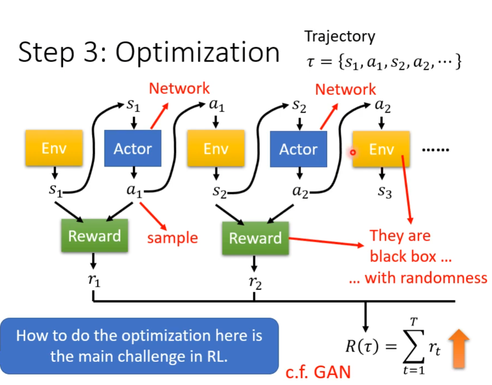
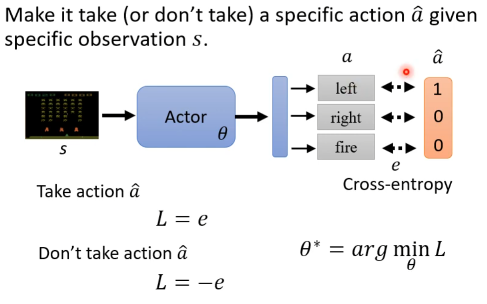
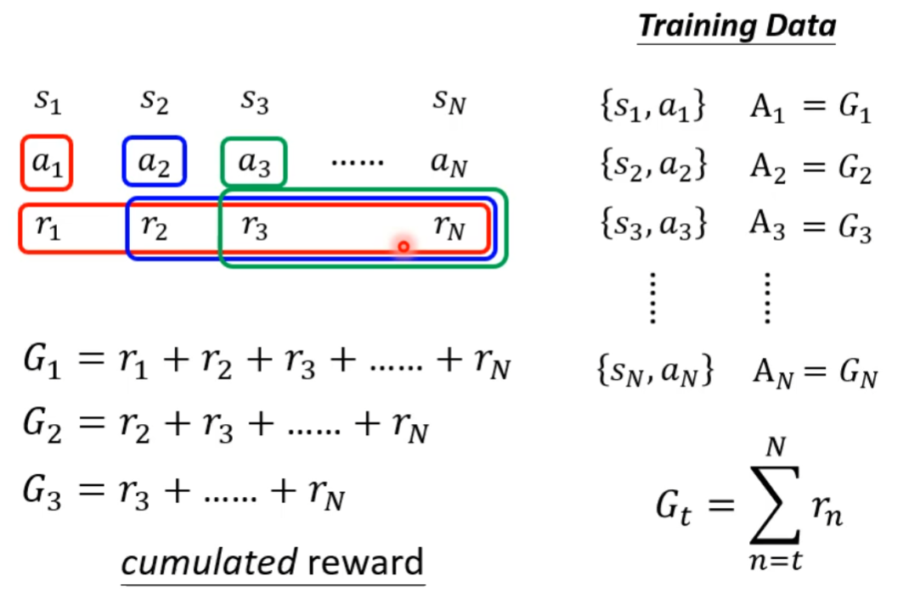
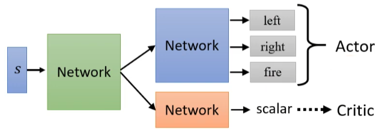
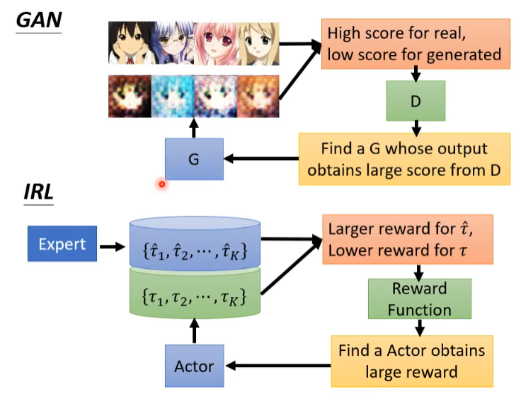

# 深入强化学习

> Deep Reinforcement Learning

## 什么是RL

机器学习 $\mathop{=}\limits_{近似}$ 寻找一个函数，主要有三个步骤 ，而强化学习也一样

1. 有未知数的Function
2. 根据训练数据定义loss
3. 优化

一整轮的（observation + action + reward）就是一个episode

所有的reward（total reward，也称之为return）：$R=\sum\limits^{T}_{t=1}r_t$，而这个total reward也就是我们想要去最大化的

因此 $-total \ reward$ 就是我们的损失函数

## Policy Gradient

如何控制我们actor的输出？可以把他当成一个分类的问题

假如我们希望模型采用一个行为，我们就希望$a$与$\hat{a}$的距离越近越好，这个距离就是$e$，所以我们的损失函数就是$L=e$，如果我们不希望模型进行这个行为，我们可以设置损失函数为$L=-e$

更进一步，我们可以对不同的行为进行加权，强烈希望他做的，加权越高，不那么强烈的加权较小，也就是
$$
L=\sum A_n e_n \\
\theta^* = arg \mathop{min}\limits_{\theta}L
$$

### 方案

**Version 0**

在每个episodes中记录每一步的action，如果这个action的reward大于0，我们认为这个action是好的，否则是坏的。

但是一个行动会影响后续的观察结果，从而影响后续的奖励。

所以我们必须要懂得**奖励延迟**:action必须牺牲即时奖励以获得更多长期奖励。

**Version 1**

计算当前行为对后续动作的所有reward和，哪个大就说明那个动作好

但是这样处理会产生一个结果就是当序列特别长的时候，第一个动作总是分最高，但是把这个当成最好的有点不太合理 

**Version 2**

针对version1的缺陷做了一点的修改，就是添加了一个折扣因子$\gamma < 1$，如下
$$
G_1^{'} = r_1 + \gamma r_2 + \gamma^2 r_3 + ... \\
G_t^{'} = \sum_{n=t}^N\gamma^{n-t}r_n
$$
**Version 3** 

因为好坏是个相对的概念，有的环境不过什么样的行为都会加分，但是我们并不希望它做

因此我们可以定一个baseline b，对每一个得分都减去这个b，这样得分就既有正数又有负数了

### 步骤

+ 初始化actor网络的参数$\theta^0$
+ 对于每个迭代$i = 1 \ to \ T$
  1. 使用actor参数$\theta^{i-1}$去与环境做互动
  2. 在互动中获得这个episodes的action
  3. 计算这些action的得分$A_1、A_2、A_3、...$
  4. 计算损失loss
  5. $\theta^i \gets \ \theta^{i-1} \gets - \eta \nabla L$

**On-policy**

要被训练的actor和要与环境互动的actor是同一个的时候，这种训练叫做On-Policy的学习

**Off-policy**

要被训练的actor和要与环境互动的actor是分开着的，我们需要训练的actor是根据其他actor跟环境互动的经验来进行学习的，通过这种方法我们就不必在每次更新时收集数据了

有一种经典的Off-Policy的方法 — proximal policy optimization(PPO)

对于目前来说Off-Policy的重点就是要被训练的actor要知道它和环境互动的那个actor的差异，打个比方就是你自己去和别人搭讪和彦祖和别人搭讪的区别

**Exploration**

收集数据注意随机性，不然模型可能训练不起来

## Actor-Critic

> critic：有一个actor$ \theta$，critic能判断对于一个observing（比如某个游戏画面）这个actor能得到多少reward
>
> critic有很多不同的变形，有的critic只是看游戏画面来判断，有的critic是看到某个游戏画面，然后又观察到一个actor，在这两者都具备的前提下，判断接下来会有多少reward

1、下面介绍一个常用的critic：Value Function，其用$V^\theta(s)$来表示

他的输入是s（比如游戏的状况，界面），而上标\theta代表的是所观察的这个actor的参数是\theta，而Value Function的输出是一个Scalar，而这个Scalar代表的时候当使用actor $\theta$ 时看到s这个环境能获得的discounted cumulated reward（就是之前的那个加权累加和）

2、Critic是怎么被训练出来的？

+ Monte-Carlo（MC）
  + 使用$actor \ \theta$和环境进行多轮互动
  + 输入一个$S_a$给$V^\theta(s)$时，他所输出的scalar要与$G_a^{’}$越接近越好

+ Temporal-difference（TD）
  + 无需玩完整句游戏就能对s和actor作出评价

$$
V^\theta(s_t) = r_t + \gamma r_{t+1} + \gamma^2 r_{t+2} … \\

V^\theta(s_{t+1}) = r_{t+1} + \gamma r_{t+2} + \gamma^2 r_{t+3} … \\

V^\theta(s_t) = r_t + \gamma V^\theta(S_{t+1})
$$

让 $V^\theta(s_t) - \gamma V^\theta(S_{t+1}) \leftrightarrow r_t$ （约等于）

**version 3.5**

那么critic如何被用在训练actor上，在version 3版本中，cumulative reward加权累和后需要减去一个b来进行normalization，但是这个b怎么选择呢？b用$V^\theta(s)$替代是一个比较好的方式，如下
$$
A_1 = G_1^{'} - b \Rightarrow  A_1 = G_1^{'} - V^\theta(s_1) \\
A_2 = G_2^{'} - b \Rightarrow  A_2 = G_2^{'} - V^\theta(s_2) \\
...
$$
那为什么用b替代$V^\theta(s)$是一个比较好的方法

$V^\theta(s)$代表的是各种不同的actor平均的reward

如果$A_t > 0$，则代表$a_t$这个行为比平均结果好

如果$A_t < 0$，则代表$a_t$这个行为比平均结果差

**version 4**

上面v3的版本被减数某一个样例的结果，而$V^\theta(s)$代表的是平均结果，因此如果被减数也是平均值结果会更好，如下，Advantage Actor-Critic
$$
A_t = r_t + V^\theta(s_{t+1}) - V^\theta(s_t)
$$
训练actor-critic的小技巧

他们可能会共用到前面网络的参数

了解更多：

目前还可以直接利用critic来得到要进行那个actor，参见1710.02298

## Reward Shaping

sparse reward：假如绝大多数actor的reward都是0，那该怎么办？

添加额外的reward，就好比想要想要成佛，但是很难很难直接成佛，可以在中间多设置几个阶位，低中高，慢慢一步一步的引导agent的走向成功，这就是reward shaping

还有种方法就是Curiosity：当agent看到了（有意义的）新东西就获得额外的加分（—— Curiosity Driven Exploration by Self-Supervised Prediction）

项目例子VizDoom

## No Reward

Learning from Demonstration：从示例中学习

有些行为可能很难定义reward，比如闯红灯和礼让行人，这些东西很难取定义reward

 有种Inverse Reinforcement Learning的方法就是让机器自己从环境和Expert示范中学习Reward Function

准则：the teacher is always the best

基本想法：

1. 初始化一个actor
2. 在每个迭代中
   1. 使用actor与环境交互获得一些trajectories
   2. 定义一个reward function，使teacher的trajectories是最好的
   3. actor学习去最大化reward function
3. 输出reward function以及所学习到的actor

**IRL与GAN的关系**

