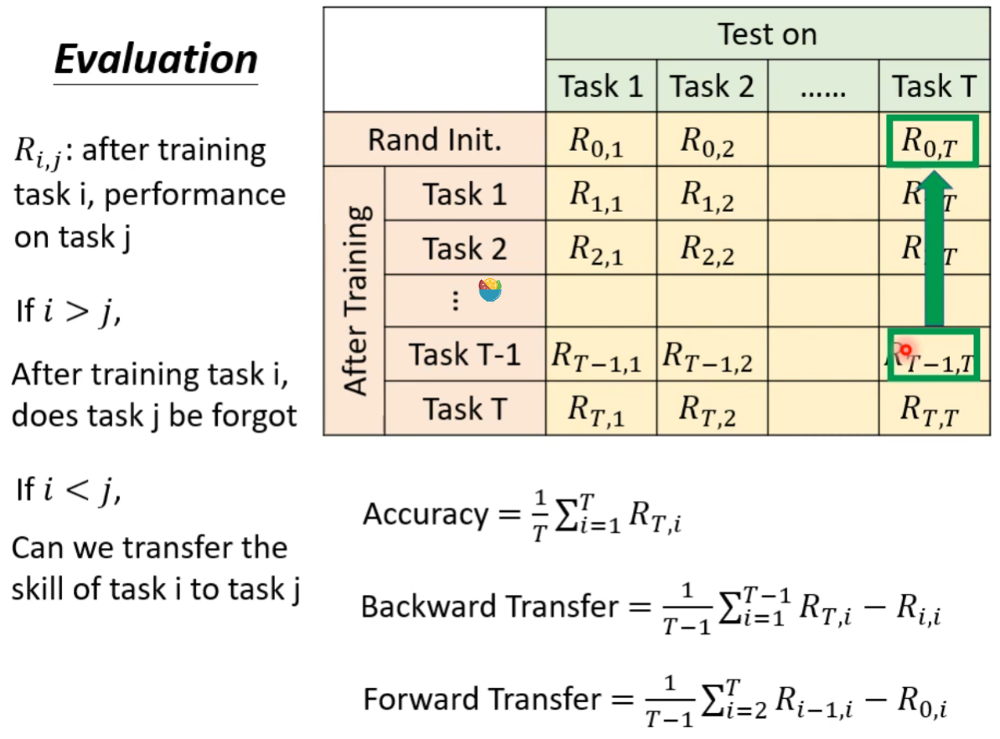
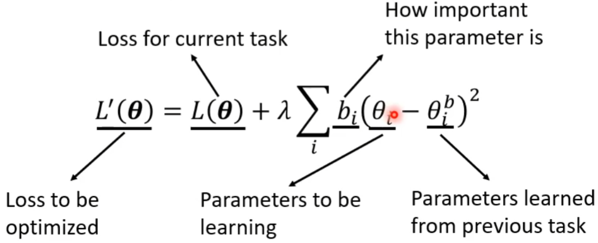
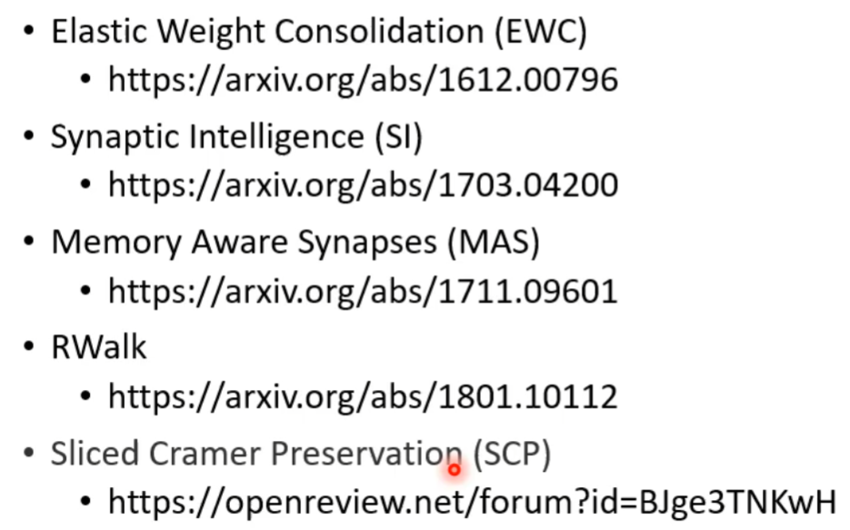
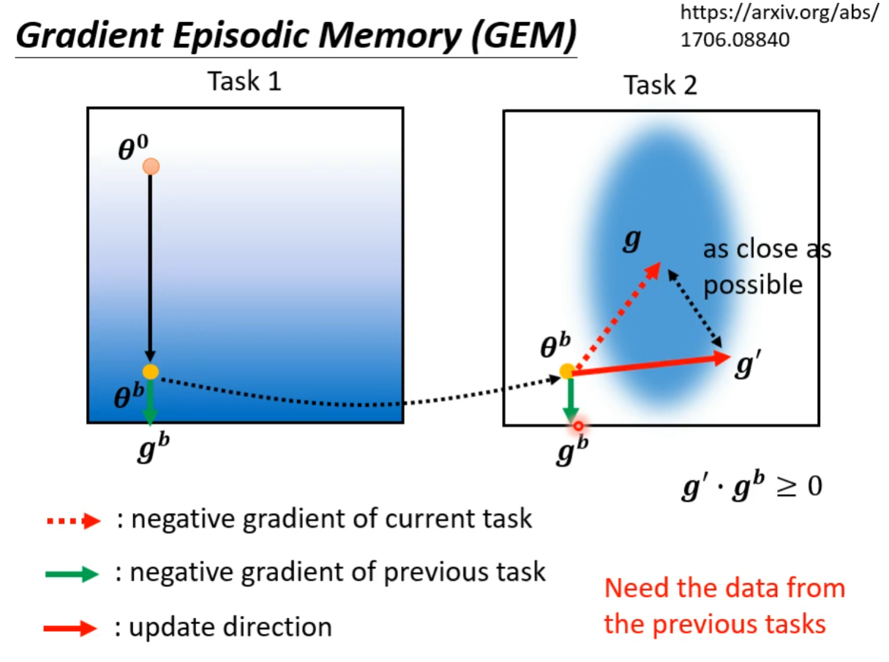

# 机器终生学习

## Catastrophic Forgetting

案例：

+ 比如有一个文字识别的例子，开始有两组训练资料
+ 先用资料1训练模型后再测试，对于资料1能获得90%的正确率
+ 在资料2上，虽然不是用资料二训练的，但也能在此训练集上拥有96%的正确率
+ 接下来再在资料2上对资料1训练好的模型继续训练，测试发现在资料2上的正确率更高了，但是模型在资料1上的正确率下降了10%，也就是说它忘记之前所学习的东西了
+ 可能有人会觉得是因为模型的容量有限，多学一点忘记前面的很正常
+ 但是实验发现，如果将资料1和资料2混合起来训练模型，对资料1和资料2上的正确率分别能达到89%和98%，这说明模型容量足够去容纳两个资料集，但是只要分开来训练模型就会遗忘掉先训练的东西

这就是“是不为也，非不能也”

通过**多任务训练可以解决这个问题**，就是一次性把所有任务的训练资料拿出来进行训练，但是这种做法有极大的限制。

通常多任务训练可以认为Life Long Learning的上界

如何评估？

+ $R_{i,j}$：在进行任务 i 的训练后，在任务 j 上所展现的性能
+ 如果$i > j$：在进行 i 任务的训练后，模型在任务 j 上会遗忘多少
+ 如果$i < j$：能迁移多少在任务 i 上所学习到东西到任务 j 上

最常见的评判标准就是求训练完最后一个任务时，对所有任务测试正确率的平均值

Backward Transfer测得是最后一个任务训练完后，对应正确率与刚训练完模型正确率的差值的平均值，其值往往是负数，通常不要太负就挺好

Forward Transfer测的是模型的迁移能力，通常不考虑

## 解决方案

### 选择可塑神经

> Selective Synaptic Plasticity

Regularization-based Approach：模型中有的节点需要被固化，仅选择可塑性高进行修改

一些参数在模型中对前一个任务是非常重要的。仅修改那些不重要的参数

+ $\theta^b$是模型从之前任务所学习到的参数
+ 给每一个参数$\theta^b_i$一个守卫$b_i$，它代表着这个参数对上一个任务的重要程度

新的损失函数如下

要注意的是，只要一些参数$\theta$和$\theta^b$接近就行，并不是所有的，这个可以通过$b_i$来调节

+ 如果$b_i = 0$，也就是对$\theta_i$没有限制  -->  这会导致 Catastrophic Forgetting
+ 如果$b_i = \infty$，参数$\theta$和$\theta^b$几乎一摸一样  -->  这会导致 Intransigence，顽固的，旧的确实不会忘，但是学习不到新的东西

$b_i$通常是人为设定的 

相关论文 —— EWC，MINST permutation， from the original EWC paper

相关设置$b_i$的方法

**Gradient Episodic Memory**

这种做法需要之前任务的训练资料，有点违反LLL的规则了，但是如果这个资料占的不是太多也是能接受的

### 额外的网络资源分配

> Additional Neural Resource Allocation

1、Progressive Neural Networks：每训练一个新的任务时，都新建一个网络，不动原始的网络，虽然这样能解决问题，但是网络的大小会随着任务的增多而增多

2、PackNet：首先开一个大的网络，每次训练网络时只使用部分的参数，其他参数暂时闲置，但是这种方法迟早会将整个网络模型的参数用尽，所以也不是一个非常好的办法

3、还有一个就是结合Picking和Growing两种办法（CPG），即可以新开模型，每次使用模型时也只使用部分

### 内存依赖

> Memory Reply

1、Generating Data：通过Generator为之前的数据产生一些伪数据，然后利用这个伪数据和要进行训练任务的数据结合起来训练。

2、添加新类别

+ Learning without forgetting  —— 1606.09282
+ Incremental Classifier and Representation Learning —— 1611.07725

three scenarios for continual learning —— 1904.07734

3、调换训练顺序

有时调换训练的顺序可能会有好的改善，这就叫做Curriculum Learning

# 神经网络压缩

网络通常可以被修剪，存在大量重复的权重和神经元

Network Pruning：网络修剪

+ 评估某个参数的重要性
  + 使用绝对值，有的绝对值越大，可以影响就越大，反之...
  + 采用机器终生学习的理论，添加参数b，以此来评估模型的重要性
+ 评估某个神经元的重要性
  + 看这个神经元大多数时候是不是为0

在修剪后，正确率可能会下降，我们可以通过在训练集上微调来恢复

要注意，以此不能修剪网络太多，否则可能恢复不了

**存在的问题**

+ Weight pruning

将参数修剪后网络架构可能会变得不规则，而且很难去实现，有时只能通过去补0来进行修剪，但是这越等于没有修剪，而且网络架构不规则时，很难使用GPU加速

+ Neuron pruning

通过神经元修剪后，网络架构是规则的，并且容易实现，容易加速

**为什么要修剪**

既然我们想把大的network修剪成小的network，那为什么不直接训练一个小的network，还要这么多此一举干什么？

因为通常小的network很难去训练，而大的network很容易训练成功

Lottery Ticket Hypothesis大乐透假说对此做了一定的解释，因为大的模型可以看成是多个小的模型构成，而小的模型就像一次买一张彩票，很难中奖，而大模型就是一次性买大量的彩票，只要有一张中了，那就是win

