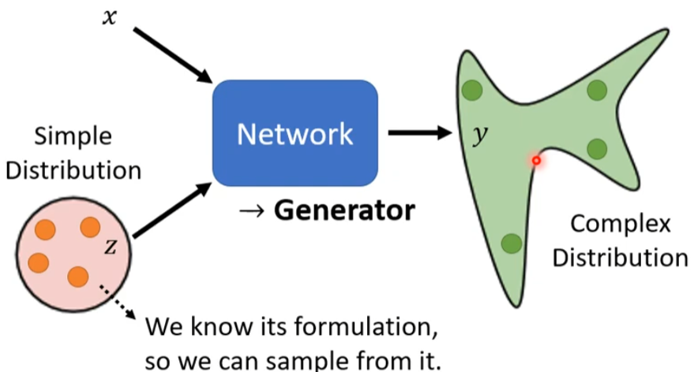
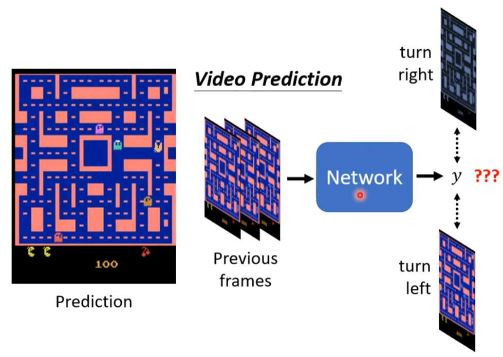
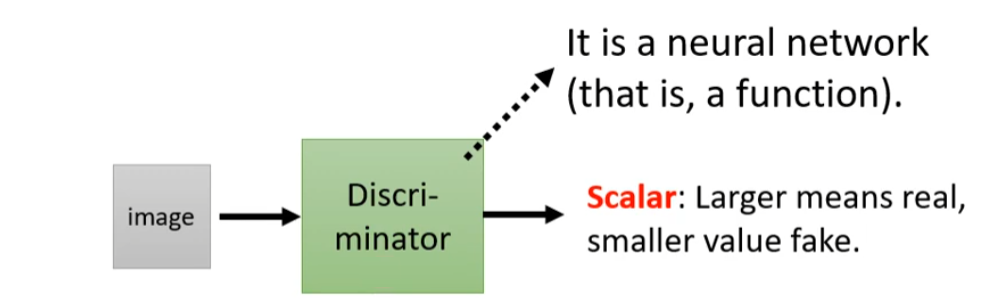
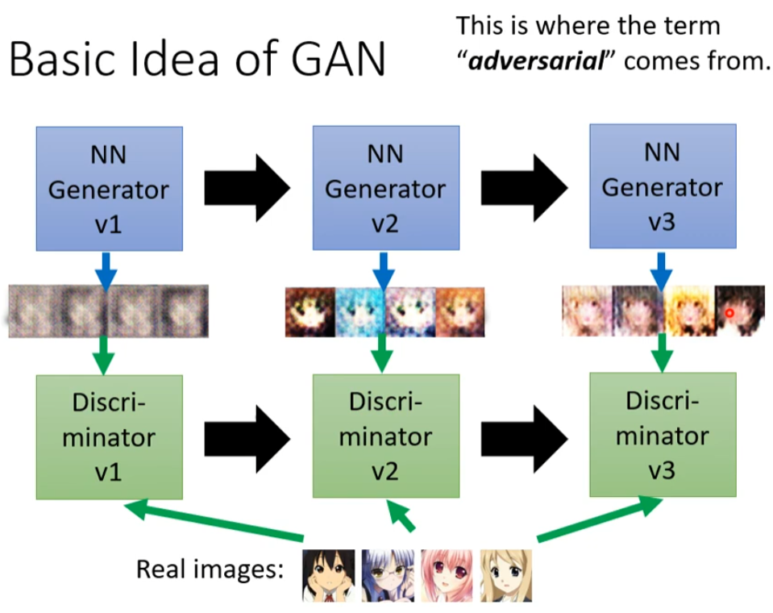
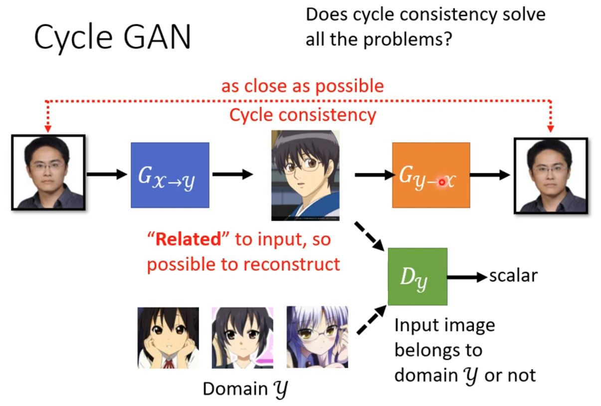
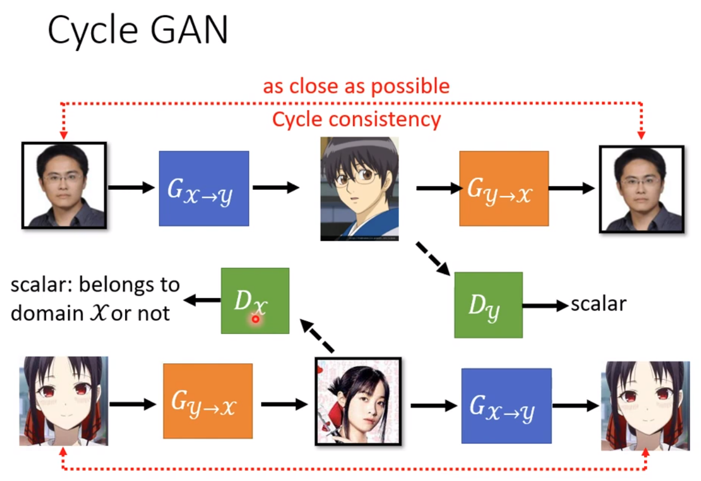

# GAN

## Network as Generator

将网络当成一个生成器

每次输入到网络的东西，不再是单一的一个x，而是将x和z一起投入到网络中，z必须是一个我们知道的一个简单分布

然后网络就会根据不同的输入产生不同的复杂分布

**那为什么输出要是一个分布？**

当一个训练资料对应的输出有两种结果，这两种结果都是对的，于是网络不能分辨出具体往哪走是对的，于是就可能产生一个向两个不同方向走的错误结果

为了避免这种情况，可以在输入里添加一个随机分布，然后会输出一个随机分布，在不同分布有不同的方向的输出

简单说就是，**任务需要有一定的创造性，相同的输入可能会产生不同的输出**，比如：

+ 绘画
+ 聊天

## Discriminator

判别器

Discriminator也是一个我们自己设计的网络（CNN，Transformer），用来对Generator生成的输出进行判别

## Basic Idea of GAN

+ 第一代的Generator因为没有学习，所以输出的图片非常乱，而Discriminator就将输出的图片和真实图片进行对比，差异大的就被抛弃
+ 第二代的Generator就不断学习能欺骗过discriminator的网络，而discriminator也不断学习能辨别出生成图与真实图的网络
+ 就这样一代一代的循环下去，一个生成网络，一个辨别网络，这两个网络就像在对抗，所以称之为生成对抗网络

### 算法详情

1、初始化generator和discriminator的网络参数

2、在每个训练迭代中：

+ step1：固定住Generator网络的参数，并更新Discriminator网络的参数
  + Discriminator学习给输入的图片打分，真实的图片分越高，生成的图片分越低
+ step2：固定住Discriminator网络的参数，并更新Generator的网络参数
  + 将向量输入到Generator网络中，这时网络模型中的某一个隐藏层的参数进行一定操作就变成一张图片
  + 将图片输入到Discriminator网络中，会产生一个分数
  + Generator就不断学习，使这个产生的分数变高

## 理论介绍 

GAN首先将一个已知分布（如正态分布）投入到Generator中，然后网络就会生成一个$P_G$以及一个$P_{Data}$，$P_G$代表生成的一个分布，而$P_{Data}$代表真实数据的分布，可以把他们都看作一个一维的向量

我们希望训练的结果使$P_G$和$P_{data}$这两个分布非常靠近，也就是希望训练一组参数（Generator网络中的参数），使得投入向量所产生的结果与真实数据分布十分相似，我们令
$$
G^* = arg \min_G Div(P_G, P_{data}) \qquad\qquad G^*代表Generator中的参数
$$
正常情况下我们要知道两个值的具体形式，然后才能计算损失值，但是在GAN里生成的是两个分布，所以这并不好计算，但是GAN神奇的一点就在于他可以通过Discriminator来间接的计算损失

我们知道Discriminator可以给越真实的图片打高分，虚假的图片打低分，所以我们最小化$P_G$和$P_{data}$这两个分布的问题可以转化为最大化两类打分数值的情况，也就是训练一组参数（Discriminator网络中的参数），使得虚假图片和真实图片的得分差异明显，我们令
$$
D^* = arg \max_D V(D, G) \qquad\qquad D^*代表Discriminator中的参数
$$
而$\max_D V(D, G)$是与JS Divergence（JS散度，用来衡量两个分布的差异）有关

相应的目标函数就如下所示（最小化的成为Loss Function，最大化的成为Objective Function）
$$
V(G, D) = E_{y \sim P_{data}}[logD(y)] + E_{y \sim P_{G}}[log(1-D(y))]
$$

## 模型评价

对于生成人脸的，可以使用人脸检测系统，比如生成了1000张图片，一个模型检测出了900个人脸，另一个模型检测出了300个人脸，那么这就很容易比较出那个模型更好

### 质量

如果是产生的各种类别的动物呢，那该如何判别？这也可以引入一个影像分类系统，将生成出来的图片投入系统后，如果系统判别出来的结果非常的集中与一个类别，就说明这个GAN很好，如果判别的分类柱状图比较平滑，也就是产生的东西是一个四不像，判别系统不能肯定的判别出，就说明GAN训练的不好

但是这也会产生新的问题，Mode Collapse（模型堆叠），这会导致模型训练出来的图片越来越只和某一张图片相似，到最后输入任何向量，输出的只有一个相同的图片，这是因为模型可能有个盲点，这个盲点一定能骗过Discriminator，于是模型就会往这个盲点靠拢，导致输出越来越相似

### 多样性

产生的类别越多， 影像判别的分类柱状图比较平滑

所以质量和多样性是互斥的

### IS

有一个评判标准（Inception Score，IS）就是基于质量和多样性的，质量越好，多样性越高IS就越大

### FID

Frechet Inception Distance

神经网络最后一个将要投入到分类器的层，这个层可能有上千个值，我们将这些数值放在一个二维平面中，假设他是一个高斯分布，然后计算它，同理也计算出真实分布的值，然后再进行比较分布差异性

## 条件生成

可能根据输入的文字（text to image）/图片（image transition / pix2pix）来控制输出的内容

训练Discriminator时，如果输入的文字和输出的图片相匹配，并且图片符合描述的分值越高

如果输入的文字会产生乱七八糟的图片，分值越低，或者生成的图片可以，但是不匹配文字，分值也越低

还有听一段声音，输出一张图片

## Cycle GAN

训练一个$G_{x \to y}$的网络，它能将真实图片转为其他风格的图片

再训练一个$D_y$网络他能判断所输入的图片是否输入其他风格的类型

但是$G_{x \to y}$网络生成出来的图片可能和他的输入没有任何关系，并且$D_y$的评分也很高

为了防止这种情况发生，所以再训练一个$G_{y \to x}$的网络，能将其他风格的图片还原回真实图片（但是这种情况往往很少发生，因为神经网络更倾向于做类似的变换）

StarGAN可能进行多种风格的转换
