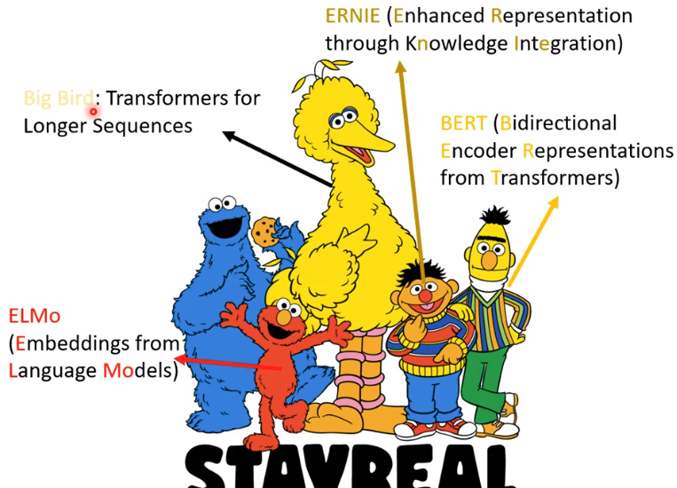
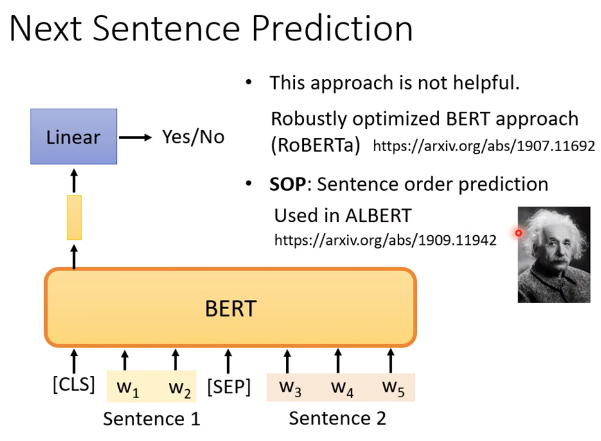
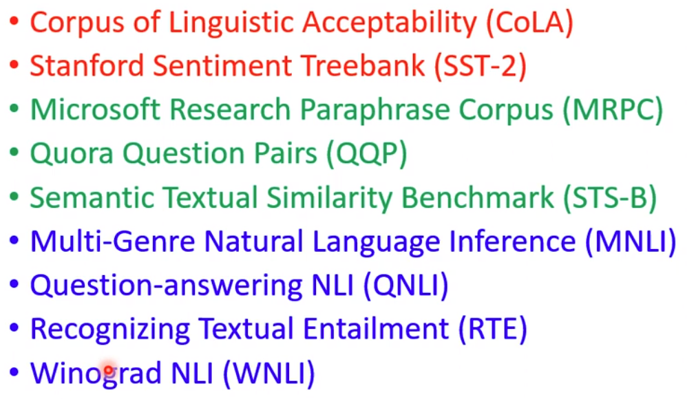
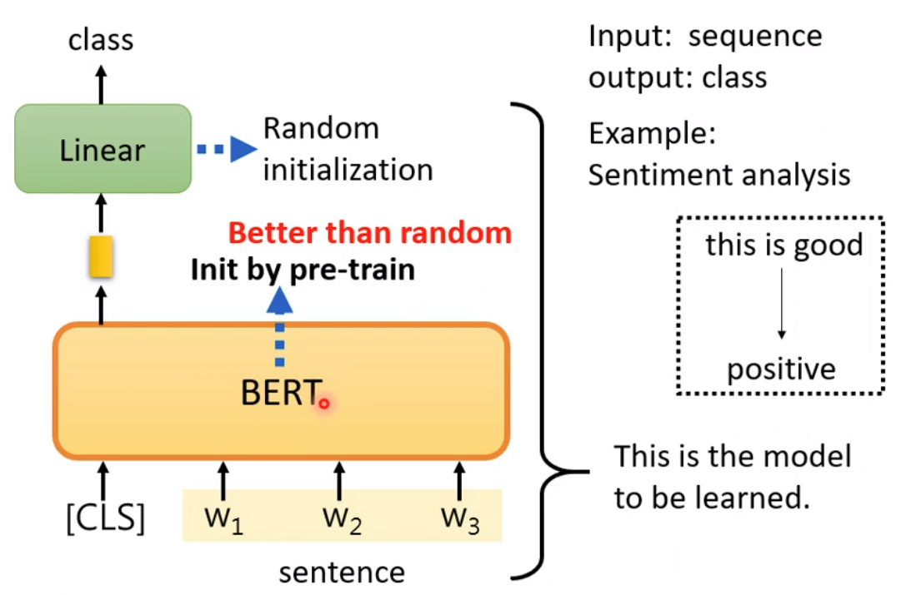
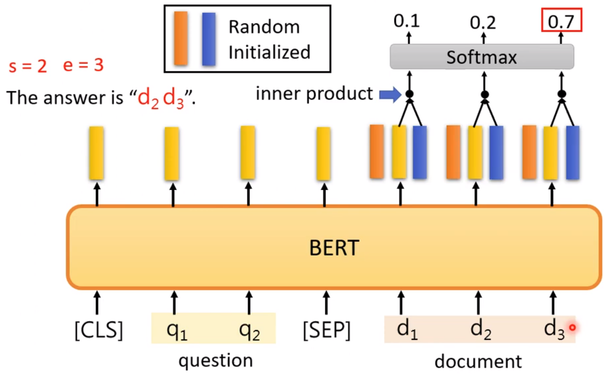
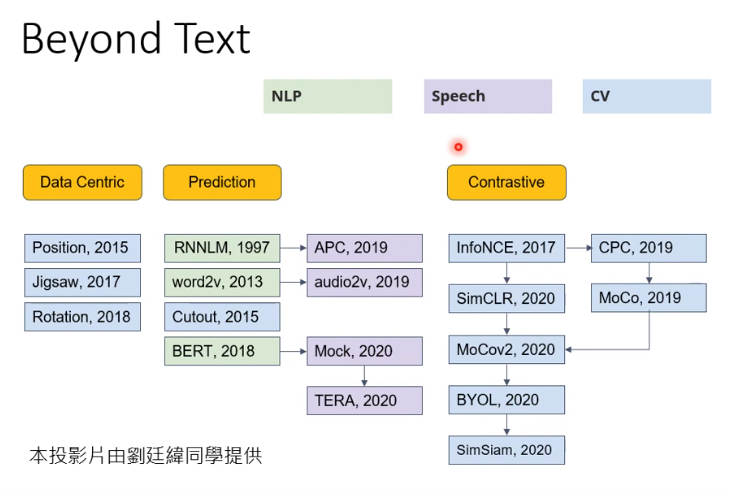

# 自监督学习

1. 有大量没有标注的资料，用这些没有标注的资料可以训练一些模型
2. 想一些不需要标注过的资料的任务进行模型的学习，比如
   1. 预测填空内容
   2. 预测下一个单词
3. 这个不需要标注资料的模型学习就称为自监督学习或者`Pre-Train`
4. 虽然训练出的这个能填空或者预测下一个单词的模型不一定有用，但是只要就行一点点的微调就能处理很多下游的任务

## BERT

### 由来

BERT芝麻街的一个角色名，有340M参数

+ ELMO：94M
+ BERT：340M
+ GPT-2：1542M
+ Megatron：8B

常用来自然语言处理，输入一段seq，输出另一段seq

### Masked token Prediction

1、将输入的sequence进行masking操作

+ 直接遮住（有一种代表遮住的特殊字符表示）
+ 用一个随机字符替换

2、通过Transformer Encoder后，会输出一段seq，找到对应被遮住的输出，然后将其变换为一个Linear，在对其softmax操作，会输出一个向量，对应可能对应值的概率分布

3、我们需要做的就是最小化真实值（被mask的值）与预测概率最大的差距

### Next Sentence Prediction

输入两个sentence（特殊字符SEP标注，将其分开），通过开始特殊字符（CLS）产生的Linear判断这两个句子是否相接

### Downsteam Tasks

真正关心的东西，只需要一点标注的数据集

自监督学习 ---Pre-Train--->  Bert  ---->   通过Bert模型能进行一系列的子任务

预训练好的BERT可以看成一个微调fine-tune

## GLUE标准

General Language Understanding Evaluation，一种评判标准，包含9种策略，可以来评判BERT的好坏

有了BERT，机器在处理自然语言方面有更进了一步

## BERT用例

### Sentiment analysis

假如要做一个判断语句正面还是负面的模型

+ 输入由开始字符（CLS）和输入的句子构成
+ 通过BERT这个模型
+ BERT产生一系列输入，但是只看CLS对应的输出
+ 将这个输出转为Linear，然后再通过一个分类器，在这里就是判断正面还是负面的分类器

上面一整个步骤就是我们要学的模型，而我们需要随机初始化的参数只有Linear这个层，BERT这个模型的参数是通过之前填空（Masked Token Prediction）训练出来的，训练出的这个BERT会使整个模型变得更优

> 在学习填空时，属于无监督学习。而完成下游任务需要少量的资料进行训练，属于监督学习。合起来就是~，也就是进行pre-train，然后再fine-tune

### POS Tagging

词性标注

（CLS）+ 输入的句子，输出一系列seq，只关注句子对应的输出，然后放进分类器进行判断

### NLI

Natural Language Inference

可以判断两个句子是否逻辑相关，比如给一个上下文和一个评论信息，判断这个评论是正面还是负面（立场分析）

输入两个句子（SEP将其区分开），然后输出一系列结果，只关心CLS对应的结果，然后将其放到分类器进行分类

### 基于提取的问题回答

答案在输入的文章内容里面

输入一个问题和一个上文，输出答案的开始索引和结束索引，比如答案在第17个单词处，那么输出就是（17，17）

### seq2seq

将一个输入的文字进行各种打乱，掩盖、删除、弄乱、旋转，然后将其还原（论文MASS）

那种打乱方法好呢，论文T5 Transfer Text-to-Text Transformer有讲，在模型C4上训练的

## GPT

主打`Predict Next Token`，架构比较像Transformer的Decoder，给一个开头，预测下一个单词，给出一个单词加上刚预测的单词，再预测一个单词，以此循环往复

GPT曾生成一个关于独角兽的假新闻，所以GPT的形象就是独角兽

可以用GPT将一句话补充完整

给出少量/一个/0个英语转法语的例子，要求输入一个法语能输出法语

## 自监督其他例子

## Auto-Encoder

比较古老的一个技术，也是不用标注过得资料就能进行模型的训练

比如有一对编码器Encoder和一个解码器Decoder

1. 可以输入一个图片到Encoder中，然后Encoder输出一个Vector
2. 将这个Vector输入到Decoder，然后Decoder输出一个图片
   1. 这个Vector有时也称为Embedding，Representation，Code
3. 要做的就是让输入的图片和输出的图片尽量接近（重建）

Auto-Encoder的一种应用就是，比如有个向量非常的大，那可以将他放到Encoder中，然后输出的Vector相对来说会小很多，然后通过重建，就能将这个输出的Vector代表之前输入的向量

有一种De-noising Auto-Encoder，对一张图片假如一些噪声，然后通过Auto-Encoder最初干净的图片

### Feature Disentangle

功能区分

Auto-Encoder中间步骤的Vector向量可能提取的就是所输入数据的特征，比如输入图片，中间的Vector可能就包含图片的纹理特征，输入语音Vector可能就包含内容，音色等信息

但是有没有方法让Vector的一个区域专门表示某一个特定的特征呢

比如输入一段声音，中间向量Vector的前50代表说话的内容，后50位代表说话的音色，这样就可以将自己说出来的话转成别人的说话的样子，也就是声音转化`Voice Conversion`

### Discrete Representation

离散表示

中间向量的表示更加丰富，比如向量的第一个数字为1代表男性，为0代表女性，或者向量就是一个one-hot用来进行分类

Text as Representation

输入一段文字，然后输出少量文字，也就是摘要，然后通过这个生成的文字还原回原文章

Anomaly Detection 异常检测

通过一些正常的资料训练出来的模型来判断新输入的资料是否有异常

比如输入一张图片，一般情况下训练好的模型能对其进行重建，但是如果输入一个从未出现过的图片或者其他类型的图片，这时可能就不能完成重建，这样也就进行了异常检测
