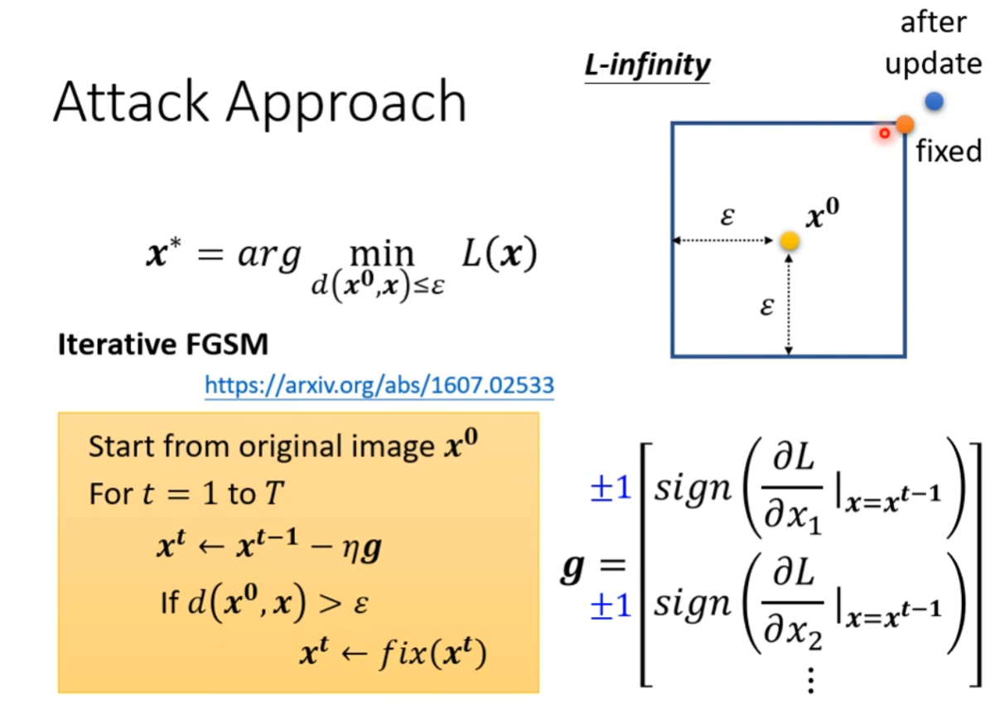

# 来自人类的恶意

+ Non-target
  + 对图片加入扰动，使得神经网络对这个图片的判断错误
+ target
  + 对图片加入扰动，使得神经网络对这个图片误判到某一个指定的类别

## 如何攻击

 

首先有个普通的分类器网络，将一个普通的图片x0输入进去后，会输出一个分布，也就是各种类别的概率

$-e(y, \hat{y})$的作用就是让正确分类和攻击后的预测分类越远

$e(y, y^{target})$的作用就是让真实图片与攻击后的图片的差距小于$\epsilon$，小于这个值后人类就不会察觉到两个图片有差距

## Non-perceivable

那么如何计算攻击后的图片与真实图片的距离呢，有两种方法

+ L2范数
+ L-infinity范数，通常使用此方法，越小越好（越小代表最大的差距比较小）

## 攻击方法

 

一般是固定输入，然后更新网络的权重，在这里则是固定住网络的权重，然后更新输入的数据

做好一次梯度下降后，就判断一次是否超出了人类所感知的界限，如果超出了则通过fix将其拉至不被人类察觉最大偏移的地方

有一种方法企图用一次获取到最佳的攻击方法（Fast Gradient Sign Method），就是所以梯度要么是1，要么是-1，然后梯度下降步长设置为$\epsilon$，这样产生出来的图片就一定不会被察觉

但是这个只做一次迭代，可能不能直接产生最优解，于是有一个改进的方法就是将其多迭代几次（Iterative FGSM）

## 攻击类型

white box attack：知道模型的参数

如果你知道一个模型是用什么资料训练出来的，你可以通过这个资料训练出一个代理网络，然后通过这个代理网络模型来生成攻击对象

 

balck box attack: 不知道模型的参数

如果不知道训练资料可以通过向网络中输入参数，然后结合输出的东西来训练，进而进行攻击

 

## 攻击原理

为什么攻击如此简单？

1610.08401.pdf -  Universal Adversarial Attack  给摄像头贴上一个东西，影像辨识系统就会识别错误

1611.02770.pdf - 小丑鱼

1905.02175.pdf - Adversarial Examples Are Not Bugs, They Are Features

One pixel attack 单像素攻击

## 攻击领域

不止图片，可以在声音领域进行攻击，如Natural language processing 1908.07125.pdf

+ 包括Speech processing，用于检测声音是否是合成的，攻击（加入一点点人类听不出的信息）后，系统就辨别错误
+ Adversarial reprogramming （1806.11146.pdf，操纵模型做他本来不想做的事情）

一般的攻击发生在测试阶段，但是有个攻击在训练阶段就开始了（1804.00792.pdf）

比如网上公开了一个数据集，训练好后对绝大多数的资料都能正确识别，但是一旦识别了那个被有意处理的图片（后门图片）模型就会错误的将它识别为别的东西

## 防御

### 被动防御

+ 将输入的图片通过一个filter，比如模糊
+ 先对影像压缩，然后解压缩（1704.01155）
+ 将原图片的投入到一个Generator中，用Generator生成出来的图片投入到网络

但是这些被动的方法如果被对方知道了，他们训练模型时也加入这些防御操作，这时可能防御就失效了

有一种强一点的方法就是使用随机的方法，对原始图片做随机防御处理

但是如果对方知道你的所有防御处理，这种加强防御也可能会失效

### 主动防御

将所有被攻击过的图片收集起来，然后重新训练一个模型，把这些被攻击的图片的错误标签改回正确的标签

# 机器学习的可解释性

有些模型本质上是可以解释的，比如机器学习的众多模型，但是深度学习、神经网路可解释性不强

有些人认为不应该继续研究深度学习，因为解释性不强，但是这就像在有灯的路上找钥匙，明知道钥匙一定不在灯所照耀的路面上（机器学习的一些模型），却非要死磕，为何不去尝试寻找黑暗的地方（深度学习）

有的模型即有解释性，能力又强（决策树）-> 但是也不能只有一个决策树  ->  随机森林

国外有一个调查，发现如果不加任何理由想让对方给自己先使用打印机的机会时，对方的同意率较高，但是如果加上了一个理由，这个同意率会大大提高

因此想要机器学习可解释就是要找一个能让人接受的理由

## Local Explanation

> Why do you think this image is a cat?

### 哪个更重要

如何知道哪一个特征较重要，可以进行控制变量法，比如有多个特征，先将其中的某个特征去掉，然后放进模型看结果有没有变化，如果没有变化就表明去掉的特征不重要

$|\frac{\triangle e}{\triangle x}|$代表这个pixels的重要性，对整个图像计算这个值就能得到Saliency Map（显著图）

**Limitation：Noisy Gradient**

有时计算图片的Saliency Map，它的亮点分布不完全集中在我们想要的区域，这时我们可以对其进行SmoothGrad操作（SmoothGrad：随机给输入的图片添加噪声，得到噪声图片的Saliency Map，然后进行平均 - 1706.03825）

**Limitation：Gradient Saturation**

有时偏微分不能反映事物是否重要，比如大象的鼻子长度，可能在前期鼻子长度越长，模型就认为他越像大象，但是达到一定的长度时，不管后面它的长度再增加，模型判断他为大象的可能性也不会有多少变化（有其他的方法可以解决 - Alternative：Integrated gradient  - IG）

### 模型怎样处理输入

+ 通过可视化方法查看
+ Probing，使用探针
  + 比如有一个语音转文字的模型，我们可以训练另一个模型（探针）来查看这个这个模型到底学到了啥。有这样一个例子，有两段声音录像，一个男声，一个女声，投入到探针，可能前几层还能区分男女声，但是到最后输出的只有机械的声音，听不出性别，这也就表明，模型真正学到了声音内容

## Global Explanation

> what does a  "cat" look like? 对于network而言，cat到底长什么样子

拿CNN做分析，将图片投入到模型时，第一个卷积层提取的结果是图片的初步特征，他可能包含多个通道，一个通道中的一个值用$a_{ij}$来表示

$X^* = arg \mathop{max} \limits_{x} \sum\limits_i \sum\limits_j a_{ij}$ 就是我们的目标，$X^*$就代表着这个通道所能检测出的pattern

虽然$X^*$这个结果看起可能没有什么意义（类比Adversarial  Attack），但是模型就是能将它作为特征辨识出来

如果想要有更好的可视化效果（针对minist），可以做一些细微修改$X^* = arg \mathop{max} \limits_{x} \sum\limits_i \sum\limits_j a_{ij} + R(X)$ ，这个$R(X)$代表的就是这个X有多么像数字，$R(X) = -\sum\limits_{i,j}|X_{ij}|$，但是这种方法虽然视觉效果有那么一点点改善，但是与我们想要的结果（明显的特征表示）还差太远。

这时我们可以换一个思路，将这些特征提出出来放入GAN中，看GAN能不能复现原结果

使用可解释模型来模拟不可解释模型的行为。（Local Interpretable Model-Agnostic Explanations - LIME）

