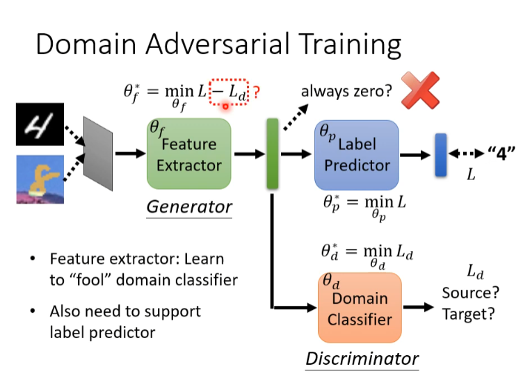

# 领域自适应

> Domain Adaptation：在某个Domain训练的模型，可以在另一个Domain测试成功

Domain shift：训练和测试数据有不同的分布，比如手写数字，如果测试集的背景有所改变的话，测试的结果可能会大幅度下降

我们定义Source为原数据，Target为分布不同的测试数据

## Basic Idea

首先我们知道source和target的分布是不同的，比如手写数字，虽然能看到数字，但是背景颜色不一样

接着我们需要构造一个特征提取器（Feature Extractor - network），它可以提取图片的特征，我们最终希望从source和target提取出的feature之间的分布差异越小越好，甚至是同一个分布

一个分类器我们可以把他看成是一个特征提取器和一个标签预测器构成，也就是我们希望将source和target数据投入到特征提取器后得到的向量分布是一样的

怎样能让不同数据源提取出的向量分布看不来差异呢？这里需要新引入一个Domain Classifier，他就是一个二元分类器，它可以吃入一个向量（提取出的特征向量）然后辨别这个向量是来自source还是来自target。

而Feature extractor的作用就是学习去欺骗过domain classifier，有点像GAN。但是还是有不同的，因为对于Feature extractor来说，它的优势太大了，如果Feature Extractor不管看到什么输入他都输出0向量，那么Domain Classifier根本辨别不出这个特征向量来自哪个数据源。

为了避免上述的情况，那么Label Predictor的作用就体现出来了，它对Feature Extractor做了一定的限制，因此上述情况不会发生

注意$\theta_f^*,\theta_p^*,\theta_d^*$的意义

当然还有其他办法

+ Decisioin Boundary
  + DIRT-T  —— 1802.08735
  + Maximum Classifier Discrepancy —— 1712.02560

若source和target本身包括的数据集就存在交集，以及交集之外的数据，比如source没有老虎这个标签，而target有，那么硬贴标签就有点不妥了 —— Universal domain adaptaion 有所介绍