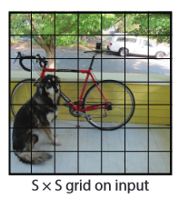

# YOLOv1理论

> 网络架构 -> 检测原理 -> Ground Truth -> Loss Compute

## 网络架构


网络受到 GoogLeNet 启发来搭建的，其中包括 24 个卷积层和 2 个全连接层，但是作者没有使用 Inception 块，而是使用数个 1x1 和 3x3 的卷积层堆砌而成。

并且作者在每一个层后面都使用了 Leaky(0.1) 的非线性激活函数，只有最后一层使用的是线性激活函数。

特征提取网络最终会输出一个大小为 7x7x1024 的特征图，接着将其 Flatten 处理，然后后面再接一个长度为 4096 的全连接层，如果不算 bias 的话，那么参数量：
$$
7\times7\times1024\times4096=205520896\approx2\times10^8
$$
这种参数量过于巨大，所以作者实际在代码里先使用了一个 256 的全连接层缓冲了一下，然后再接上 4096 的全连接层，经过改变后参数量如下所示：
$$
7\times7\times1024\times256 + 256\times4096=13893632\approx1.4\times10^7
$$
虽然这样做会少一个数量集，但是资源占用量还是很大。即使这样 yolov1 的速度还是杠杠的~

最后 4096 的全连接层再接上 $7\times7\times30=1470$ 的全连接层，并将其 reshape 到  $(7, 7, 30)$ 的形状，这样就得到我们最终想要的结果。

## 检测原理

网络最终会输出 $(7, 7, 30)$ 的特征图，其中 $7\times7$ 代表图片会被分成长宽各为 7 等份的网格，如图



而 30 代表网络对这个网格所作出的预测，而这 30 个数据代表不同的含义，如下
$$
x_1, y_1, w_1, h_1, c_1, \ \ \ x_1, y_1, w_1, h_1, c_1, \ \ \ class_1,class_2...class_{20}
$$
前 10 个数据代表 bbox 的位置信息（中心点坐标，宽高）以及置信度信息，后 20 个数据代表类别信息。

也就是说网络会预测出 3 种信息：

+ bbox：物体边界框预测
+ objectness：置信度，表示当前网格内是否存在物体
+ class：类别预测

## Ground Truth

我们都知道要将网络得出的训练结果与真实样本进行计算损失，然后反向传播计算梯度再更新网络参数，如此反复。但是真实结果与预测结果结构相差巨大，我们预测出的数据是 7x7x30 这样的一个向量结构，但是真实数据（从训练数据中拿到的标签）结构如下

```xml
<size>									// 图片尺寸
    <width>500</width>
    <height>335</height>
    <depth>3</depth>
</size>
<object>								// 第1个物体
    <name>train</name>					// 物体的类别
    <bndbox>							// bounding box 坐标（左上角、右下角坐标）
        <xmin>263</xmin>			
        <ymin>32</ymin>
        <xmax>500</xmax>
        <ymax>295</ymax>
    </bndbox>
</object>
<object>								// 第2个物体
    <name>train</name>
    <bndbox>
        <xmin>1</xmin>
        <ymin>36</ymin>
        <xmax>235</xmax>
        <ymax>299</ymax>
    </bndbox>
</object>
```

它只是包含了一张图片所有物体的边界框信息以及类别信息。

所以第一步我们就是要将这些零散的目标位置信息**编码**成 7x7x30 这样的向量格式，并且这些向量信息要与网络预测的结果含义相同。

原论文中曾表示：*We normalize the bounding box width and height by the image width and height so that they fall between 0 and 1. We parametrize the bounding box x and y coordinates to be offsets of a particular grid cell location so they are also bounded between 0 and 1.*

+ 也就是真实样本**边界框的宽高要除以整张图片的宽高**来进行归一化
+ 而**中心点坐标**信息是**相对于**中心点**所处于的 grid cell 的位置**，而不是相对于整张图片所处的位置
  + 借鉴知乎作者的一张图，如下，我们想得到的坐标就是$(c_x,c_y)$，原图片地址https://www.zhihu.com/column/c_1364967262269693952


1、边界框信息编码

下面先把xml文件的边界框信息从(左上角，右下角)的格式转化为(中心坐标，宽高)的格式
$$
x = \frac{x_{min}+x_{max}}{2} \\
y = \frac{y_{min}+y_{max}}{2} \\
w = x_{max} - x_{min} \\
h = y_{max} - y_{min}
$$
接着我们再将中心点坐标和宽高进行归一化，避免由于数据过大引起训练不稳定
$$
x = \frac{x}{w_{image}} , 
y = \frac{y}{y_{image}} \\
w = \frac{w}{w_{image}} , \ \
h = \frac{h}{h_{image}} \\
$$
因为进行了归一化，我们很容易知道每个网格的宽高是多少
$$
grid\_size = \frac{1}{grid\_num}=\frac{1}{7}
$$
计算参数化后的中心点坐标前，我们还需要知道它处在哪个 grid cell 中，这里我们可以使用向下取整 $\lfloor \cdot \rfloor$ 来计算
$$
grid_x = \lfloor\frac{x}{grid\_size}\rfloor \\
grid_y = \lfloor\frac{y}{grid\_size}\rfloor \\
$$
那么中心点坐标就可以由网格位置来计算得出了（除以 grid_size 是因为计算相对于 grid cell 的坐标）
$$
c_x = \frac{x - grid_x \times grid\_size}{grid\_size} = \frac{x}{grid\_size}-grid_x \\
c_y = \frac{y - grid_y \times grid\_size}{grid\_size} = \frac{y}{grid\_size}-grid_y
$$
我们最后会进行预测，所以还需能将这个参数化的中心点坐标还原为相对于原来整张图片的相对位置
$$
x = (c_x + grid_x) \times grid\_size \\
y = (c_y + grid_y) \times grid\_size
$$
上面的 $grid_x、grid_y$ 会由网络输出 7x7x30 向量中的 7x7 这两个维度的索引给出。由此一来我们就将训练样本xml文件中边界框信息转化为了 $(c_x,c_y,w,h)$

2、类别信息编码

类别编码最为简单，只需要获取样本数据中的所有类别，然后使用 indexOf 获取当前类别的索引，以此来构建 one-hot 编码就可以了

3、置信度编码

因为我们从 xml 得到的每个 object，它所表示的 bbox 内一定包含一个物体，所以编码时，我们直接指定置信度为 1 就行了，也就是 $Pr(Object) = 1$

至此我们就将如何把训练数据 xml 中的边界框信息和类别信息编码成与网络输出一样的格式了。

---

在进行下一步的损失函数介绍前，要总结一下各数据的含义以及后处理

1、边界框分析

首先我们从真实样本中编码的边界框位置信息 $(c_x,c_y)$，它是由向下取整然后再进行减法计算出来的，由计算过程可知，它一定是属于 [0, 1) 这样的一个数，而神经网络最后的输出结果不仅可真可负，并且数值还非常不固定，因此需要使用 sigmod 函数将其限制在 0~1 之间，保证和标签的一致性。

同理标签中边界框的宽高使用了归一化处理，数值也在 0~1 之间。所以网络最终对边界框(中心坐标，宽高)预测的数据区间要使用 sigmod 进行约束

2、置信度和类别预测

置信度预测的是当前 grid cell 存在有物体的概率，而类别预测表示这个物体属于某个类别的概率，都是 0~1 之间的值，所以也要使用 sigmod 函数进行约束

综上所有的预测结果都要在 0~1 之间，所以为方便起见，直接在网络结构的最后一层添加了一个 sigmod 函数

## Loss Compute

