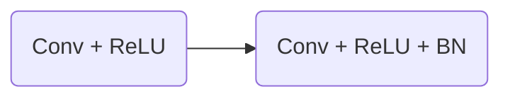
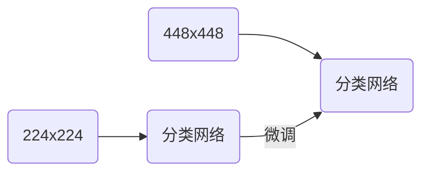
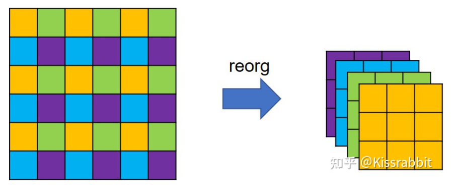

# YOLOv2理论

## 引言

在提出 YOLOv1 工作后，原作者又提出了 YOLOv2，YOLOv2 在 YOLOv1 的基础上做出了大量的改进和优化，不仅是对模型本身做出了优化，同时还引入 Faster-RCNN 工作中提出的 Anchor Box 机制，并且使用了 kmeans 聚类方法来获取更好的 Anchor Box，还有边界框回归的方法也作出了调整。

论文中也曾提到使用已经标签过的图片学习精准定位目标，同时使用分类图片来增加网络的词汇量并提高它的鲁棒性，以此来拓展目标检测的数据集，它就是YOLO9000——论文中说可以检测超过9000中不同的目标类别，但是我们关注的主要是关于对 YOLOv1 的改进 —— YOLOv2.

## 改进

### 添加 BN 层

在 YOLOv1 中，卷积结构都只是线性卷积和激活函数，并没有使用归一化层。以现在的眼光来看，BN 层几乎在计算机视觉领域随处可见，因为 BN 可以显著提高网络的收敛性，同时消除其他的正则化方式。因此 YOLOv2 做出了调整，将以往的 Conv + ReLU 改为了 Conv + ReLU + BN ，同时将之前用来避免过拟合的 dropout 层移除。

效果：在VOC2007测试集上，从原本的63.4% mAP提升到65.8% mAP（超过 2% 的 mAP 提升）

### 高分辨率微调

 YOLOv1 中的 backbone 在 ImageNet 上预训练的图片尺寸为 224x224，但是检测时受到的图片却是 448x448 的大小，因此检测时网络会因分辨率尺寸的剧变而受到影响。为了避免这个影响，作者将已经在 224×224 的低分辨率图像上训练好的分类网络又在 448×448 的高分辨率图像上进行微调，共微调 10 个轮次。微调完毕后，再去掉最后的全局平均池化层和 softmax 层，作为最终的 backbone 网络。

效果：从65.8% mAP提升到69.5% mAP（4% 的 mAP 提升）

> 虽然这个技巧有明显的作用，但是它并没有成为主流的方法，因为可以通过加长训练时间来改善这个问题

### 全卷积 & Anchor Box

在 YOLOv1 中，网络直接使用卷积特征提取器后面的**全连接层**来预测边界框坐标，而使用全连接层会破坏特征图的空间结构，为了解决这一问题，作者将全连接层给替换成了卷积网络。

同时作者还采用了 Anchor Box 机制，也就是先验框，通过预测相对于 Anchor Box 的偏移，而不是直接预测宽高大小，这样会减小网络的预测难度使网络更容易去学习，但是越多的先验框会带来越多的运算压力，因为这需要更多的参数。具体细节如下：

1. 使用 Anchor Box 来预测 bbox
2. 移除 YOLOv1 网络中的全连接层
3. 移除 YOLOv1 网络中最后的一个池化层，以此获取更高分辨率的特征图输出
4. 将输入网络的图片尺寸从 448x448 收缩为 416x416
5. 最终得到的网络下采样倍数为 32，得到 13x13 的网格

> 在 YOLOv1 中每个网格处，B 个边界框有只会输出 1 个边界框和这 1 个边界框的置信度与类别概率。但是有了 Anchor Box 后，每个 Anchor Box 都会输出一个置信度和类别信息，将类别预测和网格空间位置进行解耦。

所以最终网络会输出如下向量：
$$
S \times S \times k \times(1+4+C)
$$

+ S：网格数
+ k：Anchor Box 的数量
+ C：类别数

效果：因为使用了 Anchor Box ，计算压力更大，所以精度非但没有提升，反而下降了一点点，从 69.5% mAP 降为 69.2% mAP，但召回率却从81% 提升到了 88%。召回率的提升，意味着可以检测到更多的目标，所以作者没有因为精度的略微下降而放弃这个方案。

### 全卷积网络结构

在 YOLOv1 中作者基于 GoogLeNet 架构定制了一个网络，该网络比 vgg-16 的速度更快，参数量也更少。但是其准确性略低于 VGG16。为此在 YOLOv2 中作者构建了一个新的网络名为 DarkNet19（因为有19个卷积层）如下所示
$$
\begin{array}{c|c|c|c}
\text { Type } & \text { Filters } & \text { Size/Stride } & \text { Output } \\
\hline \text { Convolutional } & 32 & 3 \times 3 & 224 \times 224 \\
\text { Maxpool } & & 2 \times 2 / 2 & 112 \times 112 \\
\text { Convolutional } & 64 & 3 \times 3 & 112 \times 112 \\
\text { Maxpool } & & 2 \times 2 / 2 & 56 \times 56 \\
\text { Convolutional } & 128 & 3 \times 3 & 56 \times 56 \\
\text { Convolutional } & 64 & 1 \times 1 & 56 \times 56 \\
\text { Convolutional } & 128 & 3 \times 3 & 56 \times 56 \\
\text { Maxpool } & & 2 \times 2 / 2 & 28 \times 28 \\
\text { Convolutional } & 256 & 3 \times 3 & 28 \times 28 \\
\text { Convolutional } & 128 & 1 \times 1 & 28 \times 28 \\
\text { Convolutional } & 256 & 3 \times 3 & 28 \times 28 \\
\text { Maxpool } & & 2 \times 2 / 2 & 14 \times 14 \\
\text { Convolutional } & 512 & 3 \times 3 & 14 \times 14 \\
\text { Convolutional } & 256 & 1 \times 1 & 14 \times 14 \\
\text { Convolutional } & 512 & 3 \times 3 & 14 \times 14 \\
\text { Convolutional } & 256 & 1 \times 1 & 14 \times 14 \\
\text { Convolutional } & 512 & 3 \times 3 & 14 \times 14 \\
\text { Maxpool } & & 2 \times 2 / 2 & 7 \times 7 \\
\text { Convolutional } & 1024 & 3 \times 3 & 7 \times 7 \\
\text { Convolutional } & 512 & 1 \times 1 & 7 \times 7 \\
\text { Convolutional } & 1024 & 3 \times 3 & 7 \times 7 \\
\text { Convolutional } & 512 & 1 \times 1 & 7 \times 7 \\
\text { Convolutional } & 1024 & 3 \times 3 & 7 \times 7 \\
\hline \hline \text { Convolutional } & 1000 & 1 \times 1 & 7 \times 7 \\
\text { Avgpool } & & \text { Global } & 1000 \\
\text { Softmax } & & &
\end{array}
$$
作者首先将DarkNet19在ImageNet上进行预训练，获得了72.9%的top1准确率和91.2%的top5准确率。在精度上，DarkNet19网络达到了VGG网络的水平，但前者模型更小。

预训练完毕后，去掉表6-1中的最后第24层的卷积层、第25层的平池化层以及第26层的softmax层，然后换掉原先的backbone网络。

效果：网络从上一次的69.2% mAP提升到69.6% mAP。

### Kmeans聚类先验框

前面提到的 Anchor Box 虽然只是一个小小的矩形框，但是有许多参数还需要我们自行设定，如下

+ 纵横比：也就是先验矩形框的宽高比，通常采用 1:1，1:3，3:1 
+ 大小：也就是先验矩形框的面积大小，通常采用 32、64、128、256 和 512
+ 数量：就是先验框的个数

之前作者虽然应用了 Anchor Box 机制，但是这些参数都是人工指定的，但是人工指定的参数不一定好，因此作者采用 Kmeans 的方法对数据集中所有 Ground Truth 的矩形框进行聚类，以此得到一个较好的参数。

标准的 k-means 算法使用欧几里得距离进行聚类，但是这并不适合边界框的聚类，会产生很多错误，因此作者重新指定了一个距离指标，如下：
$$
d(\text { box }, \text { centroid })=1-\operatorname{IOU}(\text { box }, \text { centroid })
$$
通过实验发现 Anchor Box 的数量 k=5 时，能很好的权衡模型复杂度和召回率。

> 聚类所获得的先验框严重依赖于数据集本身，从A数据集聚类出的先验框显然难以适应新的B数据集。尤其A和B两个数据集中所包含的数据相差甚远时，这一问题会更加的严重。倘若数据集规模过小、样本不够丰富，那么由聚类得到的先验框也未必会提供足够好的尺寸先验信息。

通过下列表格能发现：

+ 经过聚类的 5 个 Anchor Box 能达到手工选取参数的 9 个 Anchor Box 的性能 (61.0 <--> 60.9)
+ 聚类后的 9 个 Anchor Box 比没聚类的性能更好 (60.9 <--> 67.2)

$$
\begin{array}{lcc}
\text { Box Generation } & \# & \text { Avg IOU } \\
\hline \text { Cluster SSE } & 5 & 58.7 \\
\text { Cluster IOU } & 5 & 61.0 \\
\text { Anchor Boxes [15] } & 9 & 60.9 \\
\text { Cluster IOU } & 9 & 67.2
\end{array}
$$

### 直接位置预测

首先，对每一个边界框，YOLOv1 仍然去学习中心点偏移量。我们知道，这个中心点偏移量是介于 0~1 的数，在 YOLOv1 中，作者没有在意这一点，直接使用线性函数输出，因此在训练初期网络很不稳定，模型很有可能会输出数值极大的中心点偏移量。于是，作者使用 sigmoid 函数使得网络对偏移量的预测是处在 0~1 范围中。
$$
\begin{aligned}
&b_{x}=\sigma\left(t_{x}\right)+c_{x} \\
&b_{y}=\sigma\left(t_{y}\right)+c_{y} \\
&b_{w}=p_{w} e^{t_{w}} \\
&b_{h}=p_{h} e^{t_{h}}
\end{aligned}
$$
$t_{x}, t_{y}, t_{w}, t_{h}$ 是我们网络预测的值，上面公式用文字描述就是：

+ 对预测值 $t_x, t_y$ 进行 sigmod 操作，然后加上网格的偏移值就等于最终边界框中心点坐标
+ 对预测值 $t_w,t_h$ 进行 exp 操作，然后再乘以 anchor box 的宽高等于最终边界框的宽高 (都是相对于特征图尺寸的)

效果：结合之前的 k-means 聚类先验框和本节的直接位置预测，模型性能得到了显著提升，从69.6% mAP提升到74.4% mAP

### 更精细的特征

改进后的 YOLO 能预测 13x13 特征图上的目标了，虽然这对检测大型对象已经够用了，但是如果有更高分辨率的特征图会使检测小型对象更加容易。因此作者添加了一个 “passthrough” 层为 13x13 的特征图添加了上一层 26x26 的特征图信息，具体操作如下：

1. 获取第 17 层 26x26x512 的卷积输出，通过**特殊的降采样**操作得到 13x13x2048 的特征图
2. 将 18 层的 13x13x1024 与 13x13x2048 的特征图进行合并

这个特殊的降采样操作不是常用的步长为2的池化层或步长为2的卷积操作，而是一种类似于在图像分割任务中常用到的pixelshuffle操作的逆操作，依据YOLO官方配置文件中的命名方式，暂且称之为reorg操作，如下所示（图片来源：https://zhuanlan.zhihu.com/p/432343631）：

不难发现，特征图在经过 reorg 操作的处理后，特征图的宽高会减半，而通道则扩充至4倍，因此，从 backbone 拿出来的 26×26×512 特征图就变成了 13×13×2048 特征图。这种特殊降采样操作的好处就在于降低分辨率的同时，没丢掉任何细节信息，信息总量保持不变。

效果：在VOC 2007测试集上的mAP从74.4%再次涨到了75.4%。由此可见，引入更多的细节信息，确实有助于提升模型的检测性能。

### 多尺度训练

每 10 个批次，网络会随机选择一个新的图像尺寸大小。由于模型将样本降低了 32 倍，所以我们从以下 32 倍中提取 { 320, 352，… 608 }。因此，最小的选项是320 × 320，最大的选项是608 × 608。训练时我们动态调整网络到相应的尺寸。这种方法可以迫使网络从输入的维度中更好的进行预测。

效果：从75.4% mAP提升到76.8% mAP

## 总结

在经过一系列的改进后 YOLOv1 终于演化成了 YOLOv2
$$
\begin{array}{r|l|lllllll|c} 
& \text { YOLO } & & & & & & & & \text { YOLOv2 } \\
\hline \text { batch norm? } & & \checkmark & \checkmark & \checkmark & \checkmark & \checkmark & \checkmark & \checkmark & \checkmark \\
\text { hi-res classifier? } & & & \checkmark & \checkmark & \checkmark & \checkmark & \checkmark & \checkmark & \checkmark \\
\text { convolutional? } & & & & \checkmark & \checkmark & \checkmark & \checkmark & \checkmark & \checkmark \\
\text { anchor boxes? } & & & & \checkmark & \checkmark & & & & \\
\text { new network? } & & & & & \checkmark & \checkmark & \checkmark & \checkmark & \checkmark \\
\text { dimension priors? } & & & & & & \checkmark & \checkmark & \checkmark & \checkmark \\
\text { location prediction? } & & & & & & \checkmark & \checkmark & \checkmark & \checkmark \\
\text { passthrough? } & & & & & & & \checkmark & \checkmark & \checkmark \\
\text { multi-scale? } & & & & & & & & \checkmark & \checkmark \\
\hline \text { VOC2007 mAP } & 63.4 & 65.8 & 69.5 & 69.2 & 69.6 & 74.4 & 75.4 & 76.8 & \mathbf{7 8 . 6}
\end{array}
$$

