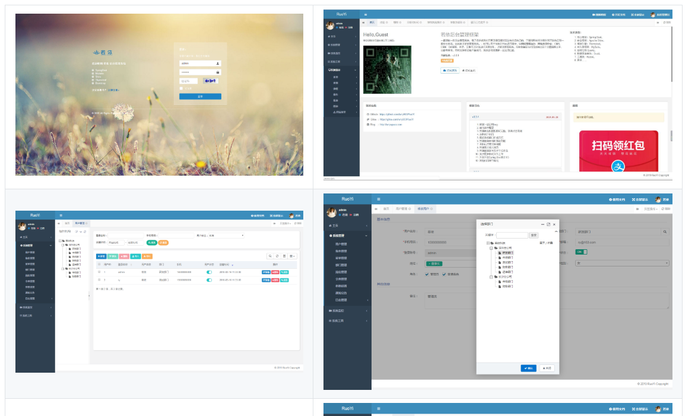
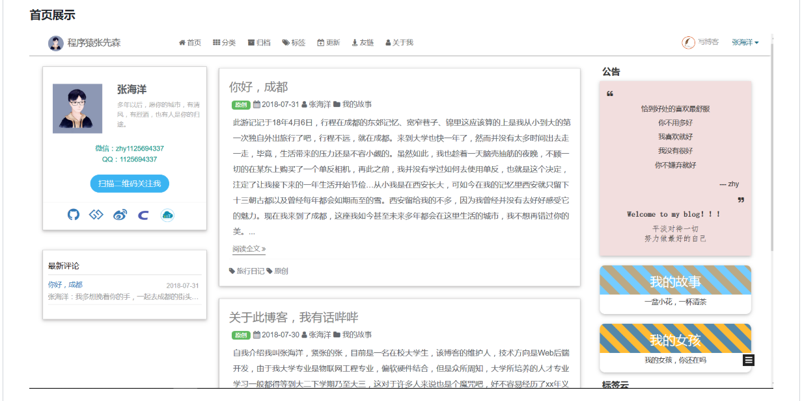

[toc]

# 优秀开源项目收集

b站看到一个up主搜集开源项目买，挺有意思的🤔，在这记录一下能根据他视频找的项目

+ Vue + SpringBoot + MyBatis 音乐网站，[点这里](https://github.com/Yin-Hongwei/music-website)

+ 个人博客，[点这里](https://github.com/DimpleFeng/DimpleBlog)

+ 基于SpringBoot2.1的权限管理系统 易读易懂、界面简洁美观。 核心技术采用Spring、MyBatis、Shiro没有任何其它重度依赖。直接运行即可用 [http://www.ruoyi.vip](http://www.ruoyi.vip/),[点这里](https://github.com/lerry903/RuoYi)

+ 使用SpringBoot+MyBatis进行前后端开发的个人博客网站，[点这里](https://github.com/zhyocean/MyBlog)

