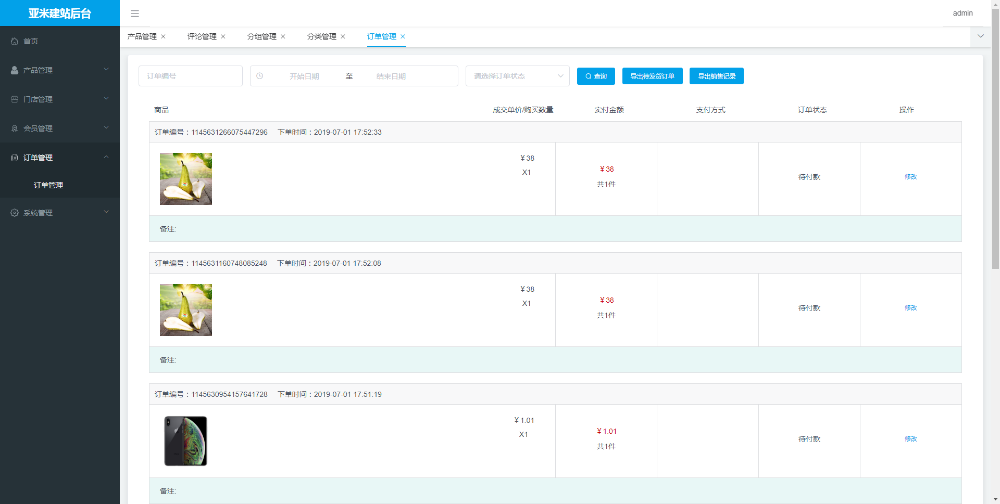

# 优秀开源项目收集

## 音乐网站

Vue + SpringBoot + MyBatis 音乐网站 [点这里](https://github.com/Yin-Hongwei/music-website)

## 个人博客

[点这里](https://github.com/DimpleFeng/DimpleBlog)

## 若依

基于SpringBoot2.1的权限管理系统 易读易懂、界面简洁美观。 核心技术采用Spring、MyBatis、Shiro没有任何其它重度依赖。直接运行即可用 [http://www.ruoyi.vip](http://www.ruoyi.vip/),[点这里](https://github.com/lerry903/RuoYi)

## 个人博客

使用SpringBoot+MyBatis进行前后端开发的个人博客网站，[点这里](https://github.com/zhyocean/MyBlog)

## 多用户博客

https://gitee.com/mtons/mblog

##  mall4j 电商商城系统

[mall4j 电商商城系统](https://gitee.com/gz-yami/mall4j)

##  后台主题 UI 框架

https://gitee.com/hplus_admin/hplus

若依项目使用的模板